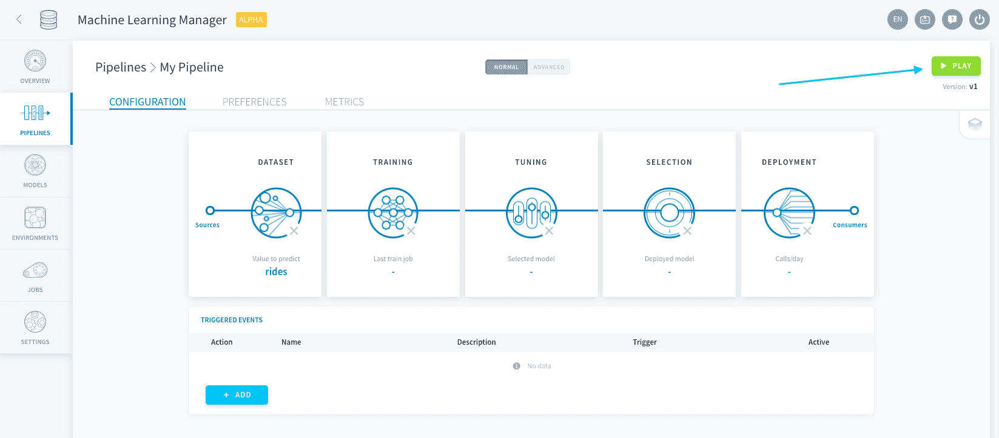
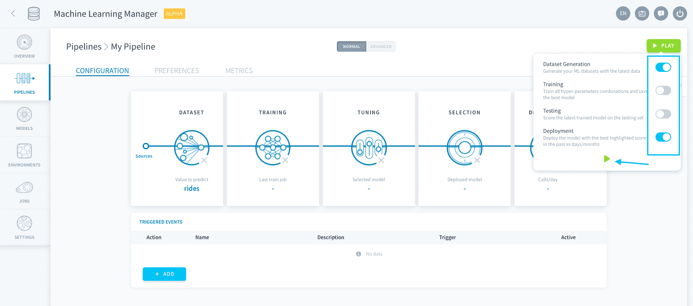

# Execute a pipeline

After a pipeline is configured, it can be executed in order to realize different tasks called **jobs**. These jobs are ran using ForePaaS technology to ensure scalability to large volume or frequency of processed data. 

The execution of a pipeline is the backbone of having a model evolve through its natural life-cycle. Following the configuration you specified, this is how you can incorporate additional data over time, re-train models, deploy new ones and make predictions. 

---
## Pipeline jobs

There are **four** kind of jobs that can be executed either manually or through [triggers](en/product/ml/pipelines/execute/triggers).

* [Dataset generation jobs](en/product/ml/pipelines/execute/index.md?id=dataset-generation-jobs)
* [Training jobs](en/product/ml/pipelines/execute/index.md?id=training-jobs)
* [Testing jobs](en/product/ml/pipelines/execute/index.md?id=testing-jobs)
* [Deployment jobs](en/product/ml/pipelines/execute/index.md?id=deployment-jobs)

To manually execute pipeline jobs, simply press the **Play ▶️ button** at the top-right.

You can then specify which jobs you want to run and how.

### Dataset generation jobs

Dataset generation jobs are used to create (or add to) the training, testing and validation datasets using your data inputs.

Training and testing sets are modeled and stored as [ML tables in the Data Manager](/en/product/data-manager/tables/index).

When a dataset generation job is launched, the training and validation sets are flushed of their previous data. Then any data point in the data input that **isn't already in the testing set** is split between the training and testing sets following the rules you set in the [Dataset step](/en/product/ml/pipelines/configure/dataset/input?id=train-test-split). The validation set is generated following the rules you set in the [Training step](/en/product/ml/pipelines/configure/training/validation?id=validation).

> The testing set is never erased naturally, unless you manually reset your datasets from the [pipeline preferences](/en/product/ml/pipelines/execute/preferences?id=reset-datasets).

### Training jobs

Training jobs are used to train models based on an algorithm and a combination of hyper-parameters, and score them on the validation set.

Training jobs can be accelerated with graphics processing units (GPU) using [FPU-G](/en/product/ml/pipelines/execute/resources?id=use-gpu-for-your-processing).

### Testing jobs

Testing jobs are used to evaluate models on the testing set using all added scoring functions.

Testing jobs can be accelerated with graphics processing units (GPU) by using [FPU-G](/en/product/ml/pipelines/execute/resources?id=use-gpu-for-your-processing).

### Deployment jobs

Deployment jobs are used to deploy inference APIs which are a model's interface to make predictions. The model deployed is based on the criteria specified in the [Model Selection step](/en/product/ml/pipelines/configure/validation/auto-deploy).

---
## Set up triggers

Instead of having to manually press the Play ▶️ button, you can choose to configure triggers to **execute pipelines at specific moments or events**. 

{Pipeline triggers}(#/en/product/ml/pipelines/execute/triggers.md)

---
## Manage pipeline preferences

In the Preferences tab, you can set up fundamental options for the execution of your pipelines such as **allocated resources, timeout and logs settings and even reset datasets** if needed.

{Pipeline preferences}(#/en/product/ml/pipelines/execute/preferences.md)

---
## Scale your pipelines

Each pipeline can be scaled independently in the Preferences, for you to specify the resources allocated to training, scoring and dataset generation jobs. 

{How to scale pipelines}(#/en/product/ml/pipelines/execute/resources.md)

---
##  Need help? 🆘

> You didn't find what you were looking for on this page? You can ask for help by sending a request directly from the platform, going to the *Support* page. You can also send us an email at support@forepaas.com.

{Send your questions to support 🤔}(https://support.forepaas.com/hc/en-us/requests)