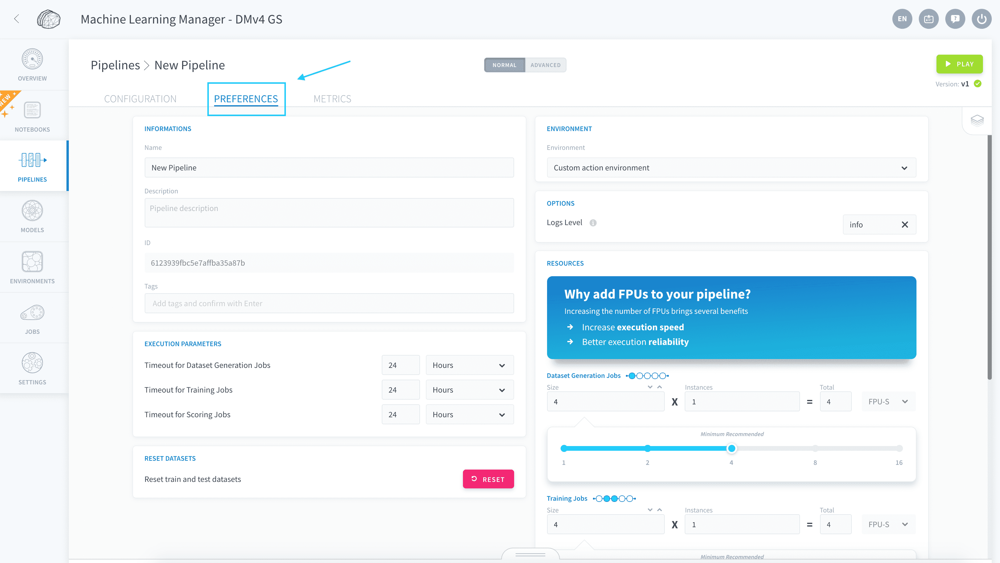
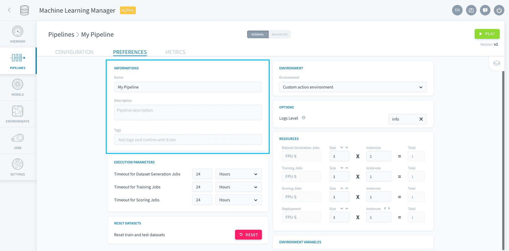
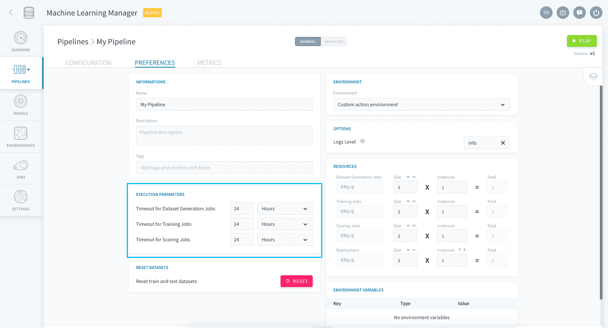
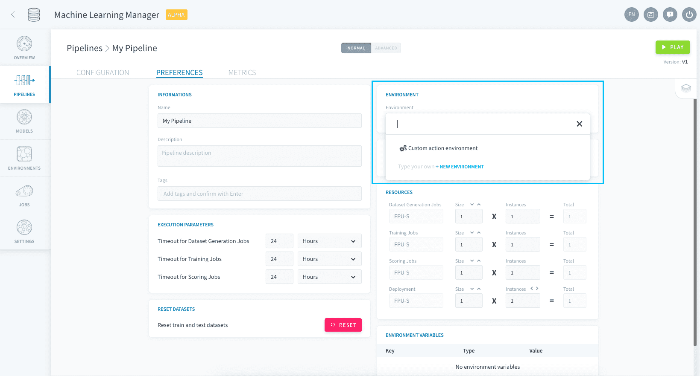
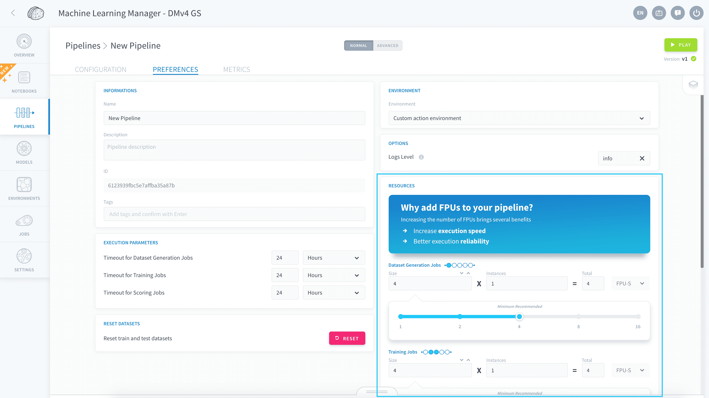
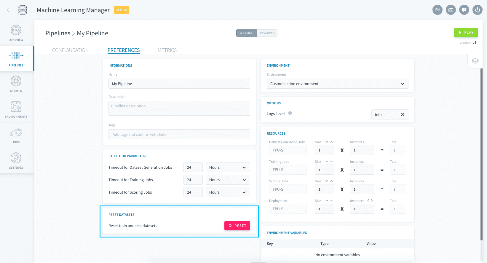

# Pipeline Preferences

Each ForePaaS pipeline possesses several execution settings which can be managed via the Preferences tab of the pipeline edition menu. 

Here are the main settings:

* [Pipeline information](en/product/ml/pipelines/execute/preferences.md?id=pipeline-information)
* [Timeout options](en/product/ml/pipelines/execute/preferences.md?id=timeout-options)
* [Environment options](en/product/ml/pipelines/execute/preferences.md?id=environment-options)
  * [Resources](en/product/ml/pipelines/execute/preferences.md?id=resources)
* [Reset datasets](en/product/ml/pipelines/execute/preferences.md?id=reset-datasets)

---
## Pipeline information

In the Informations box, you can set the name, description and tags for your pipeline. 

---
## Timeout options

The Execution Parameters box lets you set timeout and failure options.

**Timeout** is the runtime after which a job is interrupted if it hasn't finished. You can set a different runtime for all four possible jobs.

!> If a job fails while running a pipeline (i.e. several consecutive jobs), **the whole pipeline is interrupted and the next jobs will not be run**.

---
## Environment options

### Set an environment

The boxes on the right of the screen are the ones that relate to an environment, just like in a [DPE action](/en/product/dpe/actions/settings/index). By default, there is no environment applied and you can customize all settings within the Preferences page.  
If you want to harmonize the set of settings to all the pipelines you build, you can **specify them at the environment-level**. Go to Environment in the sidebar to create an environment, and apply it to each pipeline by specifying it in the Related Environment box in the pipeline's Preferences page.

### Resources

You can specify the resources dedicated to each kind of [machine learning jobs](en/product/ml/pipelines/execute/index.md?id=pipeline-jobs) in the Resources panel.

{How to scale pipelines}(#/en/product/ml/pipelines/execute/resources.md)

---
## Reset datasets

By default, pipelines are engineered so that the training and testing datasets never spill into each other over time, as ForePaaS manages the life-cycle of the data for you. However, you might want to occasionally reset your ML datasets, if corrupt or incorrect data leaked into your Testing set or if the structure of the training data changes radically.

You can decide to manually reset training, testing and validation datasets of a specific pipeline in its Preferences page by pressing this button:

> This **will not** reset the rest of your pipeline configuration such as the features choice, estimator and hyper-parameter tuning, or the generated models.

---
###  Need help? 🆘

> If you are logging-in with an OVHcloud account, you can create a ticket to raise an incident or if you need support at the [OVHcloud Help Centre](https://help.ovhcloud.com/csm/fr-home?id=csm_index). Additionally, you can ask for support by reaching out to us on the Data Platform Channel within the [Discord Server](https://discord.com/channels/850031577277792286/1163465539981672559). There is a step-by-step guide in the [support](/en/support/index.md).