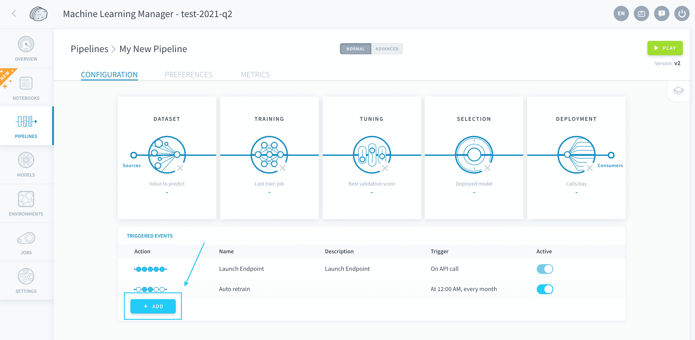

# Triggers

Triggers allow you to schedule the automatic execution of your pipelines, such as generating the datasets or training models. 

* [Add a trigger to a pipeline](/en/product/ml/pipelines/execute/triggers?id=add-a-trigger-to-a-pipeline)
  *  [Trigger on a time schedule](/en/product/ml/pipelines/execute/triggers?id=trigger-on-a-time-schedule)

---
## Add a trigger to a pipeline

To create a trigger on a pipeline, go to the home page of the pipeline and press **Add**.

You can choose a name and description for your trigger in the **Info** section.

In the **Jobs** section, select the [pipeline jobs](/en/product/ml/pipelines/execute/index?id=pipeline-jobs) that you want to trigger.

Finally, in the **Trigger** section, select the condition for the trigger. When that condition is true, the jobs that you have previously selected will automatically be launched.

### Trigger on a time schedule

You can execute your pipeline on a time schedule by selecting *Cron* as the trigger type.

?> Our engineering team is working hard to implement more trigger options soon. If you have a particular need, please drop us a note on our [roadmap portal](https://hq.forepaas.io/#/features)!