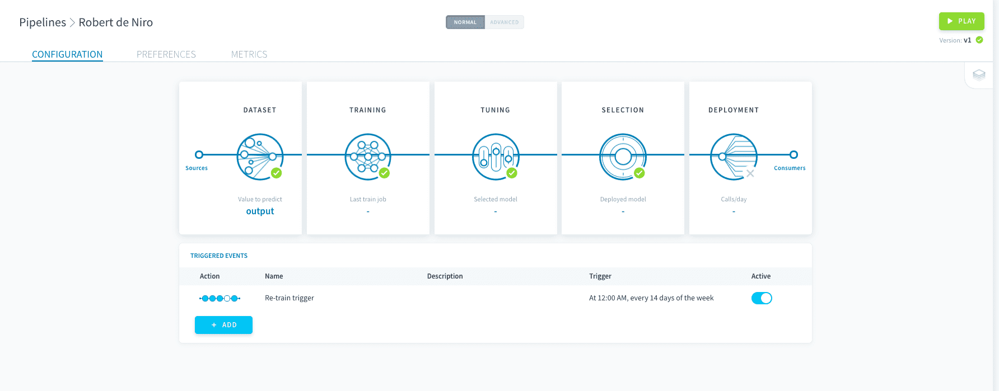
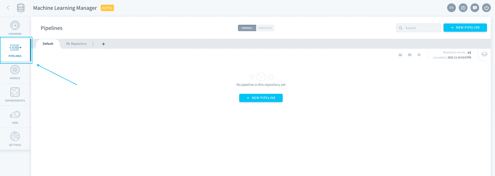
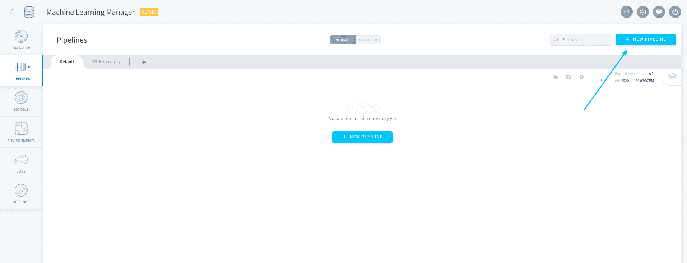
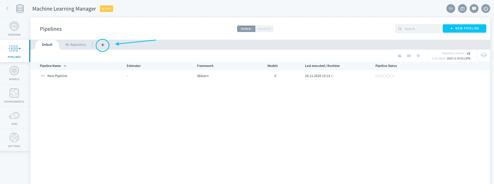
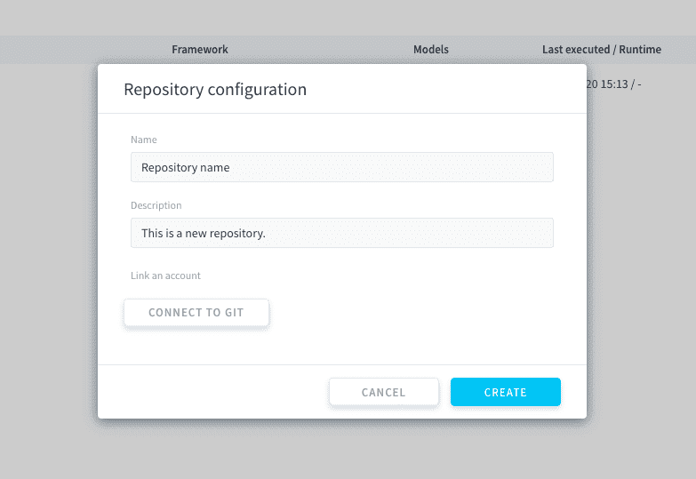
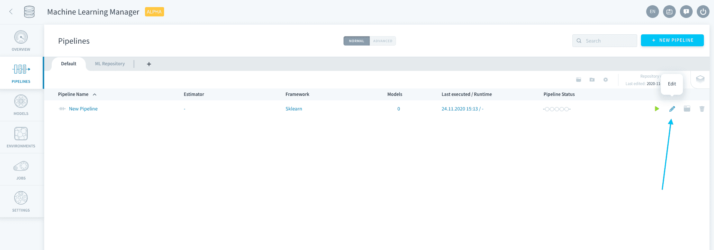
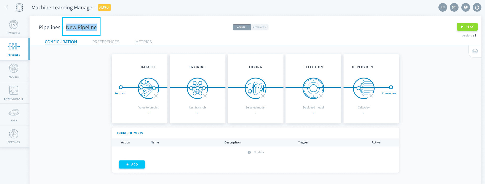
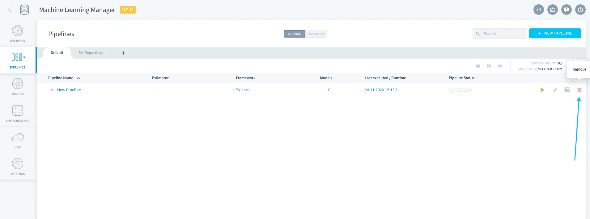

# Pipelines

>**Please note:** This service is only available on the *Legacy ForePaaS Platform*.

Pipelines are the feature that enables you to **create a machine learning model from scratch and deploy it to make predictions**. It is a production-grade end-to-end environment in which a model evolves through its [life-cycle](en/product/ml/pipelines/configure/index?id=manage-execution-options) in a traceable way.

> Pipelines can store several trained models and their versions, but only one can be deployed to make predictions.

- [Create a pipeline](/en/product/ml/pipelines/index?id=create-a-pipeline)
- [Manage pipelines](/en/product/ml/pipelines/index?id=manage-pipelines)
- [Configure a pipeline](/en/product/ml/pipelines/configure/index)
- [Execute a pipeline](/en/product/ml/pipelines/execute/index)

---
## Create a pipeline

To create a pipeline, head to **Pipelines** in the ML component. 

If you haven't already started a *machine learning Project*, start by [initializing a repository](/en/product/ml/pipelines/index.md?id=pipeline-repositories). Else simply click on **New Pipeline** at the top-right. 

Wait a few seconds for your pipeline to be built. After being built for the first time, pipelines are in auto-save mode. You can exit and come back to the configuration at any time.

{Configure a pipeline}(#/en/product/ml/pipelines/configure/index.md)

---
## Manage pipelines

### Pipeline repositories

Pipelines are stored in ForePaaS repositories. You can initialize a new repository by pressing the ➕ sign in the Pipelines tab.

You can edit the name and description of the pipeline, as well as connect it to an existing Git repository.

### Edit pipelines

Pipelines can be configured from the repository list by clicking on the **pen 🖊️ icon**, or by double-clicking the pipeline.

Pipelines can be renamed when configuring them, by double-clicking on their name at the top-right.

Pipelines can be deleted from the repository list by clicking on the **trash 🗑️ icon**.

!> Deleting a pipeline does not delete its saved models. Models that were generated by a deleted pipeline are still accessible on [the Models tab](/en/product/ml/models/index.md).

---
##  Need help? 🆘

> You didn't find what you were looking for on this page? You can ask for help by sending a request directly from the platform, going to the *Support* page. You can also send us an email at support@forepaas.com.

{Send your questions to support 🤔}(https://support.forepaas.com/hc/en-us/requests)