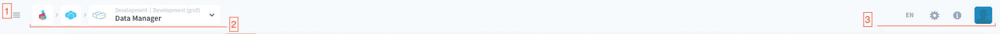

# Header

The header is always displayed no matter where you are in the platform. With it you can:
- Open or close the sidebar
- See where you are in the platform.
- Quickly navigate to other Projects and organisations.
- Access your profile settings.
- Access your [organisation settings](/en/product/organisations/orga_settings.md) from any page on the Platform.
- Change language.
- Log-out.

This component offers one of the main ways to move around the platform and this article details everything you can do with it.

1. [Open or close Sidebar](#open-or-close-sidebar)
2. [Organisation, Project and service panels](#organisation-Project-and-service-panels)
3. [Other settings](#other-settings)
     - [Language](#language)
     - [Organisation Settings](#organisation-settings)
     - [Information about the platform](#information-about-the-platform)
     - [Profile settings](#profile-settings)

## Open or close Sidebar

This button allows you to open or close the [Sidebar](/en/product/navigation/sidebar.md) no matter in which page you are.

## Organisation, Project and service panels

These panels can be displayed in icon or panel form depending on where you are in the platform. Hovering over an icon will make it turn into a panel.

From left to right, there is the:
- Organisation panel
  - *Used to change organisation.*
- Project panel
  - *Used to change Project within an organisation.*
- Service panel
  - *Used to change service within a Project.*

## Other settings

In this part of the header you can:
- Change the platform language
- Access your [Organisation Settings](/en/product/organisations/orga_settings.md)
- Check general useful information (components' status, roadmap, support, etc)
- Acess your [Profile Settings](/en/product/organisations/profile.md)

---
###  Need help? 🆘

> At any step, you can ask for support by reaching out to us on the Data Platform Channel within the [Discord Server](https://discord.com/channels/850031577277792286/1163465539981672559). you can also find a step by step guide towards joining our discord server in the [support](/en/support/index.md) section.