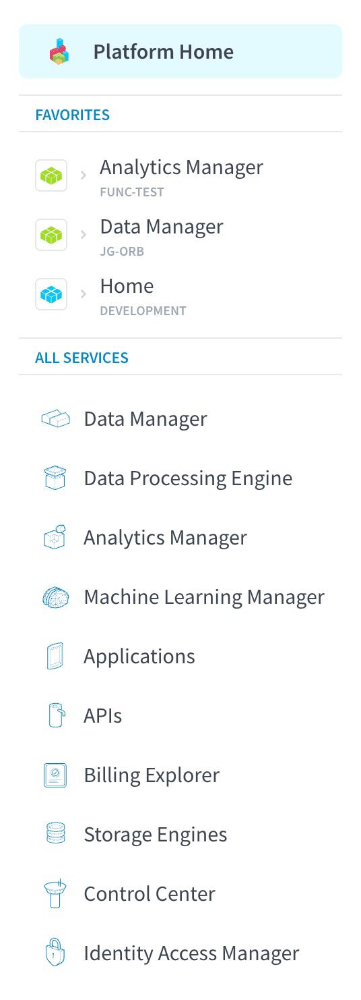
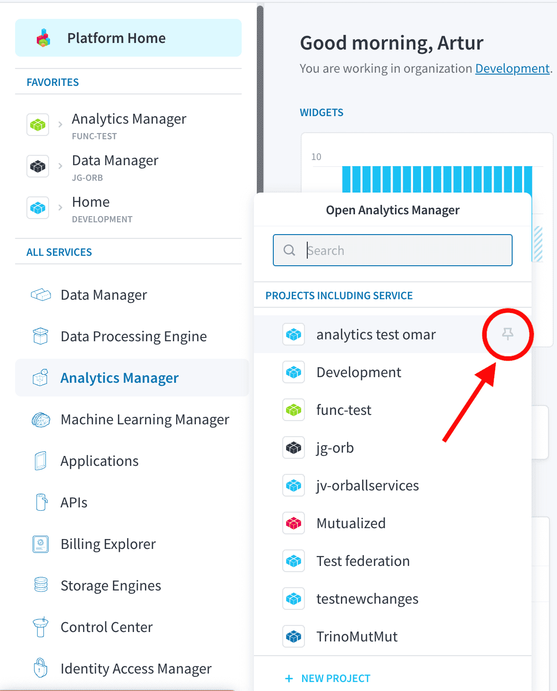
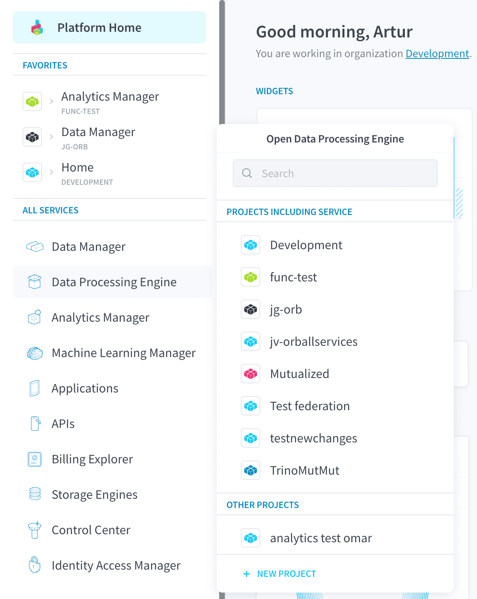

# Sidebar

The sidebar offers a quick way to move around the platform and this article details everything you can do with it.

It opens automatically in all Platforms' pages with the exception of when you are within a service. You can [open or close it in the header](/en/product/navigation/header.md?open-or-close-sidebar) and clicking outside it will close it automatically.

*From to top bottom:*
1. [Platform Home button](#platform-home-button)
2. [Favorites](#favorites)
     - [Adding Favorites](#Project-selector)
3. [All services](#all-services)
     - [Project Selector](#Project-selector)

## Platform Home button

At the top there is the *Platform Home* button. Clicking on it will send you back to the [Homepage](/en/product/navigation/home.md).   

## Favorites

The *Favorites* section can be used to easily access your recurrent services and Projects.

You can add two types of favorites:
- Service in Project
- Project Home (service name displayed as *Home*)

Clicking on *service in Project* favorites will bring you back to that service in the specific Project you configured while clicking in the *Project home* favorite will open the respective [Project's homepage](/en/product/project/project_home.md).

> Clicking on the Project icon of a favorite will bring you to the [Project's homepage](/en/product/project/project_home.md) regardless of the type of favorite you added.

### Adding Favorites

You can add *service in Project* by clicking on the pin icon that appears when hovering over a Project in the [Open Service in Project menu](#open-service-in-Project-menu).

> The pin icon appears filled if you have the service/project combination in your favorites or unfilled if you do not (it is unfilled in the screenshot).

Project Home favorites are [added directly via the Homepage](/en/product/navigation/home.md?=add-Project-homepage-to-the-sidebars-favorites)

## All services

The entirety of the Platform service portfolio is listed here so you can quickly access them in any Project you want. Hovering over a service will display the [Open Service in Project menu](#open-service-in-Project-menu) while clicking on the service **once** will keep the aforementioned menu open for that service.

> The [Billing Explorer](/en/product/organisations/orga_settings.md?=plan) and [Storage Engines](/en/product/storage-engine/index.md) services are tied only to an [Organisation](/en/product/organisations/index.md) and not to a specific Project, therefore you do not have to select Projects when opening them.

### Open Service in Project menu

This menu allows you to **select in which Project you will open your service**. There are three options (as shown in the screenshot above):
1. Open service in a Project that already includes it.
2. Open service in a Project that doesn't include it (*Other Projects* in the screenshot).
3. Open service in a new Project (*New Project* button in the screenshot).

Choosing the first option (*Projects including this service*) will simply redirect you to that service's page within the Project you selected. 

The second option (*Other Projects*) will activate the service in the selected Project and then you will be redirected (may take a few seconds).

The third option (*New Project*) will open the [Project creation page](/en/product/project/project_creation.md) so you can create a new Project with that service.

---
###  Need help? 🆘

> At any step, you can ask for support by reaching out to us on the Data Platform Channel within the [Discord Server](https://discord.com/channels/850031577277792286/1163465539981672559). you can also find a step by step guide towards joining our discord server in the [support](/en/support/index.md) section.