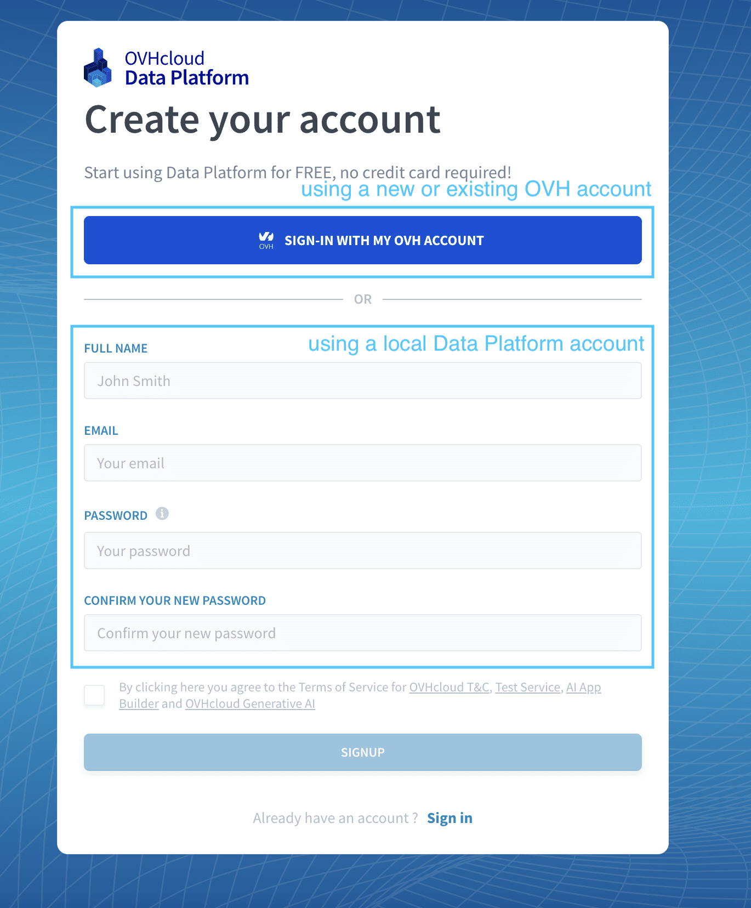
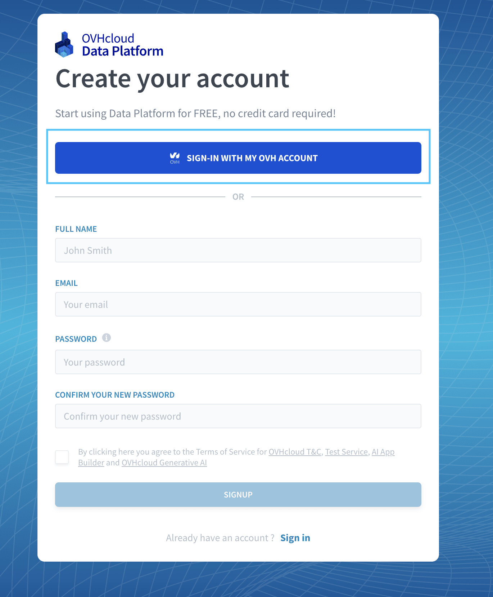
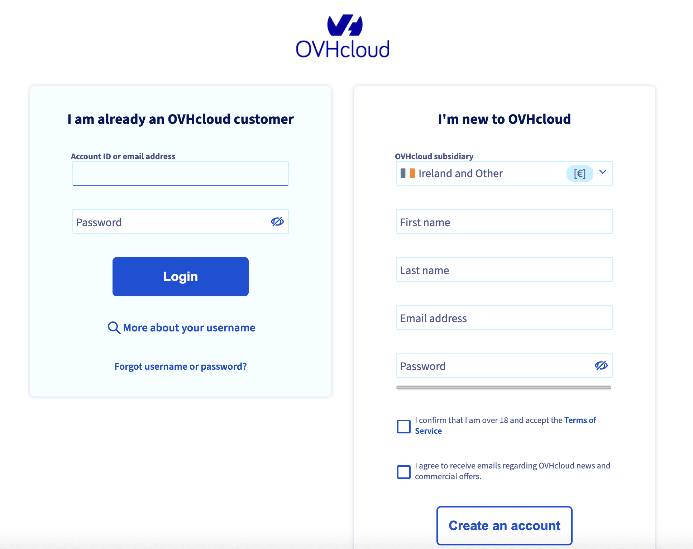
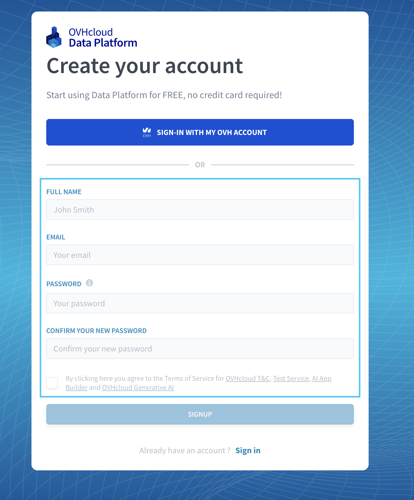

# Create an account on Data Platform

!> ForePaaS Legacy Platform no longer accepts new signups. If your company would like to get started on the platform, please use [OVHcloud Data Platform](https://eu.dataplatform.ovh.net/). 

Connecting to OVHcloud Data Platform can be done in either one of two ways:
- connecting by using an OVHcloud account
- connecting by using a local Data Platform account (invitation required)

---
## Signup using an OVHcloud account

?> This is the recommended method to connect to Data Platform.

You can connect to Data Platform using an OVHcloud account by pressing the blue button on the signup/signin page. 

You will then have the option to either use an existing account or to create a new one there.

---
## Signup using an local Data Platform account

!> To use this option, it is **required to [have been invited](/en/product/iam/users/users?id=manage-organization-iam-users) in an existing Data Platform Organization** by an admin from your company beforehand. Consequently, at least one person in your organization needs to have signed up [using an OVHcloud account](/en/product/organisations/create-account?id=signup-using-an-ovhcloud-account).

If you are joining people from your organization that are already signed-up on the platform, you can fill out the form to signup to the platform using a email & password combination.

!> To use this option, it is **required to [have been invited](/en/product/iam/users/users?id=manage-organization-iam-users) in an existing Data Platform Organization** by an admin from your company beforehand. Consequently, at least one person in your organization needs to have signed up [using an OVHcloud account](/en/product/organisations/create-account?id=signup-using-an-ovhcloud-account).

---
###  Need help? 🆘

> At any step, you can ask for support by reaching out to us on the Data Platform Channel within the [Discord Server](https://discord.com/channels/850031577277792286/1163465539981672559). you can also find a step by step guide towards joining our discord server in the [support](/en/support/index.md) section.