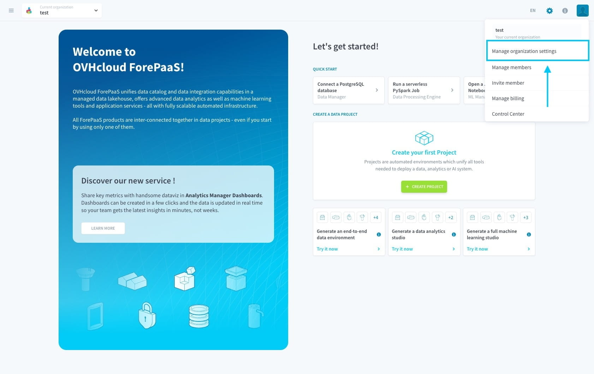
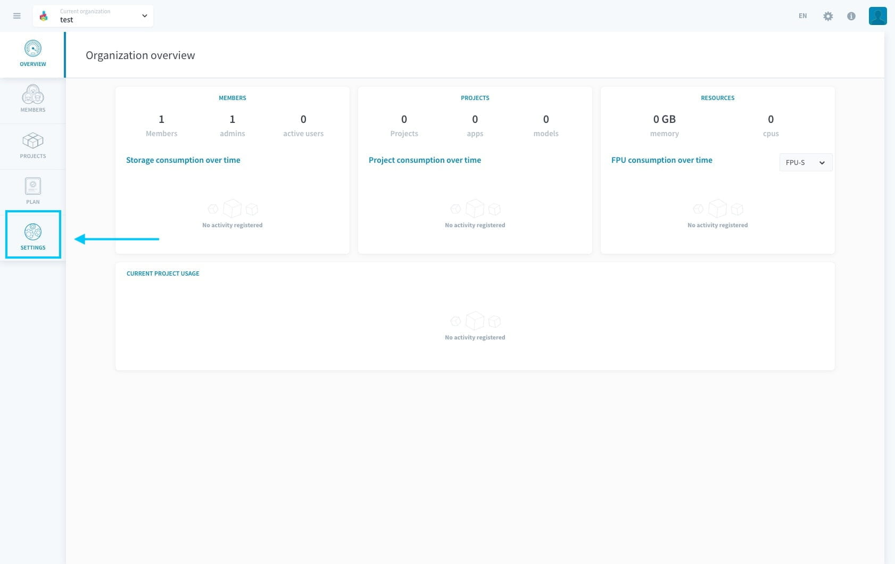
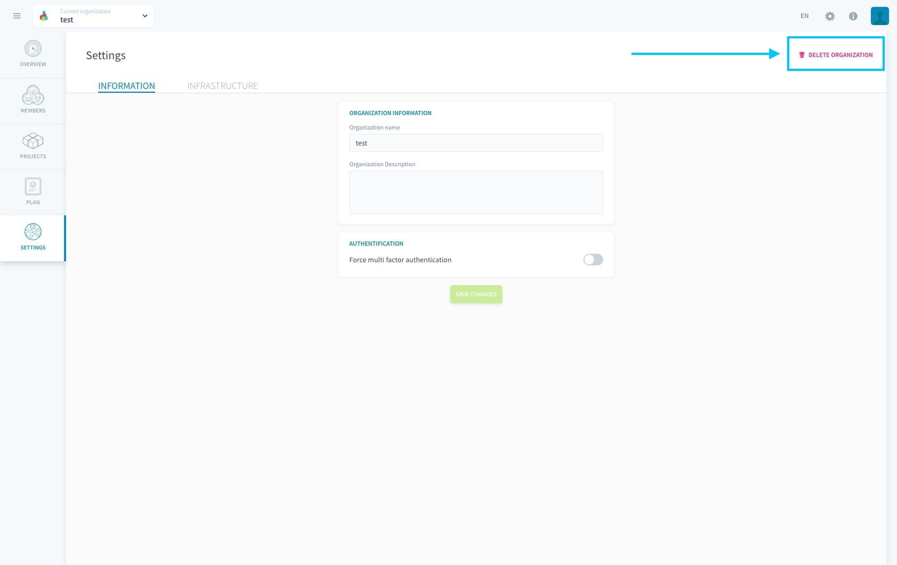
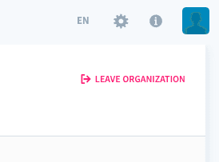

# Delete an organization

Deleting an organization ensures that all resources associated in this organization are **permanently deleted**. It is not possible to recover an organization that has been deleted.

To delete an organization there is a checklist to be followed. In the chance that you miss out on something in the checklist, you will not be allowed to delete the organization.  
All following 5 steps must be completed for an organization to be deleted:

1. [Delete all projects](/en/product/project/delete_project) within the organization
2. [Delete all storage engines](/en/product/project/storage-engine/index?id=delete-a-storage-engine) from the organization
3. Make sure there is no pending balance on [billing](/en/product/billing/account/index)
4. [Remove all users](/en/product/organisations/organization-invite-user?id=remove-members-from-your-organization) from the organization
5. Delete the organization *(see documentation below)*

---
## Delete the organization from the user interface

> Make sure you have followed all afore-mentioned steps before going further.

The option to delete an organization can be accessed by going to the organization settings. Click on the **organization settings** as shown in the image below.

Click on settings and you will land on the page which has the option to delete the organization. The button to delete will only be visible if you have followed all the steps in the checklist mentioned above.

If the checklist was not followed, you will be shown a **leave organization** button instead of the **delete organization**.

---
###  Need help? 🆘

> At any step, you can ask for support by reaching out to us on the Data Platform Channel within the [Discord Server](https://discord.com/channels/850031577277792286/1163465539981672559). you can also find a step by step guide towards joining our discord server in the [support](/en/support/index.md) section.