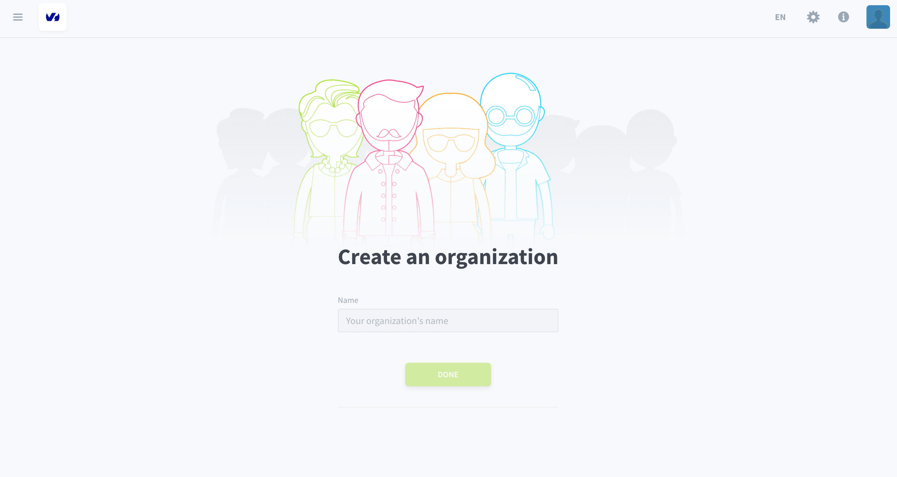
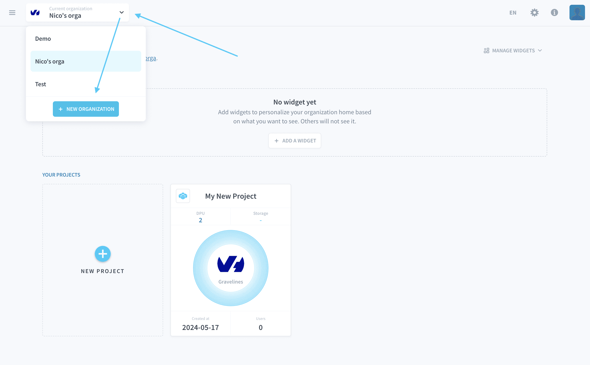
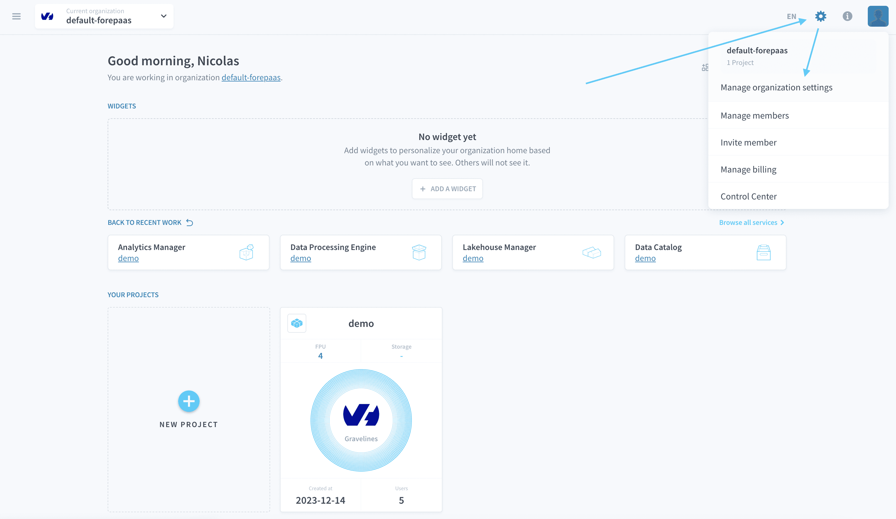

# Organizations and user profiles

Organizations are the compartmentalized teams that link individual users (or members) and [Projects](/en/product/project/index.md) as well as their services together. You can have as many teammates in your organization as you want and everyone in the organization must have [user profile](/en/product/organisations/profile.md) to use the platform.

Your organization can work on multiple [Projects](/en/product/project/index.md) at the same time and you can create as many as you want.

> To create or join an organization, make sure that you already have a [User Profile](/en/product/organisations/profile.md).

---
## Create an organization
### If you are not in an organization
If you are not part of an organization already, you will be able to create a new one:

### If you are already in an organization

If you are already in an organization, click on the drop-down menu located at the top left and then on **New organization**.

Fill in the name and press **Done**. 

---
## Join an existing organization
To join an organization that already exists (if your team already has one, for example), you need to ask someone already on there to invite you.

{Learn how to invite members}(#/en/product/organisations/organization-invite-user.md)

You will receive an email with a clickable link inviting you to join their organization.

---
## Manage your organization settings

You can manage your organization by opening the drop-down menu at the top right and by clicking on **Manage organization settings**.

From there, you will be able to configure:
- Your Projects
- Your storage engines
- Your billing settings
- Other parameters: Name, description, SSL certificates, domain names, etc.

{Learn how to configure an organization}(#/en/product/organisations/orga_settings.md)

---
###  Need help? 🆘

> At any step, you can create a ticket to raise an incident or if you need support at the [OVHcloud Help Centre](https://help.ovhcloud.com/csm/fr-home?id=csm_index). Additionally, you can ask for support by reaching out to us on the Data Platform Channel within the [Discord Server](https://discord.com/channels/850031577277792286/1163465539981672559). There is a step-by-step guide in the [support](/en/support/index.md) section.