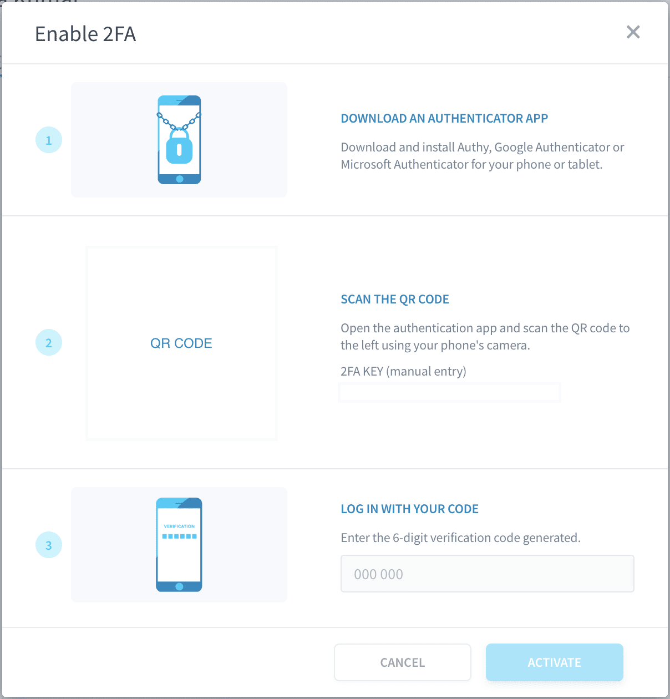
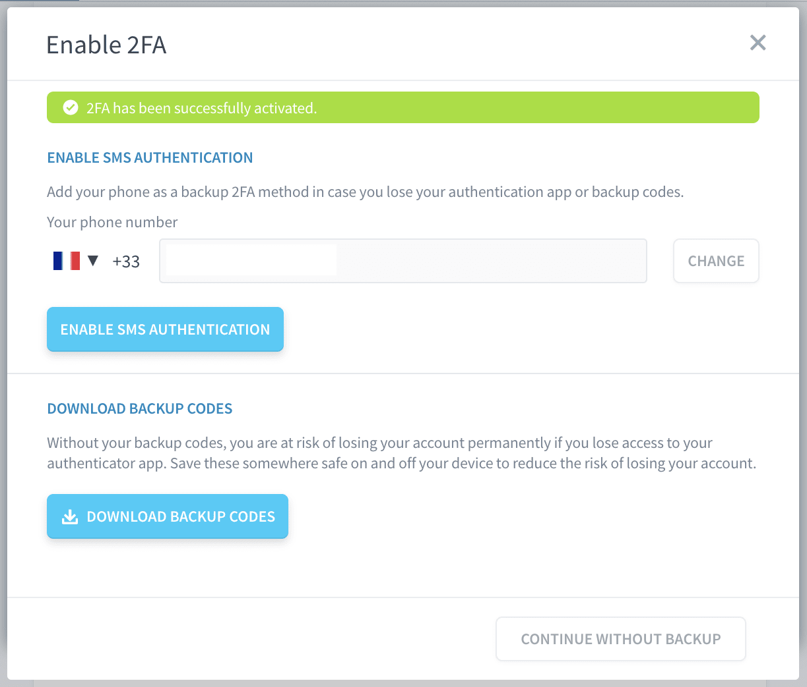
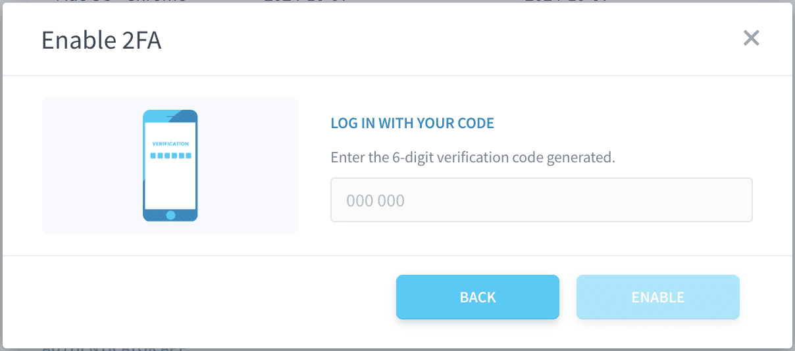
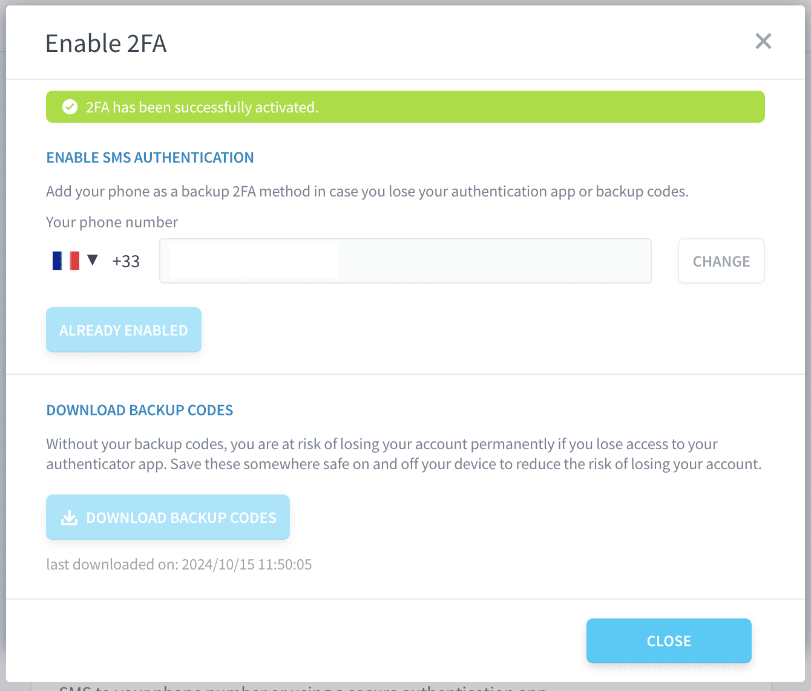
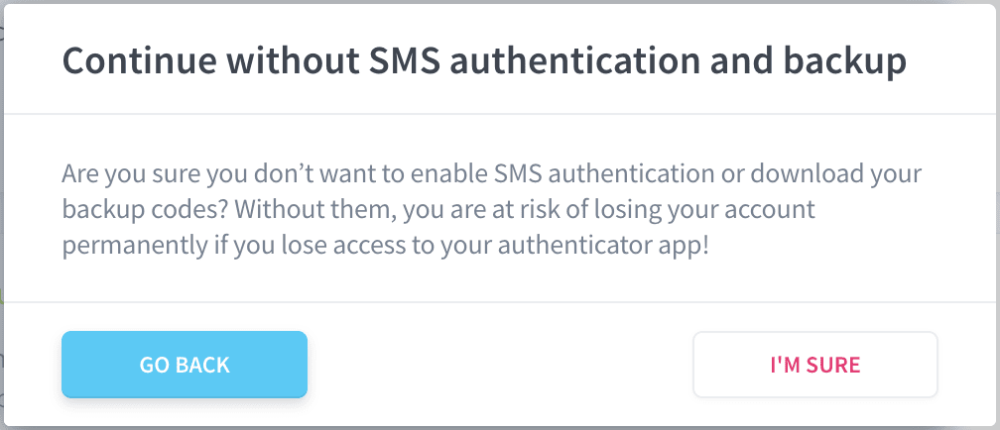

# Multi-Factor Authentication (MFA) Setup Guide

This guide will walk you through enabling Multi-Factor Authentication (MFA) on your account. MFA enhances your account's security by requiring a second form of verification in addition to your password. You can configure MFA using an authentication app or via SMS as a backup method.

## Steps to Enable MFA

### 1. Access Your Security Settings
- Log in to your account on the platform.
- Navigate to your profile settings by clicking on your user avatar in the top right corner.
- Select the **Security** tab to view your security preferences.

### 2. Enable Two-Factor Authentication (2FA)
- Under the **Two Factor Authentication** section, you will see two available methods for enabling MFA:
  - **Authenticator App** (recommended for better security)
  - **SMS Authentication** (can be used as a backup option)

You can choose either method to enable MFA, but we recommend setting up both for maximum security.

#### Option 1: Authenticator App
Follow these steps to enable MFA using an authenticator app:

1. **Download an Authenticator App**  
   Download and install an app like Google Authenticator, Authy, or Microsoft Authenticator from your phone’s app store.

2. **Scan the QR Code**  
   - Open your authenticator app and select the option to add a new account.
   - Scan the QR code displayed on your portal.
   - Alternatively, you can manually enter the 2FA key shown below the QR code.

3. **Enter the Verification Code**  
   After scanning the QR code, the authenticator app will generate a 6-digit code. Enter this code in the text field on the portal.

4. **Activate 2FA**  
   Click **Activate** to complete the setup. You will receive a confirmation message indicating that MFA has been successfully enabled.

#### Option 2: SMS Backup Authentication
After enabling 2FA with the authenticator app, it is recommended to set up SMS as a backup method in case you lose access to your authenticator app or device:

!> **Warning**: If you have not registered your phone number in the **Preferences** tab, the **Enable SMS Authentication** button will be disabled. To enable SMS-based authentication as a backup method, please ensure that your phone number is correctly registered in your account preferences.

1. **Enter Your Phone Number**  
   - Under the **SMS Backup Authentication** section, enter your phone number. The system will display the country code and number fields for verification.
   - Click **Enable SMS Authentication**.

2. **Download Backup Codes** (Recommended)
   Once MFA is activated, **you can only download your backup codes during the initial setup**. This is a security measure to ensure that the codes are not easily accessible after the setup is complete, minimizing the risk of unauthorized access to your account. 

   **Important:** Make sure to store these backup codes in a secure location because **if you lose access to both your authenticator app and phone, these codes are the only way to regain access to your account**. You will not be able to download them again later.

### 3. Final Confirmation
After successfully enabling MFA via an authenticator app and optionally via SMS, your account is now secured with two-factor authentication. You can proceed without SMS authentication if you prefer, but we strongly recommend setting it up to avoid losing access to your account.

---

## Important Notes
- **Backup Codes Can Only Be Downloaded Once**: For security reasons, the backup codes can only be downloaded during the initial setup. This ensures that your account remains secure by preventing anyone from obtaining the codes after you've set up MFA.
- **Choosing Between Authenticator App and SMS**: While you can choose between using an authenticator app or SMS as your primary 2FA method, the app-based method is considered more secure. We highly recommend configuring both to have a backup in case you lose access to one method.

---

## Conclusion
You have now successfully enabled multi-factor authentication on your account. MFA ensures an added layer of protection to your account, minimizing the risk of unauthorized access. Remember to store your backup codes in a secure location and keep your phone and authenticator app handy for future logins.
