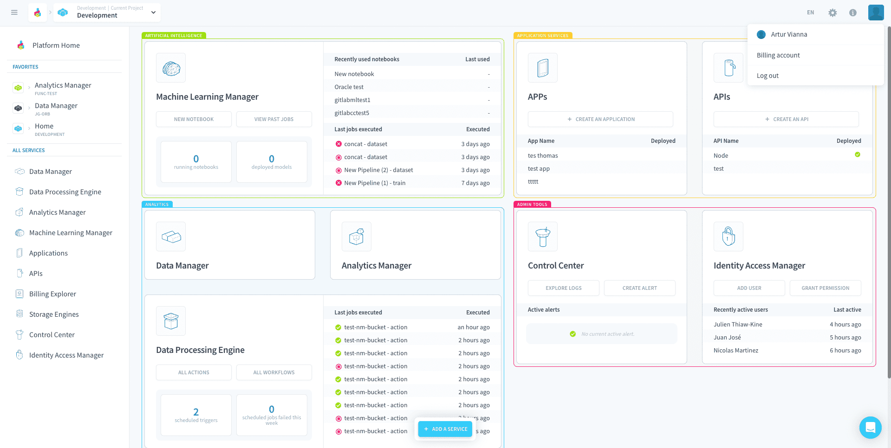
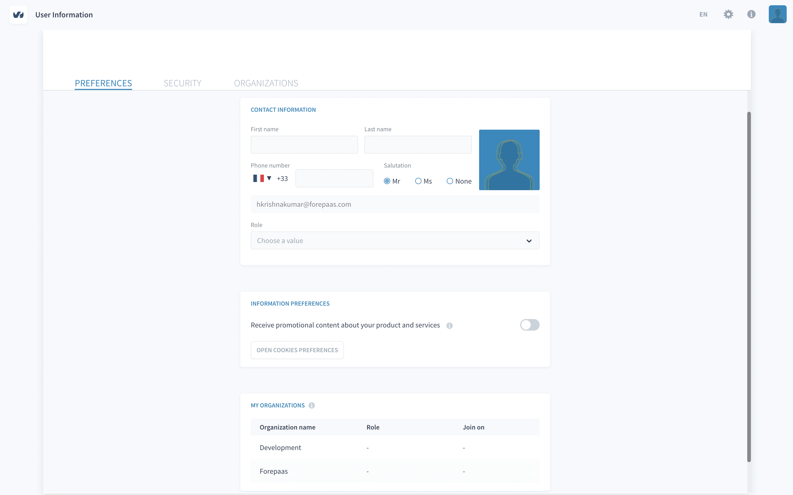
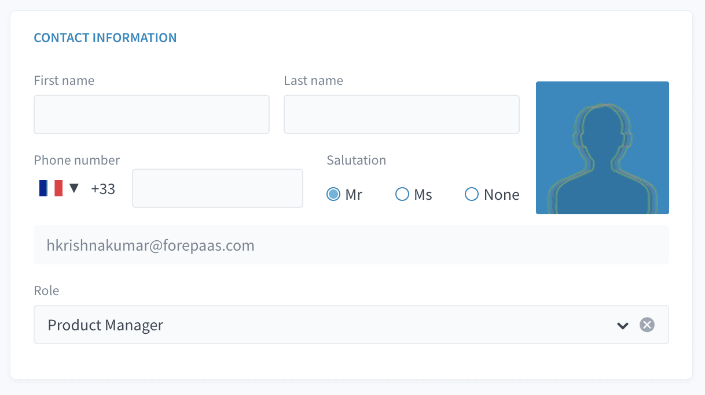
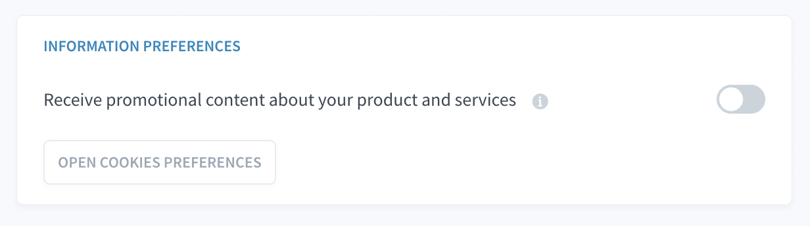
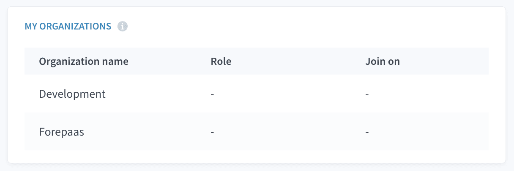
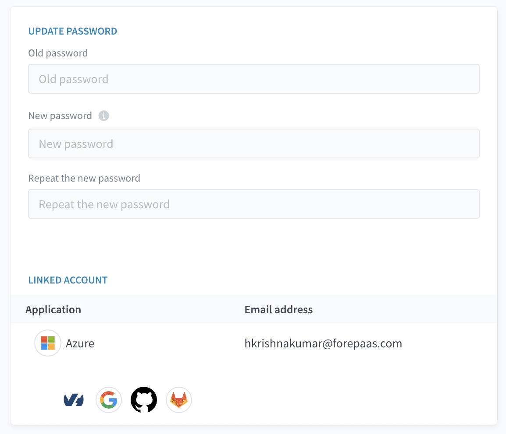
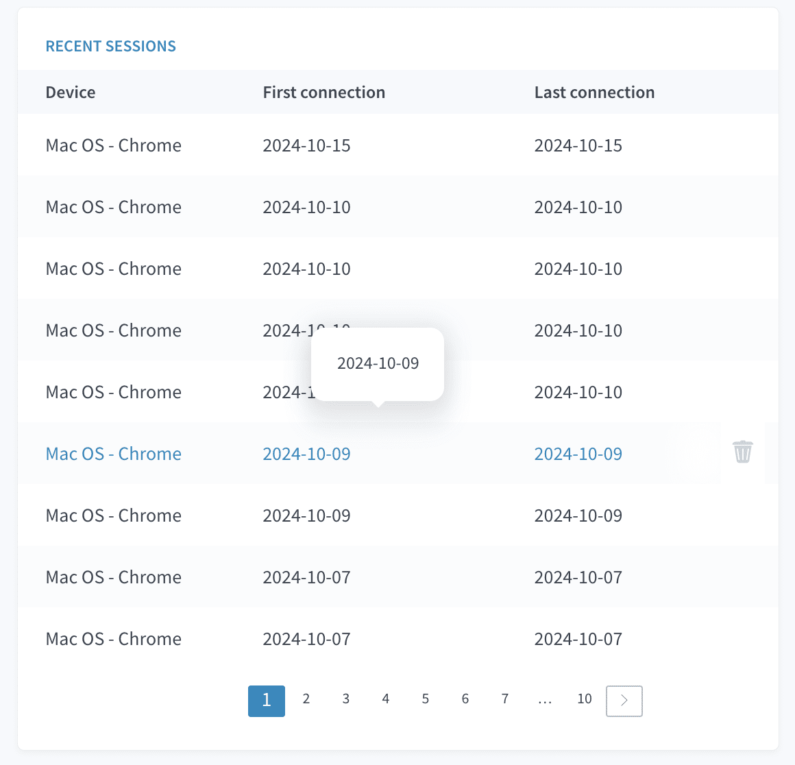
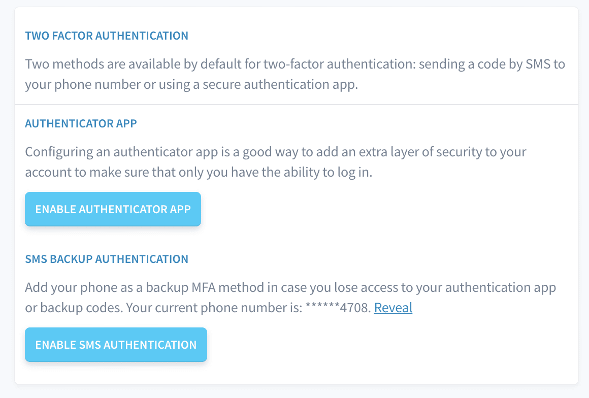
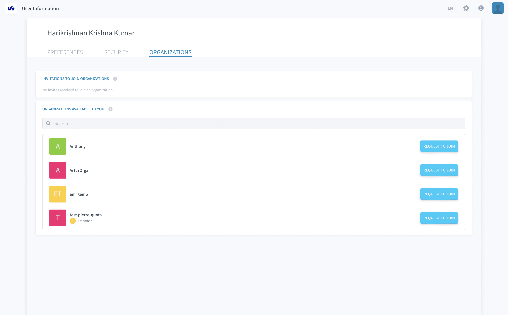
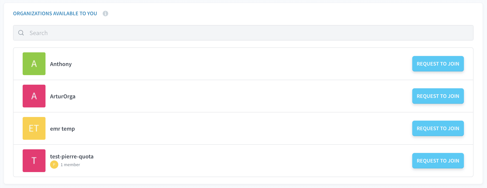

# User Profile Guide

Creating your own user profile is the first necessary step in order to use the platform. You can then create or join an [Organization](/en/product/organisations/index.md)

An [Organization](/en/product/organisations/index.md) us a workspace shared with your teammates to work on Projects. Once you are part of an [Organization](/en/product/organisations/index.md), you can create [Projects](/en/product/project/index) which are dedicated environments that assemble multiple services together and can answer one or more use cases.

> 💡 Charges are at the organization level through the purchase of a subscription plan. 
---
## Create an account
Join your team on the platform by creating yourself an account on the platform. It is completely free!

{Create your profile!}(#/en/product/organisations/create-account.md)

---
## Create or join an organization

An organization represents a company or a specific business unit. It is where you can add all your teammates to work on multiple Projects.

{Learn more about organizations!}(#/en/product/organisations/index.md)

---

## Edit your account

At any time, you have the possibility to view and edit your user profile from the platform by clicking on **Profile** at the top right.

The user profile section of the platform is split into three main sub-pages: **Preferences**, **Security**, and **Organizations**. This guide explains each section in detail to help you manage your account and settings effectively.

---

## 1. Preferences

In the **Preferences** section, you can update your contact information, manage communication preferences, and view your organization memberships.

### 1.1 Contact Information

You can update your personal details, such as:
- **First Name** and **Last Name**
- **Phone Number** (with country code selection)
- **Salutation** (Mr, Ms, None)
- **Email Address**
- **Profile Picture** (option to upload)

Additionally, there is a dropdown to choose your role in the organization.

### 1.2 Information Preferences

In this section, you can opt to receive promotional content about the platform's products and services. You can also open the cookies preferences to control how your data is used.

### 1.3 My Organizations

This section lists all the organizations you are a part of, with the following details:
- **Organization Name**
- **Role** within the organization (e.g., Admin, Member)
- **Join Date**

---

## 2. Security

The **Security** section helps you manage the security of your account. This includes options to update your password, manage linked accounts, review recent sessions, and enable multi-factor authentication (MFA).

### 2.1 Update Password

You can change your account password here. It is recommended to choose a strong password to enhance account security. 

Steps to update:
1. Enter your current password.
2. Input a new password and confirm it.
3. Save the changes.

### 2.2 Linked Accounts

You can link third-party accounts (such as Google or GitHub) to your platform account for easier login options. You can also remove linked accounts from here.

### 2.3 Recent Sessions

This section shows the details of recent login sessions, including:
- Date and time of login
- Device used
- Location (IP address)

If you notice any suspicious activity, you can terminate active sessions from this section.

### 2.4 Multi-Factor Authentication (MFA)

MFA adds an additional layer of security by requiring a second form of verification (e.g., a code sent to your mobile phone or an authenticator app). You can enable or disable MFA here.

For detailed instructions on how to configure and manage Multi-Factor Authentication (MFA) for your account, please refer to the dedicated MFA setup documentation. The document provides a step-by-step guide on enabling MFA, setting up an authenticator app or SMS-based authentication, and securely handling backup codes.

You can find the complete MFA documentation at the following location: [MFA Setup and Configuration Guide](#/en/product/organisations/mfa-setup.md).

It is highly recommended that all users review the MFA documentation to ensure their accounts are adequately protected.

---

## 3. Organizations

In the **Organizations** section, you can manage your organization memberships, view available organizations, and accept invitations.

### 3.1 Invitations to Join Organizations

If you have been invited to join an organization, it will be listed here. You can accept or decline invitations as needed.

### 3.2 Organizations Available to You

This section lists the organizations that are publicly available for you to join. You can search for specific organizations using the search bar, and click **Request to Join** for the desired organization.

### 3.3 Managing Organization Memberships

Once you are part of an organization, you can manage your role within the organization, view other members, and leave the organization if necessary. Additionally, you can create new projects within the organization’s workspace.

---

###  Need help? 🆘

> At any step, you can ask for support by reaching out to us on the Data Platform Channel within the [Discord Server](https://discord.com/channels/850031577277792286/1163465539981672559). you can also find a step by step guide towards joining our discord server in the [support](/en/support/index.md) section.
