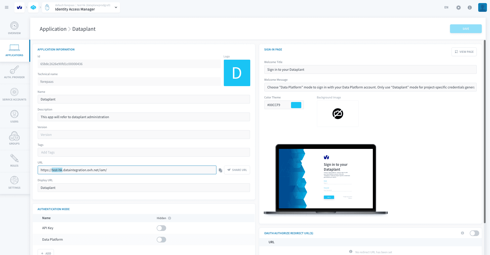

# Configuration variables

Some configuration variables for your project are presented on this page.

---
## Project subdomain

Your project's subdomain is used in the base URL for the APIs of all services of the platform. It is the **stringified version of your project's name**.

You can find it in [Identity Access Manager](/en/product/iam/index) **> Applications > Dataplant**, at the base of the field *URL*.

---
###  Need help? 🆘

> At any step, you can create a ticket to raise an incident or if you need support at the [OVHcloud Help Centre](https://help.ovhcloud.com/csm/fr-home?id=csm_index). Additionally, you can ask for support by reaching out to us on the Data Platform Channel within the [Discord Server](https://discord.com/channels/850031577277792286/1163465539981672559). There is a step-by-step guide in the [support](/en/support/index.md) section.