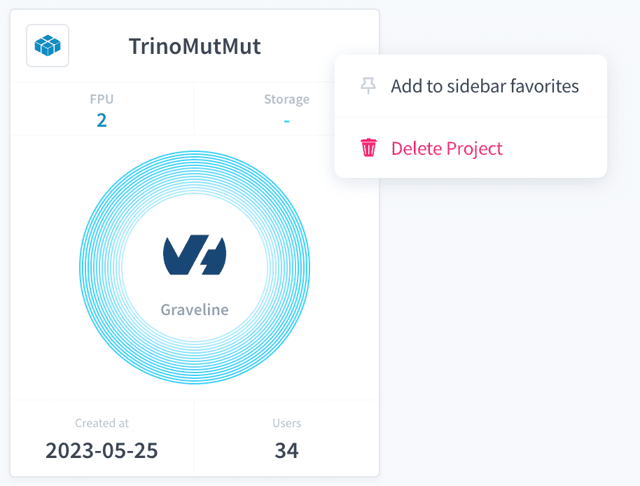
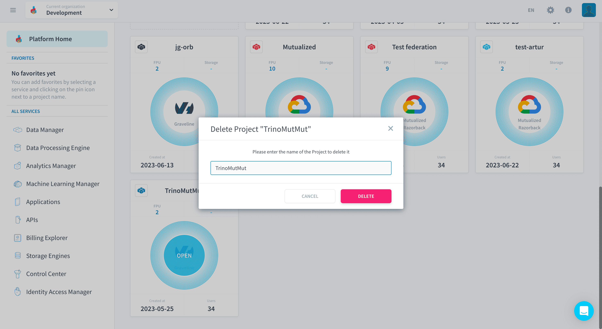

# Delete a Project

> You must have **project permission** `delete` in order to delete projects. These permissions are set at user level in your [organization settings](/en/product/organisations/organization-invite-user?id=manage-member-permissions-in-your-organization).

Deleting a Project **completely and permanently erases its data**. Use only when necessary!

If you are sure about deleting a Project, it can be done in 3 steps:

- [Choose the Project to delete](#choose-the-Project-to-delete)
- [Confirm decision by typing Project name](#confirm-decision-by-typing-Project-name)
- [Click on link on email received](#click-on-link-on-email-received)

---
## Choose the Project to delete

You can delete a Project via the [Project Card menu](/en/product/navigation/home.md?=your-Projects-list) in the [Homepage](/en/product/navigation/home.md).

---
## Confirm decision by typing Project name

After you click on *Delete Project* you will be prompted to confirm your decision by typong your Project name.

---
## Click on link on email received

You will receive an email with a link to confirm the deletion of your Project. Just click on the confirmation link to delete the Project.

---
###  Need help? 🆘

> At any step, you can create a ticket to raise an incident or if you need support at the [OVHcloud Help Centre](https://help.ovhcloud.com/csm/fr-home?id=csm_index). Additionally, you can ask for support by reaching out to us on the Data Platform Channel within the [Discord Server](https://discord.com/channels/850031577277792286/1163465539981672559). There is a step-by-step guide in the [support](/en/support/index.md) section.