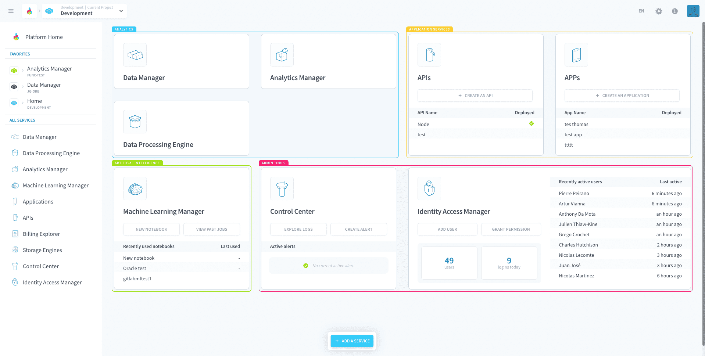

# Projects and services

On the Platform, a **Project** is a cloud environment with dedicated resources that contains all the components required to manage your data's lifecycle, from ingestion to restitution. The physical data, in turn, is stored in a [storage engine](/en/product/project/storage-engine/index) linked to the Project.

* [What can I do in a Project](#what-can-i-do-in-a-project)
* [What services are included in a Project](#what-services-are-included-in-a-Project)
* [How to allocate resources in a Project](#how-to-allocate-resources-in-a-project)

---
## What can I do in a Project

Projects are the the hub in which you access all the platform services as well as your data. The tasks that are necessary to build a data application or put AI models into production are all automated, such as:
* getting an entire team to work on the same environment, with different access rights to the data or the modules
* building a logical database schema, without being linked to a specific database
* automating the data collection, ETL-ing and visualization
* training artificial intelligence & machine learning models
* monitoring the cloud infrastructure and its performances

> In general, one Project can answer one or a range of specific use cases. You can use several Projects in order to work on different environments (staging, production...) for the same use case.  
[Learn more about how to export a Project configuration.](/en/getting-further/export-import-project-config/index.md)

---
## What services are included in a Project
A Project is a flexble environment composed of multiple services, meaning you can add services in your Project as you wish. These services are separated into categories and only the *Admin tools* services are mandatory for your project to run, all the others you may add according to your needs.

* **Data Analytics**: collection, data warehousing and processing, and querying.
  * The [Data Catalog](/en/product/data-catalog/index)
  * The [Lakehouse Manager](/en/product/lakehouse-manager/index)
  * The [Data Processing Engine](/en/product/dpe/index)
  * The [Analytics Manager](/en/product/am/index)
* **Artificial Intelligence**: notebook exploration and machine learning.
  * The [Machine Learning Manager](/en/product/ml/index) - *Only available on Legacy ForePaaS*
* **Application Services** : API gateways and data visualization.
  * The [APIs](/en/product/api-manager/index)
  * The [APPs](/en/product/app-manager/index)
* **Admin Tools**: resources management and access control.
  * The [Control Center](/en/product/cc/index)
  * The [Identity Access Manager](/en/product/iam/index)

{How to create a Project?}(#/en/product/project/project_creation.md)

---
## How to allocate resources in a Project? 

Projects were designed from scratch to scale easily as the requirements of your data Project evolve. You can independently **scale horizontally and vertically** in any component of your choice in just a few clicks, for example in the [preferences](/en/product/dpe/jobs/resources) of a [Data Processing Engine workflow](/en/product/dpe/workflows/index.md), or in the [preferences](/en/product/ml/pipelines/execute/preferences) of a [Machine Learning Manager pipeline](/en/product/ml/pipelines/index.md). Deployed instances, such as [APIs](en/product/api-manager/index), [applications](/en/product/app-manager/index) or [database engines](/en/product/project/storage-engine/index), can also be scaled independently.

Each component in your Project will consume [resources](/en/product/billing/resources/index) when it is actively running (either through a job or a deployment).

> Even when it is idle, your Project uses a handful of DPUs by default. You can manage this amount in [Control Center](/en/product/cc/index).

{Learn more about resource consumption}(#/en/product/billing/resources/index.md)