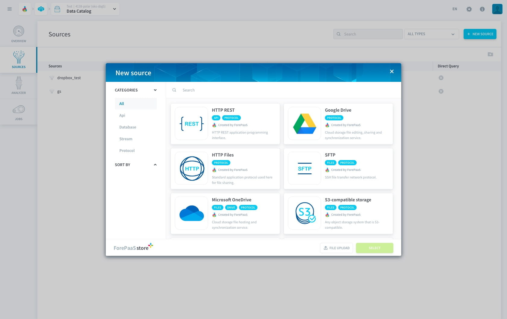
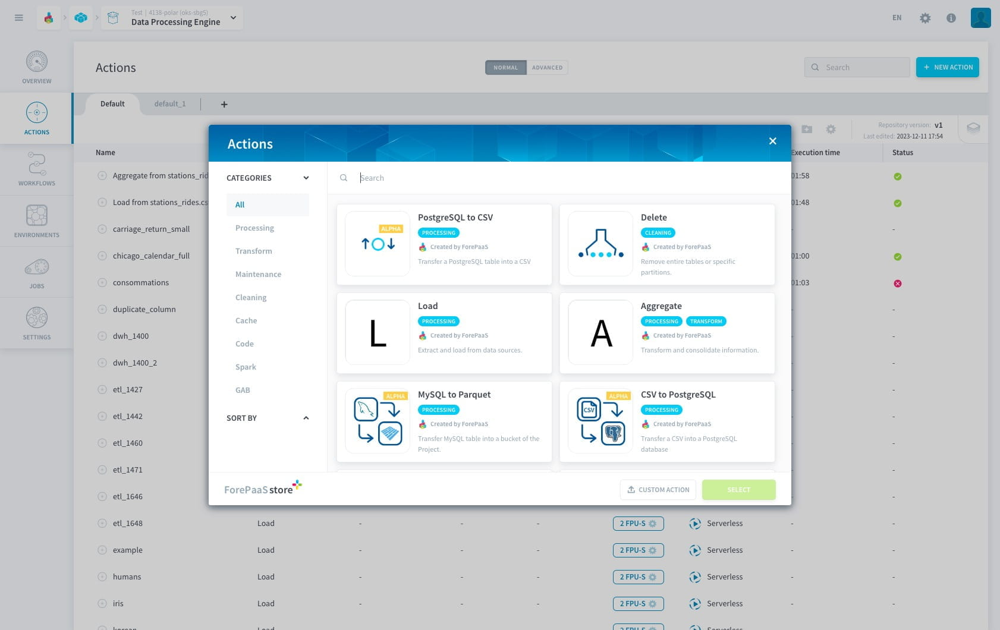
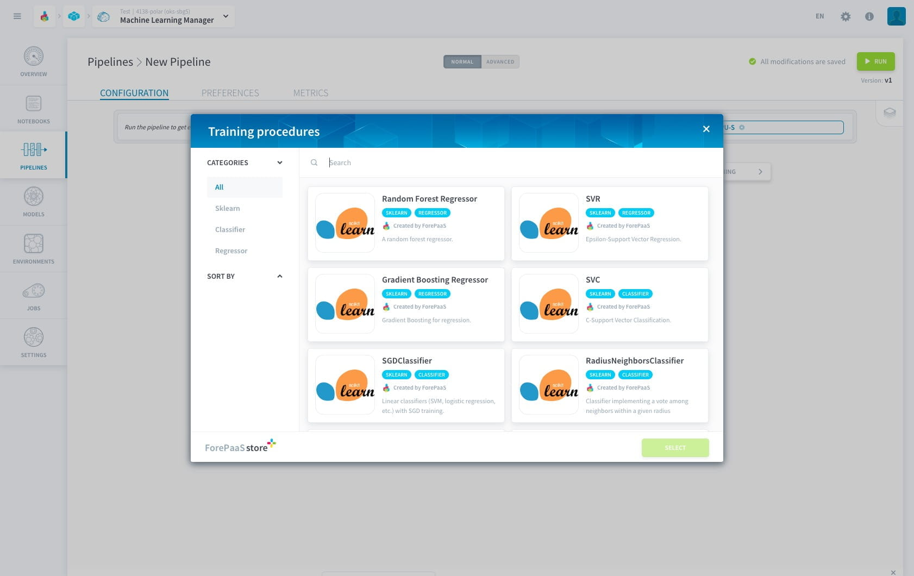
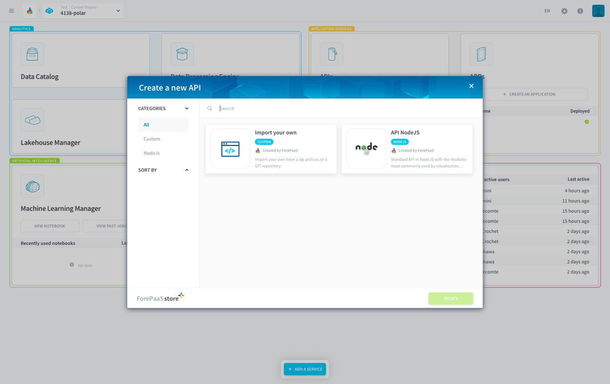
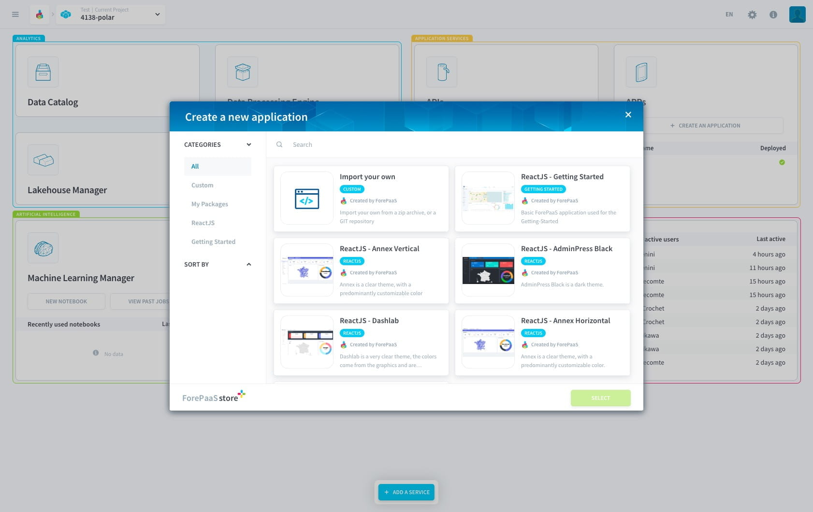

# ForePaaS Store

The platform has been designed so that each user can create, share, and/or access pieces of work through the ForePaaS Store, at each step of the data production chain:

* **[Collect](#connectors-marketplace)** : to easily connect your data sources
* **[Transform](#dpe-marketplace)** : to work on pre-built ETL actions 
* **[Data Science](#machine-learning-marketplace)** : to leverage artificial intelligence algorithms
* **[Expose](#api-and-app-marketplace)** : to integrate widgets and dashboards templates

The ForePaaS Store gathers dozens of tools, models, templates, etc. allowing you to save time when creating analytics and AI applications. 

---
## Connectors Marketplace

Within the Data Catalog, the ForePaaS Store lets you collect in a few clicks any type of data, from any source. 

{Learn more about data catalog}(#/en/product/data-catalog/index)

---
## DPE Marketplace

Inside the Data Processing Engine, the ForePaaS Store grants you access to 10+ pre-configured actions to let you transform your data in the most efficient way. Pick the action you need (aggregate, load, delete...) or create a custom action. 

{Learn more about Data Processing Engine actions}(#/en/product/dpe/actions/index)

---
## Machine Learning Marketplace  

ForePaaS lets you integrate all components of an AI solution, whether it is entirely pre-trained models or specific parts of an ML pipeline such as an estimator or a score.

{Learn more about the Machine Learning Manager}(#/en/product/ml/index.md)

---
## API and APP Marketplace
You can create your own templates and share them within an organization or with other ForePaaS users. Easily build your API with our standard NodeJS API template.  

{Learn more about API creation}(#/en/product/api-manager/deploy)

In the App Manager, create an analytical dashboard from scratch with our React templates. 

Finally, the extensions Marketplace allow you to enrich your apps and APIs with new features. 

{Learn more about APP creation}(#/en/product/app-manager/index)