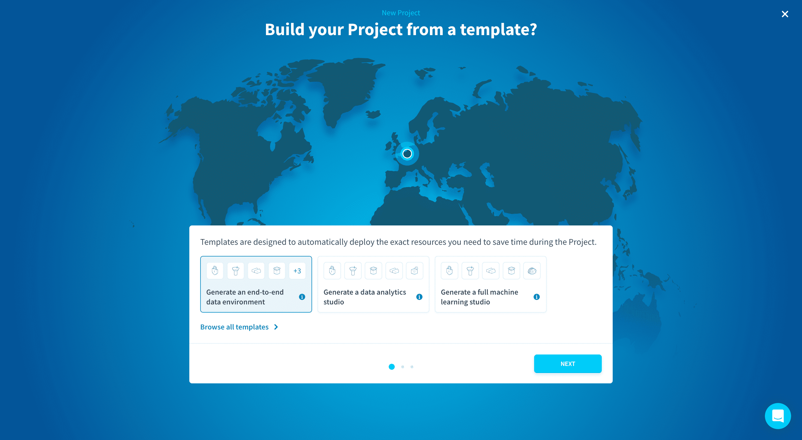
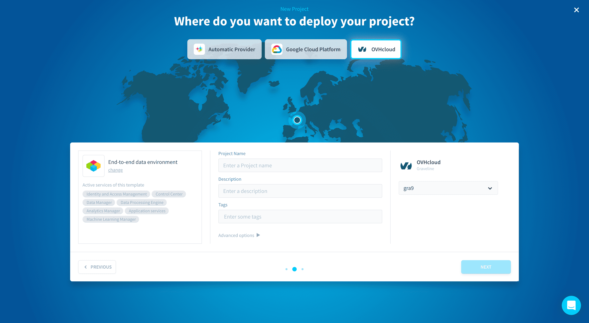
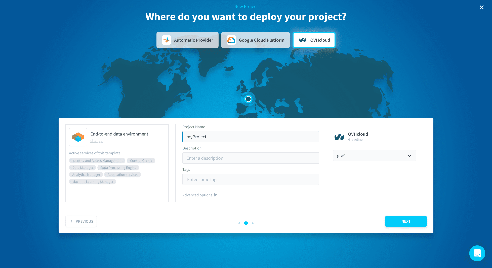
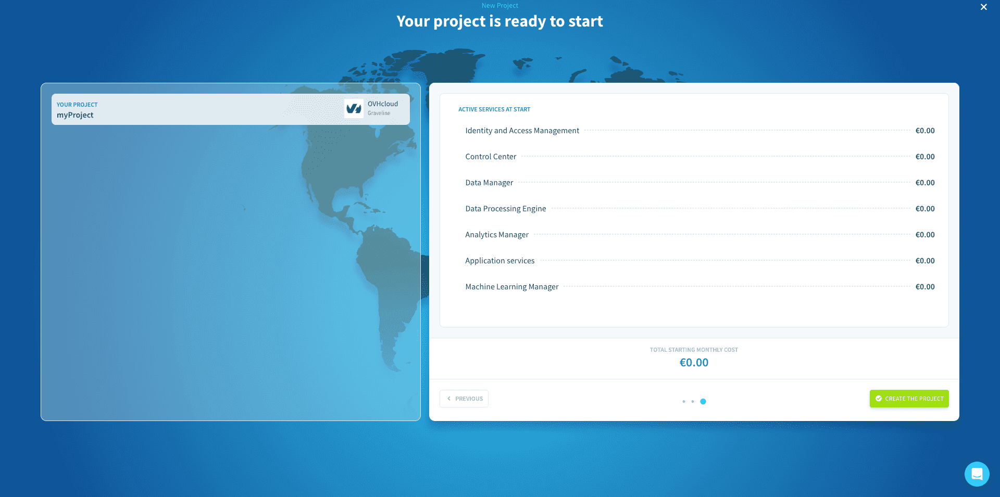

# Create a Project

Creating a new Project only takes a few minutes! It is possible to choose the cloud provider and region for your data (cloud or on-premise) as well as which Project template you want to start with.

?> Data Platform was engineered to easily scale Projects as they grow. At any time after your Project is created, you will be able to expand its capabilities and storage volume throughout the Project thanks to horizontal and vertical scalability.

Creating a Project is done in 3 steps:

- [Choose a template](#choose-a-template)
- [Choose a cloud provider and region for your Project](#choose-a-cloud-provider-and-region-for-your-Project)
- [Overview and confirmation](#overview-and-confirmation)

---
## Choose a template

Start by picking the template that suits your use case the most. If no template fits your needs perfectly, don't worry! You can add services to the Project later. To make sure all your needs are covered we suggest that you **pick the End-to-end template**. 

---
## Choose a cloud provider and region for your Project

This is the location of the data center where: 
* your Project's configuration will be stored 
* your object store will be stored
* your data processing jobs, querying, APIs and applications will be running

> Your Project's databases are stored in the [storage engine(s)](/en/product/project/storage-engine/index) your Project is linked to. The storage engine can be in different regions.

Choose a location either by clicking on the desired spot on the map, or by manually selecting your region in the dropdown menu.

Once you are happy with your cloud choice, enter the name of your Project. **This name cannot be modified later on** and will by default correspond to the Domain Name System (DNS) of your Project. 

?> You can also **customise domain and subdomain** in the advanced options of this step.

---
## Overview and confirmation

Finally, you'll get to this ultimate screen summing up all the information related to your Project.

By clicking on **Confirm**, the creation of your Project will start.

A collection of cloud micro-services are automatically set up in just a few minutes: web-app firewalls, security groups, CDNs, DNS configuration, SSL/TLS certificates, API endpoints, capacity planning, load balancer, auto-scaling, Kubernetes, cache, ETL, data warehouse engine, and more…

You will receive an email once the creation is finished, meaning the Project is ready to be used.

---
###  Need help? 🆘

> At any step, you can create a ticket to raise an incident or if you need support at the [OVHcloud Help Centre](https://help.ovhcloud.com/csm/fr-home?id=csm_index). Additionally, you can ask for support by reaching out to us on the Data Platform Channel within the [Discord Server](https://discord.com/channels/850031577277792286/1163465539981672559). There is a step-by-step guide in the [support](/en/support/index.md) section.