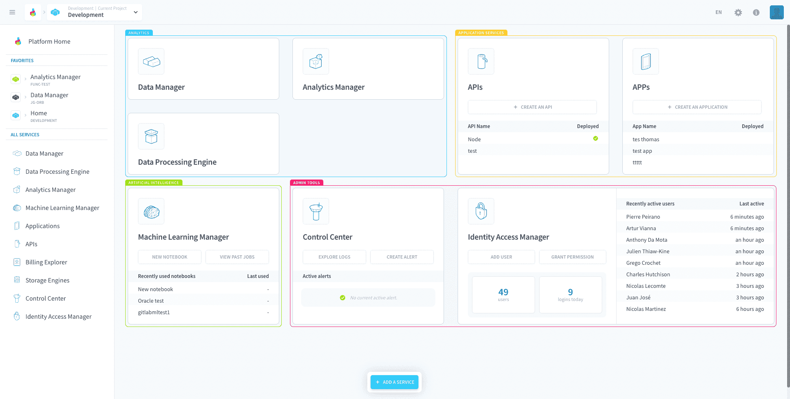
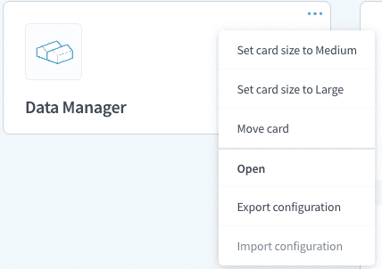
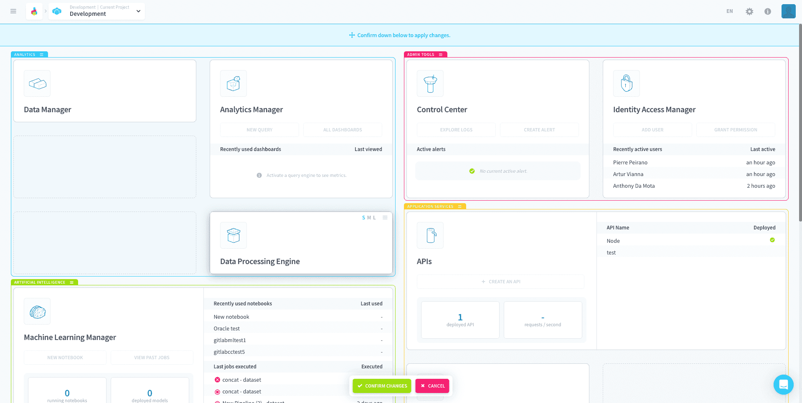
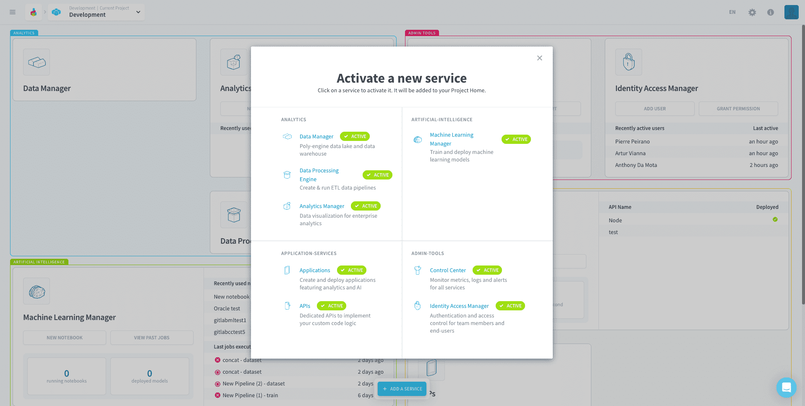

# Project Home

The Project home is the central hub of your Project. It displays all the services in the form of [Service Cards](#service-cards) that are arranged into [Sections](#sections).

In this page you can:
- Access all services in your Project.
- Add services to your Project.
- Use shortcuts to quickly go to useful pages within each service.
- View aggregate metrics of each service in one place.
- Customise the layout of the Project Home to your liking.

---
## Sections and Service Cards

Your service cards are grouped into sections by use case. Cards come in three sizes:
- **Small:** displays only the card's name and icon.
- **Medium:** displays the card's name, icon, two shortcut buttons and a couple of metrics or a table.
- **Large:** display  card's name, icon, two shortcut buttons, a couple of metrics and one to two tables

The size of the card can be changed by clicking on the three-dots-icon that appears upon hovering over the card (card settings).

In the card settings you can:
- Change the size of the card
- Move the card
- Open the service
- Export the service configuration

---
## Moving cards (edit layout)

Clicking on *Move card* in the card settings will enter the **Layout Edit Mode** which allows you to move all sections and cards.

> Note that you **cannot** create custom sections or move cards from section to section.

After arranging the layout of the cards you must *Confirm* you changes or discard them by clicking on the buttons below.

---
## Export the service configuration

You can also easily download the service configuration files in the card settings. These files can later be [imported into the same service on any Project](/en/getting-further/config.md).

---
## Add a service

With the *Add service* button at the bottom of the screen you can quickly activate new services in Project as it evolves. Clicking on this button will show you the service options available as well as which ones are already active in the current Project.

---
###  Need help? 🆘

> At any step, you can create a ticket to raise an incident or if you need support at the [OVHcloud Help Centre](https://help.ovhcloud.com/csm/fr-home?id=csm_index). Additionally, you can ask for support by reaching out to us on the Data Platform Channel within the [Discord Server](https://discord.com/channels/850031577277792286/1163465539981672559). There is a step-by-step guide in the [support](/en/support/index.md) section.