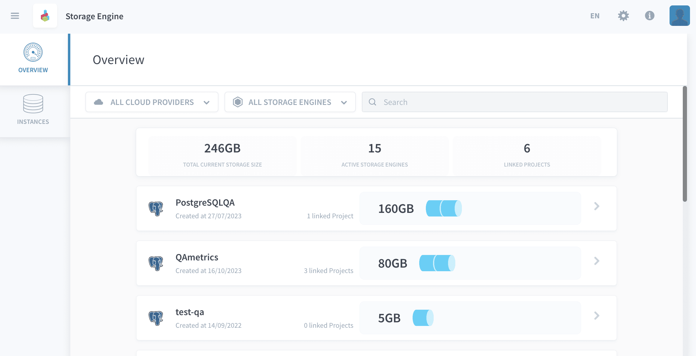
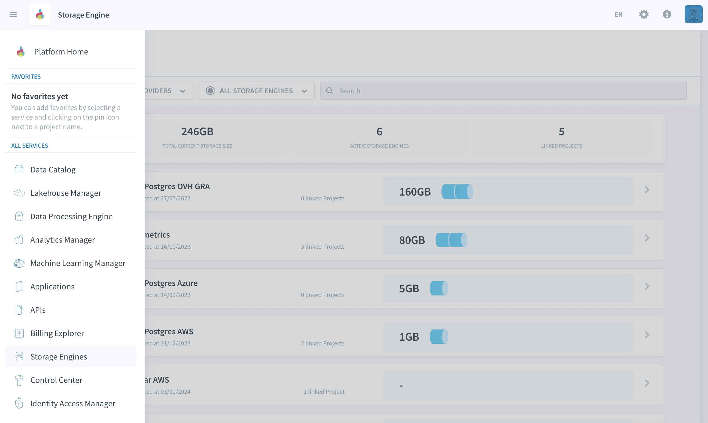
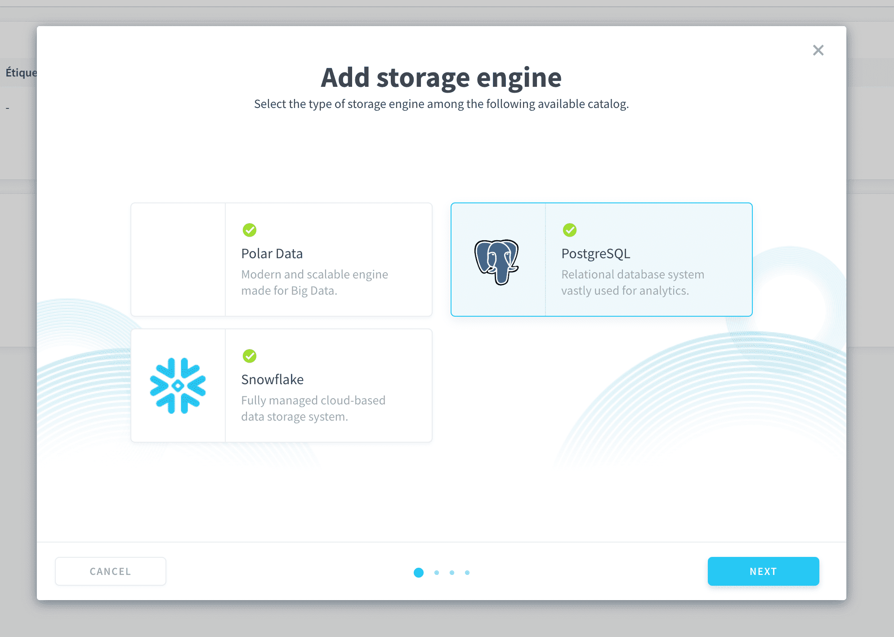
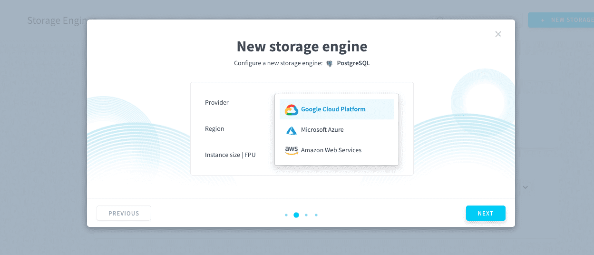
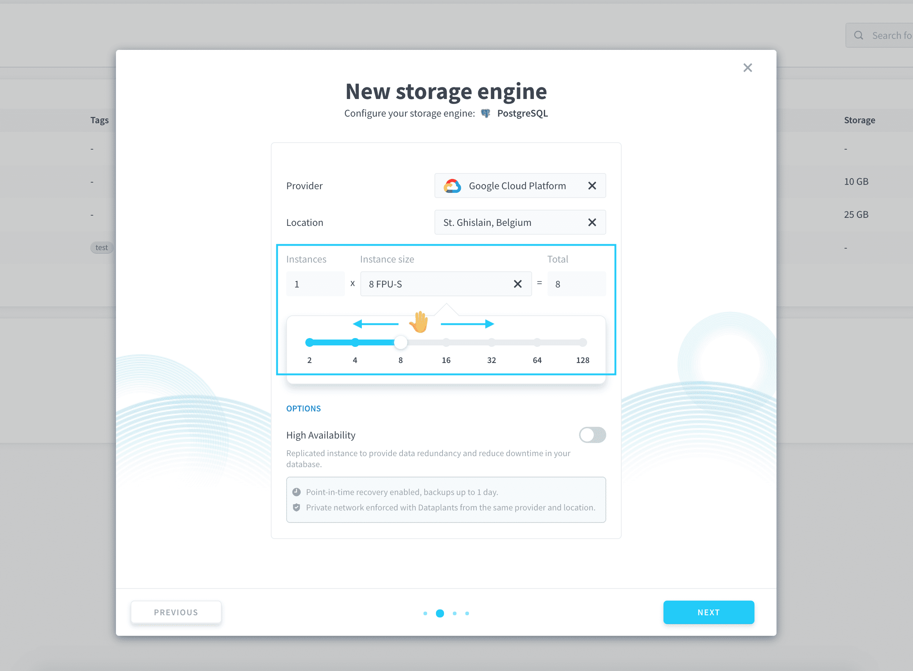
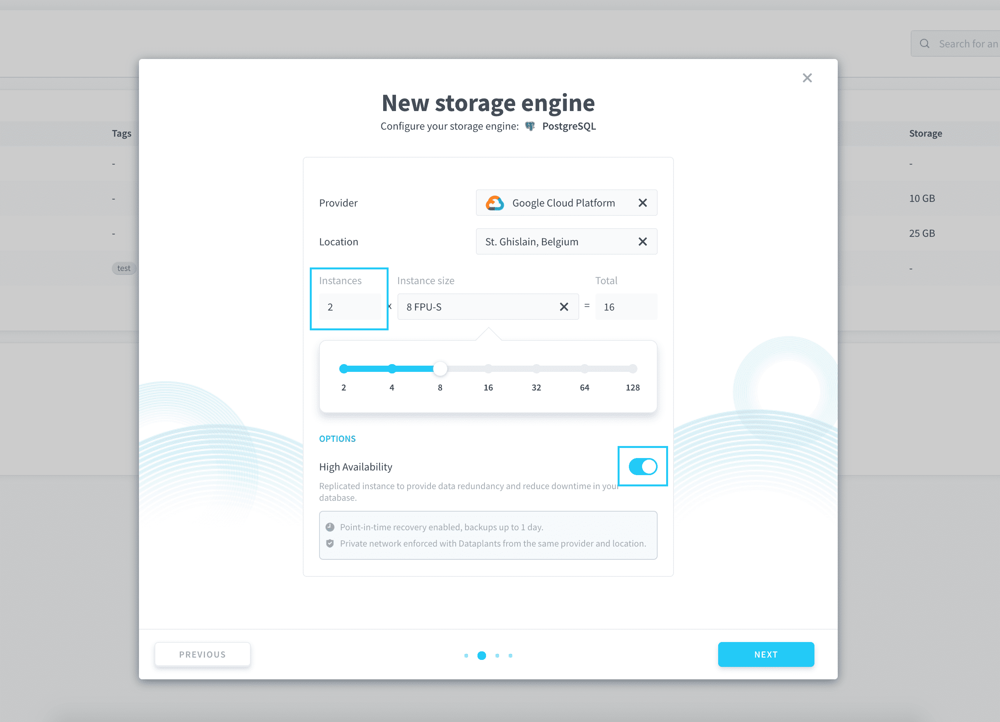
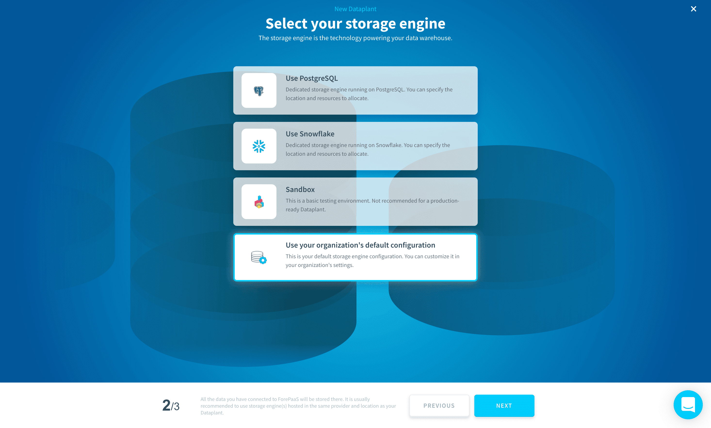
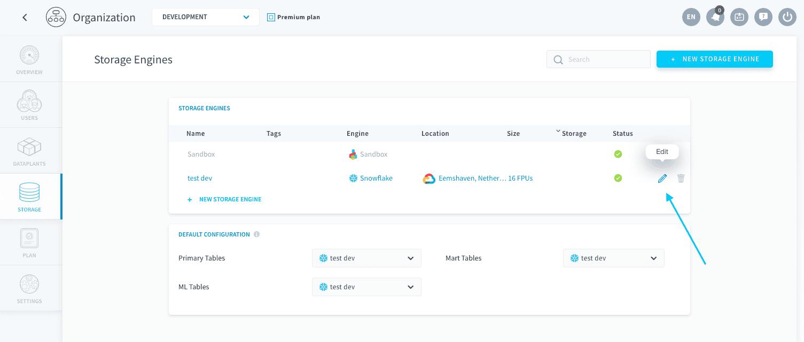
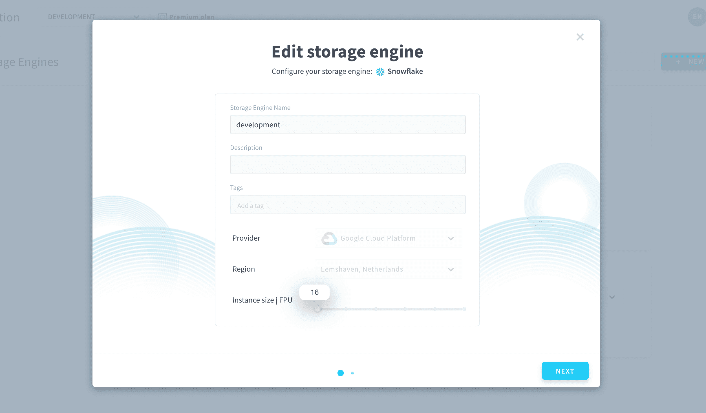
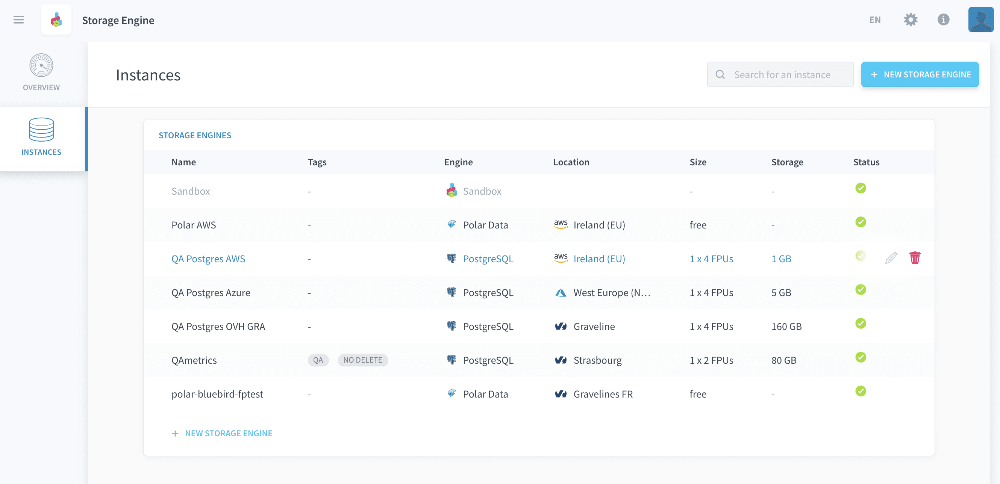

# Storage engines

!> **WARNING:** this page is currently a work in progress for the Data Platform.

Storage engines are responsible for **”physically” storing the data** of your Project. They are the technological system with which your Project services - such as [Lakehouse Manager](/en/product/lakehouse-manager/index) or [Data Processing Engine](/en/product/dpe/index) - communicate when they need to read or write data.

If you use storage services such as [Lakehouse Manager](/en/product/lakehouse-manager/index.md), then you Project is linked to at least one storage engine. It is possible to use multiple storage engines in the same Project: you can link a different one for [every dataset](/en/product/lakehouse-manager/datasets/index) in [Lakehouse Manager](/en/product/lakehouse-manager/index.md). It is also possible to use the same storage engine for multiple Projects. 

> You must have **storage engine permissions** in order to manage (i.e. create, link to Project, delete) storage engines. These permissions are set at user level in your [organization settings](/en/product/organisations/organization-invite-user?id=manage-member-permissions-in-your-organization). Even if a user has no permission on storage engines, they are still able to use it and access the data in it from inside the [Project](/en/product/project/index) - it's only the management of engines that is restricted.

Every storage engine has a technical name that is sometimes used alternatively in API calls. This technical name always starts with *i_*, for example: `i_0941a7f635f1`. This ID can typically be found in the [SQL-string converted by the Analytics Manager](/en/product/am/history) from the original user query and used to effectively run the query on the engines.

Storage engines consume [DPU](/en/product/billing/resources/index) (the platform Units) when they are active. You can choose the size (in DPU) of your engine when you [create it](en/product/project/storage-engine/index.md?id=create-a-storage-engine) or at any time later on, by [editing it](en/product/project/storage-engine/index.md?id=edit-a-storage-engine).

* [Create a storage engine](#create-a-storage-engine)
  * [Choose the type of engine](#choose-the-type-of-engine)
  * [Choose the cloud provider and location](#choose-the-cloud-provider-and-location)
  * [Choose the size of your engine](#choose-the-size-of-your-engine)
  * [Choose high availability status](#choose-high-availability-status)
  * [Include in your default configuration](#include-in-your-default-configuration)
* [Link a storage engine to a Project](#link-a-storage-engine-to-a-Project)
* [Edit a storage engine](#edit-a-storage-engine)

---
## Create a storage engine
You can create a storage engine instance from the **Storage Engines** service.

> You must have **storage engine permission** `create` in order to create storage engine instances. These permissions are set at user level in your [organization settings](/en/product/organisations/organization-invite-user?id=manage-member-permissions-in-your-organization).

In both cases, you will need to fill in the following information:

#### Choose the type of engine

the Platform currently lets you choose among two engines.

* **PostgreSQL**: [PostgreSQL](https://www.postgresql.org/) is an open-source relational database powering leading business and mobile applications. PostgreSQL is also very popular as an affordable data warehousing solution with a very good price/performance ratio. PostgreSQL is currently available on *Google Cloud Platform*, *Microsoft Azure*, *Amazon Web Services* and *OVHcloud*.
* **Snowflake**: [Snowflake](https://www.snowflake.com/) offers a cloud-based data storage and analytics service. Its architecture has been built for the cloud and leverages all the scalability and performances available. Snowflake is currently only available on *Google Cloud Platform*, *Microsoft Azure* and *Amazon Web Services*.

#### Choose the cloud provider and location

You can choose the cloud provider and location of your storage engine among the following:
- *Google Cloud Platform* (1 location available): Snowflake and PostgreSQL available
- *Microsoft Azure* (1 location available): Snowflake and PostgreSQL available
- *Amazon Web Services* (1 location available): Snowflake and PostgreSQL available
- *OVHcloud* (1 location available): PostgreSQL available

It is recommended to use the same cloud provider and location for your storage engine as the one chosen for your Projects. This is because by default, storage engine and Projects communicate on private network for better performances and security.

!> If you link a storage engine to a Project that is in another cloud provider or location, it will **permanently open your storage engine instance publically**. The connection will then be encrypted and established on public network.

#### Choose the size of your engine

Storage engines consume [DPU](/en/product/billing/resources/index) (the platform Units) when they are active. You can choose the size (in DPU) of your engine which will determine the computing power allocated to read and write data in your databases. 

For PostgreSQL, the smallest possible size is 2 DPU with *Google Cloud Platform* and *OVHcloud*, or 4 DPU with *Microsoft Azure* and *Amazon Web Services*. For Snowflake, the smallest possible size is 16 DPU anywhere.

#### Choose high availability status

High availability is a common paradigm in infrastructure management where **instances are replicated several times in order to avoid interruption of service** in case one of them goes down. Since the storage engines host the databases which are the core of all your Projects, avoiding downtime on them is an essential part of a setting up a production-grade data system.  

* **On PostgreSQL**: high-availability is *off* by default and can be switched on. When it is switched on, the number of instances deployed is doubled (i.e you are invoiced twice as much): if one the instances goes down, the other one stays active for you to use.
* **On Snowflake**: high-availability is *always on* by default and cannot be switched off. It is an internal feature when using Snowflake and replication is handled internally on their platform to ensure no interruption of service on your end. You are only paying for one storage engine instance.

> Creating a new storage engine can take up to 5-10 minutes, depending on hardware availability. Please make sure your engine has been correctly created and is marked as active ✅ before linking it to a new Project.

---
## Link a storage engine to a Project

#### Sandbox

Each Project features a free **Sandbox** instance. This is a storage engine which is located in the data center of your Project, and shared with other users of this data center. By shared, we mean that the performances are shared. Your data is always protected.

!> The Sandbox instance is intended for proof-of-concepts (POCs), development or test purposes; and is not designed to be used in a production environment as the performances can be inconsistent.

?> For the moment, Sandbox is based on the [Snowflake](https://www.snowflake.com/) technology. Essentially, this means that if you choose to use a Sandbox storage engine, any SQL expression used in your Project must be Snowflake-compatible.

#### Dedicated storage engine

As an alternative to the free Sandbox instance, you can either **choose storage engines that you already own** in your organization, or **[create](en/product/project/storage-engine/index.md?id=create-a-storage-engine) a new one**. Any engine can be used with any Project - if the engine is in a different region or cloud provider, the connection will be encrypted and established on public network.

---
## Edit a storage engine

> You must have **storage engine permission** `update` in order to edit storage engine instances. These permissions are set at user level in your [organization settings](/en/product/organisations/organization-invite-user?id=manage-member-permissions-in-your-organization).

You can edit a storage engine's characteristics from the **Storage Engines** service, by clicking on the **pen** 🖊️ icon of a storage engine.

You can edit the **name, description, tags** and **size** of your storage engine.

---
## Delete a storage engine

> You must have **storage engine permission** `delete` in order to delete storage engine instances. These permissions are set at user level in your [organization settings](/en/product/organisations/organization-invite-user?id=manage-member-permissions-in-your-organization).

You can delete a storage engine instance from the **Storage Engines** service, by clicking on the **Delete** 🗑️ icon of a storage engine. 

This option is only available if the storage engine isn't linked to any [project](/en/product/project/index) in your organization. [Deleting a project](/en/product/project/delete_project) unlinks all storage engines from it.

---
##  Need help? 🆘

> At any step, you can ask for support by reaching out to us on the Data Platform Channel within the [Discord Server](https://discord.com/channels/850031577277792286/1163465539981672559). you can also find a step by step guide towards joining our discord server in the [support](/en/support/index.md) section.