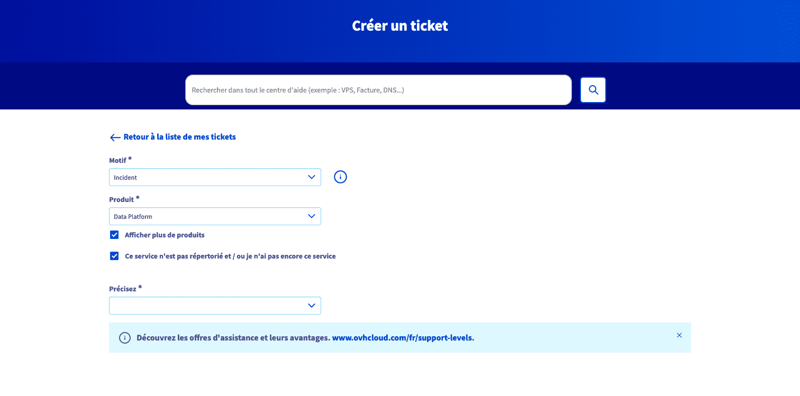

# Support Documentation

Welcome to the support documentation for the Platform! We understand that sometimes you may encounter issues or have questions while using our product. Rest assured, we are here to assist you every step of the way. To provide you with the best support experience possible, we offer the following:

1. [**Raise a ticket**](#raise-a-ticket)
2. [**Join the Discord Community channel**](#discord-support-channel-for-ovhcloud-data-platform)
3. [**Legacy ForePaaS Users**](#email-support-for-legacy-forepaas-platform)

Please find detailed information about each support channel below:

---
## Raise a ticket

Our ticketing system has been meticulously crafted to simplify the process of addressing your concerns and resolving any issues encountered while utilizing our platform. Raising a ticket is both straightforward and effective, empowering you to monitor the progress of your inquiry or problem resolution seamlessly. Here's a step-by-step guide on how to raise a ticket on our platform:

1. Start by clicking on the information icon, followed by selecting the **Contact Support** button.

> You can also use this direct link to raise a ticket - [Create Ticket](https://help.ovhcloud.com/csm?id=csm_get_help)

2. Upon clicking, you'll be directed to the OVHcloud help centre login page. Here, you can either use your existing OVHcloud account or create a new account if it's your first time accessing the platform. If you're already logged in, you'll proceed directly to step 4.

3. Once you've successfully completed the login process and find yourself on the main help center screen, simply click to the "Tickets" section. From there, you can initiate the process of creating a new ticket with just a click.

4. In the first dropdown menu labeled "Motif," choose "incident." Then, ensure that "Afficher plus de produits" is checked and in the second dropdown/search bar, select "Data Platform."

5. Next, indicate the level of impact resulting from the incident, followed by specifying the available level of circumvention for you. Click "next" to proceed.

6. On the subsequent page, provide a brief description of the issue, along with any pertinent details or requests for the support team. Feel free to attach relevant images or documents to facilitate a better understanding of the problem. Once done, click "Confirm" to submit your ticket.

Following these steps ensures that your concerns are promptly documented and attended to by our dedicated support team, ultimately leading to a resolution that meets your satisfaction.

### Post ticket creation

After creating a ticket, you may need to perform additional actions or track its progress. Our post-ticket creation process is designed to provide you with the necessary tools and resources to manage your inquiries effectively.

1. **Tracking the Ticket**: Once your ticket is submitted, you can easily track its status and progress directly from the Help Centre. Simply navigate to the "Tickets" section, where you'll find a list of all your submitted tickets along with their current status. Here, you can view any updates, responses from our support team, or actions required from your end.

2. **Closing a Ticket**: In some cases, you may need to close/delete a ticket if it's no longer relevant or if the issue has been resolved independently. To delete a ticket, locate the ticket in the "Tickets" section and select the ticket you want to delete. Click on the actions dropdown and select *close the ticket* / *fermer le ticket*.

3. **Uploading More Documents**: Should you need to provide additional documents or information related to your ticket, you can easily upload them through the Help Centre. Simply locate the ticket for which you wish to upload additional documents, and within the ticket details page, you'll find an option to add attachments. Click on this option to browse and select the relevant documents from your device, then upload them to the ticket. This ensures that our support team has all the necessary information to address your inquiry effectively.

By leveraging these post-ticket creation functionalities, you can stay informed about the progress of your inquiries, communicate seamlessly with our support staff, and provide any supplementary information required for resolution, ensuring a smooth and efficient support experience.

---
## Discord Support Channel (For OVHcloud Data Platform)

Our Discord support channel is designed to provide real-time assistance to users of **Data Platform**. By joining our Discord server, you can directly communicate with our support team, interact with other users, and stay updated with the latest announcements and product news.

### How to Access Discord Support:

1. **Join Our Discord Server**: If you haven't already joined our Discord server, you can do so by clicking on the following invite link: [Discord Invite Link](https://discord.gg/ovhcloud).

2. **Navigate to the Support Channel**: At OVHcloud, we offer a suite of diverse services, each with its dedicated channel for communication. Once you've joined our Discord server, simply navigate to the dedicated support channel named [data-platform](https://discord.com/channels/850031577277792286/1163465539981672559). In this channel, you can freely ask questions, report any issues you encounter, and seek assistance from our dedicated support team.

3. **Engage with the Community**: Feel free to interact with other users who might have similar questions or experiences. Our community is here to help each other out!

