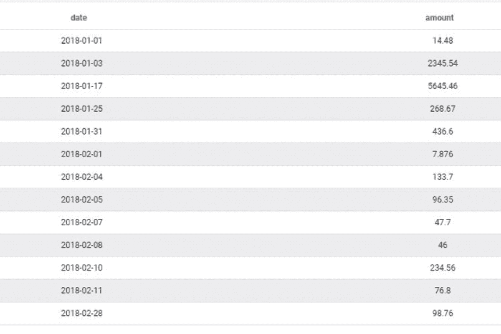
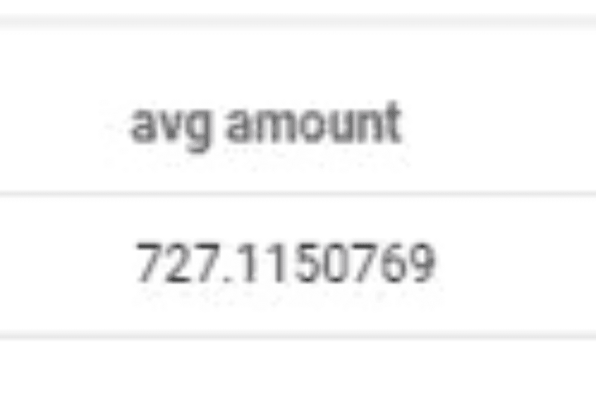
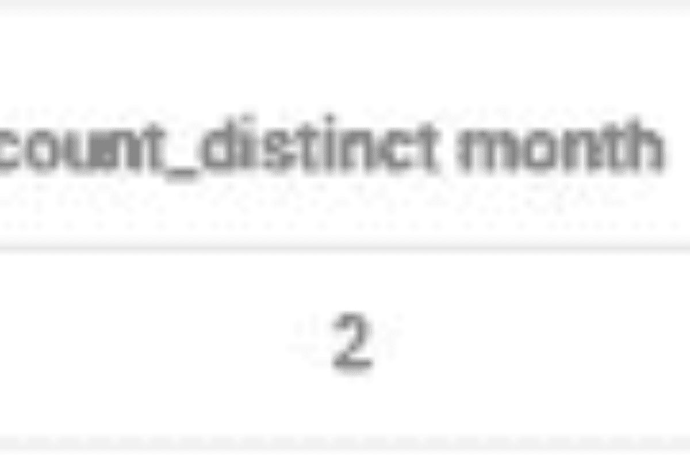
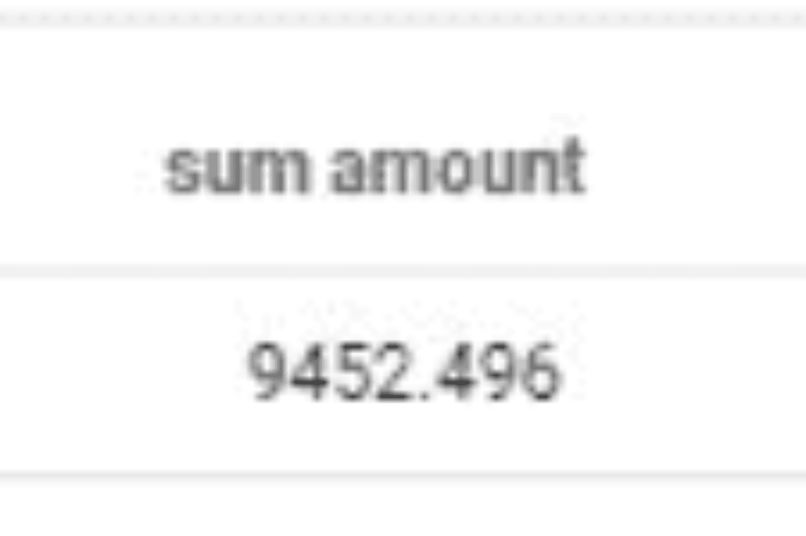

# 'Data' query parameter

This parameter is used to select and display the desired data. It is possible to apply on each attribute simlple functions such as the average, the count, the distinct count, the max, the min, the select, the distinct select and the sum.

---
## Select

The *select* function simply displays the value of the selected attribute. It will select the first value of the list if several values are returned. Let's assume we first want to display the date and amount attributes. In the interface click on the right fields and choose the function *select*. The corresponding JSON is:

```json
...
  "data": {
    "fields": {
      "date": [
        "select"
      ],
      "amount": [
        "select"
      ]
    }
  }
...

```

This will yield the following result:


You can add as many fields as you want as long as they exist in the same table, otherwise the query builder (QB) returns an error. The list of field available in the interface is automatically filtered to only display the other available attributes.

> For more fine grain control, note that you have the possibility to hardcode the table from to recover the data using the attribute "table_name". This can come in handy when certain attribute names (such as "date") are common to a large number of tables. However, this is not a good practice as the Query Builder is designed to fetch the data with the optimal path in order to reduce runtime.

---
## Avg

The *average* function is used to calculate the average of an attribute. For instance in our case, let's assume we are trying to return the average reported revenue amount overtime:

```json
...
"data": {
    "fields": {
      "amount": [
        "avg"
      ]
    }
  },
...
```
This will yield the following result:


!> Beware, depending on the granularity of your table, the average operation can have different meanings, because it operates an average of the "amount" attribute by giving each line the same weight. We therefore recommend using averages, ratios, etc. via virtual attributes so that you can control the weight (average per order, per customer, per day, per month, etc.).

---
## Count

The *count* function is used to count the number of occurrences returned by the query. For instance, in our case, let's assume we try to count the number of lines present in our table. The corresponding JSON is:
```json
...
  "data": {
    "fields": {
      "date": [
        "count"
      ]
    }
  }
...
```

This will yield the following result:


---
## Count Distinct

The *count distinct* function is used to count the unique different values of an attribute. For instance, in our case, let's assume we try to count the unique number of month present in our table. The corresponding JSON is:
```json
...
  "data": {
    "fields": {
      "month": [
        "count_distinct"
      ]
    }
  }
...
```
This will yield the following result:


---
## Min and Max

The *min and max* functions are used to display the minimum and maximum values of an attribute. For instance, in our case, let's assume we are looking for the minimum and maximum date in the table. The corresponding JSON is:

```json
...
  "data": {
    "fields": {
      "date": [
        "min",
        "max"
      ]
    }
  }
...
```
This will yield the following result:


---
## Select Distinct

The *select_distinct* functions are used to display the unique different values of an attribute. For instance, in our case, let's assume we are trying to display every month that recorded revenue for the company. The corresponding JSON is:

```json
...
 "data": {
    "fields": {
      "month": [
        "select_distinct"
      ]
    }
  }
...
```
This will yield the following result:


!> We recommend to use the *scale* parameter (GROUP BY equivalent in SQL) that we will see in another article to perform similar requests.

---
## Sum

The *sum* function is used to calculate the total value of an attribute. For instance, in our case, let's assume we are trying to get the total turnover. The corresponding JSON is:

```json
...
  "data": {
    "fields": {
      "amount": [
        "sum"
      ]
    }
  }
...
```
This will yield the following result:


---

{Learn more about the 'scale' parameter}(#/en/technical/api-reference/qb/scale.md)