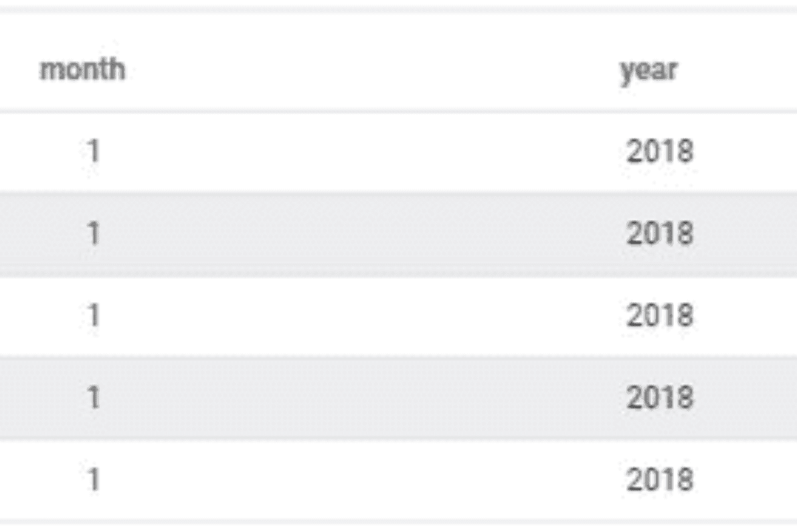

# Discover all other query parameters

In this article we will review the remaining less used parameters used to build queries on ForePaaS. In particular we will cover:
* *limit* - Ability to limit the number of outputs of a query
* *order* - Ability to order the output of a query based on other attributes
* *table_name* - Ability to set from which table is the data retrieved 
* *skip* - Ability to skip a certain number of the first outputs of a query
* *hints* - Allows to display more metadata in the raw JSON query response
* *total* - Allows to compute subtotals when a sum is computed with several scales

---
## Limit

Displaying large amount of information at once can freeze the browser as it uses all its live memory. We therefore often want to limit the number of rows that we returned by the query, you can do so by setting the *limit* sub-parameter to the desired number.

By default, the limit is set to 5000 in order to prevent any risks of overloading the web page that leverages the query. Note that this is not a maximum, you can override that condition with a higher number when setting the "limit" parameter to another value.

Let's assume, we try to display 2 lines of the month of January. The corresponding JSON would be:
```json
 {
  "data": {
    "fields": {
      "date": [
        "select"
      ],
      "amount": [
        "select"
      ]
    },
    "limit" : 2
  },
  "scale": {
    "fields": []
  },
  "filter": {
    "month": [
      1
    ],
    "year": [
      2018
    ]
  },
  "order": {}
}
```
This will yield the following result:


---
## Order

The results returned by the query may be ordered based on the order of values of one or more fields in ascending or descending order. To do that you need to add an *order* parameter to the JSON configuration with the list of fields & their corresponding direction of which to order to the output.

Assuming we are trying to order in ascending order the data of January. The corresponding JSON would be:

```json
 {
  "data": {
    "fields": {
      "amount": [
        "select"
      ],
      "date": [
        "select"
      ] ,
      "month": [
        "select"
      ] ,
      "year": [
        "select"
      ] 
    }
  },
  "scale": {
    "fields": []
  },
  "filter": {
    "month": [
        1
      ],
    "year": [
        2018
      ]
   },
  "order": {
      "date" : "asc"
  }
}
```

This will yield the following result:


---
## Table Name

As mentioned in the *data* parameter article, setting the *table_name* parameter will enforce the Query Builder to retrieve data from a specific table in the data model.

For instance, assuming we were looking to confirm that the data requested by the Query Builder came from the "prim_revenue" table, we would use the following JSON configuration:

```json
 {
  "data": {
    "fields": {
      "amount": [
        "sum"
      ],
      "month": [
        "select"
      ],
      "year": [
        "select"
      ]
    }
  },
  "scale": {
    "fields": [
      "month"
    ,
      "year"
    ]
  },
  "filter": {},
  "order": {},
  "table_name":"prim_ca"
}
```
---
## Skip

The *skip* sub-parameter allows you to skip certain lines from the final outputted ones. 

For instance when the output is ordered in a certain manner, you want to remove the first 5 or the first 10 outputs. In this case, your JSON configuration would look like the following:

```json
 {
  "data": {
    "fields": {
      "date": [
        "select"
      ],
      "amount": [
        "select"
      ]
    },
    "skip": 10
  },
  "scale": {
    "fields": []
  },
  "filter": {},
  "order": {}
}
```

---
## Hints

The *hints* sub-parameter allows to have additional meta data in the JSON response from the Query Builder which provides the total number of lines that the request generates without taking into account the *skip* and *limit* parameters. You can add the *hints* parameter as follow in the JSON configuration:

```json
  {
  "data": {
    "fields": {
      "date": [
        "select"
      ],
      "amount": [
        "select"
      ]
    },
    "limit": 2,
    "skip": 5,
    "hints": true
  },
  "scale": {
    "fields": []
  },
  "filter": {},
  "order": {}
}
```
To see the effect on the query output, you need to visualize directly the raw JSON format. To do saw, in the editing view of the query select the option "JSON" in the output display window:


It will display the following result (we've collapsed the actual query output in the *results* key which outputs the values as a table of JSON objects):
```json
  {
  "success": true,
  "cache": false,
  "timestamp": 1559896936,
  "duration": 0.11,
  "error": null,
  "warning": null,
  "hints": 13,
  "query_params": {
    "data": {
      "fields": {
        "date": [
          "select"
        ],
        "amount": [
          "select"
        ]
      },
      "limit": 2,
      "skip": 5,
      "hints": true
    },
    "scale": {
      "fields": []
    },
    "filter": {},
    "order": {}
  },
  "table_name": "prim_income",
  "results": [...]
 }
```

---
## Total

Let's assume we are calculating the sum of a measure called "mydata" with respect to 2 scales called "my_scale1" and "my_scale2". The query would look like the following:
```
...
  "data": {
     "fields": {
       "mydata": ["SUM"]
    }
  },
  "scale": {
    "fields": ["my_scale1","mys_cale2"]
  }
...
```
This query will generate the equivalent of the following SQL query:

```
SELECT SUM(mydata) FROM .... GROUP BY my_scale1, my_scale2
```

And you will be able to easily use the output data to create a table such as below:

|  | my_scale1 1 | my_scale1 2 |
| ---| --- | --- | 
| my_scale2 1 | sum 1x1 | sum 1x2 |
| my_scale2 2 | sum 2x1 | sum 2x2 |

Adding the total attribute in your query:
```
...
  "data": {  },
  "scale": {  },
  "total": {
     "all": [],
     "x": [myscale1],
     "y": [myscale2]
  }
...
```
Will allow the following rendering:

| X | my_scale1 1 | my_scale1 2 | total |
| ---| --- | --- | --- |
| my_scale2 1 | sum 1x1 | sum 1x2 | total.x |
| my_scale2 2 | sum 2x1 | sum 2x2 | total.x |
| total | total.y | total.y | total |

Which would actually require 4 distinct SQL queries:
```
SELECT SUM(mydata) FROM ... GROUP BY my_scale1, my_scale2
SELECT SUM(mydata) FROM ...
SELECT SUM(mydata) FROM .... GROUP BY my_scale1
SELECT SUM(mydata) FROM .... GROUP BY my_scale2
```

---
**Need help?** 🆘 Feel free to reach out to us by sending us a request via *support* on the ForePaaS Platform and we make sure to help you out with the best solution 😊 

{You can even send your questions directly by clicking here 👨🏻‍💻}(mailto:support.forepaas.com)