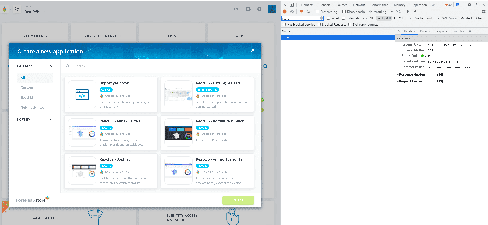

# ForePaaS Store API Reference

The [ForePaaS Store](/en/product/dataplant/marketplace) is the collaborative space on the platform where each organization's member can create, share, and/or access code templates and packages.

Each marketplace (application templates, API extensions, etc..) has [its own endpoints](/en/technical/api-reference/store/index?id=list-of-all-store-apis). They all start with:

```
https://store.forepaas.io/
```

After getting an authorization token, **creating a package in the store is done in 2 steps**:
1. create the package in the correct marketplace
2. upload a ZIP file containing the code for the first version

The same API endpoints are used to update package information and version.

* [Getting an authorization token](/en/technical/api-reference/store/index?id=getting-an-authorization-token)
* [Create or update a package](/en/technical/api-reference/store/index?id=create-or-update-a-package)
* [Add a version to your package](/en/technical/api-reference/store/index?id=add-a-version-to-your-package)
* [Get package information](/en/technical/api-reference/store/index?id=get-package-information)
* [Get package version](/en/technical/api-reference/store/index?id=get-package-version)
* [List of all store APIs](/en/technical/api-reference/store/index?id=list-of-all-store-apis)
  * [Application templates](/en/technical/api-reference/store/index?id=application-templates)
  * [API templates](/en/technical/api-reference/store/index?id=api-templates)
* [Tips and Troubleshooting](/en/technical/api-reference/store/index?id=tips-and-troubleshooting)

!> Currently, only **Application templates** and **API Templates** are fully supported.

---
## Getting an authorization token

For each call referenced below, you will need an **authorization token**. 

!> You must have a [ForePaaS account](/en/product/organisations/profile.md), and be part of at least one [organization](/en/product/organisations/index.md) to be able to upload packages and version.

To get an authorization token, 

1. Open the ForePaaS Platform and open a Project
2. Open the **browser console** (*Ctrl + Shift + C* on Google Chrome)
3. From the App's panel, choose **+** to open the new application dialog box
4. In the browser's console, go to **Network tab** and filter for *store.forepaas.io*
5. There should be one GET for `https://store.forepaas.io/v1`
5. Right click and **Copy as cURL**, that contains Authorization token and will serve as basis for next Store API calls.



---
## Create or update a package

Create/update a package in your **private store**, meaning only the members of your [organization](/en/product/organisations/index.md) will be able to see it.

> It is currently impossible to upload a package to the public store.

The following reference shows how to upload a package for the *App templates*. See [below](/en/technical/api-reference/store/index?id=list-of-all-store-apis) the list of all APIs for other marketplaces.

///

**Example request**

```bash
curl 'https://store.forepaas.io/v1/packages/app/templates/my-app' \
  -X 'PUT' \
  -H 'authority: store.forepaas.io' \
  -H 'accept: application/json, text/plain, */*' \
  -H 'content-type: application/json;charset=UTF-8' \
  -H 'origin: https://store.forepaas.io' \
  -H 'Authorization: Bearer <YOUR_AUTH_TOKEN>' \
  --data-raw '{
    "name":"My App",
    "owner":"<ORGANIZATION_ID>",
    "category":"My package",
    "i18n":{
      "fr":{
        "name": "name fr",
        "description": "desc fr",
        "long_description": "long desc fr"
      },
      "en":{
        "name": "name en",
        "description": "desc en",
        "long_description": "long desc en"
      },
      "jp":{
        "name": "name jp",
        "description": "desc jp",
        "long_description": "long desc jp"
      }
    },
    "image":"<base64 of image>",
    "preview":[<base64 of image>, <base64 of image>, ...]
  }' \
  --compressed
```
:::
**Example response**
```json
{
  "status": 200,
  "message": "Package updated with success",
  "id": "<ORGANIZATION_ID>:my-app",
  "package": {
    "image": "",
    "preview": [],
    "name": "My App",
    "i18n": {
      "fr": {
        "name": "name fr",
        "description": "desc fr",
        "long_description": "long desc fr"
      },
      "en": {
        "name": "name en",
        "description": "desc en",
        "long_description": "long desc en"
      },
      "jp": {
        "name": "name jp",
        "description": "desc jp",
        "long_description": "long desc jp"
      }
    },
    "owner": "<ORGANIZATION_ID>",
    "category": [
      "My package"
    ],
    "type": "modules",
    "id": "<ORGANIZATION_ID>:my-package",
    "versions": [],
    "downloaded": 0
  }
}
```
///

!> Make sure to update *YOUR_AUTH_TOKEN* with the [token value retrieved above](/en/technical/api-reference/store/index?id=getting-authorization-token).


||||
| ------------: | :-------------: | :------------- |
| *name* | `String` | Technical name of your package |
| *owner* | `String` | ID of your organization. This package will only be available by Project of that organization |
| *category* | `String` | Category of the package |
| *i18n* | `Object` | Display and translations for your package. You can add 3 fields (*name*, *description* and *long_description*) in French, English and/or Japanese |
| *image* | `String` | Image of your package. It has to be in base 64 |
| *preview* | `Array` | Preview images of your package. It has to be in base 64 |

---
## Add a version to your package
Add a version of your package with a *.zip* file

///

**Example request**

```bash
curl 'https://store.forepaas.io/v1/packages/app/templates/<ORGANIZATION_ID>:my-app/<VERSION>' \
  -X 'PUT' \
  -H 'authority: store.forepaas.io' \
  -H 'accept: application/json, text/plain, */*' \
  -H 'content-type: application/zip' \
  -H 'origin: https://store.forepaas.io' \
  -H 'Authorization: Bearer <YOUR_AUTH_TOKEN>' \
  --compressed --data-binary "@<PATH_TO_YOUR_FILE>"
```
:::
**Example response**

```json
{
  "success": true,
  "status": 200,
  "duration": 0.02
}
```
///

!> Make sure to update *YOUR_AUTH_TOKEN* with the [token value retrieved above](/en/technical/api-reference/store/index?id=getting-authorization-token).

---
## Get package information

This endpoint allows to check current information for a given package.
```bash
curl 'https://store.forepaas.io/v1/packages/app/templates/<ORGANIZATION_ID>:my-app' \
  -X 'GET' \
  -H 'authority: store.forepaas.io' \
  -H 'accept: application/json, text/plain, */*' \
  -H 'origin: https://store.forepaas.io' \
  -H 'Authorization: Bearer <YOUR_AUTH_TOKEN>'
```

---
## Get package version

This endpoint allows to download a given package version.
```bash
curl 'https://store.forepaas.io/v1/packages/app/templates/<ORGANIZATION_ID>:my-app/<VERSION>' \
  -X 'GET' \
  -H 'authority: store.forepaas.io' \
  -H 'origin: https://store.forepaas.io' \
  -H 'Authorization: Bearer <YOUR_AUTH_TOKEN>' \
  --output my-app_1.0.0.zip
```

---
## List of all store APIs


### Application templates

The API for [application templates](/en/product/app-manager/index?id=create-an-application) is:

```
https://store.forepaas.io/v1/packages/app/templates/
```


### API templates

The API for [API templates](/en/product/api-manager/deploy) is:

```
https://store.forepaas.io/v1/packages/api/templates/
```

---

---
## Tips and Troubleshooting

* when package is hosted in a Git repository, keep the JSON describing the package as a dedicated source file.
* make sure the `<VERSION_ID>` is a usual version number such as `1.0.0` for instance.  
By default, ForePaaS Store will deliver latest version based on version ordering.
* make sure that ZIP file contains only source files and not intermediate code or Git folders (such as `.git` or `node_modules` for instance)
* make sure the ZIP file meets package expectation.  
For instance, in App's template, a common mistake is to have a *root folder* inside the ZIP file rather than the contents at the root of the ZIP archive.
///

**Good ZIP archive**
```
.
|-- config
|-- forepaas
|-- public
|-- scripts
`-- src
```
:::
**Baz ZIP archive**
```
my-app
|-- config
|-- forepaas
|-- node_modules
|-- public
|-- scripts
`-- src
```
///

## Need help? 🆘

> Feel free to reach out to us by sending us a request via *Support* on the ForePaaS Platform or [by shooting us an email](mailto:support.forepaas.com) and we'll make sure to help you out with the best solution 😊  
