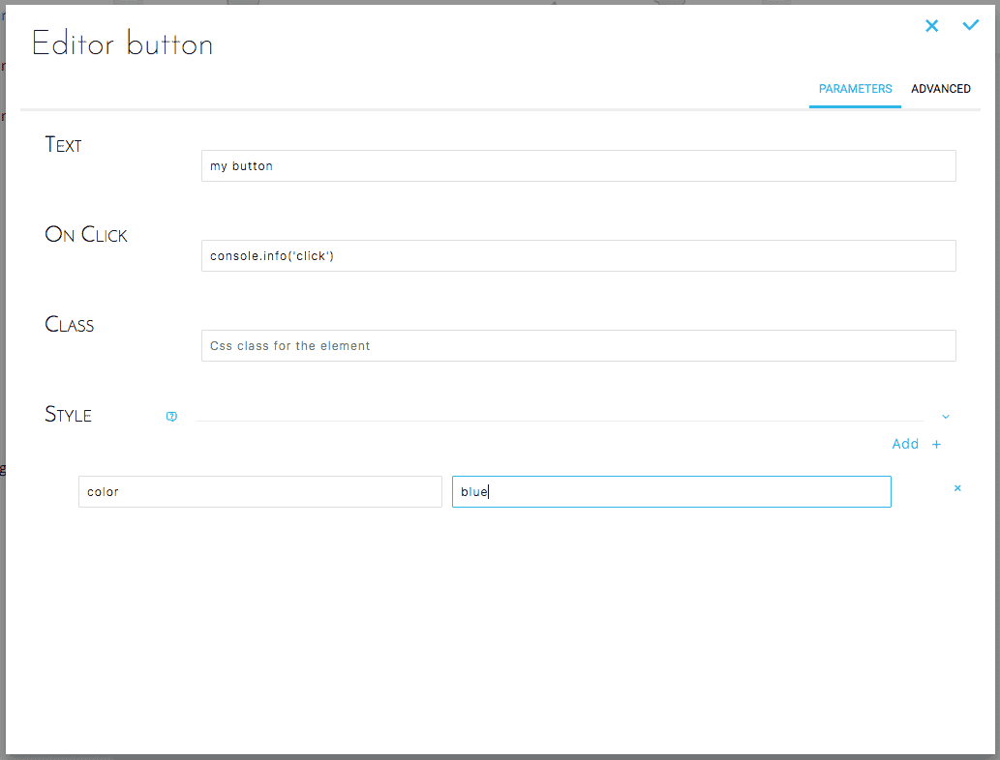
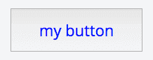

# Button

Allows you to add a clickable button with triggers an action in the interface of your dashboard.

## Add a Button element
Hover over the section of the dashboard that you willing to edit. Click on the "+" button to get the list of elements you can add, select "Basic UI" and then "Button".


## Configure a Button element

### Simple configuration

The interface allows you to configure the button in a simple and intuitive way. You can easily edit the following parameters for the button:
* **Text**: The button text as displayed on the interface for instance "Open Page" or "Next"
* **On Click**: The action that the click will trigger, this is usually a trigger to open a new dashboard page.
* **Class**: The CSS class to which the button belongs in case you are applying shared attributes such as for styling.
* **Style**: Specific styling attributes to apply to the button like the background or text color (see example below).



### Advanced configuration

Below is the JSON configuration for a **Button** as created above :

```json
{
  "type": "button",
  "style": {
    "backgroundColor": "red",
    "alignContent": "middle"
  },
  "text": "testing",
  "onClick": "console.info(\"HelloWorld\")",
  "customclass": "test"
}
```

## Result

