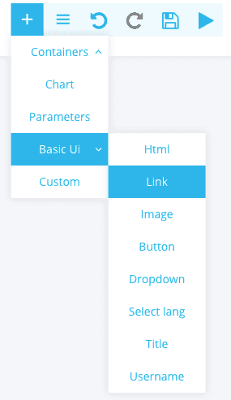
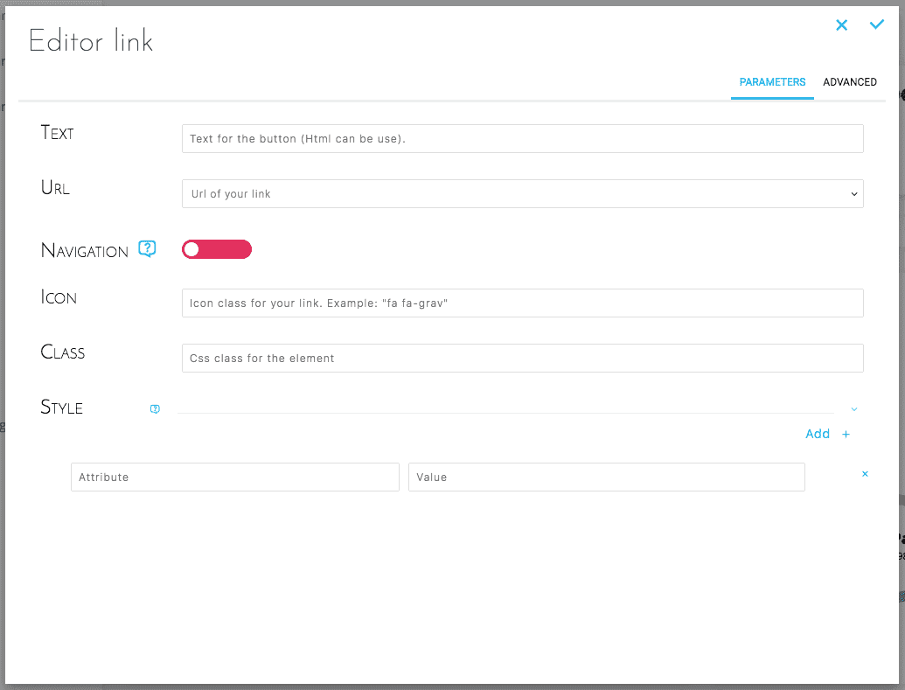
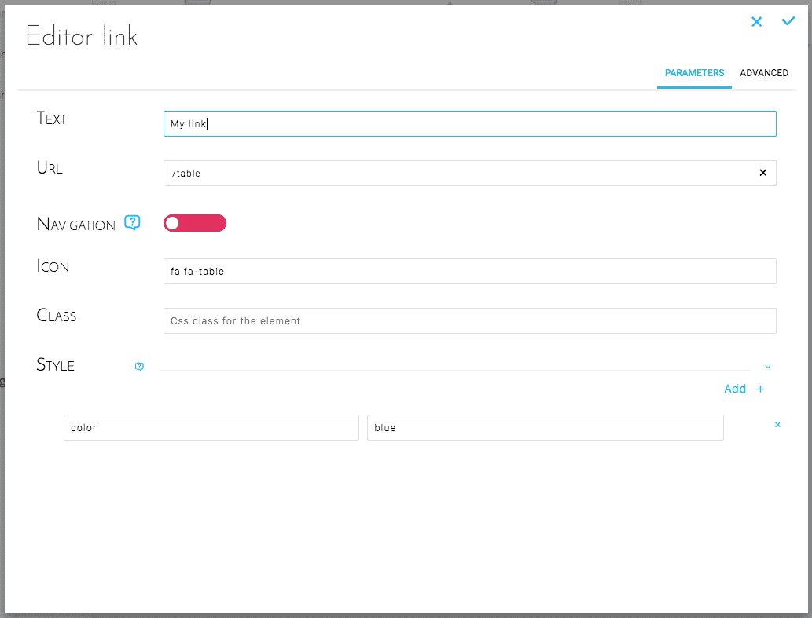
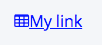

# Link

Allows you to add a link to another dashboard.

## Add Link
Select Basic UI -> Link.



## Configure Link
### Simplified configuration

This configuration allows you to configure the link in a simple and intuitive way.





### Advanced configuration

Below is the JSON configuration for an **Image** as created above :

```json
{
  "type": "link",
  "style": {
    "color": "blue"
  },
  "text": "My link",
  "url": "/table",
  "icon": "fa fa-table"
}
```

## Result

