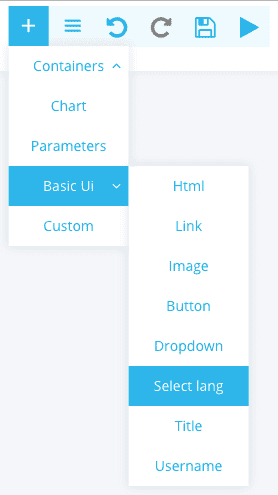
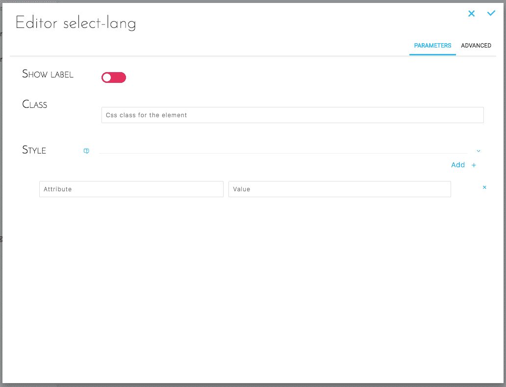
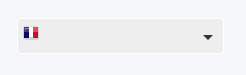

# Select Lang

Allows you to add a language selector for your dashboard.  
Available languages are defined in `./config/global.json` [at the key `i18n`](/en/getting-further/app-dev/config?id=global-configuration-file-globaljson).

## Add Select Lang
Select Basic UI -> Select lang.



## Configure Select Lang
### Simplified configuration

This configuration allows you to configure the selector in a simple and intuitive way.



### Advanced configuration

Below is the JSON configuration for **Select Lang** as created above :

```json
{
  "type": "select-lang",
  "style": {},
  "showLabel": false
}
```

## Result



