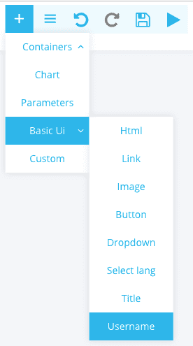
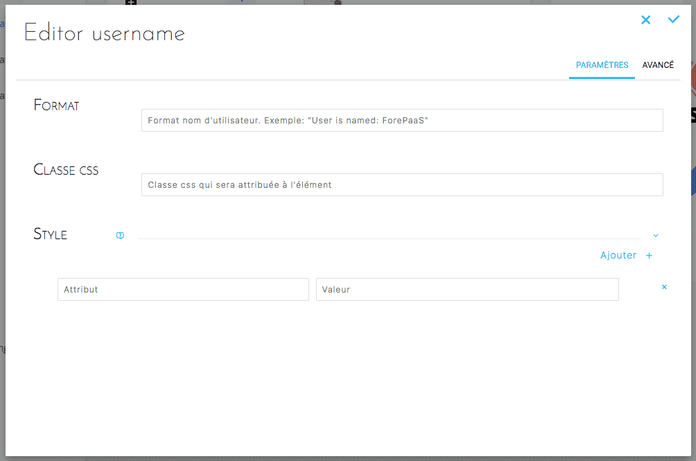
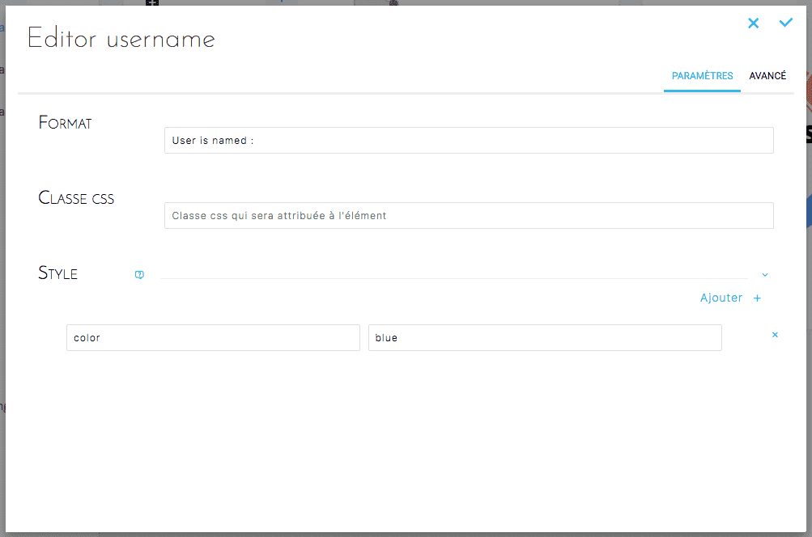

# Username

Allows you to retrieve and display the name of the person logged on the dashboard. You will then be able to display a message such as: "Welcome Mr. Smith".

## Add Username
Select Basic UI -> Username.



## Configure Username
### Simple configuration

This configuration allows you to configure the component in a simple and intuitive way.





### Advanced configuration

This configuration allows you to configure the component via a JSON document. Below is the JSON corresponding to the Switch created with the simplified configuration:

```json
{
  "type": "username",
  "style": {
    "color": "blue"
  },
  "format": "User is named :"
}

```
