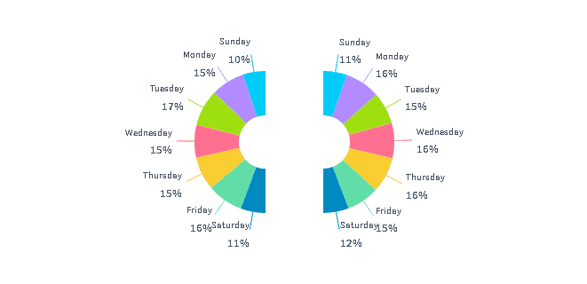

# Recharts

[ReCharts](https://recharts.org/en-US/) is a graphic library for ReactJS.  
It is possible to easily add and configure ReCharts in ForePaaS Dashboard.

* [Recharts configuration](/en/technical/sdk/app/charts/chart-recharts?id=recharts-configuration)
* [ForePaaS additions](/en/technical/sdk/app/charts/chart-recharts?id=forepaas-additions)
  * [fpFormat](/en/technical/sdk/app/charts/chart-recharts?id=fpformat)
  * [colors](/en/technical/sdk/app/charts/chart-recharts?id=colors)
  * [i18n](/en/technical/sdk/app/charts/chart-recharts?id=i18n)
  * [series](/en/technical/sdk/app/charts/chart-recharts?id=series)
  * [tickStyle](/en/technical/sdk/app/charts/chart-recharts?id=tickstyle)
  * [tooltip](/en/technical/sdk/app/charts/chart-recharts?id=tooltip)
* [Examples](/en/technical/sdk/app/charts/chart-recharts?id=examples)
  * [Sample 1: Bar Chart](/en/technical/sdk/app/charts/chart-recharts?id=sample-1-bar-chart)
  * [Sample 2: Bar/Line Chart](/en/technical/sdk/app/charts/chart-recharts?id=sample-2-barline-chart)
  * [Sample 3: Pie Chart](/en/technical/sdk/app/charts/chart-recharts?id=sample-3-pie-chart)
* [Streamline using templates](/en/technical/sdk/app/charts/chart-recharts?id=streamline-using-templates)

---
## Recharts Configuration

When configuring a ReCharts with JSON, 2 kind of attributes are available:
* **Natives**: all existing [ReCharts Options](http://recharts.org/en-US/api)
* **ForePaas**: offers futher customization and integration with ForePaaS other features

The Recharts `data` field is automatically filled from the results of the [Analytics Manager](/en/product/am/index) `request` provided in the Chart definition.

---
## ForePaaS additions

### fpFormat

Use `fpFormat`, to customize what is displayed on an axis.
For instance :
```json
"options": {
  "yAxis": [
    {
      "fpFormat": {
        "round": 2,
        "unit": "%"
      }
    }
  ]
}
```
It uses the same definition as [measure's formatter](/en/technical/sdk/app/formatter?id=measures).
It is also possible to re-use an already defined formatter by just specifying its name.
```json
"options": {
  "yAxis": [
    {
      "fpFormat": "pct"
    }
  ]
}
```

### colors

Use `colors` to provide an array of colors to be used by the chart.
```json
"options": {
  "colors": ["#FF6F90", "#FACD30", "#9EDF10"]
}
```

### i18n

Use `i18n` to provide translations dedicated to that chart.  
Those translations are used to create **labels** in **legends** and **tooltips** built upon [Analytics Manager](/en/product/am/index) `request`:
* `field` name used in `data.fields` and `scale.fields`
* `compute mode` used in `data.fields` such as `select`, `sum`, `count`, `avg`...

Code below replace  *sum* by *Sum of*  and *rides* by *Rides* inside chart tooltips for engligh language.
```json
"options": {
  "i18n": {
    "en": {
      "sum": "Sum of",
      "rides": "Rides"
    }
  }
}
```

### series
Use `series` to define options to be applied to data series from the `request`.
It is either an `Array of Object` or an `Object` (keys are fields definition and values are options).
Main options in `series` are :

|  Name     | Type  | Description |
| :--------    | :---: | :-------    |
| `_type`  | string | Diplay to be used (i.e. bar, line, area, etc.) |
| `order` | number | Order to be used in **Legend** and **Tooltips** |

In the following example, `yAxis` should be defined as described in [Recharts yAxis](https://recharts.org/en-US/api/YAxis) asn an *Array* with 2 *Objects*, each of them define an `yAxisId` used below.
```json
"options": {
  "series": {
    "cumm_progress_actual_select_0": {
      "stroke": "rgb(97, 125, 233)",
      "color": "rgb(97, 125, 233))",
      "name": "Actual (Cum.)",
      "yAxisId": "right",
      "order": 1,
      "label": true
    },
    "cumm_progress_planned_select_0": {
      "color": "rgba(62,69,80,0.15)",
      "stroke": "rgba(62,69,80,0.15)",
      "name": "Plan (Cum.)",
      "yAxisId": "right",
      "order": 0,
      "label": true
    },
    "incr_progress_actual_select_0": {
      "fill": "rgb(97, 125, 233)",
      "color": "rgb(97, 125, 233)",
      "_type": "bar",
      "name": "Actual (Inc.)",
      "yAxisId": "left",
      "maxBarSize": 6,
      "radius": [5, 5, 5, 5],
      "order": 3
    },
    "incr_progress_planned_select_0": {
      "fill": "rgba(62,69,80,0.15)",
      "color": "rgba(62,69,80,0.15)",
      "_type": "bar",
      "name": "Plan (Inc.)",
      "yAxisId": "left",
      "maxBarSize": 6,
      "radius": [5, 5, 5, 5],
      "order": 2
    }
  }
}
```

### tickStyle

Use `tickStyle` inside of [xAxis](https://recharts.org/en-US/api/XAxis) or [yAxis](https://recharts.org/en-US/api/yAxis) to define style applied to **tick** (i.e. label at axis levels).

Main options in `tickStyle` are :

|  Name     | Type  | Description |
| :--------    | :---: | :-------    |
| `x`  | number | Horizontal offset |
| `y`  | number | Vertical offset |
| `textAnchor` | string | From where it is displayed (`start`, `middle`, `end`) |
| `fontSize` | number | Font size |
| `fill` | string | Text color |

```json
"yAxis": [
  {
    "yAxisId": "left",
    "tickStyle": {
      "x": -50,
      "y": -10,
      "textAnchor": "start",
      "fontSize": 11
    }
  }
]
```

### tooltip

Use `tooltip` to customize tooltip styles.  
This configuration might be defined once for all in `./config/templates.json`.

Main options in `tooltip` are :

|  Name     | Type  | Description |
| :--------    | :---: | :-------    |
| `style`  | object | tooltip box |
| `style-label` | object | tooltip title |
| `style-content` | object | container around labels and data |
| `style-name` | object | fields name |
| `style-value` | object | values |

```json
"tooltip": {
  "style": {
    "padding": "10px 20px",
    "minWidth": "200px",
    "backgroundColor": "white",
    "borderRadius": 10,
    "boxShadow": "0 10px 30px 0 rgba(151,167,183,0.3)",
    "textTransform": "capitalize"
  },
  "style-label": {
    "fontSize": 13
  },
  "style-content": {
    "display": "flex",
    "justifyContent": "space-between"
  },
  "style-name": {
    "fontSize": 13
  },
  "style-value": {
    "fontSize": 13,
    "fontWeight": 600
  }
}
```

----
## Examples

### Sample 1 (Bar Chart)

!> Work in Progress

### Sample 2 (Bar/Line Chart)

```json
"options": {
  "barGap": 3,
  "barSize": 6,
  "i18n": {
    "en": {
      "select": ""
    }
  },
  "margin": {
    "left": 50,
    "right": 60,
    "top": 40
  },
  "yAxis": [
    {
      "yAxisId": "left",
      "domain": ["auto", "dataMax => (dataMax * 3)"],
      "fpFormat": {
        "round": 2,
        "unit": "%"
      },
      "tickLine": false,
      "axisLine": false,
      "mirror": true,
      "width": 200,
      "tickStyle": {
        "x": -50,
        "y": -10,
        "textAnchor": "start",
        "fontSize": 11
      }
    },
    {
      "yAxisId": "right",
      "orientation": "right",
      "fpFormat": {
        "round": 2,
        "unit": "%"
      },
      "tickLine": false,
      "axisLine": false,
      "mirror": true,
      "tickStyle": {
        "x": 30,
        "y": -10,
        "textAnchor": "start",
        "fontSize": 11
      }
    }
  ],
  "legend": {
    "verticalAlign": "top",
    "align": "right",
    "height": 60,
    "iconSize": 9
  },
  "series": {
    "cumm_progress_actual_select_0": {
      "stroke": "rgb(97, 125, 233)",
      "color": "rgb(97, 125, 233))",
      "name": "Actual (Cum.)",
      "yAxisId": "right",
      "order": 1,
      "label": true
    },
    "cumm_progress_planned_select_0": {
      "yAxisId": "right",
      "order": 0,
      "name": "Plan (Cum.)",
      "label": true
      "color": "rgba(62,69,80,0.15)",
      "stroke": "rgba(62,69,80,0.15)",
    },
    "incr_progress_actual_select_0": {
      "_type": "bar",
      "yAxisId": "left",
      "order": 3,
      "name": "Actual (Inc.)",
      "fill": "rgb(97, 125, 233)",
      "color": "rgb(97, 125, 233)",
      "maxBarSize": 6,
      "radius": [5, 5, 5, 5]
    },
    "incr_progress_planned_select_0": {
      "_type": "bar",
      "yAxisId": "left",
      "order": 2,
      "name": "Plan (Inc.)",
      "fill": "rgba(62,69,80,0.15)",
      "color": "rgba(62,69,80,0.15)",
      "maxBarSize": 6,
      "radius": [5, 5, 5, 5]
    }
  }
}
```

!> To be displayed

### Sample 3 (Pie Chart)

Here is a simple pie chart definition:
```json
 {
          "type": "chart",
          "chart": {
            "component": "recharts.pie",
            "request": {
              "data": {
                "fields": {
                  "rides": ["sum"]
                }
              },
              "order": {
                "week_day": "asc"
              },
              "scale": {
                "fields": ["week_day"]
              }
            },
            "dynamic-parameters": ["filter_date"]
          }
        }
```
That displays:


By doing some additions, we will improve this layout:
* adding `chart.request.dictionaries` to translate `week_day` using label defined in *Data Manager*
* using `chart.options.series* to define some [Recharts Pie configuration](https://recharts.org/en-US/api/Pie)
* using some additionnal ForePaaS options:
  * `radiusRatio` in a `serue` object: to control at which distance labels are drawn (default is 2.5)
  * `chart.options.labels` set to `false` will hide labels
  * whether `chart.options.labels.minPercent` is set, only values over will be displayed


```json
        {
          "type": "chart",
          "chart": {
            "component": "recharts.pie",
            "request": {
              "data": {
                "fields": {
                  "rides": ["sum"]
                }
              },
              "order": {
                "week_day": "asc"
              },
              "scale": {
                "fields": ["week_day"]
              },
              "dictionaries": ["week_day"]
            },
            "dynamic-parameters": ["filter_date"],
            "options": {
              "series": {
                "interval": 0,
                "label": true,
                "labelLine": true,
                "innerRadius": 10,
                "outerRadius": 60,
                "radiusRatio": 1.5,
                "endAngle": 360,
                "paddingAngle": 0,
                "cx": "50%",
                "cy": "50%"
              }
            }
          }
        }
```


The following sample will display 2 pie charts, based on the Query Builder **evol feature** (deprecated), and **2 series in chart.options.series**:
```json
        {
          "type": "chart",
          "chart": {
            "component": "recharts.pie",
            "request": {
              "data": {
                "fields": {
                  "rides": ["sum"]
                }
              },
              "order": {
                "week_day": "asc"
              },
              "scale": {
                "fields": ["week_day"]
              },
              "evol": {
                "scale": "year",
                "mode": "date",
                "depth": 1
              },
              "dictionaries": ["week_day"]
            },
            "dynamic-parameters": ["filter_date"],
            "options": {
              "series": [
                {
                  "interval": 0,
                  "label": true,
                  "labelLine": true,
                  "innerRadius": 30,
                  "outerRadius": 80,
                  "radiusRatio": 1.5,
                  "startAngle": 90,
                  "endAngle": 270,
                  "paddingAngle": 0,
                  "cx": "45%",
                  "cy": "50%"
                },
                {
                  "interval": 0,
                  "label": true,
                  "labelLine": true,
                  "innerRadius": 30,
                  "outerRadius": 80,
                  "radiusRatio": 1.5,
                  "startAngle": 90,
                  "endAngle": -90,
                  "paddingAngle": 0,
                  "cx": "55%",
                  "cy": "50%"
                }
              ]
            }
          }
        }

```


---
## Streamline using templates

It is highty advised to use [Templates](/en/technical/sdk/app/charts/template) to define **Chart styles** rather than copying same definition over and over.
To do so, just add a `recharts` object in `./config/templates.json` such as for example :
```json
{
  "recharts": {
    "cartesianGrid": {
      "stroke": "#f5f5f5",
      "vertical": false
    },
    "tooltip": {
      "style": {
        "padding": "10px 20px",
        "minWidth": "200px",
        "backgroundColor": "white",
        "borderRadius": 10,
        "boxShadow": "0 10px 30px 0 rgba(151,167,183,0.3)",
        "textTransform": "capitalize"
      },
      "style-label": {
        "fontSize": 13
      },
      "style-content": {
        "display": "flex",
        "justifyContent": "space-between"
      },
      "style-name": {
        "fontSize": 13
      },
      "style-value": {
        "fontSize": 13,
        "fontWeight": 600
      }
    },
    "xAxis": {
      "axisLine": false,
      "tickLine": false
    },
    "yAxis": {
      "tickLine": false,
      "axisLine": false,
      "mirror": true,
      "tickStyle": {
        "x": -8,
        "y": -10,
        "textAnchor": "start"
      }
    }
  }
}
```

