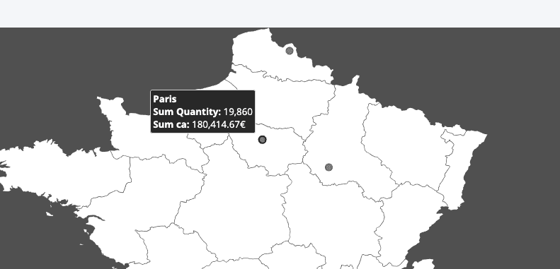
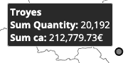

# JVectorMap

Jvectormap is a library that allows you to use maps on your dashboards.
In our standard implementation, we currently provide allow displaying a map, and with a scale on city name, display a number by city.

Official library documentation : https://jvectormap.com/



?> If you do not understand the objects referred to in this article, please check the [Charts article](/en/technical/sdk/app/charts/index.md) for more details. 

- [Sample code in JSON](en/technical/sdk/app/charts/jvectormap.md?id=sample-code-in-json)
- [Request](en/technical/sdk/app/charts/jvectormap.md?id=request)
- [Response](en/technical/sdk/app/charts/jvectormap.md?id=response)
- [Options](en/technical/sdk/app/charts/jvectormap.md?id=options)
- [Going further](en/technical/sdk/app/charts/jvectormap.md?id=going-further)

---
## Sample code in JSON

The sample code below should be pasted in an Application dashboard to use the JVectorMap library.

```json
{
  "type": "chart",
  "col": 0,
  "row": 1,
  "sizeX": 12,
  "sizeY": 20,
  "title": "",
  "chart": {
    "dynamic-parameters": [
      "datepicker"
    ],
    "component": "jvectormap",
    "options": {
      "map": "fr_regions_mill"
    },
    "request": {
      "data": {
        "fields": {
          "qte": [
            "sum"
          ],
          "ca": [
            "sum"
          ]
        }
      },
      "scale": {
        "fields": [
          "city"
        ]
      }
    }
  }
}
```


---
## Request

There are two conditions that need to be respected in order to have a correct JVectorMap request.

### First condition
The request must contain at least one data, it can be multiple like in the previous sample

```json
"data": {
  "fields": {
    "qte": [
      "sum"
    ],
    "ca": [
      "sum"
    ]
  }
},
```

That data will appear on each point of the map (marker)



### Second condition
The request must contain at least one scale, it will be use to compute marker

The value generated by the scale will be send through the google geocoding api : https://www.npmjs.com/package/geocoding

If the value generate valid lat, lng coordinates, the marker will apear with the data associated

```json
"scale": {
  "fields": [
    "city"
  ]
}
```


---
## Response

A correct answer with my previous example look like that

```json
{
    "scales": {
        "city": "Bordeaux"
    },
    "data": {
        "qte": {
            "sum": [
                {
                    "city": "Bordeaux",
                    "value": 18073
                }
            ]
        },
        "ca": {
            "sum": [
                {
                    "city": "Bordeaux",
                    "value": 190987.45
                }
            ]
        }
    }
},
{ .....
```
That answer will display a marker on Bordeaux (looking the position of the city with google geocoding) and with 2 value : sum qte, and sum ca


---
## Options

options.map : Allow the user to select a map

List of all maps

|        Name           | JSON Value      |
| :---------------------------: | :------------------------:| 
|Worlds, Continents| continents_mill      | 
|World, Country|world_mill|
|World, Country|world_mill|
|Africa, Country|africa_mill|
|Asia, Country|asia_mill|
|Europe, Country|europe_mill|
|North America, Country|north_america_mill|
|Oceania, Country|oceania_mill|
|South America, Country	|south_america_mill|
|Argentina	|ar_mill|
|Australia	|au_mill|
|Austria	|at_mill|
|Belgium	|be_mill|
|Canada	|ca_lcc|
|China	|cn_mill|
|Colombia	|co_mill|
|Denmark	|dk_mill|
|France, Departments	|fr_mill|
|France, Regions	|fr_regions_mill|
|France, Regions 2016	|fr_regions_2016_mill|
|Germany	|de_mill|
|India	|in_mill|
|Italy, Provinces	|it_mill|
|Italy, Regions	|it_regions_mill|
|Netherlands	|nl_mill|
|New Zeland	|nz_mill|
|Norway	|no_mill|
|Poland	|pl_mill|
|Portugal	|pt_mill|
|Russia, Federal districts	|ru_fd_mill|
|Russia	|ru_mill|
|South Africa	|za_mill|
|South Korea	|kr_mill|
|Spain	|es_mill|
|Sweden	|se_mill|
|Switzerland	|ch_mill|
|Thailand	|th_mill|
|United Kingdom, Regions|	uk_regions_mill|
|United Kingdom	|uk_countries_mill|
|USA	|us_aea|
|Venezuela	|ve_mill|
|Venezuela	|ve_mill|
|USA, Chicago	|us-il-chicago_mill|
|USA, New York City	|us-ny-newyork_mill|


---
## Going further

Of course that library give you a sample of usage.
But jvectormap offer much more feature

Looking the code in "forepaas/jvectormap/FpJvectormap.jsx" and the documentation to create your own chart component you can customize it.

