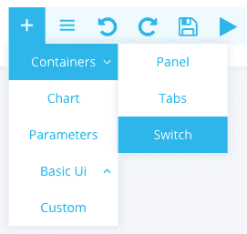
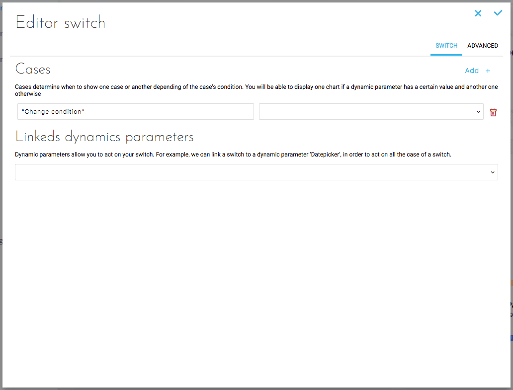
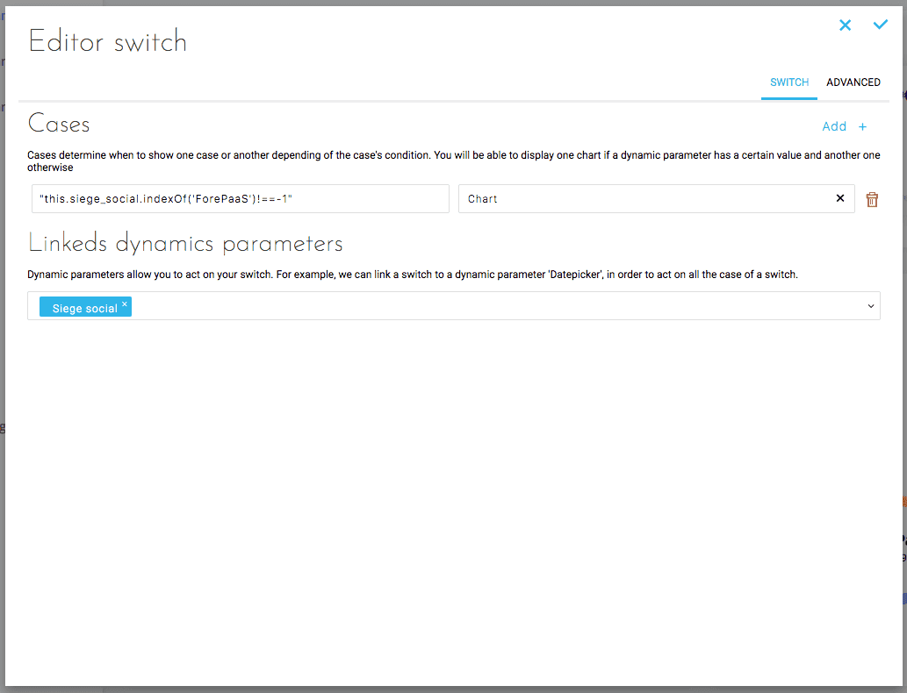

# Switch

Switches are used to set conditions on the display of elements (graphics, button, etc.).  
If you add multiple items, only the one whose condition is filled first is displayed.

>**Example:** 
* Here, only **the chart** will be displayed :
  * 1st case : true - Chart
  * 2nd case : true - Button
>* Here, only **the button** will be displayed :
  * 1st case : false - Chart
  * 2nd case : true - Button

## Adding a Switch
Select Container > Tabs.



## Configuring a Switch
### Simple configuration

This configuration allows you to configure the switch in a simple and intuitive way.



To do this, simply enter the display condition of an element and select the element type.

Then, if you wish, link this switch to a dynamic parameter by selecting it via the drop-down menu. This allows you to use the dynamic parameter data in the conditions.

In the example below, the switch is linked to the *siege_social* parameter and the Chart element is displayed if "ForePaas" is selected as the *siege_social*


>You can add as many cases as you want.

### Advanced configuration

This configuration allows you to configure the Switch via a JSON document. Below is the JSON corresponding to the Switch created with the simplified configuration:

```json
{
  "type": "switch",
  "dynamic-parameters": [
    "siege_social"
  ],
  "items": [
    {
      "case": "\"this.siege_social.indexOf('ForePaaS')!==-1\"",
      "type": "chart",
      "chart": {
        "dynamic-parameters": [
          "datepicker",
          "siege_social"
        ],
        "component": "jvectormap",
        "options": {
          "map": "fr_regions_mill"
        },
        "request": {
          "data": {
            "fields": {
              "qte": [
                "sum"
              ],
              "ca": [
                "sum"
              ]
            }
          },
          "scale": {
            "fields": [
              "ville"
            ]
          }
        },
        "id": "chart-9370143"
      }
    }
  ]
}

```