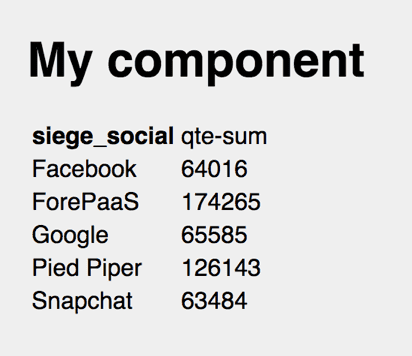
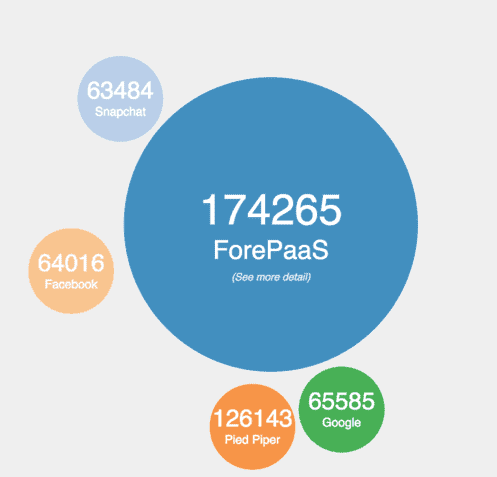

# Create custom charts

ForePaaS makes it possible for you to **create your own chart templates**.

As a reminder, here is the configuration example of a chart:

```json
{ 
  "type": "chart",
  "col": 0,
  "row": 1,
  "sizeX": 12,
  "sizeY": 12,
  "title": "",
  "chart": {
    "component": "my-component",
    "options": {
      "title": "My component"
    },
    "request": {
      "data": {
        "fields": {
          "quantity": [
            "sum"
          ]
        }
      },
      "filter": {},
      "scale": {
        "fields": [
          "city"
        ]
      }
    },
    "dynamic-parameters": [
      "dp-datepicker",
      "dp-city"
    ],
    "not-nullable-dynamic-parameters": [
      "dp-datepicker"
    ]
  }
}
```

> This format is explained in detail in our [Getting Further on App Development](/en/getting-further/app-dev/component) and lists the different templates provided by ForePaaS (echart, table, jvectormap ....)


---
## Step 1: Creating a "Hello World" component

```jsx
import React from 'react'
import PropTypes from 'prop-types'

class ChartMyComponent extends React.Component {
  render () {
    return (
      <div className='chart-my-component'>
        Hello World
      </div>
    )
  }
}

ChartMyComponent.propTypes = {
  chart: PropTypes.object
}

export default ChartMyComponent
```

This declares a ReactJS component that will simply display "Hello World". For this example, save it in `src/MyComponent.jsx`.  
Finally, you must import it into your Project by adding the highlighted line in the file `src/index.jsx`:

```jsx
FpSdk.start()
  .then(() => {
    var FpAppTemplate = FpSdk.modules.sdk.templates.default
    FpSdk.modules['chart-my-component'] = require('./MyComponent.jsx')
    render(<FpAppTemplate />, document.getElementById('root'))
  })
```

Once done, you should see your chart display "Hello World".  

!> If you don't, it is perhaps because your request does not return results.

---
## Step 2: Display data in your chart

Your template is called by the ForePaaS SDK. You can access it via the `props` of your ReactJS component which holds a chart object with the following information:

* `this.props.chart.request`: copy of the query made by your chart
* `this.props.chart.options`: list of options that you have associated with your chart
* `this.props.chart.data`: result of the query sent to the [Analytics Manager](/en/product/am/index)

In this example, HelloWorld is replaced with a simple table:

```jsx
import React from 'react'
import PropTypes from 'prop-types'

class ChartMyComponent extends React.Component {
  render () {
    return (
      <div className='chart-my-component'>
        <h1>{this.props.chart.options.title}</h1>
        <table>
          {this.props.chart.data.results.map((result, i) => {
            return (
              <tr key={i}>
                <td>{JSON.stringify(result)}</td>
              </tr>
            )
          })}
        </table>
      </div>
    )
  }
}

ChartMyComponent.propTypes = {
  chart: PropTypes.object
}

export default ChartMyComponent
```
Thanks to this code, you now have a table with one row per result.  

?> [See the Query Builder API reference for a sample result.](/en/technical/api-reference/qb/index.md?id=query-sample)

Now, let's go further and convert the JSON that appears into a real data row.
```jsx
import React from 'react'
import PropTypes from 'prop-types'

class ChartMyComponent extends React.Component {
  render () {
    return (
      <div className='chart-my-component'>
        <h1>{this.props.chart.options.title}</h1>
        <table>
          <tr>
            <th>City</th>
            <th>Data</th>
          </tr>
          {this.props.chart.data.results.map((result, i) => {
            return <tr key={i}>
              <td>{result.scales.city}</td>
              <td>{result.data.quantity.sum[0].value}</td>
            </tr>
          })}
        </table>
      </div>
    )
  }
}

ChartMyComponent.propTypes = {
  chart: PropTypes.object
}

export default ChartMyComponent
```

!> In this example, there are several **hard coded** lines.  
As a result, if you change the query for the associated JSON, the Chart will not work.

```jsx
<td>{result.scales.city}</td>
<td>{result.data.quantity.sum[0].value}</td>
```

Now, let's create a function that will dynamically search the **scales** and **data** of your graph:

```jsx
import React from 'react'
import PropTypes from 'prop-types'

class ChartMyComponent extends React.Component {
  renderLine (result, i) {
    let values = []
    // Here we give a sample of loop that parses automatically a query result
    // You have 3 levels:
    // - data : It's the data you wan't to analyse, like turnover, quantity, etc....
    // - computeMode : It's a compute mode like sum, count, avg ...
    // - evol : You will always have 0 for 'now', but if you set an evol parameter like 'year', the previous year will be in 1
    // Here you just need to convert QueryBuilder values to an easier format (an array)
    for (let field in result.data) {
      for (let computeMode in result.data[field]) {
        for (let evol in result.data[field][computeMode]) {
          values.push(result.data[field][computeMode][evol].value)
        }
      }
    }

    return (
      <tr key={i}>
        {/* Here we get the scales from the result (in this case 'city' */}
        {Object.values(result.scales).map((scale, j) => {
          return <td key={j}>{scale}</td>
        })}
        {/* Here we display our values */}
        {values.map((d, j) => {
          return <td key={j}>{d}</td>
        })}
      </tr>
    )
  }

  render () {
    return (
      <div className='chart-my-component'>
        <h1>{this.props.chart.options.title}</h1>
        <table>
          {this.props.chart.data.results.map(this.renderLine.bind(this))}
        </table>
      </div>
    )
  }
}

ChartMyComponent.propTypes = {
  chart: PropTypes.object
}

export default ChartMyComponent
```

Finally, you can put the header line of your table dynamically from the query:

```jsx
import React from 'react'
import PropTypes from 'prop-types'

class ChartMyComponent extends React.Component {
  renderHeader () {
    let values = []
    // Here I loop over the request to create the column header
    let request = this.props.chart.request
    for (let field in request.data.fields) {
      for (let computeMode of request.data.fields[field]) {
        values.push(field + '-' + computeMode)
        if (request.evol && request.evol.scale) {
          values.push(field + '-' + computeMode + '-1')
        }
      }
    }
    return (
      <tr>
        {(request.scale.fields).map((scale, j) => {
          return <th key={j}>{scale}</th>
        })}
        {values.map((d, j) => {
          return <td key={j}>{d}</td>
        })}
      </tr>
    )
  }

  renderLine (result, i) {
    let values = []
    // Here I give a sample of loop for parsing automatically a query result
    // You have 3 level :
    // - data : It's the data you wan't to analyse, like ca, qte, etc....
    // - computeMode : Its a compute mode like sum, count, avg ...
    // - evol : You will always have 0 for 'now', but if you set an evol parameter like 'year', the last year will be in 1
    // Here we just need to convert QueryBuilder values to an easier format (an array)
    for (let field in result.data) {
      for (let computeMode in result.data[field]) {
        for (let evol in result.data[field][computeMode]) {
          values.push(result.data[field][computeMode][evol].value)
        }
      }
    }

    return (
      <tr key={i}>
        {/* Here we get the scales from the result (like in my case the 'siege_social' */}
        {Object.values(result.scales).map((scale, j) => {
          return <td key={i}>{scale}</td>
        })}
        {/* Here we display our values */}
        {values.map((d, j) => {
          return <td key={i}>{d}</td>
        })}
      </tr>
    )
  }

  render () {
    return (
      <div className='chart-my-component'>
        <h1>{this.props.chart.options.title}</h1>
        <table>
          {this.renderHeader.bind(this)()}
          {this.props.chart.data.results.map(this.renderLine.bind(this))}
        </table>
      </div>
    )
  }
}

ChartMyComponent.propTypes = {
  chart: PropTypes.object
}

export default ChartMyComponent
```


Here is the visual result of your code:


 


---
## Step 3: Use a graphics library such as D3.js, Chart.js, or other

The first two steps have shown you how to display a simple table.  

Now let's see how to plug the result with a library such as D3.js.
For this example, the previous result is connected with: [http://bl.ocks.org/phuonghuynh/54a2f97950feadb45b07](http://bl.ocks.org/phuonghuynh/54a2f97950feadb45b07)

First of all, let's add the dependencies requested by the plugin to index.html (this one does not seem compatible with Webpack, so simply add them to the <body> tag)

```html
<!DOCTYPE html>
<html>
  <head>
    <link rel="icon" type="image/png" href="assets/favicon.png" sizes="32x32">
    <meta name="viewport" content="width=device-width, initial-scale=1">
    <meta charset="utf-8">
    <title>ForePaaS dashboard</title>
  </head>
  <body>
    <div id="root"></div>
    <script src="http://phuonghuynh.github.io/js/bower_components/jquery/dist/jquery.min.js"></script>
    <script src="http://phuonghuynh.github.io/js/bower_components/d3/d3.min.js"></script>
    <script src="http://phuonghuynh.github.io/js/bower_components/d3-transform/src/d3-transform.js"></script>
    <script src="http://phuonghuynh.github.io/js/bower_components/cafej/src/extarray.js"></script>
    <script src="http://phuonghuynh.github.io/js/bower_components/cafej/src/misc.js"></script>
    <script src="http://phuonghuynh.github.io/js/bower_components/cafej/src/micro-observer.js"></script>
    <script src="http://phuonghuynh.github.io/js/bower_components/microplugin/src/microplugin.js"></script>
    <script src="http://phuonghuynh.github.io/js/bower_components/bubble-chart/src/bubble-chart.js"></script>
    <script src="http://phuonghuynh.github.io/js/bower_components/bubble-chart/src/plugins/central-click/central-click.js"></script>
    <script src="http://phuonghuynh.github.io/js/bower_components/bubble-chart/src/plugins/lines/lines.js"></script>
  </body>
</html>
```

Then, copy and paste the example provided on the link in the `componentDidMount` method of our ReactJS component.
There are some modifications to make:
- Remove the `$(document).ready` from jQuery, because it will not be used by ReactJS
- Use the property `container` to pass to d3.js the **DOM node**, which will allow it to draw in the div present in the `render` function.

```jsx
import React from 'react'
import PropTypes from 'prop-types'

class ChartMyComponent extends React.Component {
  componentDidMount () {
    new window.d3.svg.BubbleChart({
      supportResponsive: true,
      container: this.refs.chart,
      size: 600,
      innerRadius: 600 / 3.5,
      radiusMin: 50,
      data: {
        items: [
          { text: 'Java', count: '236' },
          { text: '.Net', count: '382' },
          { text: 'Php', count: '170' },
          { text: 'Ruby', count: '123' },
          { text: 'D', count: '12' },
          { text: 'Python', count: '170' },
          { text: 'C/C++', count: '382' },
          { text: 'Pascal', count: '10' },
          { text: 'Something', count: '170' }
        ],
        eval: function (item) { return item.count },
        classed: function (item) { return item.text.split(' ').join('') }
      },
      plugins: [
        {
          name: 'central-click',
          options: {
            text: '(See more detail)',
            style: {
              'font-size': '12px',
              'font-style': 'italic',
              'font-family': 'Source Sans Pro, sans-serif',
              'text-anchor': 'middle',
              'fill': 'white'
            },
            attr: { dy: '65px' },
            centralClick: function () {
              alert('Here is more details!!')
            }
          }
        },
        {
          name: 'lines',
          options: {
            format: [
              {// Line #0
                textField: 'count',
                classed: { count: true },
                style: {
                  'font-size': '28px',
                  'font-family': 'Source Sans Pro, sans-serif',
                  'text-anchor': 'middle',
                  fill: 'white'
                },
                attr: {
                  dy: '0px',
                  x: function (d) { return d.cx },
                  y: function (d) { return d.cy }
                }
              },
              {// Line #1
                textField: 'text',
                classed: { text: true },
                style: {
                  'font-size': '14px',
                  'font-family': 'Source Sans Pro, sans-serif',
                  'text-anchor': 'middle',
                  fill: 'white'
                },
                attr: {
                  dy: '20px',
                  x: function (d) { return d.cx },
                  y: function (d) { return d.cy }
                }
              }
            ],
            centralFormat: [
              {// Line #0
                style: { 'font-size': '50px' },
                attr: {}
              },
              {// Line #1
                style: { 'font-size': '30px' },
                attr: { dy: '40px' }
              }
            ]
          }
        }]
    })
  }

  render () {
    return <div ref='chart' />
  }
}

ChartMyComponent.propTypes = {
  chart: PropTypes.object
}

export default ChartMyComponent
```

So far, it displays the same graph as the example found online.

To display your own data, convert the `this.props.chart.data` object to the format requested by the chart.

Add a `getItems` method:

```jsx
getItems () {
  return this.props.chart.data.results.map(item => {
    return {
      text: item.scales.city,
      count: item.data.quantity.sum[0].value
    }
  })
}
```

That you will call in the chart configuration:

```jsx
radiusMin: 50,
data: {
  items: this.getItems(),
  eval: function (item) { return item.count },
  classed: function (item) { return item.text.split(' ').join('') }
},
plugins: [
```

This is the final result:


 

---

## Still need help? 🆘

You didn't find the answer you were looking for in this page? 🙁  
Please feel free to [reach out to a support expert](https://support.forepaas.com), we're always happy to help!