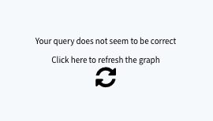

# Troubleshooting & FAQ

This page provides an accessible reference to solutions for common issues you may have when developing your application on ForePaaS as well as some **Frequently Asked Questions**.

* [Troubleshooting](en/technical/sdk/app/faq?id=troubleshooting)
  * [Incorrect query](en/technical/sdk/app/faq?id=incorrect-query)
* [FAQ](en/technical/sdk/app/faq?id=faq)
  * [How to use a specific NodeJS version?](/en/technical/sdk/app/faq?id=how-to-use-a-specific-nodejs-version)
  * [How to format a value using an existing formatter?](/en/technical/sdk/app/faq?id=how-to-format-a-value-using-an-existing-formatter)
  * [How to use registered translations?](/en/technical/sdk/app/faq?id=how-to-use-registered-translations)
  * [How to make a query and get its results outside a Chart?](/en/technical/sdk/app/faq?id=how-to-make-a-query-and-get-its-results-outside-a-chart)
  * [How to deploy a Simple Web App?](/en/technical/sdk/app/faq?id=how-to-deploy-a-simple-web-app)


If you do not find an answer to your question, please reach out to our [Support team](/en/technical/sdk/app/faq?id=cannot-find-an-answer-to-your-question-🆘)!

---
## Troubleshooting

### Incorrect Query

#### Occurrence

This error occurs when you use attempt to access a *query* that isn't available.



##### Common causes & solutions

**Undeployed API**

If the API associated to your APP isn't deployed, your APP won't be able to retrieve the query in the [Analytics Manager](/en/product/am/index).

Check if your API is deployed and deploy it if it isn't.

**Typo in your query**

Check if the fields in your query are written correctly and if they exist in the Analytics Manager.

---

## FAQ
### How to use a specific NodeJS version?

It is possible to specify the NodeJS version to use when building App by specifying in `./forepaas.json`:
```json
  "node": 14,
```

---
### How to format a value using an existing formatter?
```jsx
// Leverage "turnover" as declared in ./config/formatter.json to format a given value
import { FpMeasure } from 'forepaas/formatter'
function formatValue(field, value) {
    let measure = new FpMeasure(field);
    return measure.setValue(value).toString();
}
console.log(formatValue("turnover", 100));
```


---
### How to use registered translations?
```jsx
import FpTranslate from 'forepaas/translate'
console.log(FpTranslate("key_to_be_translated"})
```

---
### How to make a query and get its results outside a Chart?
```jsx
import FpQueryBuilder from 'forepaas/query-builder'
   const query = {
      data: {
          fields: {
              date: ["min","max"]
          }
      }
    }
    let request = new FpQueryBuilder.FpQuery(query)
    request.compute().then((response) => {
      // display array of results from the query
      console.log(response.results)
      // displays the first item in results
      console.log(response.results[0])
      // get 'data' from 1st item and displays values
      let item= response.results[0].data
      console.log(item.date.min[0].value, item.date.max[0].value)
    })
```

---
### How to deploy a Simple Web App?

Sometimes it is needed to deploy a simple web app or using a different SDK.

App's code may be provided either through a ZIP file or a Git repository.
It must provide at least:
* `forepaas.json`: minimal version described below
* `package.json`: minimal version described below
* `production/`: folder that will be the root of the website after deployment, the `package.json` file may contain a `build` command to make that folder

**forepaas.json**

```json 
 {
   "type": "app",
   "language": "js",
   "framework": "custom",
   "modules": {}
 }
```

**package.json**

```json
 {
   "name": "app_name",
   "version": "1.0.0",
   "main": "index.js",
   "scripts": {
     "build": "echo no build to do"
   }
 }
```


---
## Cannot find an answer to your question? 🆘

You can access our support portal directly from the platform by clicking on the top-right menu bar on the question mark ❓icon and then choosing *Support*. You can also send us an email on support@forepaas.com.

{Send your questions to support 🙋‍♂️ 🙋‍♀️}(https://support.forepaas.com/hc/en-us/requests)
