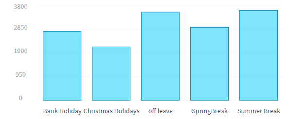
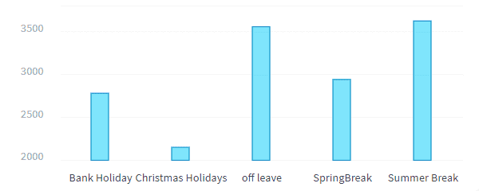
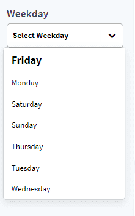

# 既存のコンポーネントを使用したカスタムグラフの編集と作成

このチュートリアルでは、最初のグラフを作成して編集し、そのグラフをダッシュボードに追加する方法を学習します。

* [グラフコンポーネントの作成と編集](jp/getting-further/app-dev/component?id=create-and-edit-a-chart-component)
  * [コンポーネントの追加](jp/getting-further/app-dev/component?id=add-a-component)
  * [グラフの編集](jp/getting-further/app-dev/component?id=customize-a-chart)
* [動的パラメータの作成と編集](jp/getting-further/app-dev/component?id=create-and-edit-a-dynamic-parameter)

---
## グラフコンポーネントの作成と編集
### コンポーネントの追加

「Rides Analytics」ダッシュボードには、新しいコンポーネントを容易に追加できます。
コンポーネントを追加するには、`rides-analytics.json`の*items*配列に次のJSONオブジェクトを追加します。

```json
{
  "type":"panel",
  "id":"rides-holidays-container",
  "sizeX":37,
  "sizeY":64,
  "row":191,
  "col":38,
  "items":[
    {
      "type":"chart",
      "chart":{
        "id":"chart-6930201",
        "component":"recharts.bar",
        "request":{
          "data":{
            "fields":{
              "avg_rides_per_day_per_station":[
                "select"
              ]
            }
          },
          "scale":{
            "fields":[
              "cat_holiday"
            ]
          }
        },
        "options":{

        }
      },
      "sizeX":100,
      "sizeY":54,
      "row":6,
      "col":0
    },
    {
      "type":"html",
      "content":"Rides variability on Holidays",
      "customclass":"chart-title",
      "sizeX":100,
      "sizeY":5,
      "row":0,
      "col":0
    }
  ]
}
```

このJSONでは、**グラフ**そのものと**グラフのタイトル**の2つのアイテムを含むパネルを定義しています。  

**グラフ**は、動作する際に要求が必要な特別なアイテムです。グラフコンポーネントがロードされると、要求が実行され、グラフの種類に応じてさまざまな形で結果が表示されます。  
要求の形式は、Query Builderのクエリと同じ形式です。また、Query Builderで要求を作成し、要求の代わりに要求IDを使用することもできます。この場合は、上記のJSONで`request`を`requestId`に置き換える必要があります。  

グラフの種類は`component`キーで定義します。ForePaaSではさまざまな種類のグラフが標準で提供されていますが、独自のコンポーネントを作成することも可能です。この方法については、このガイドの次のパートで説明します。  
この例では、[recharts](https://recharts.org/en-US/)ライブラリを使用して新しい棒グラフを定義しています。このグラフの要求では、休暇ごとの1日あたりの平均乗客数が計算されます。  

最初に、このグラフは次にように表示されます。



### グラフのカスタマイズ

このグラフはrechartsライブラリを使用して作成されているため、変更可能なプロパティが数多く存在します。 

> プロパティの詳細なリストは、[Rechartsの棒グラフのドキュメントページ](https://recharts.org/en-US/api/BarChart)に記載されています。 
 
グラフ構成用のJSONでこれらのプロパティを渡すには、このグラフに対する`options`キーを編集する必要があります。  
例えば、棒のサイズを変更するには、以下のように、`options`に`barSize`プロパティを追加します。

```json
"options": {
  "barSize": 20
}
```

また、`xAxis`または`yAxis`プロパティを追加して軸をカスタマイズすることもできます。その後、[Rechartsの軸のドキュメントページ](https://recharts.org/en-US/api/XAxis)に記載されているプロパティを渡すことができます。  
例えば、次のように、YAxisのdomainとscaleを変更します。

```json
"options": {
  "barSize": 20,
  "yAxis": {
    "domain": [
      2000,
      3800
    ],
    "scale": "linear"
  }
}
```

これらの変更を行うと、グラフは次のようになります。



**タイトルの構成**について説明するため、グラフ構成ファイルについて確認しておきましょう。  
このコンポーネントは、ForePaaSでも標準で提供されています。ここでは、HTMLコードを`content`プロパティに記述できます。これはdivで囲まれます。このdivにカスタムクラスを割り当てるには、`customclass`プロパティを使用します。

上記で定義したJSONに関連するHTMLコードは、次のようになります。

```html
<div class="html chart-title">Rides variability on Holidays</div>
```

?>➡️ カスタムグラフの詳細は、[**技術ガイド**](jp/technical/sdk/app/custom-chart)を参照してください。

---
## 動的パラメータの作成と編集

動的パラメータを利用すると、ユーザーはオンザフライで要求を変更して、1つまたは複数のグラフを対話形式で操作することができます。  

新しい動的パラメータを作成するには、`config/menus/sidebar.json`を開き、*footer*アイテムのすぐ上の*containers*オブジェクトに以下のJSONオブジェクトを追加します。

```json
  {
    "id": "dyn-weekday",
    "items": [
      {
        "type": "html",
        "content": "Weekday",
        "customclass": "dyn-title"
      },
      {
        "type": "dynamic-parameter",
        "dynamic-parameter": {
          "type": "filter",
          "id": "dynamic-weekday",
          "dictionary": "week_day",
          "component": "selectbox",
          "placeholder": "Select Weekday",
          "multi": true
        },
        "style": {
          "paddingBottom": "10px"
        }
      }
    ]
  }
```

このJSONでは、1つまたは複数の曜日でグラフの要求をフィルター処理できる動的パラメータを定義しています。
このJSONは上記のグラフのJSONと同じ手順で動作します。

このdynamic-parameterにリンクされたフィールドは、`dictionary`キーで定義されています。  
このdynamic-parameterは、selectboxコンポーネントが関連付けられています。  
`id`キーは、この動的パラメータをグラフにリンクするのに使用されます。
この動的パラメータの`type`は"filter"に設定されています。このため、この動的パラメータに関連付けられたグラフは、フィルター処理された結果を参照して、選択された曜日と一致するもののみを表示します。
`placeholder`キーと`multi`キーは、selectboxコンポーネント固有のものです。「placeholder」は選択ボックス内にデフォルトで表示されるテキストです。また、`multi`はブール値のプロパティで、trueに設定した場合に複数のオプションを選択できるようになります。

この動的パラメータを定義する上記のJSONオブジェクトをコピーして貼り付けると、新しいコンポーネントがサイドバーに次のように表示されます。



この新しく作成した動的パラメータを効果的に機能させるには、グラフにリンクする必要があります。  
このためには、グラフ構成を次のように編集します。

- `config/dashboards/rides-analytics.json`を開きます。
- **「Rides history（乗客数履歴）」グラフ**を定義するJSONオブジェクトで、dynamic-parameters配列に`"dynamic-weekday"`を追加します。
- ページをリロードすると、動的パラメータが乗客数履歴グラフにリンクされます。曜日を選択すると、グラフの情報が更新されます。

?>➡️ 動的パラメータの詳細は、[**技術ガイド**](jp/technical/sdk/app/dynamic_parameters/index)を参照してください。

おつかれさまでした🎊 🎉。 

既存のコンポーネントを利用する方法について学習しました。続いて、[カスタムコンポーネントを作成し、独自の動的パラメータとグラフを作成するのに使用する方法](/jp/getting-further/app-dev/extension.md)を学習します。
