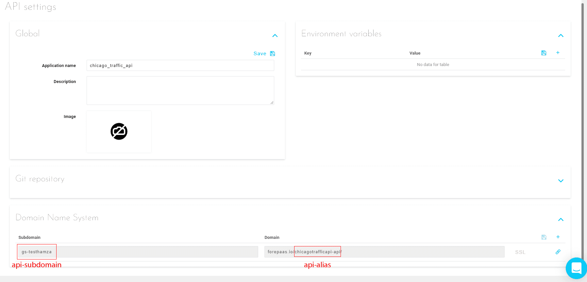
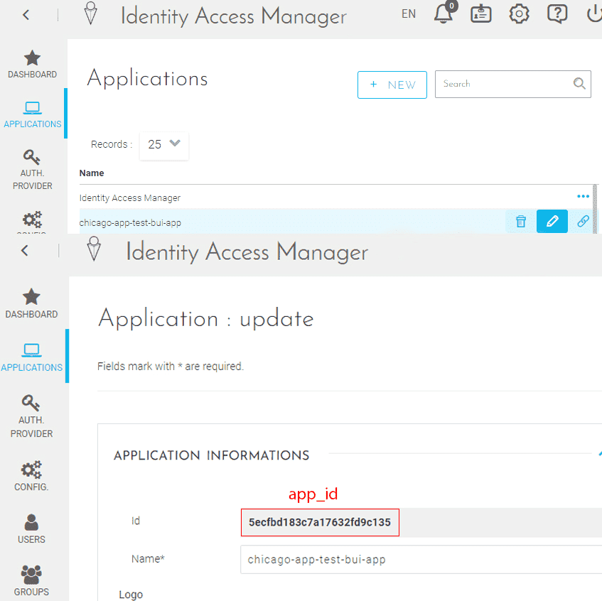
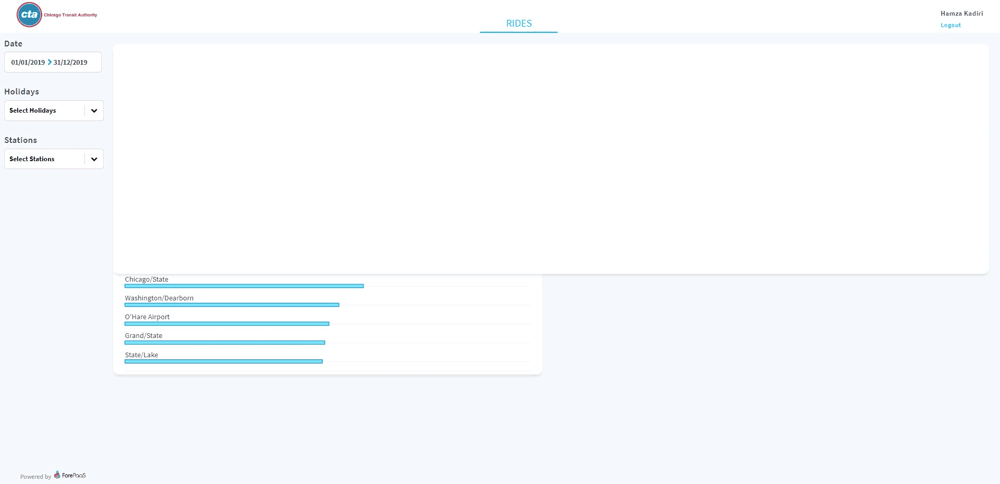
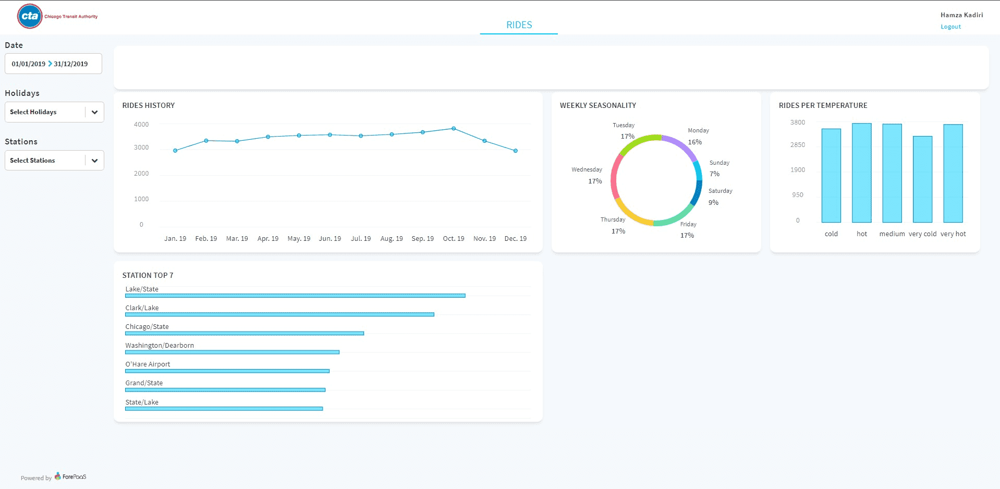
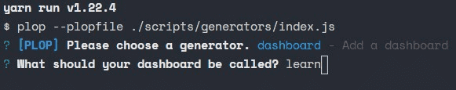
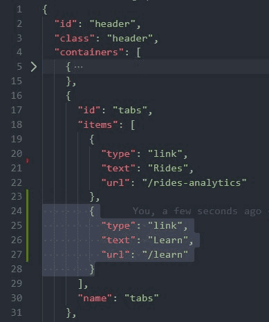
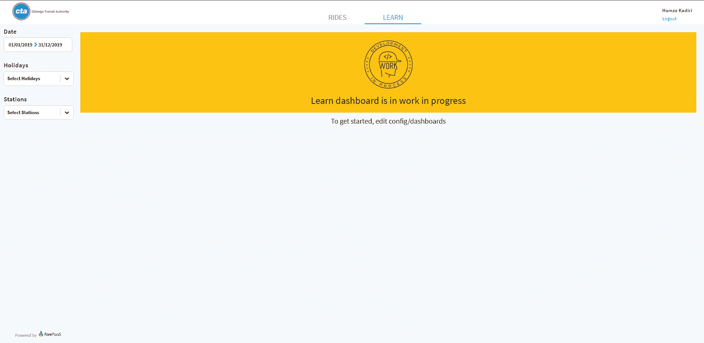

# アプリケーションの構成ファイルの詳細

ここからはコーディングを行います。このガイドでは、以下の内容について学習します。

* [アプリケーションファイルについて](jp/getting-further/app-dev/config?id=understand-forepaas-app-files)
  * [ForePaaSのアプリケーションアーキテクチャについて](jp/getting-further/app-dev/config?id=understand-forepaas-app-architecture)
  * [ForePaaSの構成ファイルについて](jp/getting-further/app-dev/config?id=understand-forepaas-configuration-files)
* [アプリケーションの編集](jp/getting-further/app-dev/config?id=edit-the-configuration-files)
  * [グローバル構成ファイルの上書き](jp/getting-further/app-dev/config?id=overwrite-the-global-configuration-file)
  * [既存のダッシュボードの編集](jp/getting-further/app-dev/config?id=edit-a-dashboard)
  * [新しいダッシュボードの作成](jp/getting-further/app-dev/config?id=generate-a-dashboard)

---
## ForePaaSのアプリケーションファイルについて
### ForePaaSのアプリケーションアーキテクチャについて

お手元には完全なForePaaSアプリケーションがあり、このアプリケーションツリーは次のようになっているはずです。

```bash
├── config
├── node_modules
├── forepaas
├── public
├── scripts
└── src
```

各ディレクトリの内容を確認していきましょう。

- `config`:ForePaaSの多くの機能を生むコア部分です。このフォルダーでは、ダッシュボード、メニュー、スタイル、翻訳などの構成ファイルの定義やアップデートを行うことができます。ここで最も重要なファイルは`global.json`で、（この後に説明する）すべての構成ファイルを宣言して使用するためのものです。
- `forepaas`:ForePaaS用の`node_modules`に相当するものです。このフォルダーには、アプリケーションをForePaaSに組み込むのに必要な基本的なすべてのコンポーネントが含まれます。/forepaas.jsonに記載されているすべてのパッケージが、ここにインストールされます。
- `node_modules` :npmからダウンロードしたライブラリが含まれるフォルダーです。これは、/package.jsonに基づいています。
- `public`:静的なすべてのファイル（フォント、アイコン、画像...）が含まれるフォルダーです。このフォルダーに保存されたファイルには、こちらのURL `/assets/{subfolder}/{name}.{extension}`からアクセスできます。  
  例えば、`assets/img`にある`favicon.png`にアクセスする（さらに、``タグで表示する）ためのURLは、`/assets/img/favicon.png`です。
- `scripts`:このフォルダーには、コンポーネントやダッシュボードを作成するためのスクリプトや、このプロジェクトを圧縮してForePaaSプラットフォーム上にアップロードしやすくするのに役立つスクリプトが含まれています。
- `src`:このフォルダーでは、独自のカスタムコンポーネントやサービスの作成やアップデートを行うことができます。その方法については、このチュートリアルの次のステップで学習します。

### ForePaaSの構成ファイルについて  

グローバル構成ファイルは、`global.json`です。

このファイルは、ForePaaSアプリケーションのエントリポイントとなります。  
このファイルでは、環境変数、ルート、ダッシュボード、その他の重要なフィールドを宣言します。

`config`フォルダーにある`global.json`を開きます。  
最初は、このファイルは次にようになっています。


```json
{
  "authentication": "{{ENV.CAM_URL}}",
  "api": "{{ENV.API_URL}}",
  "application_name": "{{ENV.APP_NAME || 'ForePaaS'}}",
  "debug": "{{ENV.DEBUG}}",
  "loader": "spinner",
  "lang": "fr",
  "version": 3,
  "storage": {
    "type": "sessionStorage"
  },
  "root": "/rides-analytics",
  "menu": [
    "file://config/menus/header.json",
    "file://config/menus/sidebar.json"
  ],
  "dashboarding": {
    "/rides-analytics": "file://config/dashboards/rides-analytics.json"
  },
  "style": "file://config/style.json",
  "reportings": "file://config/reportings.json",
  "i18n": {
    "en": "file://config/i18n/en.json"
  },
  "formatter": "file://config/formatter.json"
}
```

重要なフィールドについて説明していきましょう。

- `authentication`：認証URLを参照します。次の形式を使用します：`https://{api-subdomain}.forepaas.io/cam?app_id={app_id}`  
これはデフォルトで、環境変数として定義されます。このままの形でアプリケーションを本番環境にデプロイすることが重要です。ローカルでの開発用にこのフィールドを上書きする方法については、この[パート](#overwrite-the-global-configuration-file-for-local-use)を参照してください。
- `api` :同上。ただし、API URLを参照します。次の形式を使用します：`https://{api-subdomain}.forepaas.io/{api-alias}`
- `application_name` :アプリケーションのタイトルです。
- `root` :アプリケーションのルートパスです。
- `menu` :メニューの構成ファイルを含む配列です。  
ヘッダーとサイドバーはデフォルトで定義済みです。
- `dashboarding` :ダッシュボードを定義するためのオブジェクトです。属性はダッシュボードのURL、値はダッシュボード構成ファイルです。
- `style` :スタイル構成ファイルです。コンポーネントにスタイルを適用できます。
一部のコンポーネントにはすでにスタイルが適用されています。
- `i18n` :すべてのサポート対象言語を定義するためのオブジェクトです。属性は言語のエイリアス、値はその言語に関連する翻訳構成ファイルです。
- `formatter` :フォーマッタ構成ファイルです。データの書式設定、数値の概数化、単位の追加などを行うことができます。  
一部のフィールドはデフォルトで書式設定済みです。


---
## 構成ファイルの編集

ForePaaSのアプリケーションアーキテクチャについての知識も深まったので、ついにアプリケーションの編集に進みます。

### グローバル構成ファイルの上書き

最初のステップでは、ローカルアプリケーションをForePaaSの認証サービスと、データプラントで以前に作成したAPIにリンクします。
これらの変更が必要なのはローカルのみですので、`global.json`を直接編集することはせず、代わりに`global-override.json`という別のファイルを作成します。

- `config`フォルダーに`global-override.json`を作成します。
- 次のJSONを新しく作成したファイルにコピーして貼り付けます。

```json
{
    "authentication": "https://{api-subdomain}.forepaas.io/cam?app_id={app_id}",
    "api": "https://{api-subdomain}.forepaas.io/{api-alias}"
}
```

次の3つの変数を置き換える必要があります。

- `api-subdomain` :ForePaaSプラットフォームにログインし、「API settings（API設定）」に移動します。この変数は「Domain Name System（ドメインネームシステム）」パネルで「Subdomain（サブドメイン）」として参照されています。
- `api-alias` :この変数は、「Domain（ドメイン）」から`forepaas.io/`を削除して抜き出すことができます。



- `app_id` :Identity Access Managerページに移動します。「Applications（アプリケーション）」タブで、アプリケーションの編集モードにします。この変数は、アプリケーション情報の「Id」として参照されています。



すべてのファイルを保存します。ローカルで実行中のアプリケーションには、入門編ガイドで最後に作成したものと同じ内容が表示されています🤓。

### ダッシュボードの編集

`global.json`で確認したように、アプリケーションには`rides-analytics`というダッシュボードがすでに存在しています。

このパートでは、ダッシュボード構成ファイルを編集してレイアウトやエレメントの位置を変更する方法を学習します。

まず、`config/dashboards`の`rides-analytics.json`を開きます。
最初にパネルを作成し、アイテムの高さ、幅、位置を調整します。

パネルを作成するには、配列`items`の末尾に次の行を追加します。
これは、検索バーのプレースホルダーになるため、`search-bar`をidにします。

```json
{
    "type": "panel",
    "id" : "search-bar",
    "sizeX": 100,
    "sizeY": 100,
    "row": 0,
    "col": 0,
    "items": []
}
```

- *type:*アイテムのタイプを表します。ForePaaSでデフォルトで提供されるコンポーネントまたは特定のコンポーネントを指定できます。
- *id:*アイテムのIDです。
- *size X:*アイテムの幅を表します。このアイテムを含む幅の割合（％）を表すため、0～100の間の値を指定する必要があります。
- *size Y:*アイテムの高さを表します。
- *row:*行のオフセットを表します。
- *col:*列のオフセットを表します。

パネルを追加すると、アプリケーションは次のようになります。



次に、*sizeY*の値を19に変更してパネルの高さを小さくします。  
その後、**他のすべてのパネル**を下部に移動するため、各パネルの*row*の値を変更します。現在の値に20を加えて、他のパネルを押し下げます。  

混乱しても気にする必要はありません。これらの変更を行った後の`rides-analytics.json`ファイルを用意しています。

<details><summary>rides-analytics.json</summary>
<p>

```json
{
  "name": "Rides analytics",
  "width": 100,
  "height": 100,
  "margin": [
    10,
    10
  ],
  "description": "",
  "items": [
    {
      "type": "panel",
      "id" : "rides-history-container",
      "sizeX": 49,
      "sizeY": 70,
      "row": 20,
      "col": 0,
      "items": [
        {
          "type": "html",
          "content": "Rides history",
          "customclass": "chart-title"
        },
        {
          "type": "chart",
          "chart": {
            "id": "chart-4992931",
            "component": "recharts.line",
            "request": {
              "data": {
                "fields": {
                  "avg_rides_per_day_per_station": [
                    "select"
                  ]
                }
              },
              "scale": {
                "fields": [
                  "yearmonth"
                ]
              },
              "filter": {},
              "order": {}
            },
            "options": {
              "xAxis": {
                "type": "category"
              }
            },
            "dynamic-parameters": [
              "dynamic-date",
              "dynamic-holidays",
              "dynamic-stations"
            ]
          },
          "sizeX": 100,
          "sizeY": 55,
          "col": 0,
          "row": 9
        }
      ]
    },
    {
      "type": "panel",
      "id" : "weekly-seasonality-container",
      "sizeX": 24,
      "sizeY": 70,
      "row": 20,
      "col": 50,
      "items": [
        {
          "type": "chart",
          "chart": {
            "id": "chart-3259339",
            "component": "recharts.donut",
            "request": {
              "data": {
                "fields": {
                  "avg_rides_per_day_per_station": [
                    "select"
                  ]
                }
              },
              "scale": {
                "fields": [
                  "week_day"
                ]
              },
              "dictionaries": [
                "week_day"
              ]
            },
            "options": {}
          },
          "sizeX": 100,
          "sizeY": 60,
          "row": 5,
          "col": 0
        },
        {
          "type": "html",
          "content": "Weekly seasonality",
          "customclass": "chart-title",
          "sizeX": 93,
          "sizeY": 12,
          "row": 0,
          "col": 0
        }
      ]
    },
    {
      "type": "panel",
      "id" : "top-stations-container",
      "sizeX": 49,
      "sizeY": 70,
      "row": 94,
      "col": 0,
      "items": [
        {
          "type": "chart",
          "chart": {
            "id": "chart-7843335",
            "component": "recharts.bar-horizontal",
            "options": {},
            "request": {
              "data": {
                "limit": 7,
                "fields": {
                  "rides": [
                    "sum"
                  ]
                }
              },
              "scale": {
                "fields": [
                  "station_id"
                ]
              },
              "dictionaries": [
                "station_id"
              ],
              "order": {
                "rides": "desc"
              }
            }
          },
          "sizeX": 100,
          "sizeY": 60,
          "row": 6,
          "col": 0
        },
        {
          "type": "html",
          "content": "Station top 7",
          "customclass": "chart-title",
          "sizeX": 100,
          "sizeY": 5,
          "row": 0,
          "col": 0
        }
      ]
    },
    {
      "type": "panel",
      "id" : "rides-temperature-container",
      "sizeX": 24,
      "sizeY": 70,
      "row": 20,
      "col": 75,
      "items": [
        {
          "type": "chart",
          "chart": {
            "id": "chart-6930201",
            "component": "recharts.bar",
            "request": {
              "data": {
                "fields": {
                  "avg_rides_per_day_per_station": [
                    "select"
                  ]
                }
              },
              "scale": {
                "fields": [
                  "cat_temperature"
                ]
              }
            },
            "options": {}
          },
          "sizeX": 100,
          "sizeY": 54,
          "row": 8,
          "col": 0
        },
        {
          "type": "html",
          "content": "Rides per Temperature",
          "customclass": "chart-title",
          "sizeX": 100,
          "sizeY": 8,
          "row": 0,
          "col": 0
        }
      ]
    },
    {
      "type": "panel",
      "id" : "search-bar",
      "sizeX": 100,
      "sizeY": 19,
      "row": 0,
      "col": 0,
      "items": [
      ]
    }
  ],
  "url": "/rides-analytics",
  "path": "",
  "tags": []
}
```

</p>
</details>



ついでに、カスタム対話型マップ用のプレースホルダーとして別のパネルを追加しましょう。  

各自で編集を行うか、`rides-analytics.json`を以下のrides-analytics.jsonに置き換えてください。

<details><summary>rides-analytics.json</summary>
<p>

```json
{
  "name": "Rides analytics",
  "width": 100,
  "height": 100,
  "margin": [
    10,
    10
  ],
  "description": "",
  "items": [
    {
      "type": "panel",
      "id": "search-bar",
      "sizeX": 100,
      "sizeY": 19,
      "col": 0,
      "row": 0,
      "items": []
    },
    {
      "type": "panel",
      "id": "custom-map",
      "sizeX": 75,
      "sizeY": 99,
      "row": 20,
      "col": 0,
      "items": []
    },
    {
      "type": "panel",
      "id": "top-stations-container",
      "sizeX": 24,
      "sizeY": 99,
      "row": 20,
      "col": 76,
      "items": [
        {
          "type": "chart",
          "chart": {
            "id": "chart-7843335",
            "component": "recharts.bar-horizontal",
            "options": {},
            "request": {
              "data": {
                "limit": 7,
                "fields": {
                  "rides": [
                    "sum"
                  ]
                }
              },
              "scale": {
                "fields": [
                  "station_id"
                ]
              },
              "dictionaries": [
                "station_id"
              ],
              "order": {
                "rides": "desc"
              }
            }
          },
          "sizeX": 100,
          "sizeY": 86,
          "row": 6,
          "col": 0
        },
        {
          "type": "html",
          "content": "Station top 7",
          "customclass": "chart-title",
          "sizeX": 100,
          "sizeY": 5,
          "row": 0,
          "col": 0
        }
      ]
    },
    {
      "type": "panel",
      "id": "rides-history-container",
      "sizeX": 75,
      "sizeY": 70,
      "row": 120,
      "col": 0,
      "items": [
        {
          "type": "html",
          "content": "Rides history",
          "customclass": "chart-title"
        },
        {
          "type": "chart",
          "chart": {
            "id": "chart-4992931",
            "component": "recharts.line",
            "request": {
              "data": {
                "fields": {
                  "avg_rides_per_day_per_station": [
                    "select"
                  ]
                }
              },
              "scale": {
                "fields": [
                  "yearmonth"
                ]
              },
              "filter": {},
              "order": {}
            },
            "options": {
              "xAxis": {
                "type": "category"
              }
            },
            "dynamic-parameters": [
              "dynamic-date",
              "dynamic-holidays",
              "dynamic-stations"
            ]
          },
          "sizeX": 100,
          "sizeY": 55,
          "col": 0,
          "row": 9
        }
      ]
    },
    {
      "type": "panel",
      "id": "weekly-seasonality-container",
      "sizeX": 24,
      "sizeY": 135,
      "row": 120,
      "col": 76,
      "items": [
        {
          "type": "chart",
          "chart": {
            "id": "chart-3259339",
            "component": "recharts.donut",
            "request": {
              "data": {
                "fields": {
                  "avg_rides_per_day_per_station": [
                    "select"
                  ]
                }
              },
              "scale": {
                "fields": [
                  "week_day"
                ]
              },
              "dictionaries": [
                "week_day"
              ]
            },
            "options": {}
          },
          "sizeX": 103,
          "sizeY": 61,
          "row": 29,
          "col": 0
        },
        {
          "type": "html",
          "content": "Weekly seasonality",
          "customclass": "chart-title",
          "sizeX": 93,
          "sizeY": 12,
          "row": 0,
          "col": 0
        }
      ]
    },
    {
      "type": "panel",
      "id": "rides-temperature-container",
      "sizeX": 37,
      "sizeY": 64,
      "row": 191,
      "col": 0,
      "items": [
        {
          "type": "chart",
          "chart": {
            "id": "chart-6930201",
            "component": "recharts.bar",
            "request": {
              "data": {
                "fields": {
                  "avg_rides_per_day_per_station": [
                    "select"
                  ]
                }
              },
              "scale": {
                "fields": [
                  "cat_temperature"
                ]
              }
            },
            "options": {}
          },
          "sizeX": 100,
          "sizeY": 54,
          "row": 6,
          "col": 0
        },
        {
          "type": "html",
          "content": "Rides per Temperature",
          "customclass": "chart-title",
          "sizeX": 100,
          "sizeY": 8,
          "row": 0,
          "col": 0
        }
      ]
    }
  ],
  "url": "/rides-analytics",
  "path": "",
  "tags": []
}
```

</p>
</details>

おつかれさまでした。これで、「Rides Analytics（乗客数分析）」ページのレイアウトの準備ができました。

続いて、アプリケーションに新しいダッシュボードを追加する方法を学習します。

### ダッシュボードの作成

新しいダッシュボードを作成するには、`config/dashboards`に新しいJSONファイルを作成します。  
弊社が用意したスクリプトを使用すると、このプロセスをスピードアップできます。

```bash
yarn generate
```

矢印キーを使用して「**dashboard**」を選択し、新しいダッシュボードの名前を入力します（この場合は「learn」）。



ダッシュボードをアプリケーションにリンクするには、`global.json`を編集して「*dashboarding*」セクションに新規エントリを追加します。

```json
"/learn": "file://config/dashboards/learn.json"
```

キーは、新しいダッシュボードのURLパスを表しています。  
値は、このダッシュボードに関連付けられた.jsonファイルへのパスを表しています。

新しいダッシュボードページに、次の場所からアクセスできるようになります：[localhost:3333/#/learn](localhost:3333/#/learn)

最後に、ヘッダーの「Rides」の横に新しいリンクタブを追加しましょう。

このためには、`config/menus/header.json`に移動し、*tabs*コンテナの*items*配列にある"Rides"アイテムのすぐ下に、次のエントリを追加します。

```json
{
  "type": "link",
  "text": "Learn",
  "url": "/learn"
}
```






---
## 学習は順調に進んでいます！

ここでは、ForePaaSのアプリケーションアーキテクチャと、ローカルでのアプリケーションの編集方法について学びました。  
次のページのトピックであるアプリケーションのカスタマイズについてご紹介しましょう。コンポーネントにスタイルを適用する場合、次の複数の方法が利用できます。

- [スタイルテンプレート](/jp/technical/sdk/app/charts/template)を使用：スタイルテンプレートを使用すると、デフォルトで適用されるテンプレートを定義できます。
- コンポーネントレベルでスタイルを適用：スタイルは特定のコンポーネントのみに適用されます。これを行うには、グラフまたは動的パラメータを宣言する際にpropsを渡します。  
例：`config/dashboards/rides-analytics.json`に移動し、「*rides-history-container*」パネル内にある折れ線グラフ内の「options」フィールドを参照します。
- モジュールレベルでスタイルを適用（動的パラメータのみ）：このタイプのすべての動的パラメータにスタイルが適用されます。例：`style.json`の`select-box`内で渡されるプロパティ

> **注**：グラフには[スタイルテンプレート](/jp/technical/sdk/app/charts/template)を使用し、動的パラメータには`style.json`を使用することをお勧めします。

> **グラフでは非推奨**：
- モジュールレベルでスタイルを適用（例：Recharts）：モジュールのすべてのコンポーネントにスタイルが適用されます。  
例：`style.json`の`recharts`内で渡されるプロパティ
- コンポーネントレベルでスタイルを適用（例：Recharts-Bar）：指定されたコンポーネントタイプを共有するすべてのコンポーネントにスタイルが適用されます。  
例：`style.json`の`recharts-bar`内で渡されるプロパティ

次の課題に進む準備はできましたか。🧗🏽‍♂️ では、グラフの作成と編集方法の学習に進みましょう。


?> ➡️ [カスタムグラフの編集と作成](/jp/getting-further/app-dev/component.md)

