# 動的パラメータおよびグラフとしての、カスタムコンポーネントの利用

Reactフレームワークでは、**独自のコンポーネントを新規に作成**できます。これらのコンポーネントは、[動的パラメータ](jp/getting-further/app-dev/extension?id=use-a-custom-component-as-a-dynamic-parameter)および[グラフ](jp/getting-further/app-dev/extension?id=use-a-custom-component-as-a-chart)として利用できます。

このガイドでは、次の内容について説明します。

* [動的パラメータのユースケース](jp/getting-further/app-dev/extension?id=use-a-custom-component-as-a-dynamic-parameter)
  * [コンポーネントの作成](jp/getting-further/app-dev/extension?id=generate-a-component)
  * [コンポーネントの編集](jp/getting-further/app-dev/extension?id=edit-a-component)
  * [2つ目の動的パラメータの作成](jp/getting-further/app-dev/extension?id=adding-a-search-bar)
* [グラフのユースケース](jp/getting-further/app-dev/extension?id=use-a-custom-component-as-a-chart)
* [ForePaaSでのアプリケーションの公開](jp/getting-further/app-dev/extension?id=publish-your-app-on-your-dataplant)
  * [zipファイルの利用](jp/getting-further/app-dev/extension?id=import-your-app-as-a-zip-file)
  * [Gitの利用](jp/getting-further/app-dev/extension?id=connect-your-app-to-a-git-repository)

?> 必要なときにはいつでも、[**技術ガイド**](jp/technical/sdk/app/custom-component)🔧を参照してカスタムコンポーネントの詳細を確認してください。

---
## 動的パラメータとしての、カスタムコンポーネントの利用

### コンポーネントの作成

カスタムコンポーネントを作成し、動的パラメータとして使用する方法を確認していきましょう。

例として、次のチェックボックス・グループ・コンポーネントを作成する方法を手順を追って説明します。

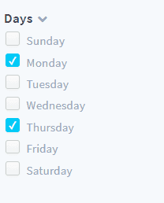

コンポーネントを作成するには、以下のコマンドを実行して弊社のビルド前スクリプトを利用します。

```bash
yarn generate
```

以下に示すように、**component**ジェネレーターを選択し、`DynamicParameterCheckbox`と名前を付け、最後の質問に「No」と答えます。

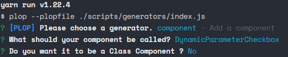

!> コンポーネントを動的パラメータとして登録するには、コンポーネント名が「DynamicParameter」で始まる必要があります。

このスクリプトにより、`src/components`内に次の3つのファイルを含むフォルダーが生成されます。

- `DynamicParameterCheckbox.jsx`
- `DynamicParameterCheckbox.less`
- `index.js`

### コンポーネントの宣言

コンポーネントでの作業を始める前に、コンポーネントを宣言して使用する方法を確認しましょう。

次の手順に従って、新しいコンポーネントを宣言します。

- `src/components/index.js`に移動します。
- このファイルの一番上に次の行を追加して、コンポーネントをインポートします。

  ```js
  import DynamicParameterCheckbox from "./DynamicParameterCheckbox";
  ```

- componentsオブジェクトにコンポーネント名を追加して、コンポーネントを宣言します。

  ```js
    components: {
        ...
        DynamicParameterCheckbox
  },
  ```

コンポーネントの**エイリアス**を指定することで、構成ファイル内でこのコンポーネントを呼び出すことができます。コンポーネントのエイリアスを取得するには、コンポーネント名をキャメルケースからケバブケースに変えて（`DynamicParameterCheckbox`を`dynamic-parameter-checkbox`に変更）、そこから「dynamic-parameter」と「chart」の両方またはいずれかを削除します。  

ここでは、コンポーネントのエイリアスは`checkbox`になります。次に、`config/menus/sidebar.json`に移動し、*dynamic-weekday*の*component*プロパティを`"checkbox"`（すなわちコンポーネントのエイリアス）に変更します。

アプリケーションページに移動し、**dynamic-weekdayコンポーネントが変更されている**ことを確認します。

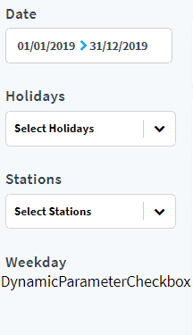


### コンポーネントの編集

このガイドで使用するフレームワークはReactです。 

> コンポーネントの作成について分かりやすく手順を追って説明していきますが、Reactフレームワークについて疑問点がある場合は、[こちら](https://reactjs.org/docs/getting-started.html)のドキュメントを確認してください。🆘  
また、関数コンポーネントを使用するため、Reactの最新の機能の1つである**Reactフック**を利用します。詳細については、こちらの[ページ](https://reactjs.org/docs/hooks-intro.html)を参照してください。

では、`DynamicParameterCheckbox.jsx`の編集を始めましょう。

このコンポーネントはdynamic-parameterとして宣言されているため、一部のプロパティはすでにForePaaSのデータフローロジックによって自動的に渡されています。[useEffect](https://reactjs.org/docs/hooks-reference.html#useeffect)フックを使用すると、コンポーネントが初めてレンダリングされたときに、これらのプロパティをロギングできます。

まず、ファイルの最初の行を変更して、`useEffect`と`useState`（これは後で必要になります）をインポートします。

```js
import React, { useEffect, useState } from "react";
```

次に、`props`を関数コンポーネントの引数に追加します。

```jsx
const DynamicParameterCheckbox = (props) => {
```

最後に、この関数内のreturnステートメントの直前にuseEffectフックを追加します。

この関数コンポーネントの定義は、次のようになります。

```jsx
const DynamicParameterCheckbox = props => {
  useEffect(() => {
    console.log(props);
  }, []);

  return <div>DynamicParameterCheckbox</div>;
};
```

ブラウザのコンソールパネルを開くと、これらのプロパティを確認できます。

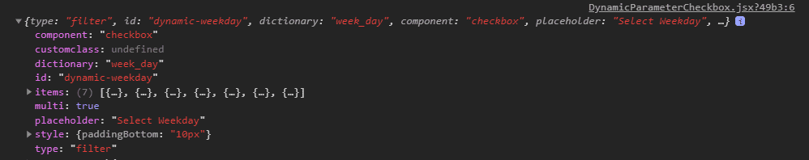

ご覧のように、これらのプロパティの大半は、dynamic-parameterを定義する際に`sidebar.json`に渡されます。  
ただし、`items`は、`dictionary`で指定されたフィールド（この場合は`week_day`）に対してクエリを実行する内部要求の結果になります。

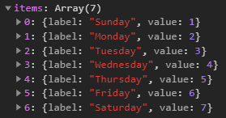

次に、チェックボックスを作成しましょう。

チェックボックスを作成するには、小さなパッケージ`react-checkbox-group`をインストールする必要があります。このためには以下を実行します。

```bash
yarn add react-checkbox-group
```

このパッケージでは、チェックボックス・グループ・コンポーネントを使用できるようになります。このコンポーネントをインポートするには、このファイルの一番上に次の行を追加します。

```js
import CheckboxGroup from "react-checkbox-group";
```

ブール変数`expanded`をコンポーネントのStateに追加して、小さな矢印アイコンで`CheckboxGroup`を表示または非表示できるようにします。

```js
const DynamicParameterCheckbox = (props) => {
  const [expanded, setExpanded] = useState(true)
  ...
```

この関数のreturnステートメントを次のように変更します。

```jsx
<div>
  <div className="dyn-title checkbox-header">
    {props.title}
    <i
      onClick={() => setExpanded(!expanded)}
      className={`fa fa-chevron-${expanded ? "down" : "right"} expand-icon`}
    />
  </div>
  {expanded && (
    <CheckboxGroup name="options">
      {Checkbox => (
        <React.Fragment>
          {props.items.map(option => (
            <div key={option.value}>
              <label className="dyn-checkbox-container" htmlFor={option.value}>
                <Checkbox
                  className="dyn-checkbox"
                  id={option.value}
                  value={option.value}
                />
                <span className="dyn-checkbox-label">{option.label}</span>
              </label>
            </div>
          ))}
        </React.Fragment>
      )}
    </CheckboxGroup>
  )}
</div>
```

タイトルセクションでは*props.title*を使用しています。このため、以下に示すように、`config/menus/sidebar.json`の**dynamic-weekday**の定義に`title`プロパティを渡す必要があります（重複するためHTMLエレメントも削除されています）。

```json
{
  "id": "dyn-weekday",
  "items": [
    {
      "type": "dynamic-parameter",
      "dynamic-parameter": {
        "type": "filter",
        "id": "dynamic-weekday",
        "dictionary": "week_day",
        "component": "checkbox",
        "title": "Days"
      },
      "style": {
        "paddingBottom": "10px"
      }
    }
  ]
}
```

最後に、以下のコードスニペットを使用して`DynamicParameterCheckbox.less`を変更して、コンポーネントにスタイルを適用します。

<details><summary>DynamicParameterCheckbox.less</summary>
<p>

```less
// DynamicParameterCheckbox stylesheet

@import "../../styles/_variables.less";

.checkbox-header {
  display: flex;
  flex-direction: row;
  align-items: center;
}

.dyn-checkbox-container {
  display: flex;
  align-items: flex-end;
  margin: 3px;
}

.dyn-checkbox {
  -webkit-appearance: none;
  background-color: #fafafa;
  border: 1px solid #cacece;
  box-shadow: 0 1px 2px rgba(0, 0, 0, 0.05), inset 0px -15px 10px -12px rgba(0, 0, 0, 0.05);
  padding: 7px;
  border-radius: 3px;
  display: inline-block;
  position: relative;
}

.dyn-checkbox:hover {
  cursor: pointer;
  box-shadow: 0 1px 2px @primary-color, inset 0px 1px 3px @primary-color;
  border: 1px solid @primary-color;
}

.dyn-checkbox:active,
.dyn-checkbox:checked:active {
  box-shadow: 0 1px 2px @primary-color, inset 0px 1px 3px @primary-color;
}

.dyn-checkbox:checked {
  background-color: @primary-color;
  border: 1px solid @primary-color;
  box-shadow: 0 1px 2px @primary-color, inset 0px -15px 10px -12px
      @primary-color, inset 15px 10px -12px @primary-color;
  color: white;
}

.dyn-checkbox:checked:after {
  content: "\2714";
  font-size: 12px;
  position: absolute;
  top: -1px;
  left: 2px;
  color: white;
}

.dyn-checkbox-label {
  cursor: pointer;
  font-family: "Source Sans Pro";
  font-size: 14px;
  letter-spacing: 0;
  color: #97a7b7;
  line-height: 17px;
  margin-left: 5px;
}

.fa.expand-icon {
  color: #97a7b7;
  font-size: 12px;
  cursor: pointer;
  margin-left: 5px;
}

.fa.expand-icon:hover {
  color: #3e4550;
  cursor: pointer;
}
```

</p>
</details>

dynamic-parameterは見映えが良くなりましたが、まだうまく機能していません。

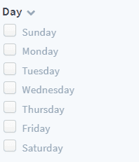

どのボックスにもチェックを入れることができません。  

これは、CheckboxGroupをdynamic-parameterコンポーネントにバインドする必要があるためです。このためには、コンポーネントのStateに配列を追加する必要があります。こうして選択されたオプションを追跡できるようにし、`selectedOptions`と名前を付けます。

```javascript
const DynamicParameterCheckbox = (props) => {
  const [expanded, setExpanded] = useState(true)
  const [selectedOptions, setSelectedOptions] = useState([])
  ...
```

関数`onChange`を追加して、先ほど定義した配列を更新します。

```javascript
const onChange = options => {
  setSelectedOptions(options);
};
```

最後に、2つのプロパティ（`onChange`と`value`（`selectedOptions`を含む配列））をCheckboxGroupに追加する必要があります。次のように、returnステートメントを変更してこれらをバインドします。

```js
return (
  ...
  <CheckboxGroup name='options' value={selectedOptions} onChange={onChange}>
  ...
```
もう少しです🚴‍♂️。

最後のステップでは、このdynamic-parameterを[Reduxグローバルストア](https://redux.js.org/api/store)にバインドしてグラフの要求を変更できるようにします。次の行をファイルの一番上にあるimportに追加します。

```js
import { connect } from "react-redux";
import { set } from "forepaas/store/querystring/action";
```

次に、ファイルの最後の行を次のように**置き換え**て、このコンポーネントをグローバルストアに接続します。

```javascript
export default connect(state => ({ querystring: state.querystring }))(
  DynamicParameterCheckbox
);
```

`DynamicParameterCheckbox`関数コンポーネント内に、ヘルパー関数`updateModel`を作成して、アクションをグローバルストアにディスパッチします。

```js
const updateModel = model => {
  if (props.id) {
    let value = model.map(item => (item && item.value ? item.value : item));
    props.dispatch(set(props.id, value.length ? value : null));
  }
};
```

次に、`onChange`関数を更新して`updateModel`を呼び出します。

```js
const onChange = options => {
  setSelectedOptions(options);
  updateModel(options);
};
```

これで、動的パラメータがグローバルストアに接続されました。`dynamic-weekday`に接続されているグラフは、この動的パラメータの影響を受けるため、動的パラメータがグローバルストアに接続されていることを確認できます。

ページが更新されたときに動的パラメータのStateがロードされるようにするには、`useEffect`フックを次のように変更します。

```js
useEffect(() => {
  const selectedOptions = props.querystring[props.id] || [];
  setSelectedOptions(selectedOptions);
}, [props.items]);
```

おつかれさまでした。これで最初のカスタム動的パラメータの作成は完了です。  
途中で分からなくなってしまった場合😪も、心配はいりません。最終的なコードは[こちら](https://github.com/forepaas/getting-started/tree/release/advanced/src/components/DynamicParameterCheckbox)で確認できます。


### 検索バーの追加
駅でフィルター処理できるように、2つ目の動的パラメータを追加しましょう。

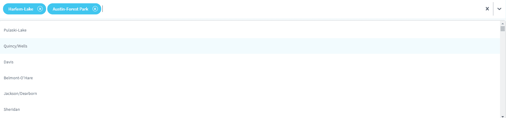

新しいコンポーネントを作成します。

```bash
yarn generate
```

**component**ジェネレーターを選択します。コンポーネントに`DynamicParameterAutocompleteBox`と名前を付け、最後の質問に「No」と答えます。

新しく作成された.jsxの内容を、次のように変更します。

<details><summary>DynamicParameterAutocompleteBox.jsx</summary>
<p>

```jsx
import React, { useState, useEffect } from "react";
import { connect } from "react-redux";
import Select from "react-select";
import { set } from "forepaas/store/querystring/action";

const searchIcon = () => ({
  alignItems: "center",
  display: "flex",
  ":before": {
    fontFamily: "FontAwesome",
    content: '"\f002"',
    marginRight: 8
  }
});

const customStyles = {
  control: (base, state) => ({
    ...base,
    height: "57px",
    borderWidth: "0px",
    boxShadow: "5px 5px -2px rgba(0, 0, 0, 0.1)"
  }),
  option: (base, state) => ({
    ...base,
    color: state.theme.colors.neutral50,
    fontSize: "13px",
    height: "48px",
    display: "flex",
    alignItems: "center",
    fontWeight: 500,
    letterSpacing: 0
  }),
  menu: (base, state) => ({
    ...base,
    zIndex: 2000
  }),
  multiValue: (base, state) => ({
    ...base,
    borderRadius: "21px",
    backgroundColor: state.theme.colors.primary75,
    color: state.theme.colors.neutral0,
    height: "34px",
    alignItems: "center"
  }),
  multiValueLabel: (base, state) => ({
    ...base,
    color: state.theme.colors.neutral0,
    display: "flex",
    alignItems: "center",
    marginLeft: "10px",
    fontWeight: 600,
    letterSpacing: 0
  }),
  placeholder: (base, state) => ({
    ...base,
    color: state.theme.colors.neutral20,
    fontSize: "14px",
    ...searchIcon()
  }),
  multiValueRemove: (base, state) => {
    return {
      ...base,
      color: state.theme.colors.neutral0,
      borderRadius: "10px",
      padding: "0px",
      margin: "10px",
      border: `1px solid ${state.theme.colors.neutral0}`,
      ":hover": {
        backgroundColor: state.theme.colors.neutral0,
        color: state.theme.colors.primary75,
        cursor: "pointer"
      }
    };
  }
};

const DynamicParameterAutocompleteBox = ({ items, ...props }) => {
  const [selectedOptions, setSelectedOptions] = useState([]);

  const customTheme = theme => ({
    ...theme,
    colors: {
      ...theme.colors,
      primary: props.primaryColor || "#00CCF9",
      primary25: props.primary25Color || "rgba(16,182,233,0.06)",
      primary50: props.primary50Color || "rgba(16,182,233,0.20)",
      primary75: props.primary75Color || "rgba(16,182,233,0.8)",
      neutral20: props.placeholderColor || "#97A7B7",
      neutral50: props.menuColor || "#485465"
    }
  });

  useEffect(() => {
    const selectedValues = props.querystring[props.id] || [];
    const mappedOptions = items.filter(item =>
      selectedValues.includes(item.value)
    );
    setSelectedOptions(mappedOptions);
  }, [items]);

  const updateModel = model => {
    if (props.id) {
      let selectedValues =
        model && model.length
          ? model.map(item => (item && item.value ? item.value : item))
          : [];
      props.dispatch(
        set(props.id, selectedValues.length ? selectedValues : null)
      );
    }
  };

  const onChange = options => {
    setSelectedOptions(options);
    updateModel(options);
  };

  return (
    <Select
      value={selectedOptions}
      styles={customStyles}
      theme={customTheme}
      options={items}
      isMulti={props.isMulti}
      placeholder={props.placeholder}
      onChange={onChange}
    />
  );
};

export default connect(state => ({ querystring: state.querystring }))(
  DynamicParameterAutocompleteBox
);
```

</p>
</details>

新しいコンポーネントをインポートし、ファイル内で定義された`components`オブジェクトに追加して、
`src/components/index.js`で[コンポーネントを宣言](#declare-a-component)します。

`config/dashboards/rides-analytics.json`に移動し、idが`search-bar`のパネルを見つけて、次のように**dynamic-parameterで置き換え**ます。

```json
{
  "type": "dynamic-parameter",
  "id": "search-bar",
  "dynamic-parameter": {
    "type": "filter",
    "id": "dynamic-stations",
    "component": "autocomplete-box",
    "placeholder": "Search for a station",
    "isMulti": true,
    "dictionary": "station_id"
  },
  "sizeX": 100,
  "sizeY": 19,
  "col": 0,
  "row": 0,
  "items": []
}
```

最後に、新しい検索バーで重複するため、`config/menus/sidebar.json`から*dyn-stations*オブジェクト全体を削除します。

---
## グラフとしての、カスタムコンポーネントの利用

このセクションでは、カスタムコンポーネントを作成し、グラフとして使用する方法を学習します。

例として、[React-Leaflet](https://react-leaflet.js.org/)ライブラリを使用して対話型のマップコンポーネントを作成します。最終的な結果は次のようになります。

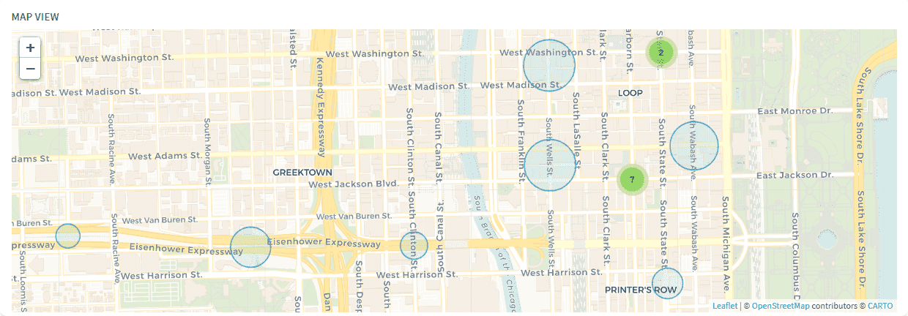

はじめに、いつもどおりスクリプトを使ってコンポーネントを作成しましょう。

```bash
yarn generate
```

**component**ジェネレーターを選択し、`ChartMap`と名前を付け、最後の質問に「No」と答えます。

!> コンポーネントが正しく認識され登録されるには、グラフコンポーネント名が「Chart」で始まる必要があります。

`src/components/index.js`でコンポーネントを[宣言](#declare-a-component)します。

これで、コンポーネントが分析ダッシュボードで利用できるようになります。`rides-analytics.json`に移動し、新しいグラフとタイトルを`custom-map`パネルに追加します。

```json
{
  "type": "panel",
  "id": "custom-map",
  "sizeX": 75,
  "sizeY": 99,
  "row": 20,
  "col": 0,
  "items": [
    {
      "type": "html",
      "content": "Map view",
      "customclass": "chart-title",
      "sizeX": 100,
      "sizeY": 5
    },
    {
      "type": "chart",
      "chart": {
        "id": "chart-map",
        "component": "map",
        "dynamic-parameters": [
          "dynamic-date",
          "dynamic-holidays",
          "dynamic-stations",
          "dynamic-weekday"
        ],
        "request": {
          "data": {
            "fields": {
              "rides": ["avg"]
            }
          },
          "scale": {
            "fields": ["station_id", "station_name", "lat", "lng"]
          },
          "filter": {},
          "order": {}
        }
      },
      "sizeX": 100,
      "sizeY": 88,
      "row": 6,
      "col": 0
    }
  ]
}
```

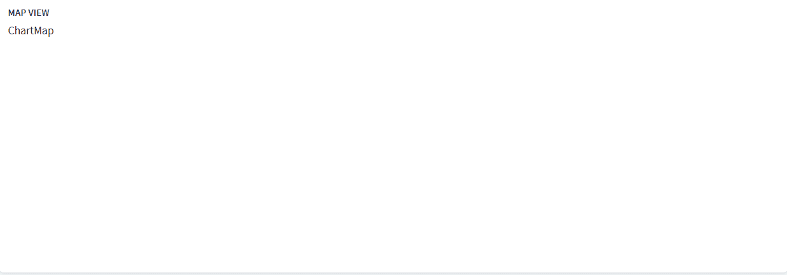

動的パラメータと同様に、グラフもマウントされたときに自動的にプロパティを受け取ります。どのようになるかを確認しましょう。

通常どおり、`ChartMap.jsx`ファイルの**最初の行を変更**して`useEffect`と`useState`をインポートします。

```jsx
import React, { useEffect, useState } from "react";
```

次に、`props`を関数コンポーネントの引数に追加します。

```jsx
const ChartMap = (props) => {
```

最後に、この関数内のreturnステートメントの直前に、useEffectフックを追加します。

最終的な関数コンポーネントは、次のようになります。

```jsx
const ChartMap = props => {
  useEffect(() => {
    console.log(props);
  }, []);
  return <div>ChartMap</div>;
};
```

ブラウザのコンソールパネルを開くと、このコンポーネントに渡されたプロパティを確認できます。

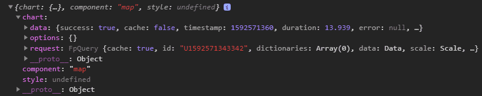

これらのプロパティの大半は、`config/dashboards/rides-analytics.json`のグラフ定義から渡されます。  
ただし、`data`は、このグラフに関連するQuery Builderの要求の結果を表すJSONです。このJSONは可能な限り汎用性ある形で記述されているため、処理がやや面倒です。

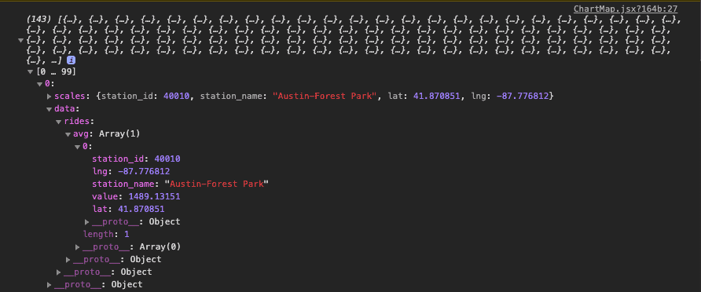

この例では（ほとんどの場合も同様ですが）、JSONオブジェクトは非常に複雑であるため、ヘルパー関数を使用してJSONオブジェクトをフラット化し、扱いやすくします。

```jsx
const flattenChartResults = results => {
  let flattenedChartResults = [];
  results.forEach(result => {
    let fieldEntries = [];
    Object.entries(result.data).forEach(([fieldName, computeModes]) => {
      Object.entries(computeModes).forEach(([computeModeName, rows]) => {
        computeModeName === "select"
          ? fieldEntries.push([computeModeName, rows[0].value])
          : fieldEntries.push([
              `${fieldName}_${computeModeName}`,
              rows[0].value
            ]);
      });
    });
    let flattenedObject = {
      ...result.scales,
      ...Object.fromEntries(fieldEntries)
    };
    flattenedChartResults.push(flattenedObject);
  });
  return flattenedChartResults;
};
```

インポートとChartMapの間に上記のコードスニペットをコピーして貼り付けて、useEffectフックの内容を更新し、フラット化された結果を表示します。

```jsx
useEffect(() => {
  const results = flattenChartResults(props.chart.data.results);
  console.log(results);
}, [props.chart.data.results]);
```

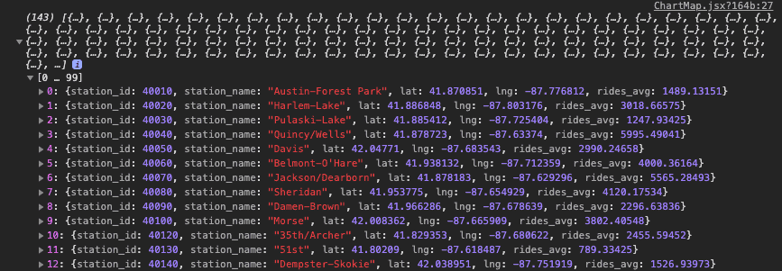

これらの結果をマップ上に表示するには、コンポーネントのStateにこのデータを保存する必要があります。次のように、`ChartMap`コンポーネント内で配列を宣言します。

```jsx
const ChartMap = (props) => {
  const [stations, setStations] = useState([])
  ...
```

useEffectを更新して、結果をロギングする代わりにこの配列を変更します。

```js
useEffect(() => {
  const results = flattenChartResults(props.chart.data.results);
  setStations(results);
}, [props.chart.data.results]);
```

データの準備が済んだら、続いて、地図の作成方法を確認しましょう。`react-leaflet`、`leaflet`、`react-leaflet-markercluster`をインストールする必要があります。

```bash
yarn add react-leaflet leaflet react-leaflet-markercluster
```

ファイルの一番上に次の行を追加して、react-leafletのコンポーネントをインポートします。

```js
import {
  Map as LeafletMap,
  CircleMarker,
  Popup,
  TileLayer
} from "react-leaflet";
```

`ChartMap.less`に移動し、以下のコードスニペットを使用してスタイルシートを変更します。

<details><summary>ChartMap.less</summary>
<p>

```less
// ChartMap stylesheet
@import "~leaflet/dist/leaflet.css";
@import "~react-leaflet-markercluster/dist/styles.min.css";

.leaflet-container {
  height: 100%;
}

.leaflet-popup-content-wrapper,
.leaflet-popup-tip {
  opacity: 0.85;
  background-color: #3e4550;
  box-shadow: inset 0 -3px 0 0 rgba(0, 0, 0, 0.13);
  color: #fff;
}

.leaflet-popup-content-wrapper {
  text-align: center;
  border-radius: 1px;
}

.popup-title {
  letter-spacing: 0;
  font-size: 13px;
}

.popup-value {
  font-size: 13px;
  font-weight: 600;
}
```

</p>
</details>

`ChartMap.jsx`に戻り、Stateのすぐ下で、デフォルトのマップパラメータ（center、zoom、minZoom）を定義します。

```jsx
const center = [41.89, -87.6297982];
const zoom = 14;
const minZoom = 7;
```

関数のreturnステートメントを変更して、シカゴを中心とする空のマップを表示します。

```jsx
return (
  <LeafletMap center={center} zoom={zoom} minZoom={minZoom}>
    <TileLayer
      attribution='&copy; <a href="https://www.openstreetmap.org/copyright">OpenStreetMap</a> contributors &copy; <a href="https://carto.com/attributions">CARTO</a>'
      url="https://{s}.basemaps.cartocdn.com/rastertiles/voyager/{z}/{x}/{y}{r}.png"
    />
  </LeafletMap>
);
```

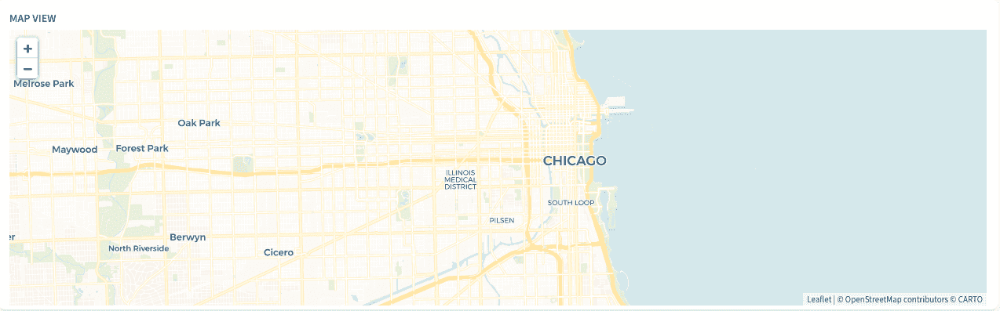

次に、`LeafletMap`内の`TileLayer`のすぐ下に駅を示す円形のマーカーを追加します。

```jsx
{
  stations.map(station => (
    <CircleMarker
      key={station.station_id}
      center={[station.lat, station.lng]}
    />
  ));
}
```

> プロパティを追加してサイズ、ウェイト、色などを制御することで、円形のマーカーをカスタマイズできます。詳細なドキュメントは、[こちら](https://leafletjs.com/reference-1.6.0.html#circlemarker)に記載されています。

以下は、円形の色を変更し、乗客数に比例したサイズにするコードスニペットです。

```jsx
<CircleMarker
  key={station.station_id}
  center={[station.lat, station.lng]}
  radius={Math.max(
    10 + (station.rides_avg / 1000) * Math.log(zoom),
    ((2 * station.rides_avg) / 1000) * Math.log(zoom)
  )}
  color={"#0089C0"}
  weight={1}
  fillColor={"rgba(0,204,249,0.5)"}
/>
```

次に、円形をクリックしたときに、駅名と関連する乗客数を表示するポップアップを追加します。

以下のように、`CircleMarker`内に追加します。

```jsx
<CircleMarker
  key={station.station_id}
  center={[station.lat, station.lng]}
  radius={Math.max(
    10 + (station.rides_avg / 1000) * Math.log(zoom),
    ((2 * station.rides_avg) / 1000) * Math.log(zoom)
  )}
  color={"#0089C0"}
  weight={1}
  fillColor={"rgba(0,204,249,0.5)"}
>
  <Popup closeButton={false} position={[station.lat, station.lng]}>
    <div className="popup-title">{station.station_name}</div>
    <div className="popup-value">{station.rides_avg}</div>
  </Popup>
</CircleMarker>
```

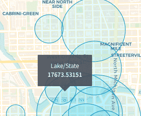

`FpMeasure`を使用すると、平均乗客数が`rides`に対して`config/formatter.json`で指定された書式設定ルールに従うようにすることができます。

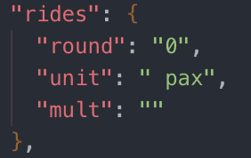

FpMeasureをインポートします。

```js
import { FpMeasure } from "forepaas/formatter";
```

ポップアップ値を変更します。

```jsx
<div className="popup-value">
  {new FpMeasure("rides").setValue(station.rides_avg).toString()}
</div>
```

作成したマップを使ってみると、動的パラメータを変更したときに毎回リロードが行われることに気付くはずです。`config/dashboards/rides-analytics.json`でグラフ構成オプションに`noReload`プロパティを追加すると、この動作を無効にすることができます。

```json
"chart": {
  "id": "chart-map",
  "component": "map",
  "noReload": true,
  "dynamic-parameters": [
    ...
  ],
  "request": {
    ...
  }
},
```

円形が重複しないように円形をクラスターごとにまとめます。`react-leaflet-markercluster`ライブラリのおかげで非常に簡単にできます。

MarkerClusterGroupコンポーネントをインポートします。

```js
import MarkerClusterGroup from "react-leaflet-markercluster";
```

次のように、`MarkerClusterGroup`内に**円形のマーカーをラップ**します。

```jsx
<MarkerClusterGroup showCoverageOnHover={false}>
  {stations.map(station => (
    <CircleMarker
      ...
    </CircleMarker>
  ))}
</MarkerClusterGroup>
```

最初のカスタムコンポーネントの作成が完了しました。おつかれさまでした。  
途中で分からなくなってしまった場合も、心配はいりません。最終的なコードは[こちら](https://github.com/forepaas/getting-started/tree/release/advanced/src/components/ChartMap)で確認できます。

?>➡️ カスタムコンポーネントの作成の詳細は、[**技術ガイド**](jp/technical/sdk/app/custom-component)を参照してください。

---
## データプラントでのアプリケーションの公開

ローカル環境でアプリケーションが完成したら、次にアプリケーションをForePaaSプラットフォームに接続します。  
これを行うには、[アプリケーションをzipファイルでアップロード](#import-your-app-as-a-zip-file)するか、[アプリケーションをGitリポジトリに接続](#connect-your-app-to-a-git-repository)します。

### アプリケーションのzipファイルでのインポート

最初に、アプリケーションをzipファイルでエクスポートする必要があります。このzipファイルに、`node_modules`、`forepaas`、`webpack`、`.git`のフォルダーを含めることはできません。

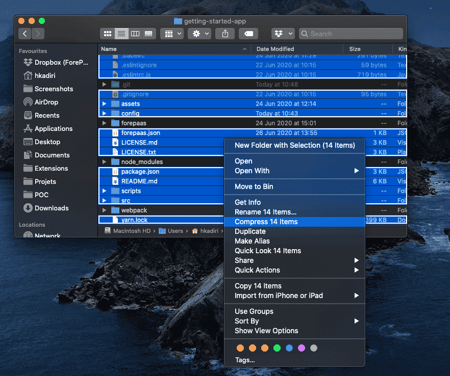

また、ビルド前スクリプトを使用してアプリケーションをzipすることもできます。データプラントにアップロードするためのzipファイルを生成するには、次のコマンドを実行します。

```bash
yarn zip
```

アプリケーションフォルダーと同じ名前のzipファイルが生成されます。

その後、[これらのステップ](/jp/getting-started/app-init/app-manager?id=build-and-deploy-a-front-end-application)に沿ってこのzipファイルを使って新しいアプリケーションを作成するか、既存のアプリケーションを編集し、zipファイルをアップロードしてアプリケーションの新規バージョンを作成することができます。

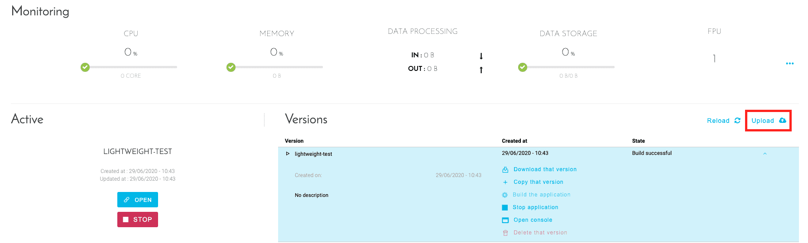

### アプリケーションのGitリポジトリへの接続

ForePaaSプラットフォームにGitリポジトリを接続する場合は、この[ガイド](/jp/product/app-manager/settings/git-integration)の手順に従ってください。

アプリケーションがアップロードされたら、アプリケーションをビルドしてデプロイします。

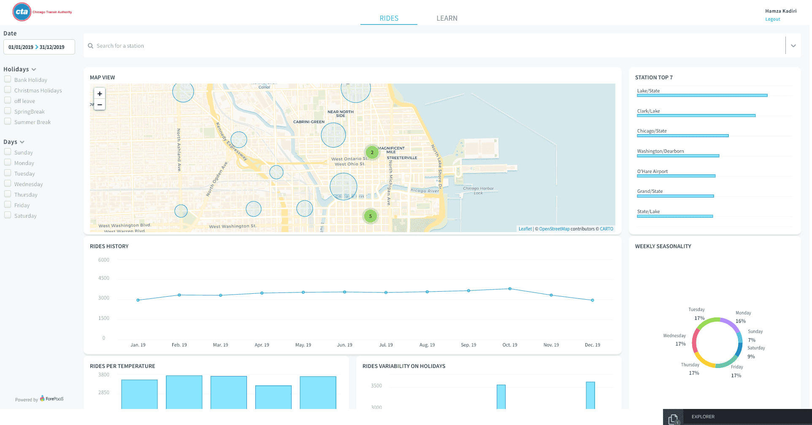

<p><span style="color:black; font-size:20px;"><b> おつかれさまでした！</b></span></p>

作成したアプリケーションがForePaaSにデプロイされました。  

さらに基本的な分析機能があった方がいいかもしれません。次のこのシリーズの最後のガイドでは、Google Analyticsを使用して分析機能を追加する方法について説明します。

?>➡️ [**Web分析ツールのインストール**](jp/getting-further/app-dev/monitor)