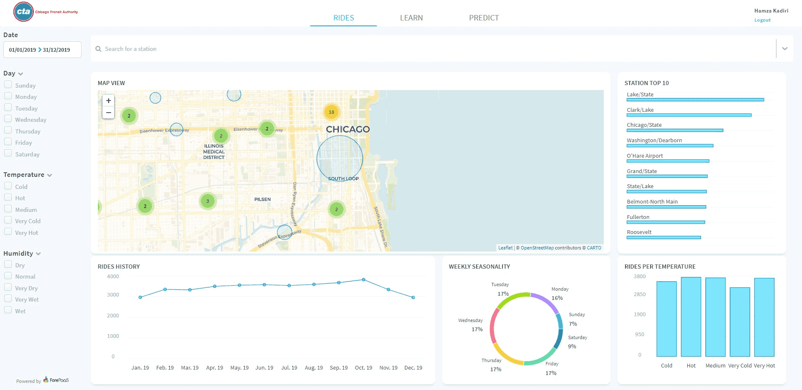

# 独自のアプリケーションの開発

この上級者向けガイドでは、独自のカスタム・アプリケーション・コンポーネント（グラフや動的フィルター）を作成し、これらをカスタマイズして、ForePaaSプラットフォームに組み込む方法などを段階的に学習します。

📥データを各自で用意する必要はありません。最初の[入門編ガイド](#/jp/getting-started/app-init/index)を元に作成したサンプルデータとコードが用意されています。

⛳️この上級者向けガイドには、用意されたAPIリファレンスとボイラープレートを元にカスタムコードを作成するためのすべてのツールが揃っています。

!> これは、開発者、フロントエンドエンジニア、アプリケーションアーキテクトを対象とした上級者向けガイドです。フロントエンド開発の基本的な考え方を理解しておくことをお勧めします。

以下は、**このガイドを最後まで学習することで実現できるアプリケーションのイメージです**。カスタム・マップ・コンポーネントと複雑なフィルターオプションが追加され、すべてのグラフのスタイルが整えられています。

---

## では始めましょう！ 

👉以下のステップに沿って作業を行います。

   
1

   <a class="landing-link" href="/#/jp/getting-further/app-dev/build.md">
      
      

         <h2>作成</h2>
         
外部コードを使用してバージョンの作成、デプロイ、管理を行う方法

      

   </a>

   
2

   <a class="landing-link" href="/#/jp/getting-further/app-dev/config.md">
      
      

         <h2>構成</h2>
         
アプリケーションアーキテクチャと構成ファイルについて

      

   </a>

   
3

   <a class="landing-link" href="/#/jp/getting-further/app-dev/component.md">
      
      

         <h2>カスタマイズ</h2>
         
既存のコンポーネントを使用したグラフのスタイルの作成、編集、カスタマイズ

      

   </a>

   
4

   <a class="landing-link" href="#/jp/getting-further/app-dev/extension.md">
      
      

         <h2>拡張</h2>
         
動的パラメータおよびグラフとしての、カスタムコンポーネント（拡張）の追加

      

   </a>

   
5

   <a class="landing-link" href="#/jp/getting-further/app-dev/monitor.md">
      
      

         <h2>モニタリング</h2>
         
使用状況およびトラフィックをモニタリングするためのデプロイ済みのアプリケーションへのWeb分析のインストール

      

   </a>

