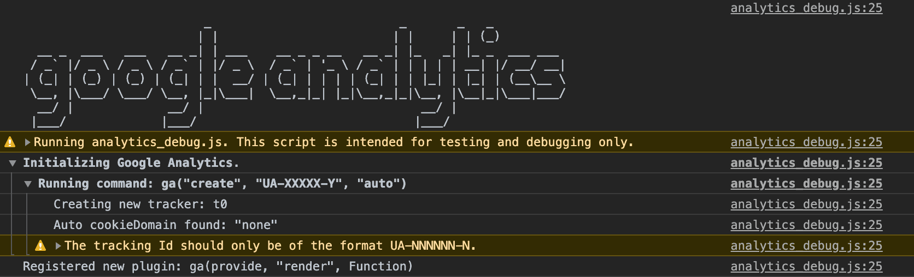
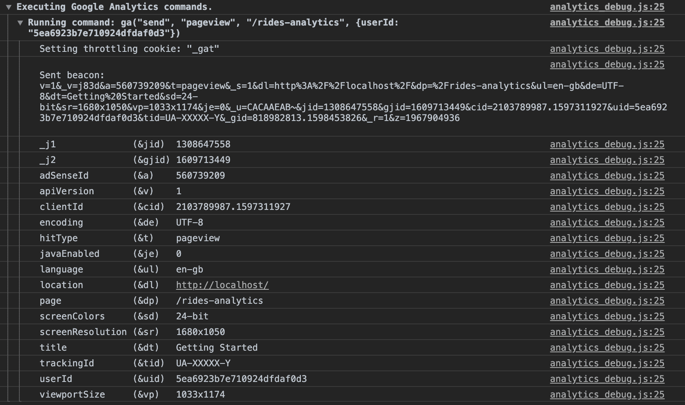
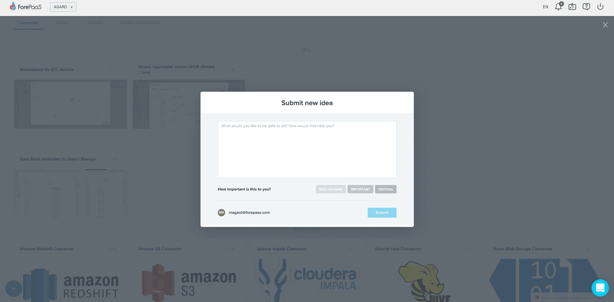

# Web分析ツールのアプリケーションへの追加 

このパートでは、[Google Analytics](https://analytics.google.com/analytics/web/)などのサービスを利用してForePaaSアプリケーションの**トラフィック**の**追跡と分析**を行う方法について説明します。

> このガイドは主にGoogle Analyticsを対象としていますが、以下の説明はほとんどのWeb分析ツールに当てはまります。

* [ForePaaSアプリケーションへのWeb分析タグの追加](jp/getting-further/app-dev/monitor?id=Add-the-web-analytics-tag-to-your-ForePaaS-application)
* [イベント追跡のセットアップ](jp/getting-further/app-dev/monitor?id=setup-event-tracking)
  * [ページビューイベント](jp/getting-further/app-dev/monitor?id=trigger-an-event-when-a-page-is-viewed)
  * [ボタンクリックイベント](jp/getting-further/app-dev/monitor?id=trigger-an-event-when-a-button-is-clicked)


---
## ForePaaSアプリケーションへのWeb分析タグの追加

はじめに、ForePaaSアプリケーションにタグを追加する必要があります。一般に、タグの追加は`index.html`で行います。
ただし、環境変数が必要になる場合もあります（開発用と本番用のアカウントが異なる場合など）。この場合は、`src/helpers`に以下のコードを含む`initAnalytics.jsx`ファイルを作成します。

```jsx
/* eslint-disable */

import FpSdk from 'forepaas/sdk';

export const initAnalytics = () => {
  const environment = FpSdk.config.environment;
  (function (i, s, o, g, r, a, m) {
    i['GoogleAnalyticsObject'] = r;
    (i[r] =
      i[r] ||
      function () {
        (i[r].q = i[r].q || []).push(arguments)
      }),
    (i[r].l = 1 * new Date());
    (a = s.createElement(o)), (m = s.getElementsByTagName(o)[0])
    a.async = 1
    a.src = g
    m.parentNode.insertBefore(a, m)
  })(
    window,
    document,
    'script',
    `https://www.google-analytics.com/analytics${
      environment === 'development' ? '_debug' : ''
    }.js`,
    'ga'
  )

  ga('create', 'UA-XXXXX-Y', 'auto')
};

export default initAnalytics
```

上記のコードから分かるように、ロードされる分析スクリプトは*environment*変数に応じて変わります。この変数は`global.json`で設定できます。

次に、`src/index.jsx`に移動し、次の新しいヘルパー関数をインポートして、アプリケーションの起動時に呼び出します。

```jsx
...
import initAnalytics from 'src/helpers/initAnalytics.jsx'
...
FpSdk.start()
  .then(() => {
    initAnalytics()
    authentication.init()
    templates.init()
    return components.init()
  })
  .then(() => {
    render(<AppTemplate />, document.getElementById('root'))
  })
```

`config/global.json`で、environment変数をdevelopmentに設定してスクリプトが呼び出されるようにします。
```json
{ ...
  "environment": "development",
  ...
}
```

ブラウザのコンソールを開くと、スクリプトanalytics_debug.jsが呼び出されていることを確認できます。



続いて、さまざまなイベントを分析サービスに送信する方法を学習しましょう。

---
## イベント追跡のセットアップ

このセクションでは、このForePaaSアプリケーションでユーザーが行う次の2種類の操作を追跡する方法を学習します。
* ユーザーが新しいページ（ダッシュボード）をロードする**ページビューイベント** 
* **ボタンをクリック**するイベント

### ページが表示されるイベントをトリガー

ページビューイベントを送信するには、ダッシュボードのロード時のデフォルト動作を上書きする必要があります。このためには、**テンプレート**を使用します。

`src/templates`に新しいファイルを作成して、新しいテンプレートファイルを生成します。

このガイドの最初の部分で用意されたボイラープレートを使用した方は、次のように入力してテンプレートファイルを生成します。

```bash
yarn generate
```

それ以外の場合は、`src/templates`に`analytics.jsx`というファイルを作成します。

最初は、この分析テンプレートは次のようになっています。

```jsx
import FpDashboard from 'forepaas/dashboarding/templates/default.jsx'
import FpSdk from 'forepaas/sdk'

class AnalyticsDashboard extends FpDashboard {
}

export default AnalyticsDashboard
```

このダッシュボードを使用できるようにするには、カスタムコンポーネントの場合のように、最初に宣言する必要があります。

`src/templates/index.js`に移動し、次のように、新しいテンプレートをインポートします。

```jsx
import analytics from './analytics.jsx'
```

次に、このテンプレートを「templates」オブジェクトに追加します。

```jsx
templates: {
    ...
    analytics
  },
```


続いて、分析テンプレートに戻り、`componentDidMount`メソッドを上書きして「ページビュー」イベントをWeb分析サービスに送信します。

```jsx
class AnalyticsDashboard extends FpDashboard {
  componentDidMount () {
    super.componentDidMount()
    const clientSession = JSON.parse(localStorage.getItem('client-authority-manager-session'))
    const userId = clientSession['uid']
    window.ga('send', 'pageview', this.props.match.path, { userId })
  }
}
```

最後に、ダッシュボードを新しいテンプレートにバインドするため、次のように、ダッシュボード構成ファイルに**templateキーを追加**します。 

`config/rides-analytics.json`に移動します。

```json
{
  "name": "Rides analytics",
  "width": 100,
  "height": 100,
  "margin": [
    10,
    10
  ],
  "template" : "analytics",
    ...
}
```

デバッグモードなので、userIdやpageがWeb分析サービスに正しく送信されていることを確認できます。




### ボタンがクリックされるイベントをトリガー

このセクションでは、ユーザーがボタンをクリックしたときにWeb分析サービスにイベントを送信する方法を学習します。このためには、`FpButton`を拡張した`AnalyticsButton`という新しいコンポーネントを作成する必要があります。

このためには、[こちら](/jp/getting-further/app-dev/extension?id=generate-a-component)と[こちら](/jp/getting-further/app-dev/extension?id=declare-a-component)の説明に従って、AnalyticsButtonという新しいコンポーネントを作成して宣言します。

`AnalyticsButton`コンポーネントでは、すでに使用しているボタンコンポーネントを拡張します。この例では、ForePaaSアプリケーションでデフォルトで用意されているボタンである`FpButton`を拡張します。

そのため、`AnalyticsButton.jsx`は次のようになります。

```jsx
import FpButton from 'forepaas/core-ui/button'
class AnalyticsButton extends FpButton {
}
export default AnalyticsButton
```

次に、クリックでボタンのビヘイビアをアクティブにします。このためには、次のように、`handleClick`メソッドを追加します。

```jsx
class AnalyticsButton extends FpButton {
    handleClick (e) {
        const clientSession = JSON.parse(localStorage.getItem('client-authority-manager-session'))
        const userId = clientSession['uid']
        ga('send', 'event', 'Button', 'Click', { userId })
        super.handleClick(e)
    }
}
```

最後に、この新しいコンポーネントを実際に使用するには、ダッシュボード構成ファイルに移動し、必要に応じて、`button`を`analytics-button`に置き換えます。

おつかれさまでした。分析を行うために既存のコンポーネントとテンプレートを上書きする方法について学習しました。

---
<p><span style="color:red; font-size:20px;"><b>おつかれさまでした！🎉🎊</b></span></p>

**アプリケーション開発に関する発展編ガイドは終了です。**これで、カスタマイズしたコンポーネントを使って望みどおりのダッシュボードを作成できるようになりました。


### ForePaaSを改善するためのご意見💡

> ご意見をお寄せください。[「Roadmap（ロードマップ）」タブ](https://hq.forepaas.io/#/features)で**計画されている機能について賛成票を投じたり**、**各自の要望やアイデア**を送信したりすることができます。



?> ➡️ [ロードマップで意見を述べる](https://hq.forepaas.io/#/features) 🚀