# 最初のアプリケーションの高度なカスタマイズ

このチュートリアルでは、シンプルなアプリケーションの**画面表示をカスタマイズ**するためのApp Managerの高度な機能について説明します。 

?> このチュートリアルの内容は、*入門編*の[フロントエンドアプリケーションのビルドとデプロイ](/jp/getting-started/app-init/app-manager)セクションの続きです。

---
## 前提条件
このチュートリアルは、[入門編チュートリアル](/jp/getting-started/app-init/index)の**5つのセクションをすべて**完了していることが前提になっています。Data Processing Engine、Data Manager、Query Builderがそれぞれのページの説明に従って構成され、カスタマイズを行うアプリケーションと合わせてAPIのデプロイが完了している必要があります。


このチュートリアルでは、次のステップについて説明します。

- [より高度なグラフの作成](/jp/getting-further/app-manager/index?id=create-a-more-advanced-chart)
- [高度なカスタマイズ](/jp/getting-further/app-manager/index?id=customizing-further)
    - [単位](/jp/getting-further/app-manager/index?id=units)
    - [ラベル](/jp/getting-further/app-manager/index?id=labels)
- [アプリケーションの新規バージョンのリビルドとデプロイ](/jp/getting-further/app-manager/index?id=rebuild-and-deploy-the-new-version-of-your-app)

---
## より高度なグラフの作成

最初に、別のグラフの種類である横棒グラフを使用し、合計乗客数に関する上位7駅を表示します。

Query Builderですでに作成済みのクエリを選択する代わりに、グラフを作成する際に**オンザフライで新しいクエリを作成**することもできます。このためには、最初のパネルを縮小し、その横に2つ目のパネルを**作成**します。

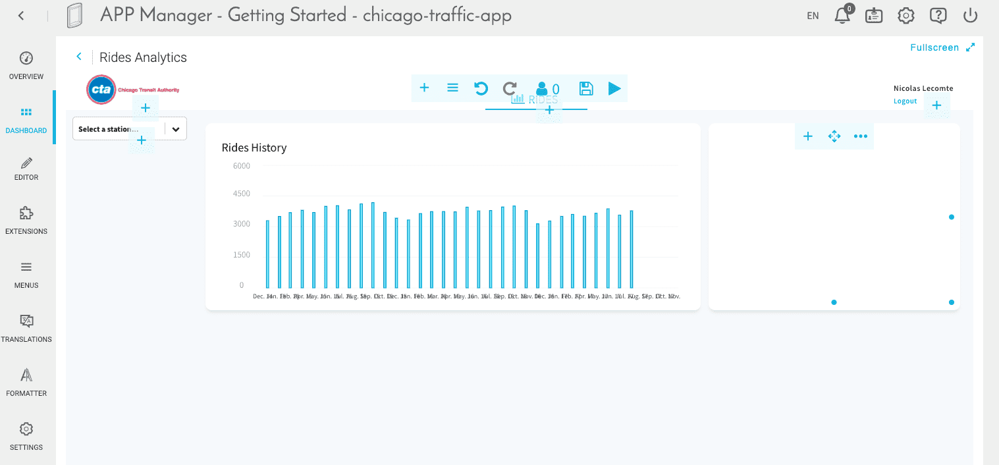

2つ目のパネル内で➕アイコンをクリックし、「**HTML**」を選択します。名前を*Top 7 Stations*と付け、**H1**スタイルを適用します。

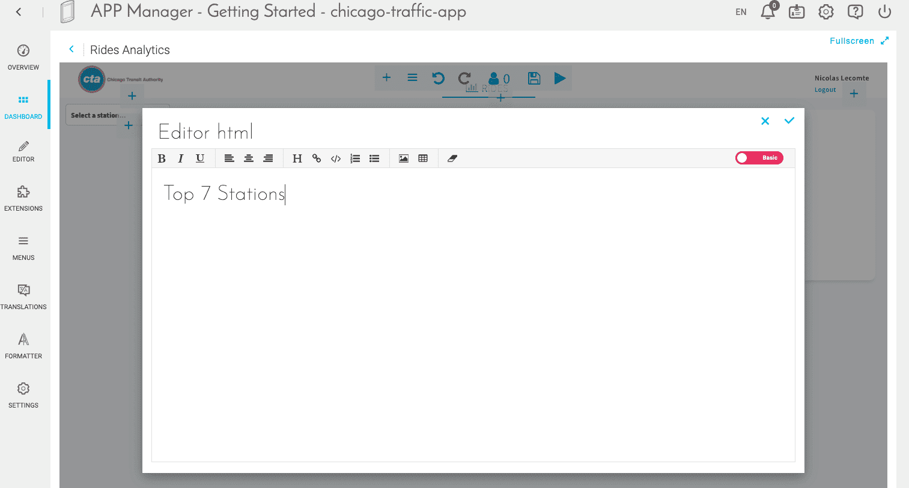

2つ目のパネル内で➕アイコンをクリックし、「Chart（グラフ）」を選択します。「*Recharts - Bar Horizontal（Recharts - 横棒グラフ）*」タイプを選択します。

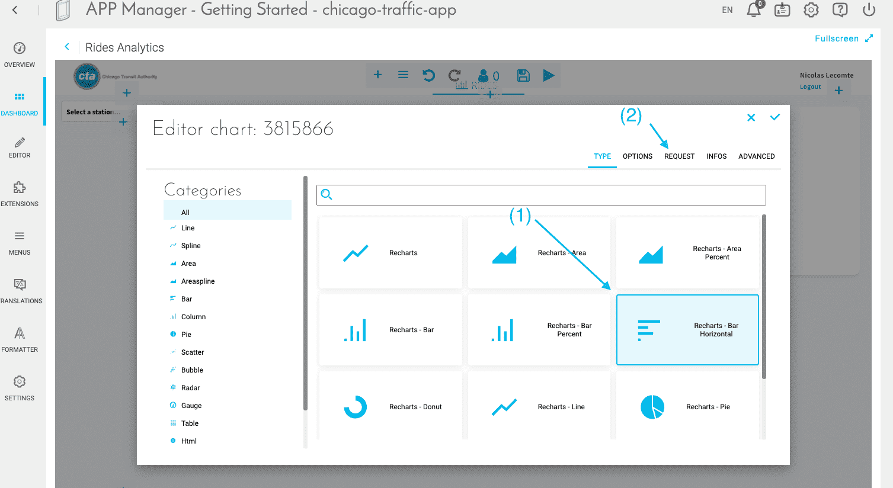

「Request（要求）」タブで、「_Request（要求）_」モードを選択し、「Data（データ）」として「*rides*」を入力し（合計、降順）、「Scale（スケール）」として「*station_id*」を入力します。

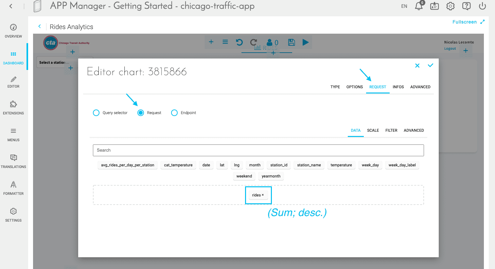
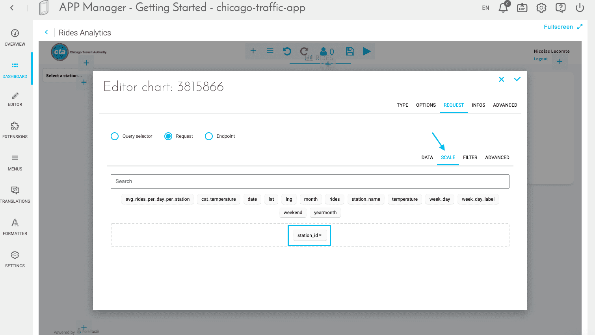

最後のステップでは、高度なJSONエディターを使用してクエリを詳細にカスタマイズします。具体的には、カスタムパラメータを追加して駅の**数を7つに制限**する必要があります。これを行うには、下に示すように、クエリの「Advanced（詳細）」モードに移動して、行2の下の"data" JSONオブジェクト内に`"limit":7,`を追加します。

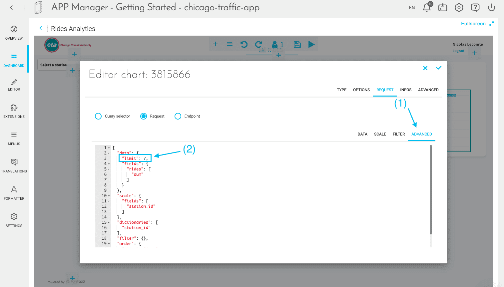

この時点でダッシュボードは次のようになっているはずです。忘れずに**保存**💾を行ってください。

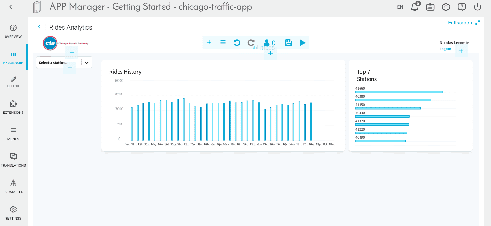

---
## 高度なカスタマイズ

App Managerではさまざまな機能を利用して、アプリケーションを望みどおりにデザインできます。

### 単位

ダッシュボードの上部にある**再生**アイコンをクリックして、読み取り専用モードに切り替えます。*Top 7 Stations*のグラフの棒の上にマウスカーソルを合わせます。 

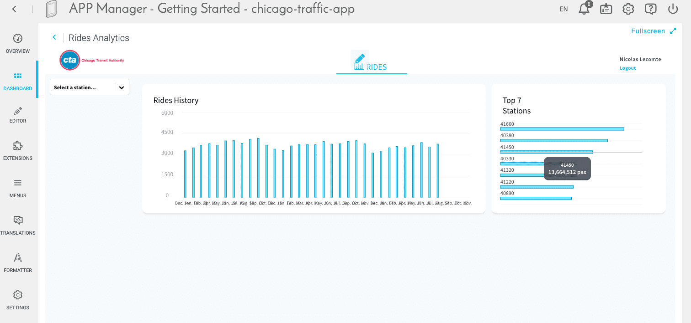

分かりやすくするため、これらの単位を百万単位に書式設定することができます。これを行うには、「**Formatter（フォーマッタ）**」タブに移動します。Getting Startedテンプレートを選択すれば、「*RIDES*」というメジャーがすでに追加されています。

> 一般的に、新しいメジャーを追加する必要がある場合は、書式設定を行おうとしている**属性と同じ名前**にする必要があります。

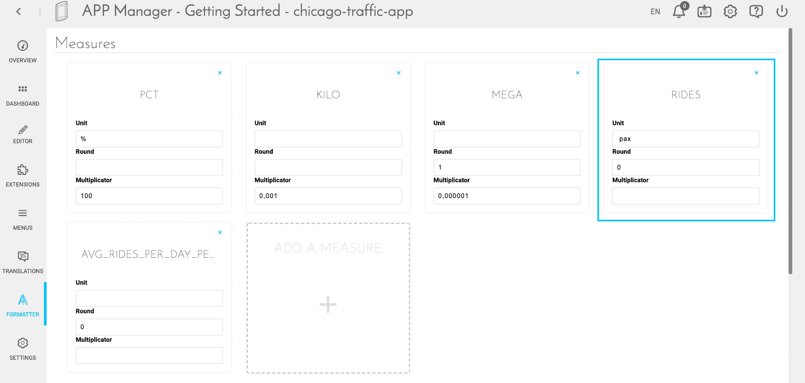

書式設定パラメータとして、「Unit（単位）」に*Mpax*、「Round（概数）」に*0*（整数を表示）、「Multiplicator（乗数）」に*0.000001*（百万単位で表示）を指定します。

> 「Formatter（フォーマッタ）」は自動保存モードになっているため、保存について心配する必要はありません。

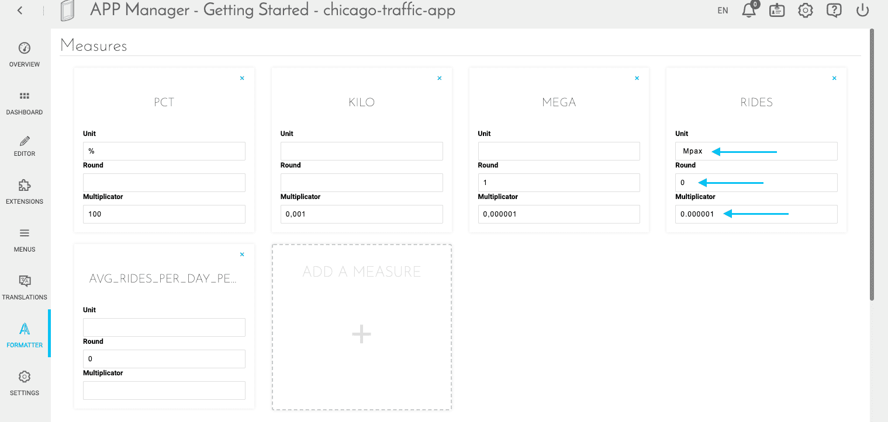

結果は次のようになります。

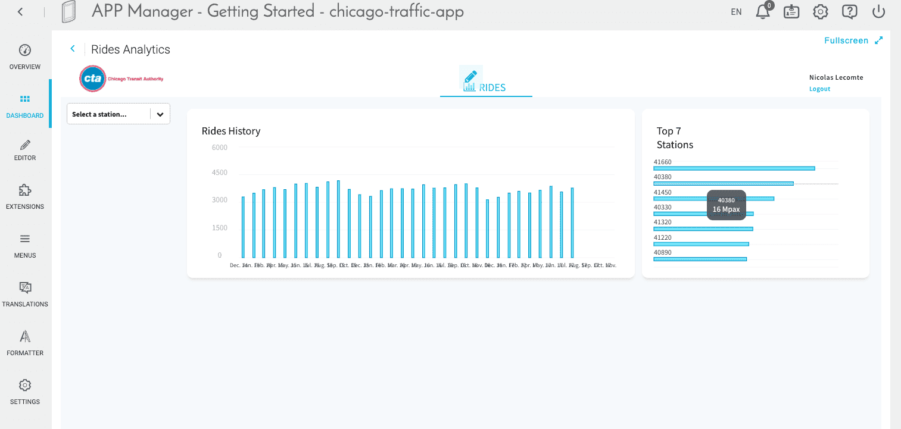


### ラベル

*Top 7 Stations*の横棒グラフに、駅名ではなく駅のIDが表示されていることにお気付きでしょうか。特定の値にラベルを割り当てるには、*station_id*属性の**ディクショナリ**を変更する必要があります。*stations_rides*テーブルでは*date*と*station_id*の2つが主キーになっているため、一意の主キー*station_id*に対応する名前を含む別のテーブルが必要になります。[ここから](https://www.dropbox.com/s/90mbniz1gfm9q8n/chicago_stations_dictionary.csv.zip?dl=1)このテーブルをダウンロードし、Data Managerにインポートします。 

「Organize（体系化）」タブで、この新しいテーブルを「Prim」セクションにドラッグし、*station_id*を主キーとして設定して、新しいテーブルをテーブル*stations_rides*にリンクします。

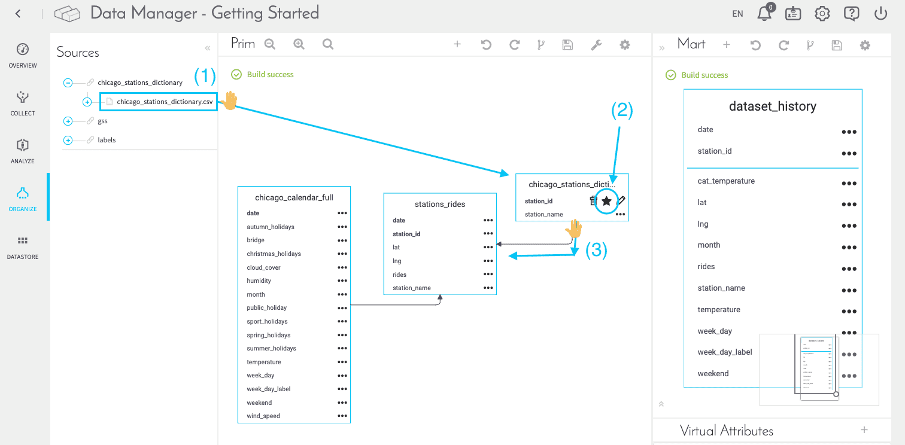

この新しいテーブルを編集します。

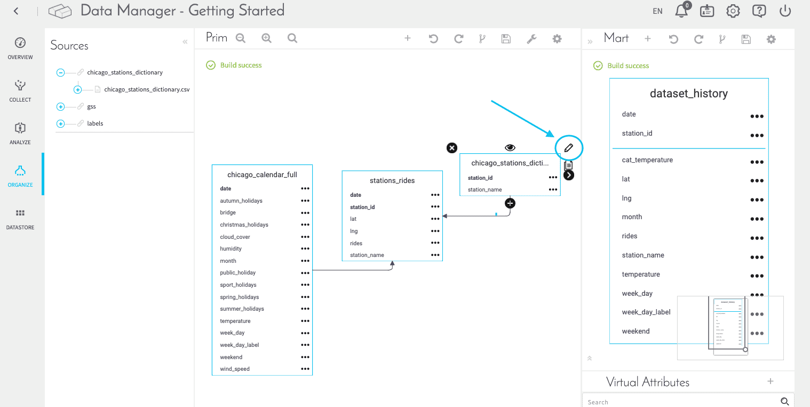

このテーブルが*station_id*のディクショナリを表すように指定するには、「**Object's label（オブジェクトのラベル）**」で「*station_name*」を選択します。こうすることで、主キーによって識別されたテーブルの各行（この場合は*station_id*）が、ダッシュボード内で、先ほど定義したラベル（属性*station_name*）を使って表されるようになります。  

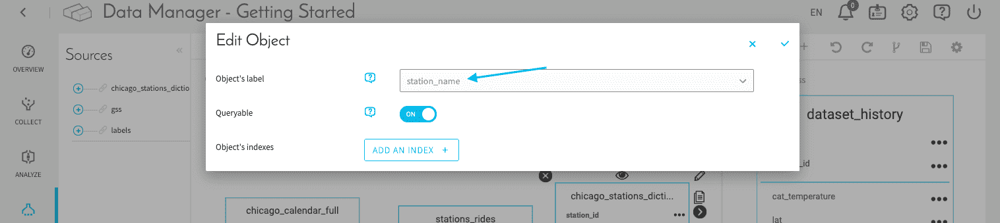

最終的なダッシュボードにこれらの変更内容を反映するには、セットアップ済みのデータパイプラインでこれらを「伝達」する必要があります。**チュートリアルを進める前に、次の操作を行います。**

- 🔧アイコンをクリックして、*chicago_stations_dictionary*のDPEアクションを作成します。 
- Primのスキーマの変更内容をアップデートしてビルドするには、⚙️（ビルド）をクリックします。
- 新しく作成されたアクションをData Processing Engineで実行します。
- Query Builderで、「Query Builder activity」の横にある、「Overview（概要）」画面の「**Flush cache（キャッシュのフラッシュ）**」をクリックします。
- APIの概要画面で、「**Refresh cache（キャッシュの更新）**」をクリックします。

Query Builderに移動し、「Dataset（データセット）」に移動して「Dictionaries（ディクショナリ）」タブを選択し、ディクショナリが適切に作成されていることを確認します。次のようになっているか、*station_id*ディクショナリを確認します。

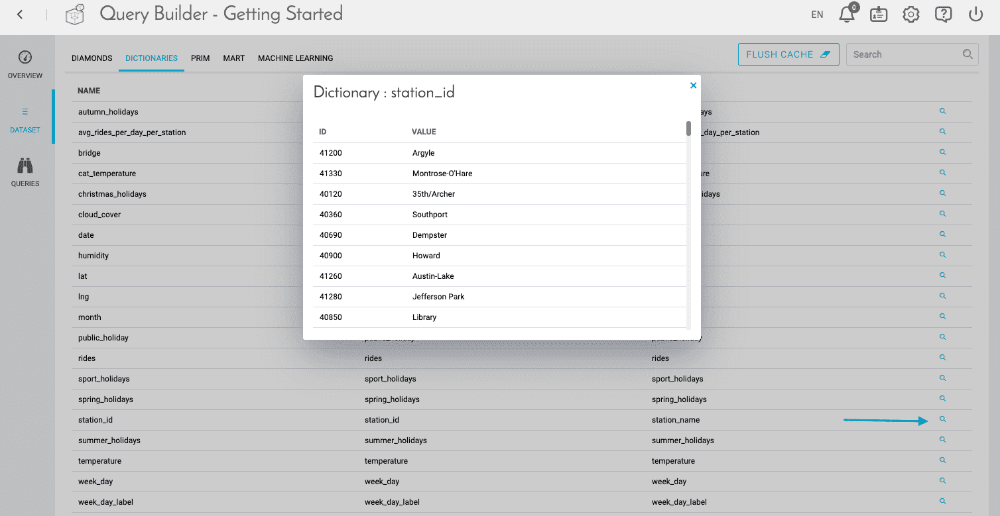

App Managerのダッシュボードに戻り、最後のステップで、作成したグラフがこのクエリで適切なディクショナリの*station_id*の値を参照するようにする必要があります。このためには、「Advanced（詳細）モード」にする必要がありますが、これについては先ほど説明したとおりです。  

*Top 7 Stations*のグラフを編集します。「**Request（要求）**」タブを開き、その下の「**Advanced（詳細）**」をクリックします。行14の直後に次のコードを追加します。 

```
"dictionaries": [
    "station_id"
  ],
```


!> ダッシュボードで作業を行うステップでは、ダッシュボードエディターの上部にある💾アイコンを使用して変更内容を保存するようにしてください。

最終的なアプリケーションは、次のようになります。

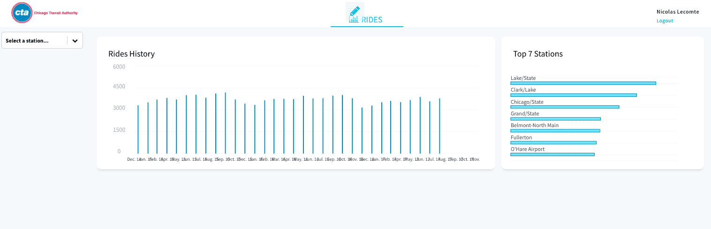

---
## アプリケーションの新規バージョンのリビルドとデプロイ

もう少しで完了です。最後のステップでは、運用環境のダッシュボードに最新の変更内容を公開しましょう。このためには、必ず保存💾を行ってから、Application Managerの「**Overview（概要）**」タブに戻ります。最初に、現在デプロイされているアプリケーションを**Stop（停止）**します。アプリケーションが停止したらすぐに、「**Build（ビルド）**」をクリックしてから「**Deploy（デプロイ）**」をクリックします。

> 通常、**ビルド**プロセスには数分かかります。どのような処理が行われているのかに興味がある場合や、ビルドに失敗した場合は、バージョンパネルを展開してログコンソールを開き、ログを調べます。トラブルシューティングの方法がよく分からない場合は、弊社のサポートチーム💁💁‍♂️まで遠慮なくログを送付してください。

これでアプリケーションが**稼働**し、オンラインでアクセスできるようになりました。  
リンクを取得するには、「Overview（概要）」タブで「**Open（開く）**」をクリックします。

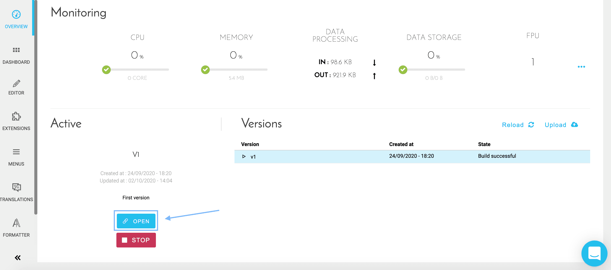


ゆっくりとリラックスして数字を確認してください☕。

---

<p><span style="color:red; font-size:20px;"><b>おつかれさまでした！🎉🎊</b></span></p>

**これで、発展的なアプリケーション作成のチュートリアルは完了です**。いつでもForePaaSプラットフォーム上で複雑なデータアプリケーションを作成することができます。

> [こちらの簡単なアンケート](https://forms.office.com/Pages/ResponsePage.aspx?id=nDWzgpGTfE2g8oFnUal2QQ9d-P8xWc5AgNsykYKKK71UOVpZT1RUMFBRUk5BWjNLSzBCNVhDSVgyNSQlQCN0PWcu)（所要時間は約3分⌛）にご記入をお願いします。いただいたご意見を参考に良かった点や改善点を確認し🧐、チュートリアルのさらなる改善を図っていきます。


ご存知のように、このチュートリアルはいつでもご利用いただけます。必要に応じて他のドキュメントを参照し、製品の個別のコンポーネントの詳細を確認するようにしてください。

また、何かあった際には遠慮なく**ご連絡ください**。弊社のサポートチームと製品チームは、寄せられたAIアプリケーションのアイデアを迅速に実現できるように全力で支援を行います。

{ロードマップで意見を述べる🚀}(https://hq.forepaas.io/#/features)
{サポートに質問を送る🤔}(https://support.forepaas.com/hc/en-us/requests)

---

コードについての理解を深め、アプリケーションを望みどおりにカスタマイズする方法を学びたい方には、次のチュートリアルが役立ちます。

{アプリケーションをさらに高度にカスタマイズする📊}(#/jp/getting-further/app-dev/index)
