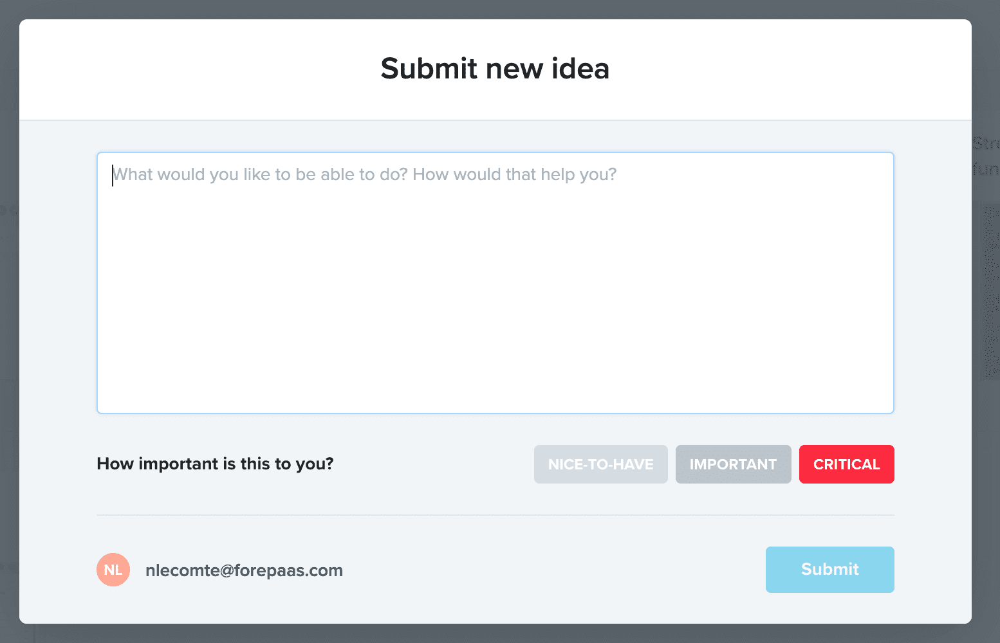
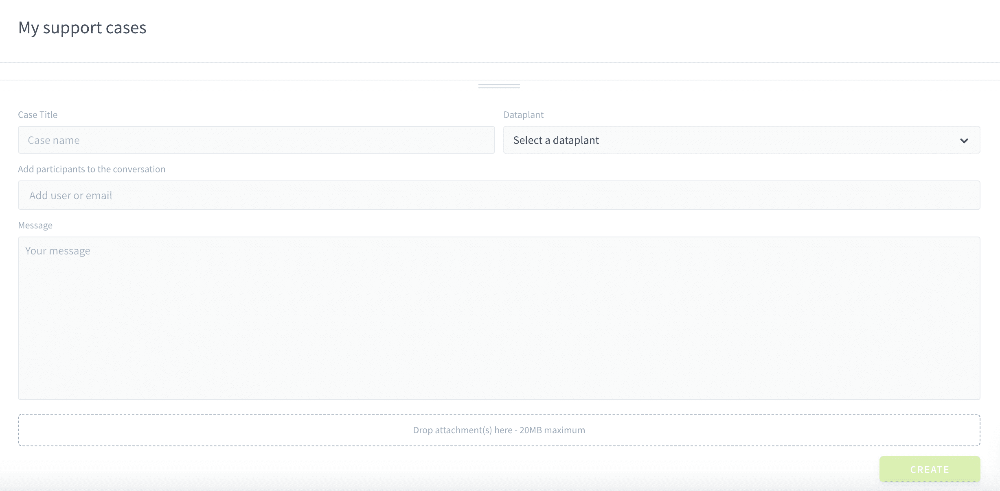

# 発展編：ForePaaSの各種機能

発展編チュートリアルへようこそ👋。プロジェクト開発に対するあなたの向上心は大歓迎です。  

**発展編**ガイドシリーズを利用すると、ForePaaSの高度な機能について理解し、ForePaaSの機能をフルに活用できるようになります。実践的な事例を通じて、**望みどおりのAIシステムを作成する方法を学ぶ**ことができます。  

それぞれの役割によって必要な機能は異なります。[入門編](/jp/getting-started/index.md)ガイドでご紹介したのはForePaaSでできることのごく一部にすぎません。ForePaaSプラットフォームでは、他にもさまざまなことが実現可能です。

|      | 役割   | 必要な機能  | 
| :--: | ------------ | -------------------| 
| | **プロジェクトマネージャー** | [プロジェクトツールキット](jp/getting-further/project-toolkit)を使用してプロジェクトを始動させること。  |
| | **フロントエンド開発者** | アプリケーションを高度に[カスタマイズする](jp/getting-further/app-dev/index.md)こと。 | 
| | **データサイエンティスト** | [堅牢な機械学習モデル](jp/getting-further/ml/index.md)を設計してデプロイすること。 | 
| | **データエンジニア** | [セグメント化機能](/jp/getting-further/segmentation/index)を利用してデータパイプラインを最大限に活用すること。 | 

  
?> **ご検討中の方へ🧐**  
ForePaaSのすべての先進的機能を確認したいとお考えの方には、発展編ガイドの内容を順を追って確認していただくことをお勧めします👣。

---
## 発展編チュートリアル

**発展編**シリーズのチュートリアルでは、ForePaaSプラットフォームのさまざまな側面に関する発展的な例やユースケースについて説明します。これらのチュートリアルでは、利便性を高めるため、コードスニペットやボイラープレートが示されています。ただし、ForePaaSプラットフォームの各オプションについては各自で確認することをお勧めします。また、ForePaaSプラットフォームの各コンポーネントの詳しい説明が必要なときには、[製品ガイド](/jp/product/index)を随時参照してください。

この時点で、シカゴの交通データのデータソースを元に視覚化するシステム全体のセットアップを完了しているはずです。まだの方は、[入門編](/jp/getting-started/index.md)ガイドを参照して最初のアプリケーションをセットアップすることをお勧めします。このアプリケーションは、これからご説明する発展的な事例の基盤となります。  

準備ができたら、**以下のチュートリアルに取り組んでください**。

### ダッシュボードの高度なカスタマイズ

🕒 *推定所要時間：1時間*

[入門編](/jp/getting-started/app-init/index)ガイドの延長として、アプリケーションの画面表示をカスタマイズする方法について学びます。

{アプリケーションの高度なカスタマイズ📊}(/#/jp/getting-further/app-manager/index.md)

### 独自の分析アプリケーションの開発

🕒 *推定所要時間：2～4時間*

この上級者向けガイドでは、アプリケーションに合わせて、独自のコンポーネントを作成し、グラフや拡張などをセットアップする方法を段階的に学習します。

{独自のアプリケーションの開発🖥}(/#/jp/getting-further/app-dev/index.md)

### 機械学習モデルを使用したリアルタイム予測

🕒 *推定所要時間：1～2時間*

この実践的なチュートリアルでは、Data Processing Engineと機械学習コンポーネントを最大限に活用してリアルタイム予測モデルを作成する方法を学習します。リアルタイムAPI天候データを収集し、本番環境にシカゴの将来の交通量を予測してアプリケーションに分析情報を表示するためのパイプラインをセットアップします。 

{予測のデプロイと視覚化🤖}(#/jp/getting-further/ml/index.md)

### セグメント化を利用した処理能力の最適化

🕒 *推定所要時間：1時間*

この簡潔なガイドでは、わずかな時間でDPEのジョブを実行できるようにするための、ジョブのセグメント化機能について説明します。 

{セグメント化を利用したパイプラインの高速化🏎}(/#/jp/getting-further/segmentation/dwh-attributes.md)

---

## ご意見をお寄せください！🗣️

ForePaaSプラットフォームをご利用いただきありがとうございます。弊社のサポートチームと製品チームは、皆さまにサービスを円滑にご利用いただけるよう全力で取り組んでいます。このためには、**皆さまに気兼ねなくご連絡いただき**、**皆さまの正直な声を聞かせていただく**ことが必要です。うまく機能している部分とそうでない部分を把握することで、サービスの改善に役立てていくことができます。

以下の2つのチャネルからご意見をお寄せください。

### アイデアをお持ちの場合💡

> [「Roadmap（ロードマップ）」タブ](https://hq.forepaas.io/#/features)で**計画されている機能について賛成票を投じたり**、**各自の要望やアイデア**を送信したりすることができます。

{ロードマップで意見を述べる🚀}(https://hq.forepaas.io/#/features)

###  サポートが必要な場合🆘

> サポートの依頼が必要な場合は、いつでもプラットフォームの「*Support（サポート）*」タブから直接依頼を送信することができます。また、support@forepaas.com宛にメールを送付することもできます。

{サポートに質問を送付する🤔}(https://support.forepaas.com/hc/en-us/requests)