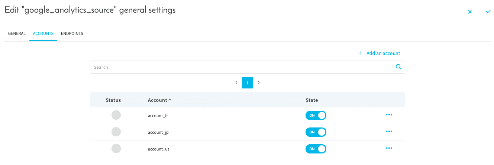
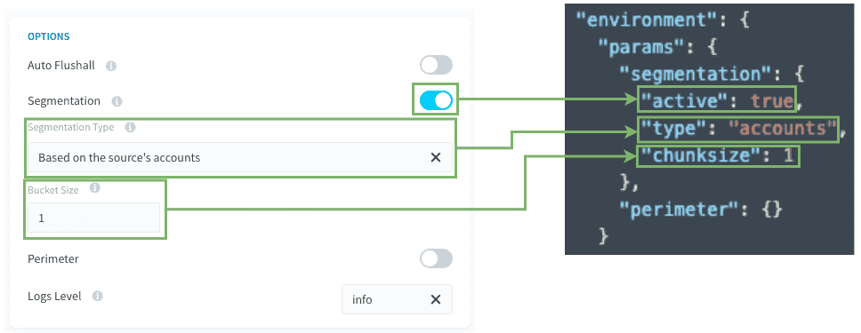
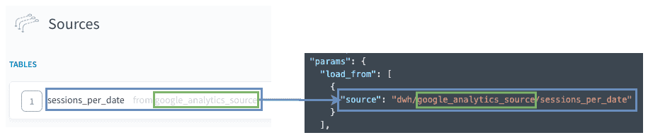
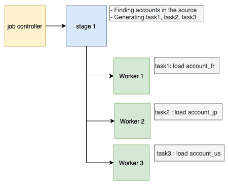

# ソースアカウントによるセグメント化

## ユースケース

ユーザーアカウント固有のソーシャルネットワークなどのソースの場合、Data Managerコンポーネント内で同じソースに対して複数のアカウントを設定できます。この場合、これらのアカウントを利用して、このソースを利用するDPEアクションを複数のタスクに分割し、各タスクで1つまたは複数のアカウントのデータを取得できます。

### 前提条件

- Data Managerでソースに対して、以下のように複数のアカウントが設定されている必要があります。



---
## 互換性
このセグメント化オプションは、以下のアクションとソースにのみ対応しています。

| アクションタイプ | ソースタイプ |
|          ---        |          ---          | 
| <ul><li>Load</li><li>Custom</li></ul> | <ul><li>**API**：Facebook、Twitter、Google Analytics、YouTube Private、YouTube Public、LinkedIn</li></ul> |

---
## 詳細パラメータについて 

このセグメント化オプションを設定するには、「Segmentation Type（セグメント化のタイプ）」ドロップダウンで「*Based on the source's accounts（ソースアカウントに基づく）*」を選択します。

 

**Bucket Size（バケットサイズ）/chunksize**：各タスクで処理するアカウントの数を設定（デフォルト=1）します。


### ロードアクション 
ロードアクションのソースがセグメント化のベースになります。
  

### カスタムアクション 
キーparams.load_from[0].sourceが
ソースのアドレス：
"dwh/SOURCE_NAME/ENDPOINT_NAME"を示していることを確認します
_（詳細JSONモードについては、前のスクリーンショットを確認してください）_。


---
## 処理の流れ

アクションのセグメント化が**ソースアカウントに基づいて**行われる場合、アクション（ワークフロー内のアクション）の実行時に、以下が実行されます。

1. ジョブコントローラーがアクションを複数のタスクに分割し、各タスクにソース内で設定されたアカウントの中の異なるアカウント（またはアカウントのセット、`chunksize`の設定による）が割り当てられます。
1. その後、各**ワーカー**が**タスクを1つずつ**実行します。  
このため、タスクが何百個あっても問題はなく、アクションはワーカーの数に対して並列処理されます。  



---
## ヒント

### 1つのアカウントセットのみからロードします。

以下に示すように、"values"キーを追加して、ロードするアカウントのリストをハードコードできます。
これは、すべてのアカウントセットのすべてのデータを取得することなく、新しく作成されたアカウントの履歴を取得する必要がある場合に便利です。

この場合の構成は、次のようになります。 
```json
 "environment": {
    "params": {
      "segmentation": {
        "active": true,
        "type": "accounts",
        "values": ["account_jp","account_fr"]
        "chunksize": 1
      }
    }
  }
```

"values"の値はソースで設定されている**アカウントのキー**に対応している必要があります。最初のユースケースの画面を参照してください（この例では、account_fr、account_jp、account_us）。

"values"が存在しない場合、このジョブはソースで設定された有効なすべてのアカウントのデータを取得します。
