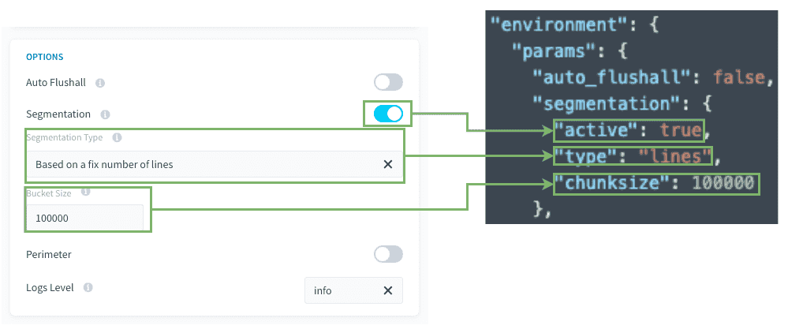
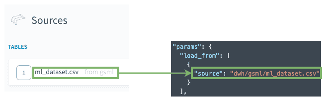
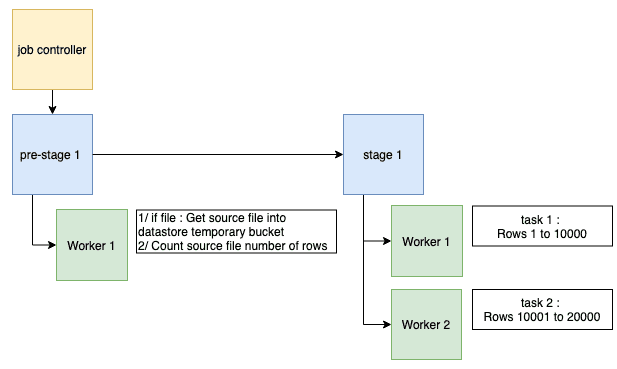

# ソース行のチャンク化によるセグメント化

## ユースケース

CSVファイルが取り込むのに大きすぎる場合があります。この場合には、行数でセグメント化を行うことで全体のロード速度を改善することができます。 

使用例： 
- 取り込むのに大きすぎるCSVファイルがあり、複数のワーカー用にファイルをチャンクに分割

---
## 互換性

| アクションタイプ | ソースタイプ |
|          ---        |          ---          |
| <ul><li>Load</li><li>Custom</li></ul> | <ul>**ファイル形式**：CSV</ul><ul>**データベース**：MySQL、PostgreSQL、SQLServer、Impala、Hive、BiqQuery、ElasticSearch、Cassandra、Redshift、Oracle、SQLServer</ul> |

---
## 詳細パラメータについて 

以下は表示モードと詳細JSONモードの対応関係を簡単に示したものです。

  

**Bucket Size（バケットサイズ）/chunksize**：各タスクで取り込む行数を設定します。
 

### ロードアクション
指定されたソースがセグメント化のベースになります。
  

### カスタムアクション 
キーparams.load_from[0].sourceが
ソースのアドレス：
"dwh/SOURCE_NAME/FILE_NAMEまたはTABLE_NAME"を示していることを確認します
_（詳細JSONモードについては、前のスクリーンショットを確認してください）_。

---
## 処理の流れ

アクションのセグメント化が**固定された行数に基づいて**行われる場合、
アクション（ワークフロー内のアクション）の実行時に、以下が実行されます。
1. CSV形式のソースファイルを取得する事前ステージで、行数をカウントしてデータストアの一時的なバケットに配置します。
2. ジョブコントローラーがアクションを複数のタスクに分割し、各タスクに異なる行のチャンクが取り込み対象として割り当てられます。
1. その後、各**ワーカー**が**タスクを1つずつ**実行します。  

---
## 確認事項

このセグメント化のタイプを使用する前に、以下のポイントを**必ず確認してください**。 

### 1. 同じステージで生成されるタスク数が大きくなりすぎないようにします。 

DPEが適切に機能するようにするため、ステージのタスク数が500を超えないようにすることをお勧めします。
これはハードリミットではありませんが、500を超えてタスク数を増やすとパフォーマンスの低下が起きる可能性があります。
タスクの数を少なくするには、バケットサイズの設定を大きくして、個々のタスクで処理する行の数を増やします（これにより、タスクの数が少なくなります）。

タスクごとにソースのCSVファイルがデータストアの一時的なバケットから各ワーカーにアップロードされることに注意してください。そのため、CSVファイルが大きい場合は、タスクの数を少なくすることをお勧めします。
**タスクの数は、ジョブが持つワーカーの数にするのが理想的です。**

### 2. 宛先データベースに十分なCPUが存在しますか。 
 
* DBMSの`insert`操作はCPU負荷が高いことに注意してください。
* 例えば、データベースのCPUが1つだけの場合に、DBMSインスタンスに対して6つのワーカーを使用してinsert操作を同時に行うことはお勧めできません。

> 一般原則：並行して実行されるワーカー1つにつきCPUを1つ用意することをお勧めします。 

