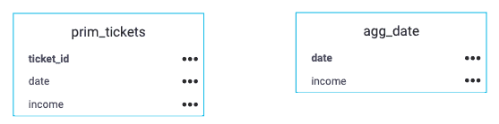
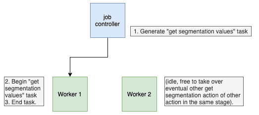
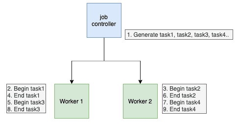
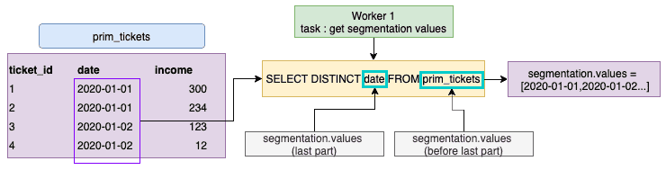
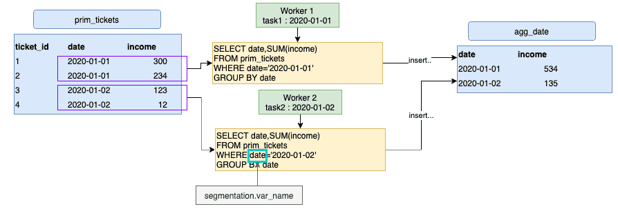

# 「データプラントのテーブル属性に基づく」セグメント化

大量のデータを処理する際には、複数のワーカーでワークロードを分散処理できます。  
最もよく利用されるセグメント化のタイプは、`dwh_attribute`というものです。

アクションが複数のタスクに分割され、各タスクでデータプラントの特定のテーブルの選択した属性を元に取得した小さな値のセットが処理されます。 

!> セグメント化の使用には注意が必要です。  
セグメント化のパラメータによってアクションを大幅に高速化できることもあれば、まったくの逆効果になることもあります。  
セグメント化の属性を適切に選択しないと、最終的なデータ出力が間違ったものになる可能性もあります。  
**そのため、以下の内容をよく確認するようにしてください。**


---
## ユースケースの概要

以下の`prim_ticket`テーブルに対して`aggregate`アクションを使用し、日付（`date`）ごとのすべてのチケット収入を集計し、テーブルagg_dateに結果を挿入します。
  

このアクションの実行時間を最適化するため、日付の値に基づいてワークロードを複数のタスクに分割します。


---
## 詳細パラメータについて

はじめに、「*Preferences（基本設定）*」タブと*「Advanced（詳細）」モード*のJSONフィールドの対応関係は以下のようになっています。  
分かりやすくするため、以下では**JSONのテクニカル名**を使用します。


> 青色の四角形は分かりやすくするためにUIで使用されているものです。ここでは、DPEで使用される緑色のパラメータを中心に説明します。

**Source Attribute（ソース属性）/var_name**：ソースのフィルタリングに使用されるSQL属性です。

**Reference Attribute（参照属性）/values**：値のセットの取得元のアドレスです。
取得元がPrimまたはMartテーブルの場合は**"dwh/TABLE_NAME/ATTRIBUTE_NAME"**、
取得元がソースの場合は**"dwh/SOURCE_NAME/TABLE_NAME/ATTRIBUTE_NAME"**の書式を使用します。

**Bucket Size（バケットサイズ）/chunksize**：タスクごとにフィルター処理される値の数です。

---
## 処理の流れ

アクションのセグメント化が**データプラントのテーブル属性に基づいて**行われる場合、
アクション（ワークフロー内のアクション）の実行時に、以下が実行されます。
1. 事前ステージで、`segmentation.values`フィールドの`table/attribute`からすべての個別の値が取得されます。
  
1. ジョブコントローラーがアクションを複数のタスクに分割し、各タスクにステップ1で取得した値の中の異なる値（または値のセット、`chunksize`の設定による）が割り当てられます。
1. その後、各**ワーカー**が**タスクを1つずつ**実行します。  
このため、タスクが何百個あっても問題はなく、アクションはワーカーの数に対して並列処理されます。  


---
## 技術的な説明

セグメント化の構成の各パートがどのように使用されているかを、細かく見ていきましょう。
以下のセグメント化の構成について考えます。

```json
{
    "segmentation": {
        "active": true,
        "type": "dwh_attributes",
        "values": "dwh/data_prim/prim_tickets/date",
        "var_name": "date",
        "chunksize": 1
    }
}
```

1. 事前ステージのタスクで、`prim_ticket`から個別の`date`値がすべて取得され、`segmentation.values`のアドレスが実際の値に置き換えられます。  
`segmentation.values`のアドレスがどのように構成されるかに注意してください。  
このアドレスは、アクションで選択された実際の`ソーステーブル`と異なる場合があります。

2. ジョブコントローラーは、`segmentation.values`の長さと`chunksize`（各タスクで処理する値の数）に基づいてタスクを作成します。
3. 各ワーカーはタスクを1つずつ処理します。これは集計アクションでの例です。
ここで留意したいのは、`segmentation.var_name`が抽出クエリのWHERE句でフィルター処理を行う属性として使用されていることです。そのため、`segmentation.values`内で使用されるものと異なる場合があります。



---
## 適切なセグメント化属性の選択

> データパイプラインを適切に素早く機能させるには、セグメント化用の属性を適切に選択することが重要です。

適切なセグメント化属性の特性は、次のとおりです。 

### 1. カーディナリティ 
属性のカーディナリティが、ソーステーブルの行数に対して大きくなりすぎないようにします。 
> Query Builderで次のような簡単なクエリを使用すれば、カーディナリティを確認できます。
```json
{
  "table_name": "prim_ticket",
  "data": {
    "fields": {
      "date": ["count_distinct"],
      "another_candidate": ["count_distinct"],
      "maybe_this_one": ["count_distinct"]
    }
  }
}
```

### 2. 行数の分布 
各値の行数の分布がほぼ均等になっているのが理想的です。

### 3. 値が長いテキストではないこと 
値が長いテキストの場合、ジョブコントローラーが過負荷になることがあります。

### 4. `aggregate`、`diff`、`delete_diff`アクションの場合

!> セグメント化の属性は、**宛先テーブル**の**主キー**に含まれている必要があります。  
そうでない場合、それぞれのグループのデータが不完全なものになります。

例えば、日付（`date`）ごとに集計を行いながら`ticket_id`でセグメント化を行う場合、タスク1でチケット1の収入が挿入された後、タスク2で同じ日付に発生したチケット2の収入が更新されます。

### 5. セグメント化に適した属性に関するヒント

* 多くの場合、データの日付を表す属性はセグメント化に適しています。
  * この属性は主に集計テーブルの主キーに存在
  * カーディナリティが低～中程度
  * 行数の分布を適切に維持
* メインの参照に含まれる属性もセグメント化に適しています。

---
## 確認事項

このセグメント化のタイプを使用する前に、以下のポイントを**必ず確認してください**。 

### 1. `var_name`属性はソーステーブルでインデックス処理されていますか。
インデックス処理されていない場合、抽出クエリの処理がかなり遅くなります。

### 2. データベースのソースと宛先に十分なCPUが存在しますか。 
 
* `select`および`insert`操作はCPU負荷が高いことに注意してください。
* 例えば、データベースのCPUが1つだけの場合に、DBMSインスタンスに対して6つのワーカーを使用してselect操作とinsert操作を同時に行うことはお勧めできません。

> 一般原則：並行して実行されるワーカー1つにつきCPUを1つ用意することをお勧めします。 

### 3. 同じステージで生成されるタスク数が大きくなりすぎないようにします。 

DPEが適切に機能するようにするため、ステージのタスク数が500を超えないようにすることをお勧めします。
これはハードリミットではありませんが、500を超えてタスク数を増やすとパフォーマンスの低下が起きる可能性があります。
タスクの数を少なくするには、バケットサイズの設定を大きくして、個々のタスクで処理する値の数を増やします（これにより、タスクの数が少なくなります）。

---
## ヒント

### 1. SQL式を使用できます。 

`segmentation.values`（この属性の最後の部分）および`segmentation.var_name`では、お使いのDBMSと互換性のあるSQL式を使用できます。DBMSは時間がたつと変更される可能性があるため、SQL式を使用する場合はSQL式を再確認し、必要に応じて修正する必要があります。

例えば、次のような形で使用できます。
```json
"segmentation": 
{
   "active": true,
   "type": "dwh_attributes",
   "values": "dwh/data_prim/prim_tickets/DATE(datetime)",
   "var_name": "DATE(datetime)",
   "chunksize": 1
 }
```

### 2. `segmentation.values`テーブルはソーステーブルと異なる可能性があります。

`segmentation.values`のセットがソーステーブルとは別のテーブルに含まれる場合、アクションで使用されているソーステーブルと異なるテーブルを指定できます。  
これはエレメントを絞り込み、テーブル全体を毎回再計算しないようにするのに役立ちます。

例えば、`segmentation.values`を参照テーブルや一時的なテーブルから取得し、その中のデータのみを処理することができます。
