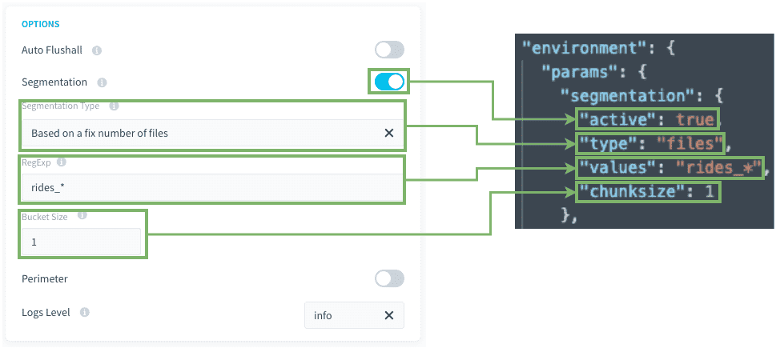
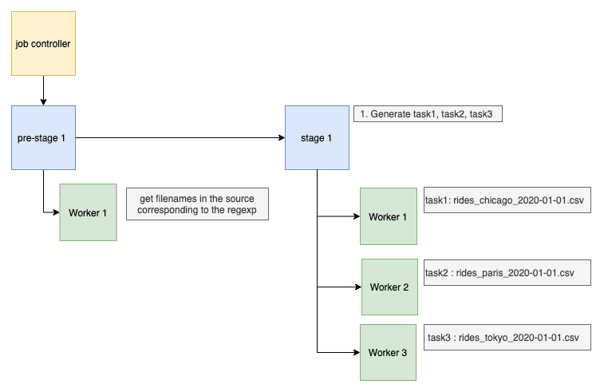

# ファイルのセットによるセグメント化

## ユースケース

離れた場所にあるソースフォルダー内の同じ構造を持つソースの場合、このセグメント化モードを使用して、DPEでフォルダー内のすべてのファイルを自動的に見つけて、特定のファイル数に対応したタスクを作成できます。これらのファイルごとに、「load_from.source」のアクションのソースファイルが置き換えられます。 

例：ソースでは毎日新しいファイルが供給されていますが、前もって正確な名前が分からない状態で、ロードアクションで供給されるこれらのすべてのファイルを取り込む必要があります。

- rides_chicago_2020-01-01.csv
- rides_paris_2020-01-01.csv
- rides_tokyo_2020-01-01.csv

異なる複数のワーカーで作業を並列処理できるようにして、各タスクでそれぞれ異なるファイルを処理します。

### 前提条件

- すべてのファイルの書式と構造が同じであること
- すべてのファイルが同じフォルダー内にあること
 - フォルダー内に構造の異なる他のファイルがある場合、これらのファイルに特定の名前が付けられ、正規表現で除外できるようになっていること
- スキーマ内および各ファイル内に存在するすべての属性／列が、次の条件を満たしていること
 - 存在していること（XMLやJSONなどの半構造化書式を除く：存在しない場合はNULL値に置き換えられる）
 - 同じタイプまたは構造であること（例：日時の構造）

---
## 詳細パラメータについて 

このセグメント化オプションを設定するには、「Segmentation Type（セグメント化のタイプ）」ドロップダウンで「*Based on files（ファイルに基づく）*」を選択します。

**RegExp（正規表現）/values**：正規表現を使用して取得するファイル名を識別できます。アスタリスク（\*）文字を使用すると、任意の複数の文字を検索できます（この正規表現では、.*に置き換えられます）。
正規表現のリストや、具体的なファイル名をハードコードしたリストを使用することもできます。

**Bucket Size（バケットサイズ）/chunksize**：各タスクで取り込むファイルの数を設定します。
何百ものファイルがない限り、この値は1に設定することをお勧めします。タスクの数を妥当な範囲（100以下）に抑える必要がある場合は、タスクごとのファイル数を増やします。 

---
## 互換性
このセグメント化オプションは、以下のアクションとソースにのみ対応しています。

| アクションタイプ | ソースタイプ |
|          ---        |          ---          |
| <ul><li>Load</li><li>Custom</li></ul> | <ul><li>S3（ファイルアップロード、データストア、AWSなど）</li><li>FTP</li><li>SFTP</li></ul> |

---
## ブループリントのルールとマッピング

Data Managerでは、他のすべてのファイルのブループリントとして機能する1つのファイルを分析する必要があります。
ブループリントのルールに従うには、Data Managerでこのファイルの定義を保持する必要があります。 

Loadアクションを作成するDPEで、分析済みのファイルをソースとして使用します。
こうすることで、ロードされるすべてのファイルに同じブループリントのルールが適用されます。

---
## 処理の流れ

アクションのセグメント化が**固定されたファイル数に基づいて**行われる場合、アクションの実行時に、その内部またはワークフロー経由で以下が実行されます。
1. 事前ステージで、構成内で設定された正規表現に対応するソース内のすべてのファイル名が取得されます。
   
1. ジョブコントローラーがアクションを複数のタスクに分割し、各タスクにステップ1で見つけたファイル名の中の異なる値（または値のセット、`chunksize`の設定による）が割り当てられます。
1. その後、各**ワーカー**が**タスクを1つずつ**実行します。  
このため、タスクが何百個あっても問題はなく、アクションはワーカーの数に対して並列処理されます。  

---