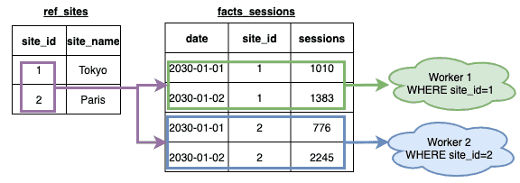
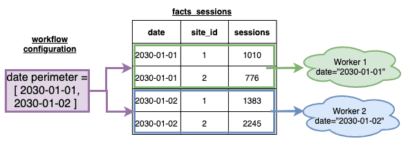
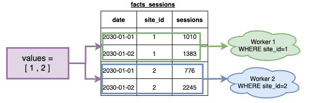
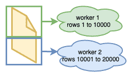
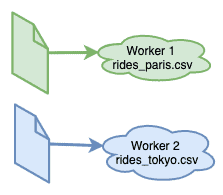
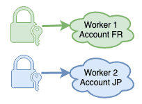

# セグメント化

セグメント化を利用すると、アクションを複数のタスクに分割し、各タスクで扱うデータセットを小さくすることで、DPEの拡張性を最大限に引き出すことができます。

!> 強力な機能の利用には責任が伴います。セグメント化を使用する際には、十分に注意を払い、いくつかの点について確認する必要があります。
セグメント化のパラメータ次第で、アクションを大幅に高速化できる場合もあれば、まったくの逆効果になることもあります。  

!> セグメント化のタイプごとに重要な注意点があります。セグメント化を使用する際には、該当するセグメント化のタイプの章の内容をよく確認するようにしてください。

使用しているDPEアクションや使用するソースのタイプには
セグメント化を行う方法が複数ありますが、適合する場合と適合しない場合があります。 
 
## [テーブル属性の値によるセグメント化](jp/getting-further/segmentation/dwh-attributes)  

## [ワークフローで設定された日付の境界によるセグメント化](/jp/getting-further/segmentation/workflow-dates.md)

## [事前定義された値のセットによるセグメント化](/jp/getting-further/segmentation/predefined-set.md)

## [ソースのチャンク化によるセグメント化](/jp/getting-further/segmentation/chunk-source)  

## [同じ構造のファイルによるセグメント化](/jp/getting-further/segmentation/files)  

## [ソースアカウントによるセグメント化](/jp/getting-further/segmentation/accounts)  

