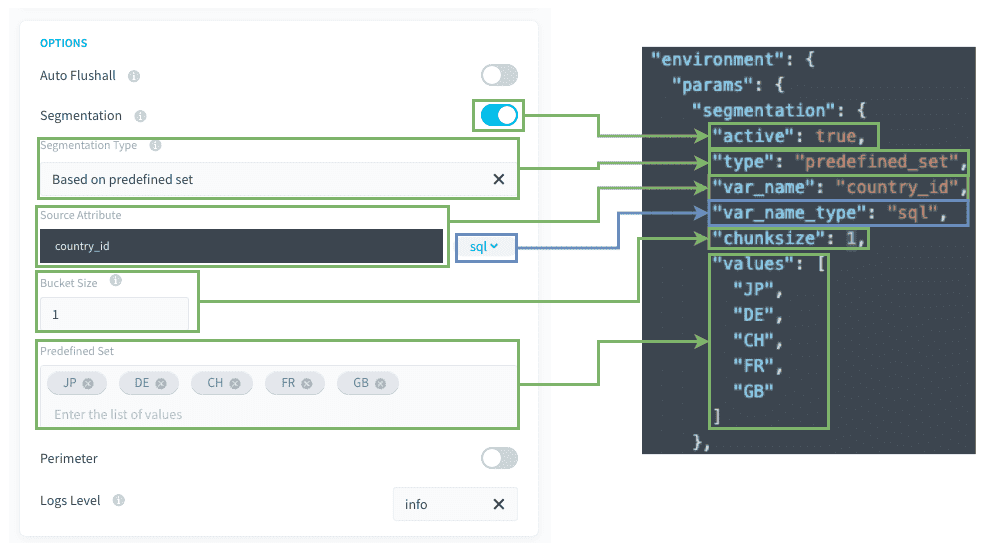

# 事前定義された値のセットに基づくセグメント化

## ユースケース

選択した値のセットに対してアクションを実行し、同時のその値のセットに基づいてセグメント化を行うことができます。

使用例： 
- ショッピングサイトまたはアイテムの詳細なプリセットでのセグメント化 
- 集計アクションAでのデータのサブセットAに対するビジネスルールAの適用、および集計アクションBでのデータのサブセットBに対するビジネスルールBの適用 
## 互換性

このセグメント化オプションは、以下のアクションとソースにのみ対応しています。

| アクションタイプ | ソースタイプ |
|          ---        |          ---          |
| <ul><li>Load</li><li>Aggregate</li><li>Diff</li><li>Delete_Diff</li><li>Delete</li><li>Custom</li></ul> | <ul>**データベース**：MySQL、PostgreSQL、SQLServer、Impala、Hive、BiqQuery、ElasticSearch、Cassandra、Redshift、Oracle</ul> |

---
## 詳細パラメータについて 

以下は表示モードと詳細JSONモードの対応関係を簡単に示したものです。

 

**Source Attribute（ソース属性）/var_name**：ソースのフィルタリングに使用されるSQL属性です。

**Bucket Size（バケットサイズ）/chunksize**：タスクごとにフィルター処理される値の数です。

**Predefined Set（事前定義セット）/values**：フィルター対象のハードコードされた値のセットです。

---
### 処理の流れ／技術的な説明

これらの章は基本的に[こちら](jp/getting-further/segmentation/dwh-attributes?id=behind-the-scenes)に記載されているものと同じです。

唯一の違いは、値がデータプラントのテーブル属性ではなく、構成内ですでに設定されているため、事前ステージが必要ないことです。


---
## 確認事項

このセグメント化のタイプを使用する前に、以下のポイントを**必ず確認してください**。 

### 1. `var_name`属性はソーステーブルでインデックス処理されていますか。
インデックス処理されていない場合、抽出クエリの処理がかなり遅くなります。

### 2. データベースのソースと宛先に十分なCPUが存在しますか。 
 
* `select`および`insert`操作はCPU負荷が高いことに注意してください。
* 例えば、データベースのCPUが1つだけの場合に、DBMSインスタンスに対して6つのワーカーを使用してselect操作とinsert操作を同時に行うことはお勧めできません。

> 一般原則：並行して実行されるワーカー1つにつきCPUを1つ用意することをお勧めします。 

### 3. 同じステージで生成されるタスク数が大きくなりすぎないようにします。 

DPEが適切に機能するようにするため、ステージのタスク数が500を超えないようにすることをお勧めします。
これはハードリミットではありませんが、500を超えてタスク数を増やすとパフォーマンスの低下が起きる可能性があります。
タスクの数を少なくするには、バケットサイズの設定を大きくして、個々のタスクで処理する値の数を増やします（これにより、タスクの数が少なくなります）。


---
## ヒント

### 1. SQL式を使用できます。 

`segmentation.var_name`（この属性の最後の部分）では、お使いのDBMSと互換性のあるSQL式を使用できます。DBMSは時間がたつと変更される可能性があるため、SQL式を使用する場合はSQL式を再確認し、必要に応じて修正する必要があります。

例えば、次のような形で使用できます。
```json
{
  "segmentation": {
    "active": true,
    "type": "predefined_set",
    "var_name": "DATE(datetime)",
    "values": ["2020-01-01","2020-01-02"]
    "chunksize": 1
  }
}
```


