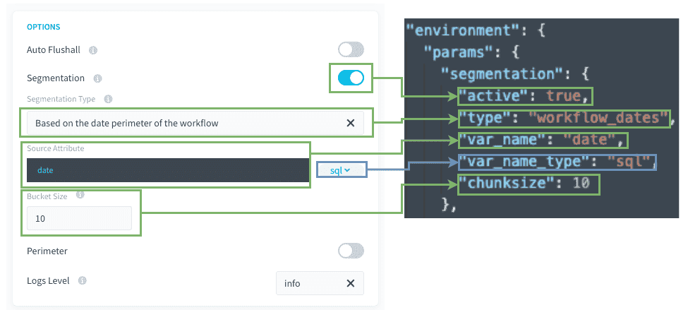

# ワークフローで設定された日付の境界に基づくセグメント化

## ユースケース

日単位で使用する場合は通常、DPEアクションで今日までのX日間に対応するデータを処理する必要があります。 

その他に、過去の日付のセットに対してのみアクションを実行する必要がある場合もあります。 
このセグメント化のタイプは、値がData Managerのテーブルではなく、ワークフロー構成で設定された日付から取得される点を除き、基本的に「Data Managerのテーブル属性の値によるセグメント化」と同じように機能します。 

### 具体的な使用例 
-	X日前から今日までに限定してデータをソースから取得（日単位での相対日付の使用）
-	2つの詳細な日付間のデータをソースから取得（過去データの取得、単発での使用）
-	2つの日付間に限定して集計テーブルを再計算（日単位での相対日付の使用または単発での使用）

ソースデータに日付属性が含まれている場合、アクションを複数のプロセスに分割し、各プロセスで特定の日付や日付グループを処理することができます。 
この場合、各タスクは抽出する必要のある日付に対してフィルターを適用します。

---
## 互換性

このセグメント化オプションは、以下のアクションとソースにのみ対応しています。

| アクションタイプ | ソースタイプ |
|          ---        |          ---          |
| <ul><li>Load</li><li>Aggregate</li><li>Diff</li><li>Delete_Diff</li><li>Delete</li><li>Custom</li></ul> | <div><ul><li>**データベース**：MySQL、PostgreSQL、SQLServer、Impala、Hive、BiqQuery、ElasticSearch、Cassandra、Redshift、Oracle</li><li>**API**：Facebook、Twitter、Google Analytics、YouTube Private、YouTube Public、HTTP REST</li></ul> |

---
## 詳細パラメータについて 

以下は表示モードと詳細JSONモードの対応関係を簡単に示したものです。



**Source Attribute（ソース属性）/var_name**：ソースのフィルタリングに使用されるSQL属性です。

**Bucket Size（バケットサイズ）/chunksize**：タスクごとにフィルター処理される値の数です。

---
### 処理の流れ／技術的な説明

これらの章は基本的に[こちら](jp/getting-further/segmentation/dwh-attributes?id=behind-the-scenes)に記載されているものと同じです。

唯一の違いは、値がデータプラントのテーブル属性ではなく、ワークフローの日付の境界から取得されるため、事前ステージが必要ないことです。


---
## 確認事項

このセグメント化のタイプを使用する前に、以下のポイントを**必ず確認してください**。 

### 1. `var_name`属性はソーステーブルでインデックス処理されていますか。
インデックス処理されていない場合、抽出クエリの処理がかなり遅くなります。

### 2. データベースのソースと宛先に十分なCPUが存在しますか。 
 
* `select`および`insert`操作はCPU負荷が高いことに注意してください。
* 例えば、データベースのCPUが1つだけの場合に、DBMSインスタンスに対して6つのワーカーを使用してselect操作とinsert操作を同時に行うことはお勧めできません。

> 一般原則：並行して実行されるワーカー1つにつきCPUを1つ用意することをお勧めします。 

### 3. 同じステージで生成されるタスク数が大きくなりすぎないようにします。 

DPEが適切に機能するようにするため、ステージのタスク数が500を超えないようにすることをお勧めします。これは500を超えるとすぐに機能に問題が生じるようなハードリミットではありませんが、パフォーマンスの低下が起きる可能性があります。タスクの数を少なくするには、バケットサイズの設定を大きくして、個々のタスクで処理する値の数を増やします（これにより、タスクの数が少なくなります）。


---
## ヒント

### 1. SQL式を使用できます。 

`segmentation.var_name`（この属性の最後の部分）では、お使いのDBMSと互換性のあるSQL式を使用できます。DBMSは時間がたつと変更される可能性があるため、SQL式を使用する場合はSQL式を再確認し、必要に応じて修正する必要があります。

例えば、次のような形で使用できます。
```json
"segmentation": 
{
   "active": true,
   "type": "workflow_dates",
   "var_name": "DATE(datetime)",
   "chunksize": 1
 }
```


