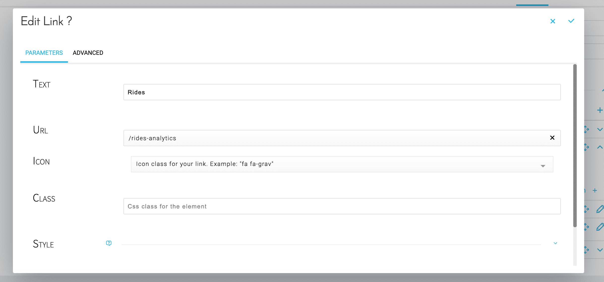

# Build and deploy a front-end application

In this tutorial you'll **learn how to build, deploy and customize your first application**. To make it easier for everyone, you won't start from scratch. Download [the zip](https://www.dropbox.com/s/o2lnt6gffnrores/gs-init.zip?dl=1) we've prepared for you to accelerate the process, thanks to pre-built graphs. 

Additionally, we've made the source code of the final app available to further speed things up. This way, you will create an application by importing a simple zip file directly into ForePaaS. Click on "Create an app", choose "Import" and select the zip file on your computer.

!> We store the app files in Dropbox already compressed 📦. Some browser & computer systems (for instance Safari on MacOS) will automatically unzip the folder once you download it. If you re-compress the files, make sure to compress only the content of the Getting Started folder. Generally speaking, as mentioned before, **we recommend using Chrome as the default browser** for using ForePaaS.

Simply drag and drop the zip into the designated dropzone. 

Then fill in the different fields as shown in the screenshot below. 

Click on **Confirm**, your app will automatically build and deploy. Please allow for a few minutes before we start working on it.

---

## Objectives

The main goal of every project on ForePaaS is to correlate data derived from queries and display them within insightful and interactive dashboards. Those dashboards must be understandable at a glance and insights must be easy to capture for final users. That is one of the hardest tasks: create your application and dashboards so that people instantly grasp takeaways from data and can make informed business decisions.
 
In this first simple project, you want to **understand the impact of holidays, temperature, weekday on traffic**, most visited stations and see the traffic evolution over time. 

---

## Pre-requisites

As always, every previous step needs to have been completed. 
* The API is up and running
* Workflows are set up and have been executed by our workers.
* The Data Manager shows a proper logical schema. Virtual attributes are created, tables linked, every attribute of the Dataset related to their DPE actions and built properly with the good types and nature
* Queries in the Query Builder are properly requesting our data warehouse.

Inside ForePaaS, applications are structured depending on:
* **Dashboards**: pages of the app
* **Menu**: to access the different pages of your app
* **Dynamic parameters**: filters to sort your data based on different criteria

We will go through the following steps to build and deploy these different elements:
* [Set up your canvas](/jp/getting-started/app-init/app-manager?id=set-up-your-canvas)
 * [Create a page](/jp/getting-started/app-init/app-manager?id=create-a-dashboard)
 * [Set up a sidebar menu](/jp/getting-started/app-init/app-manager?id=set-up-a-sidebar-menu)
 * [Set up dynamic parameters](/jp/getting-started/app-init/app-manager?id=set-up-your-dynamic-parameters)
* [Set up charts](/jp/getting-started/app-init/app-manager?id=set-up-charts)
 * [Create your first area chart](/jp/getting-started/app-init/app-manager?id=create-your-first-area-chart)
 * [Set up other chart types](/jp/getting-started/app-init/app-manager?id=set-up-other-chart-types)
 * [Customize further](/jp/getting-started/app-init/app-manager?id=customizing-further)
* [Rebuild and deploy a new version of your app](/jp/getting-started/app-init/app-manager?id=rebuild-and-deploy-a-new-version-of-your-app)

---

## Create your first dashboard

### Set up your canvas

#### Create a dashboard

Click on the **Dashboard** menu, and on **Create my first Dashboard**. 
Name it *Rides Analytics*. You've just created the first page of your app!

#### Set up a sidebar menu

Then head to the **Menus** menu. 
On the Side Bar tab, expand the *primary-menu* to see the container's items. Click on Add an item to add a tab in your final menu. Select **link** and fill in the fields as shown below. Don't forget to define the favicon!

#### Set up your dynamic parameters

Dynamic parameters are filters to help you present your data according to various criteria. 
Here, you will add 2 new dynamic parameters. 

Still in the **Menus** menu, click on **Header** on the top right-hand corner. 
You will first add 2 parameters to filter data depending on the date and holiday on the left of your header. Then, you will create a parameter to filter data according to the metro station. 

To create your first parameter, click on header-left, on Add an item. Select **parameters**, and pick the *Datepicker range* one. 

Then, fill in the options as shown in the screenshot below. 

In the **Infos** tab, give it the following name: *select_date*, and Confirm. 

Please follow the same procedure for the 2nd parameter. You will create a **Select Box** type of parameters. Fill in the options as below, and name it *select_holidays*. 

The last parameter will appear on the top right of your header. Click on header-right, and follow the same steps with another **Select Box**. Name it *select_stations*. 

**Your canvas configuration is now done ✅**. You can now move forward to the next step, creating your first graphs. Note however that every dynamic parameters like the date picker and select boxes can be customized. To learn about how to do that, head to the technical documentation for application components!

[Learn more about Dynamic Parameters](jp/technical/api-reference/app-manager/dynamic_parameters/index)

### Set up charts

Go to the **Dashboard** tab and click on the **Edit** icon on your Ride Analytics dashboard. 
You can see that the menu and the filters we've just created are well set up here. 

#### Create your first area chart

1. Create a panel

Click on the ➕ icon to create a panel (*Containers* > *Panel*). Once it's created, you can resize it so it takes half the width of the page, and approximately 2/3 of the height. 

2. Give a title to your chart

Click on the ➕icon inside your panel, and select *Basic UI*, *html*. 
Name it **Rides history** and apply the H1 style by clicking on the H button. 

!> Don't forget to **Save** your dashboard regularly to make sure your edits are consistently saved (💾 icon in the top middle bar). 

3. Create your chart

Inside your panel, click on the ➕icon and select *Chart*. Pick the **Area Chart Smooth** model. 

Click on **Query**, and select **Query selector** to pick the *rides_per_month* query you've created in the Query Builder.

To complete the setup, you have to connect this chart with the filters we've already created. Go to the **Infos** tab, in the **Linked dynamic parameters** section and select the 3 available. 

You can now test if your filters are properly working. Enter the read-only mode by clicking on the Play icon, and modify dates or holiday type to see how your data is changing. Your first chart is done!

> **Quick tip**, as you're new to the product, it might happen that you mis-click or mis-place components in the dashboard building interface. **A common issue is when components are placed on top of each others** giving the impression that some are missing. If this happens to you, move the visible components to make sure none are hiding underneath...

#### Set up other chart types

You will create 3 more charts to make your dashboard more insightful.
* One **pie chart** displaying the distribution of rides over weekday
* One **horizontal bar** to show the top 7 stations in terms of traffic
* One **column chart** to illustrate the variations of rides depending on the temperature

The process is exactly the same as what you've just done above for your area chart. However, instead of choosing a query that has already been created via the *Query Selector*, we will create new ones "on the fly". When you create a new chart, in this case in the Request tab, select the open *Request* and set-up the charts according to the table below: 

|                Title                | Type of chart                  | Query setup                                               |
| :------------------------------: | -------------------------- | ------------------------------------------------------------ |
|             **Weekly seasonality**              | Pie chart                        | *avg_rides_per_day_per_station* as data (select) and *week_day* as scale |
|            **Stations top 7**             | Horizontal bar                      | *rides* as data (sum and descending) and *station_id* as scale. |
|            **Rides history / temperature**             | Column chart                  | *avg_rides_per_day_per_station* as data (select) and *cat_temperature* as scale    |

As mentioned before, queries can be further customized using the advanced mode. Specifically, for the chart "stations top 7", you will need add a custom parameter to **limit the number** of stations to the top 7. To do that, head to the advanced mode of your query as shown below and simply add the line of code _"limit":7_  below the second line in the "data" JSON object, as such:

So far, your dashboard should look something like this: 

#### Customizing further 

Now let's go a step further in the customization of those graphs, for instance, we can:
* Change the colors of the column chart to make it more visual. To do that, click on the **Edit** icon and in the *Options* tab, **Color** section, pick the color of your choice. 
* For the **horizontal bar**, you'll want to improve the way the labels are displayed. For instance, let's **round the figures** of the bar chart of rides history. To do that follow these 3 steps:
  1.  Go to the *Formatter* tab and **start by clicking "Add a measure"**. 
  2. **Give the measure the name of the attribute that you are trying to format**. In our case, simply name it "rides" (to save the new name, don't forget to click on the ✏️ icon). 
  3. Then, **assign the measure the formatting parameters that you want**, specifically the unit, the number of digits to round to and an optional multiplication factor. In our case, enter "Mpax" as unit (include the blank space) and round = 0 to display integers. 

> When editing an existing measure (i.e. the Unit, Round or Multiplicator parameters) don't worry about saving, the Formatter works in "Auto Save" mode. 

This is now looking even better! 

As you might have noticed:
* In our "Weekly seasonality" pie chart, days appear as numbers instead of actual names, 1 for Sunday, 2 for Monday, etc. 
* In the "Top 7", stations appear with their id instead of names. 

Read on to learn how to turn these numerical values into actual names.

##### Changing the value of a dictionary

To assign labels to specific values, in our case the days of the week of the stations, you will need to modify what is called a **dictionary** for:
* The *week_day* attribute in the *dataset_history*;
* The *station_id* attribute in the *chicago_stations_gps* object.

Head back to your Data Manager component in the Organize tab and select the *chicago_ref_day*, table that we had previously set-up. This table contains the "reference" labels for the different days of the week (0 for Monday, 1 for Tuesday, etc.). Click on the edit icon while the table is selected.

To specify that this table represents the dictionary for *week_day*, click on the dropdown for the "Object's label" and select the attribute "week_day_label". This will indicate to the platform that each individual row of the table identified by the primary key, in this case the *week_day* will be represented in the dashboard by its label stored in the attribute *week_day_label*. Your table editor window should look like the screenshot below:

In the *chicago_stations_gps* table, let's repeat the same operation by selecting the *station_name* attribute as the "Object’s label” field, then confirm and close the window.

To see these changes reflected in your final dashboard we will need to "propagate" it in the value chain that we have just set-up in particular update the cache of the different components. **Before moving on with the tutorial make sure to**:
* Click on the ⚙️ “Build” in order to update and build the changes of your Prim schema.
* In the Query Builder, click on “flush cache” in the Overview screen, right next to “Query Builder activity”
* In your API overview screen, click on “Refresh cache”

You can now check in your Query Builder that the dictionary has been created properly by going to your Dataset, and selecting the Dictionaries tab. Look for the *week_day* dictionary: 

Going back to your dashboard in the App Manager, the final step is to make sure that we will look for the *week_day* values in the right dictionary for this query. 

!> Once again at each step when you are working on your dashboard, make sure to save your changes using the 💾 icon on the top of your dashboard editor.

Repeat these actions with your Stations top 7 chart: adding “dictionaries”:[“station_id”], into the query configuration. You can see that your “select_stations” dynamic parameter at the top right has already been automatically translated into *station_name*.

Your final app should now look like this: 

### Rebuild and deploy the new version of your app

You're almost finished! Just one last step! Let's publish the recent changes to the dashboard in production. To do this, go back to the **Overview** tab of the application manager, you should first **stop** the currently deployed application. As soon as it has shut down, click on **Build**, and then **Deploy**.

> The **build** process usually takes a couple of minutes. If you're curious of what is going on or if the build fails : open the log console by expanding the version panel and inspect the logs. Feel free to send logs to our support team 💁💁‍♂️if you're not sure how to troubleshoot it yourself!

Your app is **live** and can now be accessed online! 

---

<b> Congrats! 🎉🎊</b>

**You've completed the ForePaaS Getting Started tutorial!** You're now ready to go live on the platform, explore by yourself and build your own projects from scratch. 

> Please take 3 min ⌛to fill in [this short survey](https://forms.office.com/Pages/ResponsePage.aspx?id=nDWzgpGTfE2g8oFnUal2QQ9d-P8xWc5AgNsykYKKK71UOVpZT1RUMFBRUk5BWjNLSzBCNVhDSVgyNSQlQCN0PWcu). It will help us understand 🧐 what worked well and what didn't in your experience, in order to make this tutorial even better. 

Obviously, you can come back to this tutorial at any time... We encourage you to check out the rest of the documentation to dive deeper into a specific component of the product when needed.

Also, don't hesitate to **get in touch** if you need anything, our support & product team is dedicated to helping you deliver faster any AI applications your have in mind. 

{Give your opinion on the roadmap 🚀}(https://hq.forepaas.io/#/features)
{Send your questions to support 🤔}(https://support.forepaas.com/hc/en-us/requests)

---

Did you like this first tutorial. Want more? Don't worry we got you covered, you can continue to develop your first application adding predictions to your dashboard by using our ML pipelines!

{Embed machine learning models in your app 🤖}(#/jp/getting-started/ml/index)
