# Deploy your first API

In this tutorial, we will learn how to deploy an API from the ForePaaS store.  

The API component is crucial as it serves as the interface between the external world, namely your applications, and your Data Manager and queries. You'll see you will have to call this API when building your application, in the next tutorial.

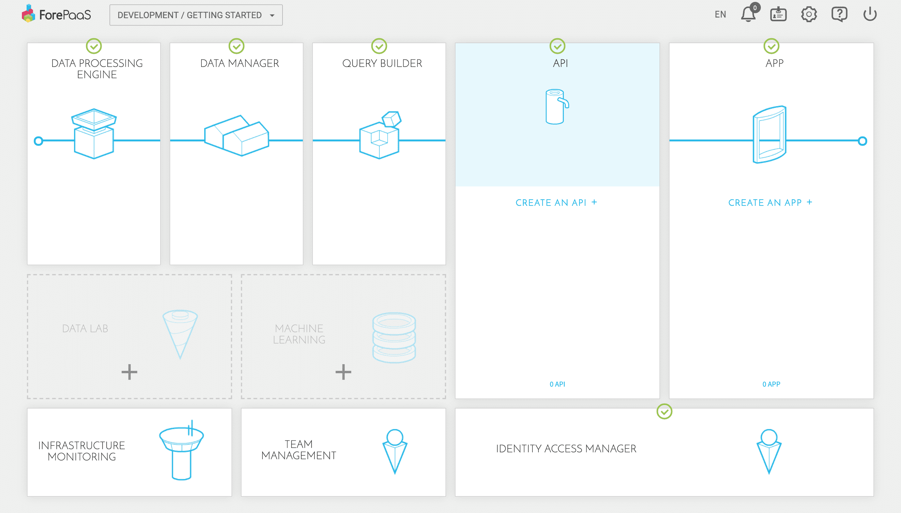

---

## Create a new API

From the main page of your DataPlant, click on "Create API" inside the API component. You will be prompted to choose between 2 options:
* __From the store__: You can create a new project using an existing API template from the internal *ForePaaS Store*. The ForePaaS Store is an internal marketplace where users can share parts of their work such as: custom actions, new connectors or even machine learning models.
* __Import__: You can import one of your existing API projects by linking your DataPlant to a Git repository. You can also authorize the connection to your favorite Git repository management tool like Github, Gitlab or Bitbucket by connecting your ForePaaS account in your *User settings*.

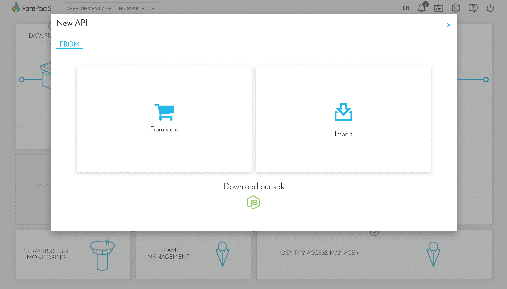

Select the **From the store** option. Note that the **ForePaaS store is accessible in all components** for instance to create actions, applications or machine learning models. Regarding APIs, various themes are available to users, as you're just starting we've made a simple NodeJS template just for you. Proceed by selecting the only template available: *API NodeJS*.

{Learn more about the ForePaaS Store}(#/jp/product/dataplant/marketplace.md)

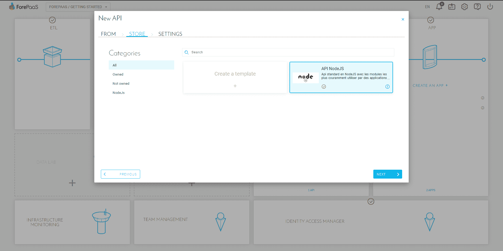

Choose a name for your API, and enable the option **auto build** & **auto deploy**. This will download the source code of your API, automatically build it and deploy it for you.

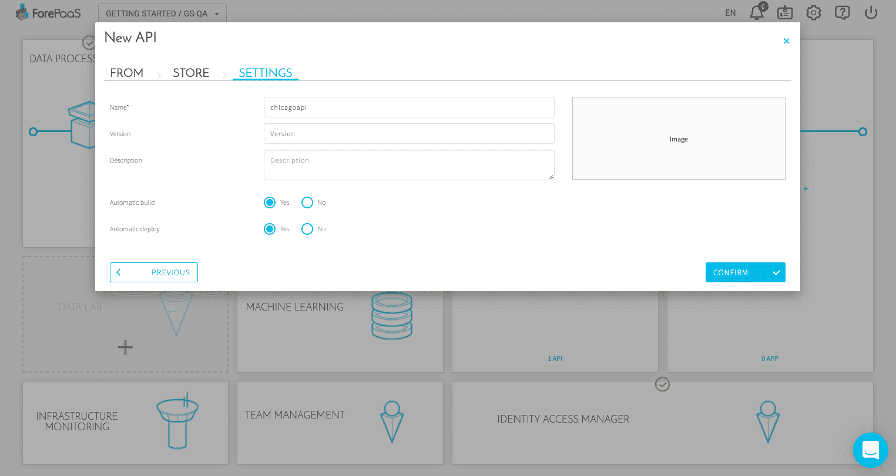

From there, give it a couple of seconds as the creation of the API may take a moment. Go grab a hot drink ☕ whilst the API finishes its build.

As soon as the backup, the API upload & build are done, the screen will let you know that the application is ready. While it's not available yet, you can either continue to wait or click on "Go to API" to monitor its deployment in more detail by accessing the logs.

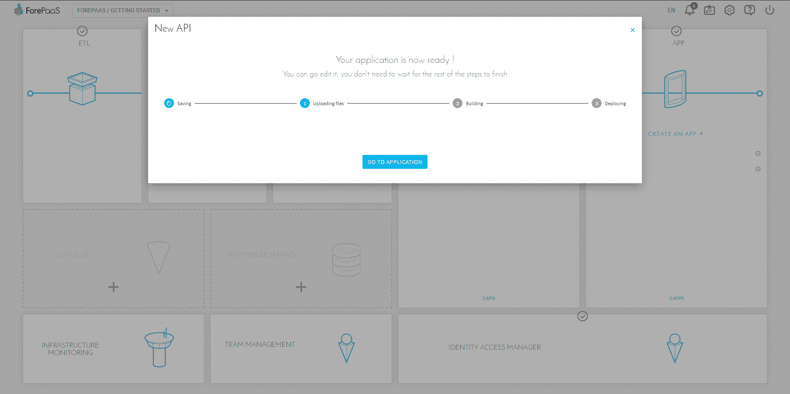

This is what it looks like if you close the window while the build is still in progress:

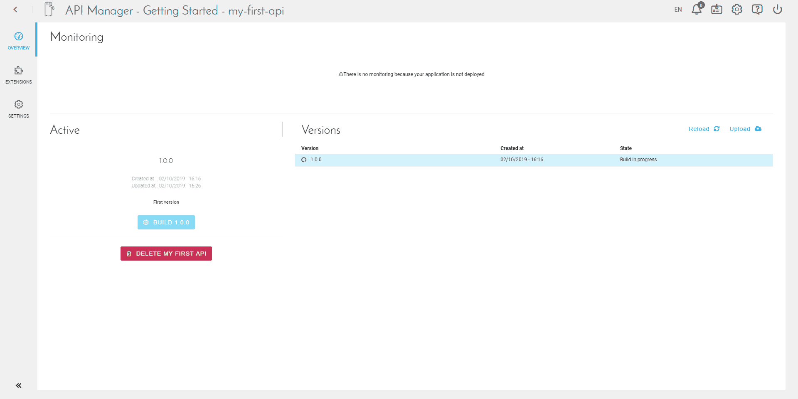

## Manage your APIs

Go to the homepage of the API component.
Here, you'll find three parts:
* __Monitoring__: status of your API once it has been deployed
* __Active__: status of your "active" version, that is to say, the one you are currently working on
* __Versions__: list of all the versions (also called tags) available in your API

You can see more details about the version you just created using the arrow to the right of it.

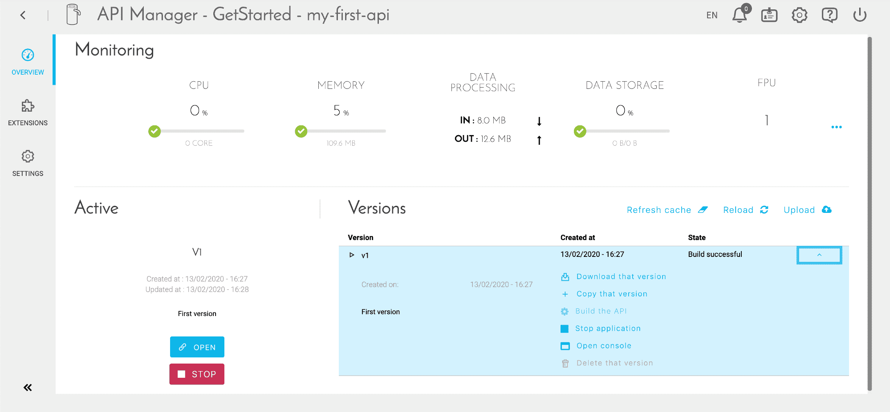

Check the activity log by clicking on "Open Console". Since we have activated the auto-build when creating the API, it has already started. 

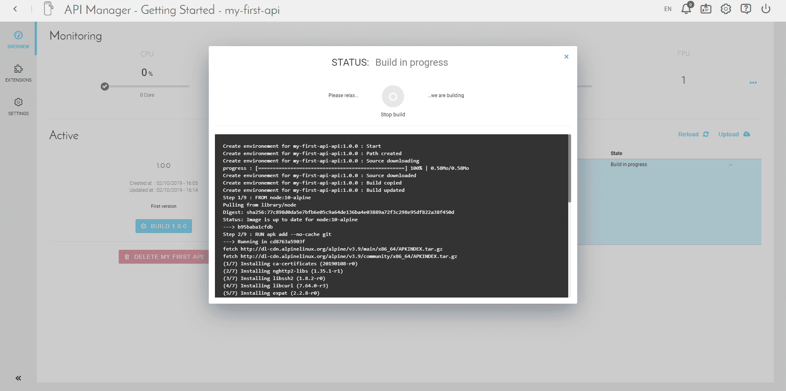

When it is done, you should see a last log "EndBuild success" and the deployment will start right after. When the deployment is complete, the "Open" button appears.

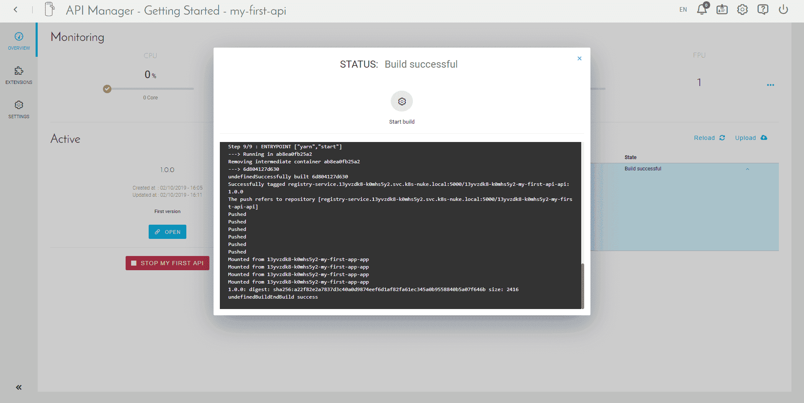

> ForePaaS uses a **[blue-green](https://en.wikipedia.org/wiki/Blue-green_deployment) deployment methodology** ensuring 100% availability of your data. You can therefore seamlessly create & deploy new versions of your API without risking any downtime!

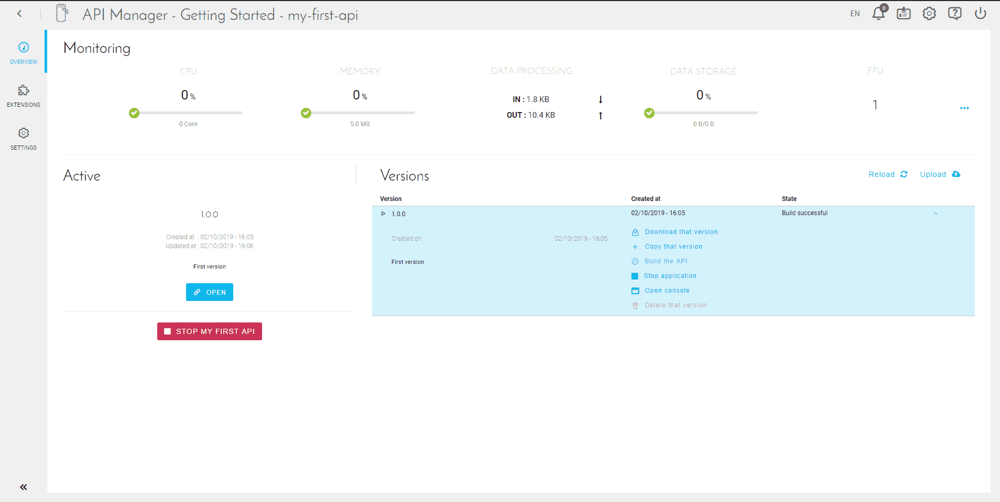

When you open your API, you will land on the screen below confirming that your API is alive & healthy! Congrats 🎉!

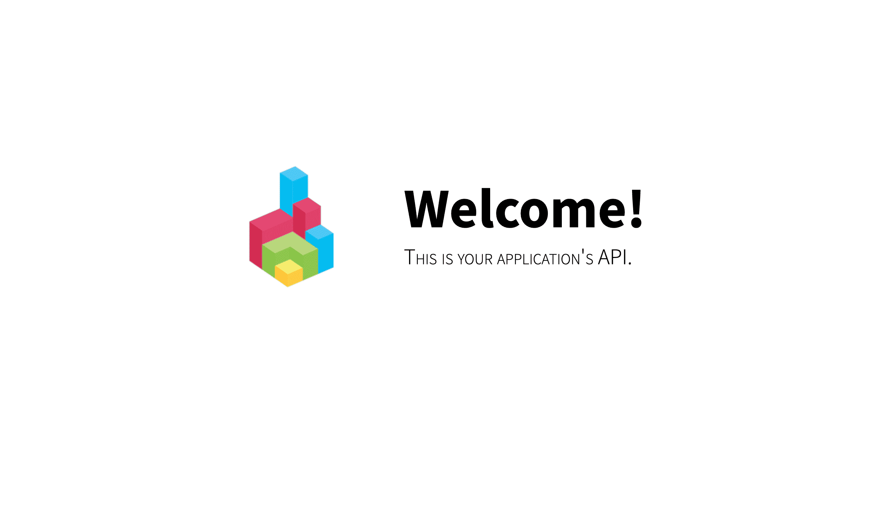

To access your API, simply install an application and connect it to the API. You can also use its endpoints live. To see how you can do this, head to the [API component documentation](jp/product/api-manager/index). More specifically, here is the list of [API endpoints](jp/technical/sdk/api/index) from the Technical Guide.

{Get ready to put your application in production}(#/jp/getting-started/app-init/app-manager.md)