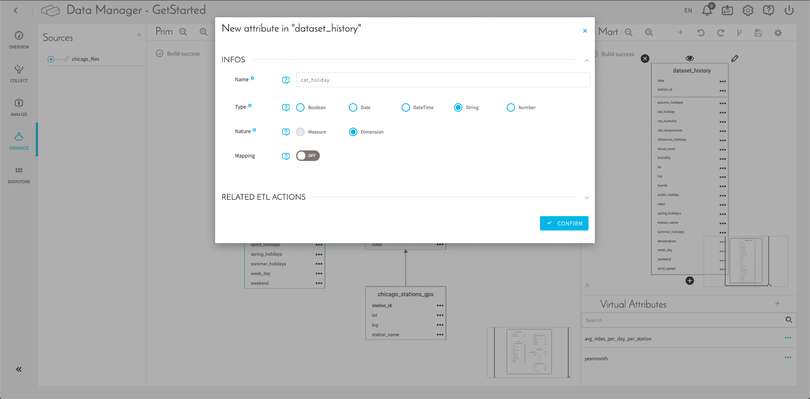

# Define data sources and build your data modeling

## Objectives

Here, you will learn how to **connect your first data source** to your DataPlant, **analyze** and **organize** it in a consistent way so that relations between your data can be understood at a glance. 

The **Data Manager is the first component you should use** when starting out on your DataPlant. It is the component that controls:
* Data sources collection
* Data analysis & modeling
* Data storage

The Data Manager component offers 2 separate storage systems:
* a *data warehouse* for structured datasets
* an S3-compatible *data store* for unstructured data like pictures or videos.

Additionally it includes data quality & modeling features to help you organize data, regardless of their sources, in a logical and query-able schema.

The data source consists of five CSV files containing contextual and historical data about Chicago weather and public transport. 

We will go through the following steps:
* [Connect your first source](/jp/getting-started/app-init/data-manager?id=connect-your-first-source)
* [Analyze your data](/jp/getting-started/app-init/data-manager?id=analyze-your-data)
* [Organize your data](/jp/getting-started/app-init/data-manager?id=organize-your-data)
  * [Create your schema in the prim](/jp/getting-started/app-init/data-manager?id=create-your-schema-in-the-prim)
  * [Create virtual attributes](/jp/getting-started/app-init/data-manager?id=create-virtual-attributes)
  * [Create your aggregate object in the mart](/jp/getting-started/app-init/data-manager?id=create-your-aggregate-object-in-the-mart)
  * [Define indexes](/jp/getting-started/app-init/data-manager?id=define-indexes)
  * [Generate DPE actions](/jp/getting-started/app-init/data-manager?id=generate-etl-actions)

---

## Connect your first source

> First thing, you should download the files to upload [**here**](https://www.dropbox.com/sh/2128cygfm8zdam4/AADwGsPhJY8Hgh9rxKBsiznYa?dl=1). Files are zipped to optimize their size, *depending on your computer or browser you might have issues unzipping them*. One known workaround is to use an online extract tool or simply get in touch!

Inside the Data Manager component, go to the menu Collect (1) and click on the "New Source" (2) button on the top right-hand corner to add your very first data source.

Here, you access a marketplace with pre-configured connectors that you can set up right away.
In this tutorial, we will use the File Upload source to import our .csv files into ForePaaS. Look for the *File upload* in the search bar. Give a name to your source: *chicago_files*; and click on Next. 

You can **drag and drop or upload the 5 files** we have provided and **click on Confirm**, as shown below. Make sure that all the files are selected, if the tick boxes ✅ are not selected, the files won't be loaded in ForePaaS.

**Your files are now loaded to the ForePaas data store!** Please note that even though the files 📂 contain structured data, the tables in the data warehouse will not be filled unless you first run load actions.

!> The load actions are available in the *DPE component*, but don't worry we'll see that in the next article! For now, keep going just keep in mind that this is true for any new source that you add to your DataPlant: first connect the source in the *Data Manager component*, then load data from the source's content to your environment using the DPE. 

Now, let's move on to the Data Analysis part. 

---

## Analyze your data

Click on the Analyze menu. This is the place to extract metadata (i.e. data providing information about other data) out of your data sources to display it properly. 

Metadata extraction launches automatically as soon as you click on a file. **You should, therefore, select each of your files to analyze them**. To do that, simply click on the + icon in the sources section (next to *chicago_files*) and then click on each individual file. 

You can also add rules by clicking on the 💼 icon. Some rules are automated, for example, dates coming from sources in a *dd/mm/yyyy* format are changed to the standard database format *yyyy-mm-dd*. Here, we don't need to set additional rules.

[Learn more about Analyze](jp/product/data-manager/analyze/index)

---

## Organize your data

In this preliminary tutorial we will focus on structured data using sample *.csv* files and explore mostly the data warehouse. ForePaaS lets you also store unstructured data through the data store, feel free to check-out the product documentation for the data store to understand how you can use it as well. But for now let's keep going!

[Learn more about the Datastore](jp/product/data-manager/datastore/index.md)

### Create your schema in the Prim

Once that your metadata has been extracted, it's time to head to the Organize screen. This is where you will **build a unified view of all your data** for analytics purposes. 

The empty Organize screen should look like this. 

The **Prim** panel of the *Organize* screen is where you will organize all your attributes in tables, whereas the **Mart** is only reserved for aggregation and can therefore take attributes from one or several primary tables. This is particularly useful if you want to group attributes from various tables to optimize the execution runtime of your queries for example. We will explore how an aggregate table is created later in this tutorial. 

Drag each of the .csv files into the **Prim** window to start organizing them. Click on the ➕ icon in the sources to see a list of all the sources and drag them into the Prim. It will ask you to validate the new object, click on the ✅ icon. 

!> Make sure that you have analyzed all the .csv files in the previous step before drag & dropping them in the data model. ForePaaS uses the metadata information captured in the Analyze step to automatically create tables and assign attribute names & types.

Once we've created these 5 new objects corresponding to the 5 .csv files, click on the ⚙️ icon to **save and build**. You will need to do so each time you edit your model.

!> The 💾 icon for the aggregate (Mart) and Prim windows are specific to each i.e. if you edit the Prim, the Prim 💾 icon should be clicked, and edits in the Mart require the Mart 💾 icon to be clicked. 

At this stage, your *Organize* screen should look like this. 

Now, let's set the **primary key(s)** in each object as shown in the screenshot below by clicking on the ⭐icon (it will set the selected attribute in bold).

NB: You will see that the DataPlant will automatically suggest some primary keys. You can modify them by clicking on the ⭐icon.

The primary key is the attribute or set of attributes designated to uniquely identify each row in the table. 
If the number of unique combinations of an attribute(s) is equal to the number of rows, it has the maximum **cardinality**. Cardinality is a measure of how many unique combinations exist and can be seen in the Analyze window under the “card” column.  A good example is a dataset that records one event that takes place once a day, for one year. The cardinality of the “date” is 365/365, but the cardinality of the “month” is 12/365.

|                Object                                 | Primary key(s)              | 
| :------------------------------: | -------------------------- | 
|             **chicago_stations_gps**      | station_id                     | 
|            **chicago_calendar**              | date                             | 
|            **chicago_weather_history**  | date                             |
|            **chicago_ref_day**               | week_day                     | 
|            **stations_rides**                   | date, station_id           | 

To wrap up, you need to tell the Data Manager how your tables relate to each other by adding linking information between them. First, click once on *chicago_weather_history* parent table, then click and drag on the arrow on the right side of the table and drop/unclick on the child table *stations_rides*. 

Re-iterate the process so that your prim schema looks like the screen below.

> **Quick tip**, you can move the object by clicking on the table (to select your table) and then can drag and drop the table. Now it looks better!

!> Remember, from now on and for your future projects, don't forget to 💾*Save* or ⚙️*Save and Build* your work each time you modify something in the tables. Note that saving the model simply updates the data model configuration within the DataPlant but **does not apply the changes to the physical model in the database**. Unless you Save and Build, the changes won't be visible in the other components of the platform.

You've now successfully prepared an organized space (aka database tables) to host your data. 	

[Learn more about Organize](jp/product/data-manager/organize)
       
### Create virtual attributes

Let’s now create what we call **virtual attributes**. Virtual attributes allow you to calculate or generate new attributes that will be computed on the fly and won't be stored in the database, but that could be used in a query or a chart in your final dashboard.

>Note: Adding or editing virtual attributes does not require a rebuild of the schema.  

Click on the ➕ icon (1) and fill in the window named "Add attributes" (2):

Here are the 2 attributes and their respective SQL code:

|              Attribute name               | SQL              | 
| :------------------------------: | -------------------------- | 
|           avg_rides_per_day_per_station     | SUM(rides)/COUNT(DISTINCT date,station_id)                |
|             yearmonth           | LEFT (date,7)                      | 

**avg_rides_per_day_per_station** will give us the average number of rides which will be used in our GPS dashboard where we will locate and indicate the number of rides per stations geographically. 

**yearmonth** change the date format in order to use in a dynamic parameter for our dashboard, it can be used as a scale for example.

This is how your Organize screen should look like eventually:

### Create your aggregate object in the Mart

Let’s focus on the Mart section on the Organize screen. Click on the ➕ icon to create a new object, that we will call **dataset_history**. The purpose of this new object is to aggregate all important data (namely holidays and temperature) in one unique table.

Then, just drag and drop attributes from the Prim you need to integrate to the *dataset_history* in the Mart following the instructions and screenshot below. 

|                Original object                | Attributes to drag-and-drop                  | Primary keys (dataset_history)                  | 
| :------------------------------: | -------------------------- | -------------------------- | 
|             **chicago_weather_history**              | *cloud_cover* / *humidity* / *temperature* / *wind_speed*                       |                | 
|            **stations_rides**             | *rides*                  | *date* / *station_id*                  | 
|            **chicago_calendar**             | *autumn_holidays* / *christmas_holidays* / *month* / *public_holiday* / *spring_holidays* / *summer_holidays* / *weekend* / *week_day*                 |                    | 
|            **chicago_stations_gps**             | *lat* / *lng* / *station_name*              |                       | 

In addition, we will need to create 3 new attributes to help translate numerical data (temperature, humidity, dates) into understandable categories such as cold for temperature, dry for humidity or Christmas holidays for dates. This will be useful to filter data in your final dashboard according to categories rather than specific numerical values. 

Start by clicking on the ➕ icon that appears at the bottom of the object *dataset_history* when you click on it. You can then create or edit an attribute inside an object:

Define attributes as follows:

|                Attribute name               | Type               | Nature                  | Mapping                  | 
| :------------------------------: | ----------- | ------------------- | ------------------ | 
|  **cat_holiday**            | String                             | Dimension                     | OFF                     | 
|  **cat_humidity**          | String                              | Dimension                     | OFF                     | 
|  **cat_temperature**    | String                              | Dimension                     | OFF                     | 

> For the moment, these three attributes are not physically specified but don't worry! It will be done soon in the tutorial for the next component: the Data Processing Engine (DPE).

Don’t forget to save and build your Mart schema by clicking on the ⚙️ icon.

?> Notice how you just used two different methods to generate new attributes from the Data Manager: **virtual attributes** and **adding an attribute to a Mart table**.  
🔘 Virtual attributes are a quick win but can become hard to manage if you need to modify them when scaling.  
🔘 Adding a Mart attribute takes up storage and requires you to physically define them in the DPE, but this makes them more rigorous as DPE specifications can be edited without changing the whole data model. New physical attributes can also be used as indexes, as shown in the next subsection.

### Define indexes

Defining indexes improves the speed of data retrieval operations on a table at the cost of additional writes and storage space to maintain the index structure. Indexes are used to quickly locate data without having to search every row in a table.

In order to create an index, edit the **dataset_history** object by clicking on the ✏️ icon next to the object and insert indexes as below (clicking on *ADD AN INDEX ➕*  button): 

The following attributes should be added as index:
* *cat_holiday*
* *cat_temperature*
* *cat_humidity*

### Generate DPE actions

Before moving to this last step for the data model set-up, and if you haven't done so yet, click on the ⚙️icons in the Prim and in the Mart to save your build.

!> One last quick check ✋! Make sure to **double-check that your data model looks exactly like the one in the screenshots** before moving to the next step. If some attributes are missing you will get stuck in later steps of the tutorial.

Then press the 🔧icon to **automatically generate DPE (Data Processing Engine) actions** for each of your tables in the Prim. Select the **default repository**  and the **v1 version**.  This will save you some time in the DPE and help you to start transforming data for visualization.

Once you've confirmed the creation of DPE actions, **it's time to head to the Data Processing Engine** to see what's next. 

{Prepare your data pipelines with the DPE}(#/jp/getting-started/app-init/dpe)
