# Configure data imports and transformations

## Objectives

The DPE is the component that lets you **create data pipelines from the raw sources to the storage systems inside ForePaaS**. Everything is automated, from the management and deployment to the scalability to help you focus on the business logic of your data project rather than its logistics.

While the Data Manager is where you plan out your data structure at the **conceptual level**, the Data Processing Engine is where you execute actions to **physically impact your data**.

Below is the summary of the steps that we'll go through during this tutorial:
* [Actions](/jp/getting-started/app-init/dpe?id=actions)
 * [Understand actions set by default](/jp/getting-started/app-init/dpe?id=understand-actions-set-by-default)
 * [Create your actions](/jp/getting-started/app-init/dpe?id=create-your-actions)
   * [Create a load action](/jp/getting-started/app-init/dpe?id=create-a-load-action)
   * [Create a custom action](/jp/getting-started/app-init/dpe?id=create-a-custom-action)
   * [Create a delete action](/jp/getting-started/app-init/dpe?id=create-a-delete-action)
   * [Create an aggregate action](/jp/getting-started/app-init/dpe?id=create-an-aggregate-action)
   * [Split your workload](/jp/getting-started/app-init/dpe?id=accelerate-pipelines-with-the-segmentation-option)
* [Workflows](/jp/getting-started/app-init/dpe?id=workflows)
* [Environments](/jp/getting-started/app-init/dpe?id=environments)
* [Jobs](/jp/getting-started/app-init/dpe?id=jobs)

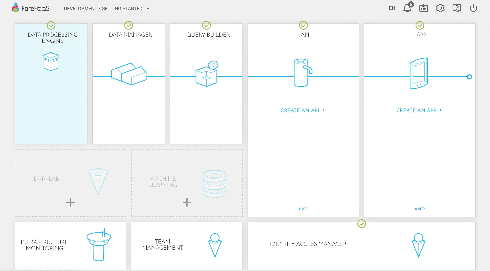

---

## Pre-requisites & Definitions

Before going through this tutorial:
* Make sure the loading and the setup of your data model in the Data Manager have been completed. 
* Having some experience with SQL and Python can be helpful to customize your actions. *But don't worry!* You can also simply copy-paste the pieces of code we will provide.

Below are the short definitions of each major element of the Data Processing Engine. For detailed explanation on each of them, make sure to check out the [product documentation](/jp/product/dpe/index.md) directly!
* **Actions**: An [action](/jp/product/dpe/actions/index) is a unitary operation on the data which can be organized in stages and workflows to define more complex data operations. Like workflows, they can be launched manually, set up to run on a schedule or triggered through an API call. 
* **Workflows**: A [workflow](/jp/product/dpe/workflows/index) is a sequence of one or more actions with a given execution order. Within a workflow, actions are organized in stages. A workflow can either be launched manually, set up to run on a schedule or triggered through an API call.
* **Environments**: [Environments](/jp/product/dpe/environments/index) are a shared set of configuration settings applied to the execution of an action and/or a workflow. Environments are used to store template job configurations such as ressource allocation, perimeter and / or segmentation options.
* **Jobs**: A [job](/jp/product/dpe/jobs/index) is a unitary execution of any action or workflow in the DPE. Every job has its own dedicated set of resources. You are limited to run only a certain amount of jobs in parallel. Check-out the component settings to see the limitation quotas.

---

## Actions

Here, you will create transformation **actions** that will be part of **workflows**, scheduled to launch and run on its own. The ultimate goal is to create automated data pipelines that will process public datasets about the Chicago transit department to create a specific analysis of the subway traffic. 

This is what you should see when clicking on the Actions menu of your DPE. 

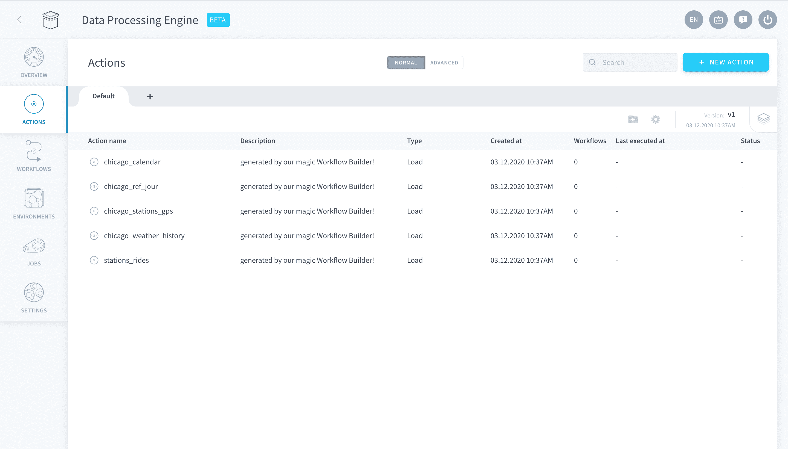

### Understand actions created by default

Defining DPE actions is one of the critical aspect of preparing data for final consumption (typically via a dashboard). By clicking on the Actions menu, you should see the following actions that were generated from the previous article (in the Organize section of your Data Manager): 

 * chicago_calendar
 * chicago_stations_gps
 * chicago_weather_history
 * stations_rides
 * chicago_ref_day


### Create your actions

We will now complement this initial list by manually creating different types of actions.

#### Create a load action

Here, all your load actions have been automatically generated by the Data Manager component. However, it is possible to create your own load actions directly using a low-code interface, the only steps required being that you **select the desired source and destination tables, followed by mapping the appropriate attributes together**. 

To see how an automatic action can be configured, click on the ✏️ icon for the *chicago_calendar* Load action to have a look at how it works.

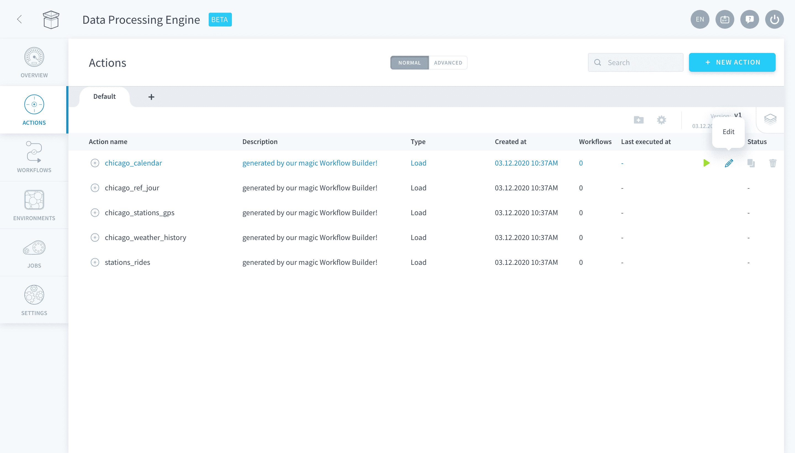

Below is an example of how the attributes are mapped with each other. Every attribute of the destination table will expect an input whether the value is manually inputted by a user or equal to an attribute from the source. 

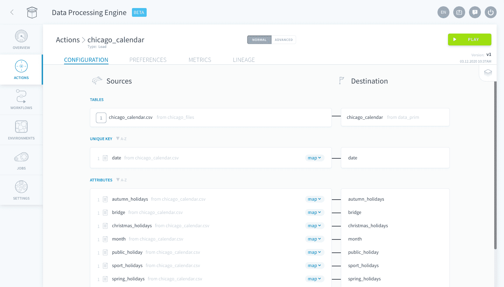

{Read more about Load actions in the product documentation.}(/jp/product/dpe/actions/load/index.md)

#### Create a custom action

We will use one custom action linked to the *stations_rides* attributes to import data from an online website that will be refreshed continuously overtime. A custom action allows you to **run any piece of Python 3+ code** as part of your data pipelines. 

In our case, we will be pulling data from the Chicago city API. We will set-up the workflow to run daily so that the data is pulled every day from the city of Chicago in order to keep your application up to date. 

Click on New action, then select the action type Custom in the ForePaaS Store interface.

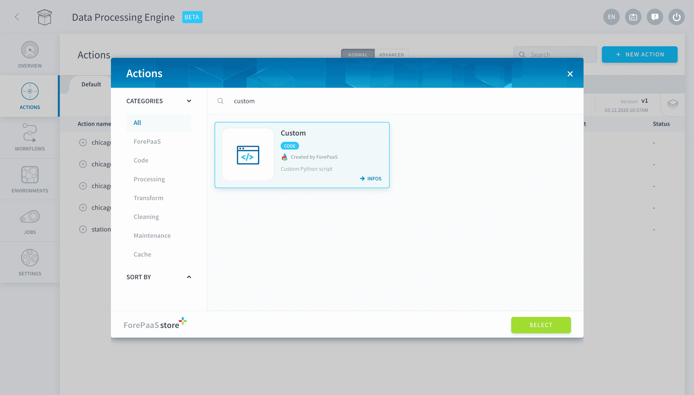

Then, click on the **start with a boilerplate** button. A boilerplate is simply a sample of code that provides you with the basic structure of how to write custom actions using Python.

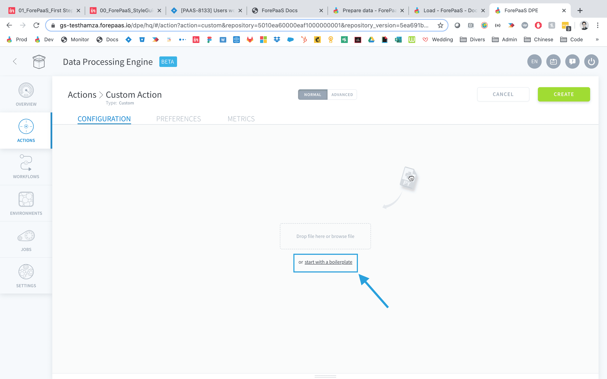

When the boilerplate has loaded, it should look like the screen below:

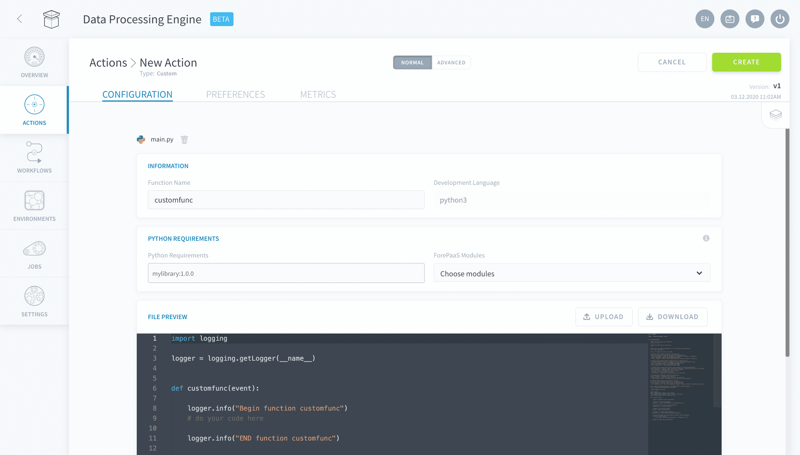

In the code editing panel, copy and paste the code sample below.
```
# import the different libraries you are going to use
import csv,json,requests,datetime,time,sys,logging
import pandas as pd
from forepaas.worker.connect import connect
from forepaas.worker.connector import bulk_insert

logger = logging.getLogger(__name__)

# Enter the main function called by this custom action
def customfunc(event):
    try:
        current = "2019-12-01"
        month = 12
        year = 2019
        lines = []
        #loop for each month 
        for i in range(1,12*2):
            start_date = datetime.date(year,month,1)
            logger.info(start_date)
            if month<12:  end_date = datetime.date(year,month+1,1)-datetime.timedelta(1)
            else:  end_date = datetime.date(year,12,31)
            d1=str(start_date)+"T00:00:00.000"
            d2=str(end_date)+"T00:00:00.000"
            url = "https://data.cityofchicago.org/resource/5neh-572f.json?%24limit=20000&$where=date%20between%20%27"+d1+"%27%20and%20%27"+d2+"%27"
            retry=0 
            ok=False
            while retry<3 and ok==False: 
                retry+=1
                if retry>1: time.sleep(10)
                try:
                    resp = requests.get(url=url,timeout=60)
                    if resp.status_code==200: ok=True
                    else: error=resp.text
                except Exception as err:
                    error=err
            if ok==False: raise Exception(error)
            for record in resp.json():
                line = {
                    "date":         record["date"][:10],
                    "station_id":   record["station_id"],
                    "rides":        record["rides"]
                }
                lines.append(line)
            month = month-1
            if month==0:
                month=12
                year = year-1

        connector = connect("dwh/data_prim/")
        stats,err = bulk_insert(connector,"stations_rides",pd.DataFrame(lines))
        logger.info(stats)

    except Exception as err: 
        raise Exception("File:{} Error:{} L:{}".format(str(__file__).split("/")[-1],err,sys.exc_info()[2].tb_lineno))
```

After copy-pasting the code, make sure to click on the **Create** button on the top right of the window to save your current set-up. Here is what your configuration screen should look like at this point:

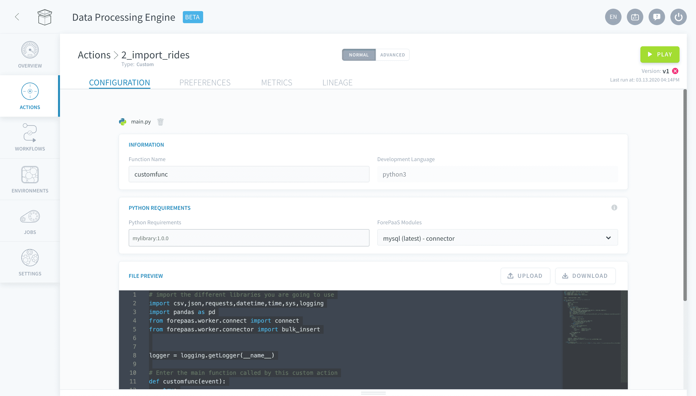

Note that once an action is created, all changes are saved automatically. Finally, head to the Preferences tab and set the name of your action to *2_import_rides*.

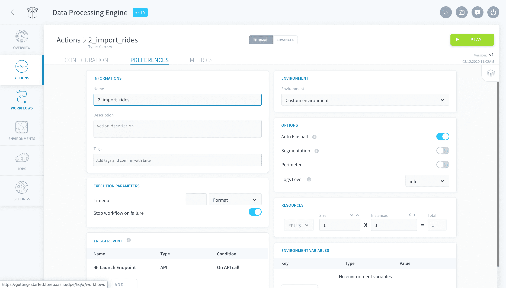

That's it 🙌! You've just successfully created your first custom Python DPE action on the ForePaaS platform.

#### Create a delete action

When dealing with live production data, you may also need to regularly **get rid of obsolete data, or just to reset part of it**. Delete action types are made just for that. They are used to truncate all the data present in your Data Manager table, or a specific subset of this data. For now, let's create only one delete action to delete previous data of *chicago_calendar*.

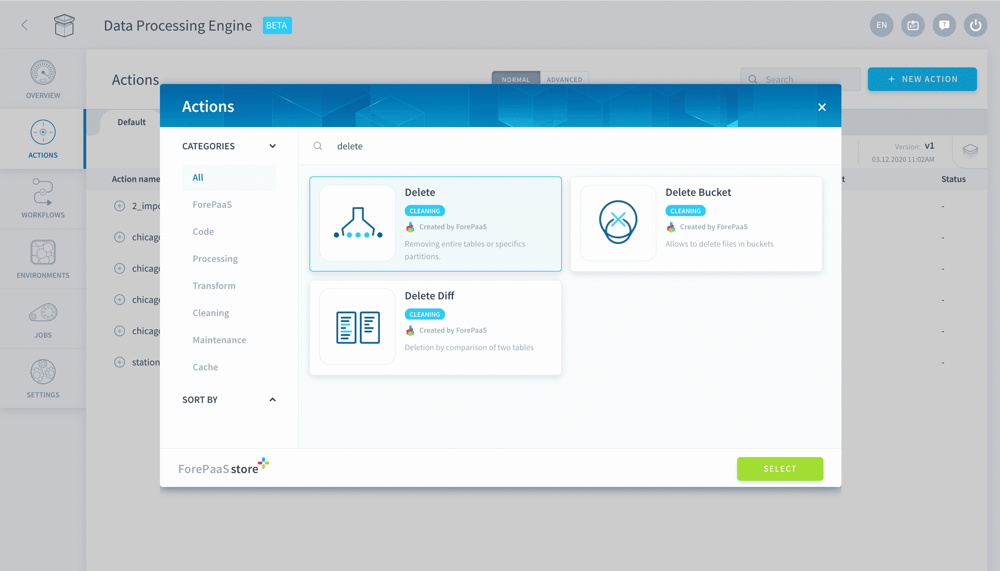

To do so, create a delete action as shown in the picture above. Then, drag *chicago_calendar* from the left column to the right column:

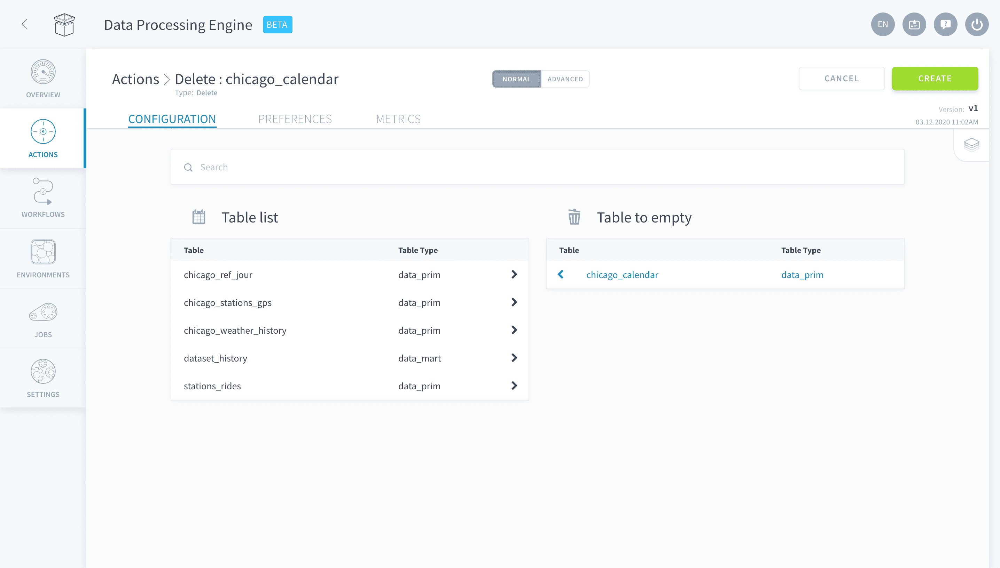

Click on the create button. This action can now be used to delete the collected data at the end of the day, ensuring each day the data is fresh.

#### Create an aggregate action

You will need one more type of action in order to consolidate your different data from different sources. For that, it is easier to create an aggregate action which is designed to create aggregate (mart) tables which are **tables composed of attributes combined from different primary tables**.

In particular we will use this aggregate action to load your data into the *dataset_history* table you created in the Mart section of your data model. The aggregate action is important for your project since it is going to help centralize your important datasets in specific tables to simplify the design of queries and expose the data to the final consumer, whether a dashboard or an API endpoint.

Click to new action and once again in the ForePaaS Store, select the Aggregate action template. 

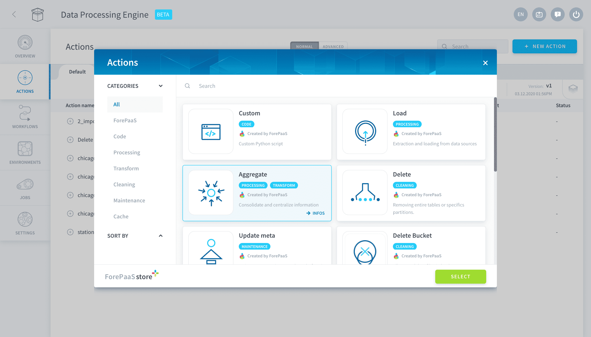

There will be 3 simple steps to configure the Aggregation action for this tutorial:
* **(1)** Select the source table : *stations_rides*
* **(2)** Select the destination table *dataset_history* and wait a few seconds: it will automatically find all the join conditions required and map attributes.

!> **Join conditions are necessary** to indicate to the aggregate action how tables are linked together. Note that if the joins were not set-up automatically, it means that something is wrong in your primary data model in the Organize screen of the Data Manager. Simply head back to the previous article to double-check your data model before moving forward.

Please choose an **inner join** using the dropdowns for the 3 attributes. This will ensure that we do not have any null fields in the records of our dataset_history table. For each table, if the mapping is not set automatically, **use the following join conditions**:

```
# Table chicago_weather_history
stations_rides.date = chicago_weather_history.date

# Table chicago_stations_gps
stations_rides.station_id = chicago_stations_gps.station_id

# Table chicago_calendar
stations_rides.date = chicago_calendar.date
```

At this point you should see the following configuration for your aggregate action.

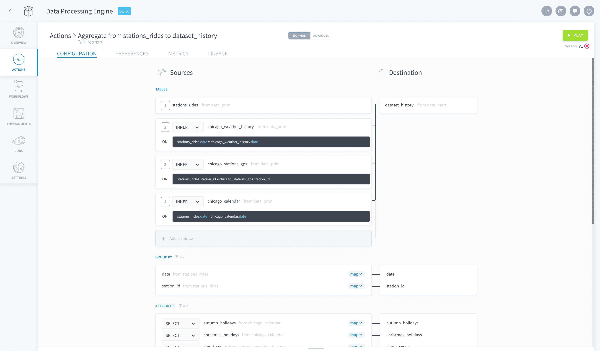

Once it's done, let's lay the groundwork for the **custom attributes** you created earlier in the Data Manager components. These attributes allow you to interpret and translate numerical values (temperature degree, humidity level, time of the year) into categories, for instance: above 62°F, the temperature will be considered as hot to very hot; below 63%, the humidity will be regarded as very dry. This will be useful to filter data in your final dashboard according to large categories. 

Click on the < map > option in blue option dropdown as shown below and switch it to < sql >. This allows you to pick a different input mode for the destination attribute. Map stands for "mapping", i.e. selecting a source attribute.

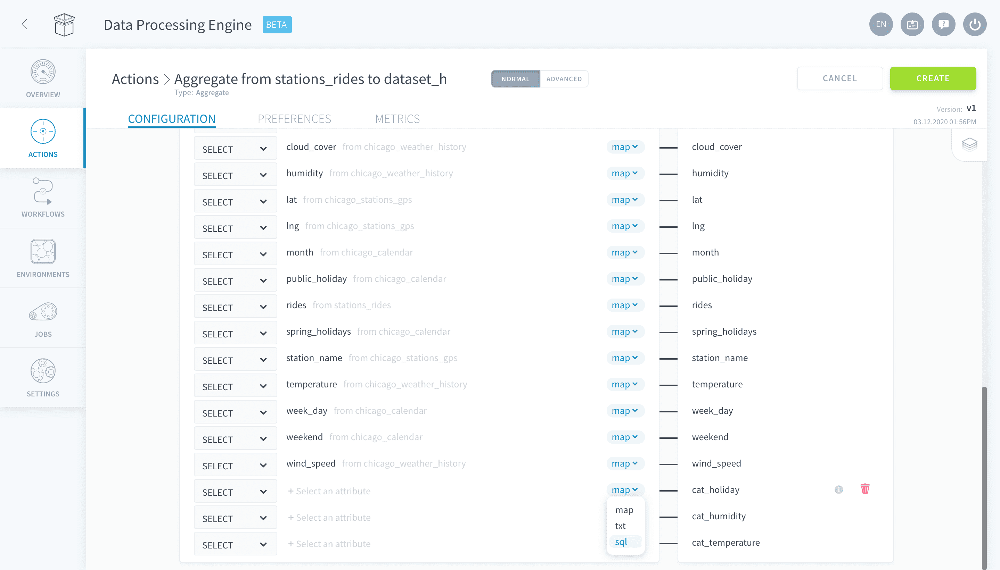

Simply copy-paste the SQL commands below for each of the following attributes in their respective input fields set to < sql >. Don't worry if the cells appear blank, simply expand the view to see the full pasted script.

*cat_holiday* 
```
CASE 
WHEN MAX(chicago_calendar.christmas_holidays)=1 THEN 'Christmas Holidays'
WHEN MAX(chicago_calendar.summer_holidays)=1 THEN 'Summer Break'
WHEN MAX(chicago_calendar.spring_holidays)=1 THEN 'SpringBreak'
WHEN MAX(chicago_calendar.public_holiday)=1 THEN 'off leave'
ELSE ''
END```

*cat_humidity*
```
CASE 
WHEN MAX(chicago_weather_history.humidity)<0.63 THEN 'very dry'
WHEN MAX(chicago_weather_history.humidity)<0.71 THEN 'dry'
WHEN MAX(chicago_weather_history.humidity)<0.78 THEN 'normal'
ELSE 'very wet'
END```

*cat_temperature*
```
CASE 
WHEN MAX(chicago_weather_history.temperature)<40 THEN 'very cold'
WHEN MAX(chicago_weather_history.temperature)<48 THEN 'cold'
WHEN MAX(chicago_weather_history.temperature)<55 THEN 'medium'
ELSE 'very hot'
END```

Last but not least, select compute mode “SUM” for the source attribute *rides* from the table *stations_rides* as below.

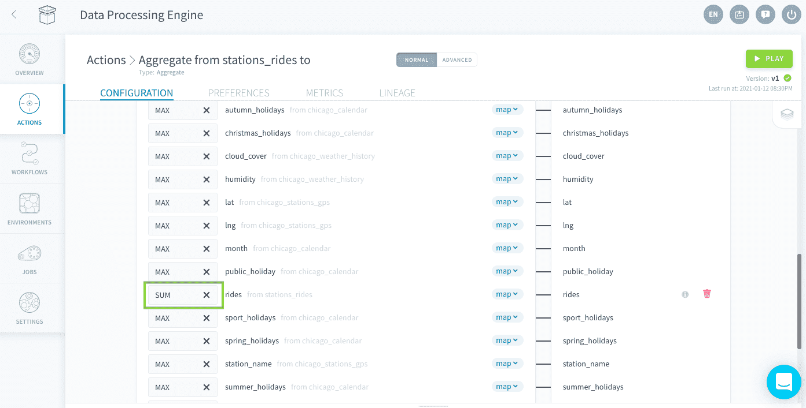

!> **Leaving a destination attribute unmapped in the aggregate action configuration will trigger an error when the action is launched**. If you'd rather leave the destination field empty, make sure to simply remove it from the list of mapped attributes.

{Learn more about Aggregate Actions}(jp/product/dpe/actions/aggregate/index.md)

#### Accelerate pipelines with the Segmentation option

In this tutorial, the aggregate action created loads hundreds of thousands of rows, which might take a bit of time for the worker to process. You can accelerate the process by running **several sub-actions in parallel with the Segmentation option**. The segmentation splits an action into sub-actions (tasks) based on a specific criteria to support heavy workloads. For this specific example we will use segmentation based on the values of an attribute of a table. 

Head to the *Preferences* tab. In our example we will be using segmentation **based on the station's ID**. In other words we are going to aggregate the count of passenger daily per station and parallelize this workload on different nodes. To do that, we'll need to **select the source & reference attribute as station_id** from the *stations_rides* table. Make sure your segmentation options are set as shown below: 

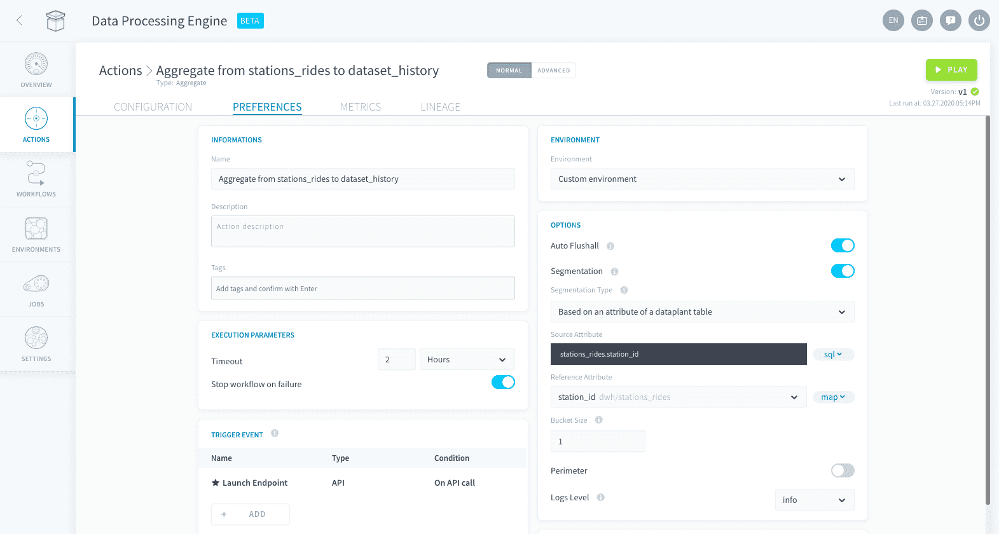

Make sure to input the following values for the segmentation options:

|       Input Field Name                |       Type    |           Value                         | 
| :-----------------------------: | ---------- | ----------- | 
|       **Segmentation Type**      |  -           |   Based on an attribute of a dataplant table          | 
|       **Source Attribute**           |   SQL      |  stations_rides.station_id                         | 
|       **Reference Attribute**     |    Map     | station_id *dwh/stations_ride*                         | 
|       **Bucket Size**                 |    -      |      80        | 

!> Make sure to **double check the segmentation configurations** before moving to the next steps, if not set properly you might have issues down the road. Check-out the product documentation to learn more about the [segmentation options](https://docs.forepaas.io/#/jp/product/etl/actions/settings/segmentation.md) available in ForePaaS.

Good job 💪! **You've now successfully created all the actions** required for this tutorial. To sum up: you've automatically generated 5 load actions from the Data Manager; manually composed 1 custom action & created 1 Delete action so that our data is always up-to-date, and finally used 1 aggregate action to build our dataset_history.

We recommend organizing all the actions into 2 folders for ease of read, one corresponding to each of the workflows that we will develop in the next section. To do that simply click on the 📁icon with a + on the top right of the repository screen.

* **Import Chicago Data** containing the following actions

|                Name                | Type                    | Function                                               |
| :------------------------------: | -------------------------- | ------------------------------------------------------------ |
|             **Delete : chicago_calendar**              | Delete                        | Deletes the previous chicago_calendar data in order to refresh the whole table |
|            **chicago_stations_gps**             | Load                  | Generated directly from the Data Manager, it loads the GPS data of the stations we need.    |
|            **chicago_calendar**             | Load                  | Generated directly from the Data Manager, it loads the calendar of these past years with every holiday, bank holidays, weekends...   |


* **Update History Table** containing the following actions 

|                Name                | Type                    | Function                                               |
| :------------------------------: | -------------------------- | ------------------------------------------------------------ |
|            **chicago_weather_history**             | Load                       | Generated directly from the Data Manager, it loads the Chicago weather Data from previous years  |
|            **2_import_rides**             | Custom                  | Loads daily the number of rides at each station of Chicago      |
|            **Aggregate from stations_rides to dataset_history**             | Aggregate                  | Creating your dataset that will group all the data we need    |

At this stage, your repository of actions should look like this (double click on the folder to open it):
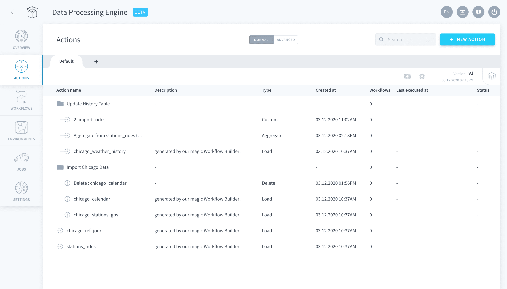

In this first tutorial, we have created all our versions in a single repository without managing its versions. Repositories of actions can be versioned and also synced with external Git repositories. Check-out the [dedicated product documentation](jp/product/dpe/actions/index?id=overview) page to learn more about how to do that! But for now, either explore the Actions documentation in more detail or move on to the next ⏭️step and create your first workflow!

{Learn more about Actions}(jp/product/dpe/actions/index)

---

## Workflows

Workflows are like a movie script to put your actions into... action. 🎬    
Within a workflow, actions are organized in sequential stages. **Within a stage, all actions will be run in parallel while stages will always run one after the other**. Actions can be reused into multiple stages of a single workflow.

> Note that it is therefore important to remember that **stages are run one after the other** in the order you planned them while **actions contained in a stage are all run all at the same time** regardless of the order. In short, remember that the order of the actions inside a stage does not matter while the stages’ order inside a workflow does. 

For the needs of our tutorial, we will create **2 workflows**, one for importing Chicago data and the other to update historical tables. 

To create your first workflow, you'll need to head to the *Workflow* tab and click on "New Workflow". The newly created workflow will be given a default name, head to preferences or double click on the header to set a new name *Import Chicago Data*. 

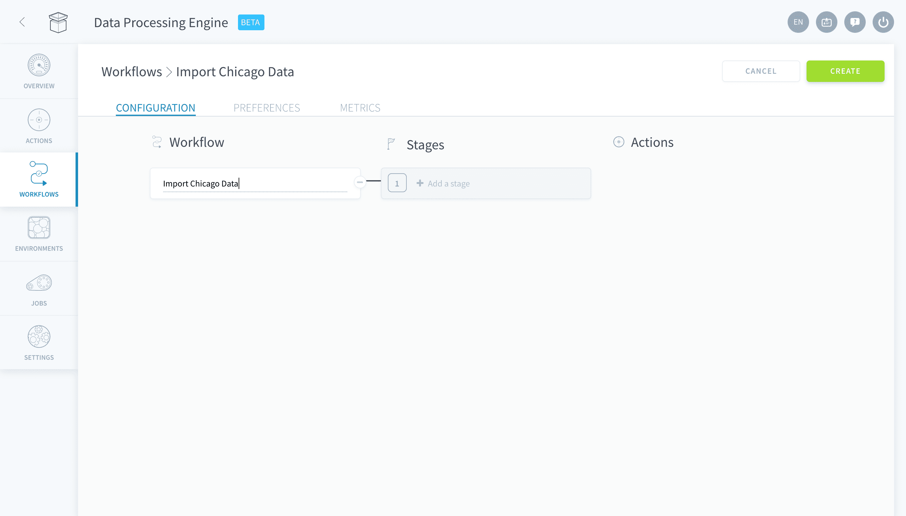

Let's start by defining 3 different stages by clicking on "Add a stage". Then, add actions in each stage using the dropdown search selector following the screenshot provided as a guide for each stage.

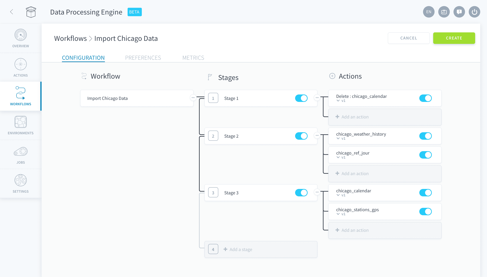

Repeat the same operation for a new workflow this time called *Update History Table*.

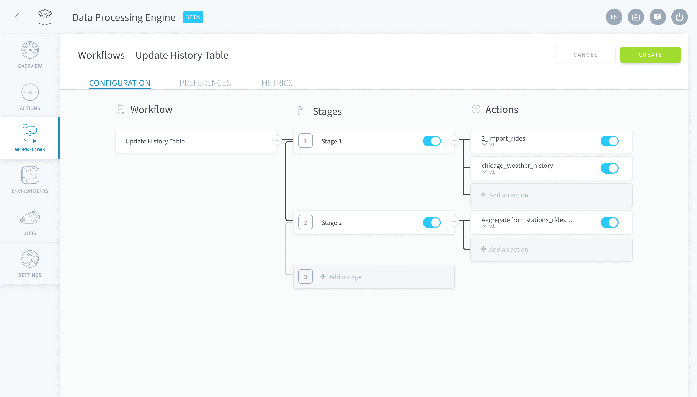

> Don't hesitate to click on **Play** one you've configured your workflows. This will allow you to test them, **see the execution logs live** and make sure everything is running smoothly before moving to the next steps. This means that the configuration of your workflows are being compiled to run. The "Building" phase is managed automatically by ForePaaS and will be triggered only when new modifications have been made to the workflows.

> Please note that workflows might take a few minutes ⏳ to start when you launch them for the first time.

Finally, the last thing we need to do is **schedule both workflows to run daily**. To do that **we'll set a trigger event to launch them at a specific hour everyday**. Every action or workflow can be set a different list of trigger events which once "triggered" will "launch" the job.

There are several types of trigger events but for now we'll focus on the CRON (Command On Run). Head to the *Preferences* tab of your workflows and scroll to the Triggers widget on the bottom left side. Click "+Add" and select the trigger type as CRON and mode as Complete. Navigate to the *Daily* tab and in the list of options select "Every 1 day(s)" as shown in the picture below:

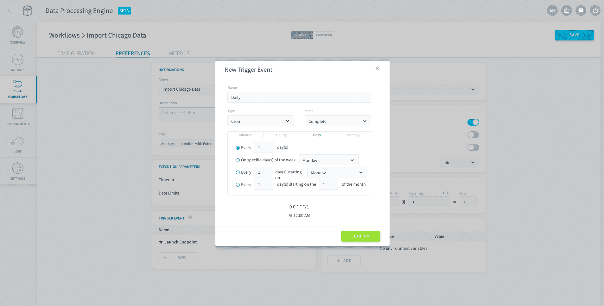

Hit the *Confirm* button to create the new trigger event which you can name "Daily" for instance and it will append it below the *Launch Endpoint* present by default in the Trigger event table.

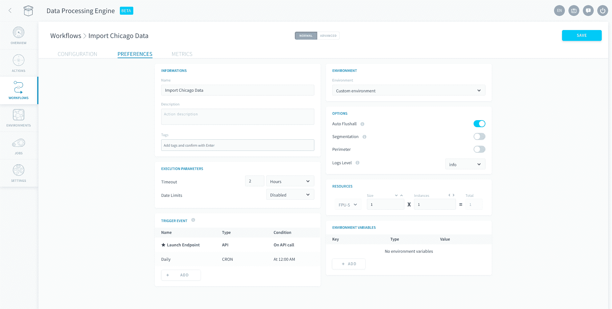

Once your workflows have been created and organized you'll need to go to the *Environments* tab. The workflows that we have set-up should less than 60s to run each. If you're noticing runtimes longer than 5 minutes, reach out to our support team! 

!> Make sure to click on the **Save** button on the top right of the screen whenever you make a modification to your workflows. Actions are stored in repositories which can be versioned which is not the case for workflows or environments. *Autosave* is therefore disabled for both workflows & environments.

Alright! Hang in there 💆‍♀️ 💆‍♂️, we're almost done, this the last section for the data processing step.

---

## Environments

Landing on this section, you can see that no environment are set-up yet. **By default actions & workflows are launched on a standard environment**, setting-up shared environments in an optional step. Here you will be able to create custom environments shared for multiple actions/workflows, so you don't have to configure each of them manually when your project increase in size.

Let's create a dedicated environment for our two workflows. Click on "New Environment" and name it *Data Load and Processing*. In the Environment's option, set the resources to x2 instances of x2 FPU in size each and set to *ON* the option *Auto flushall*, as shown below:

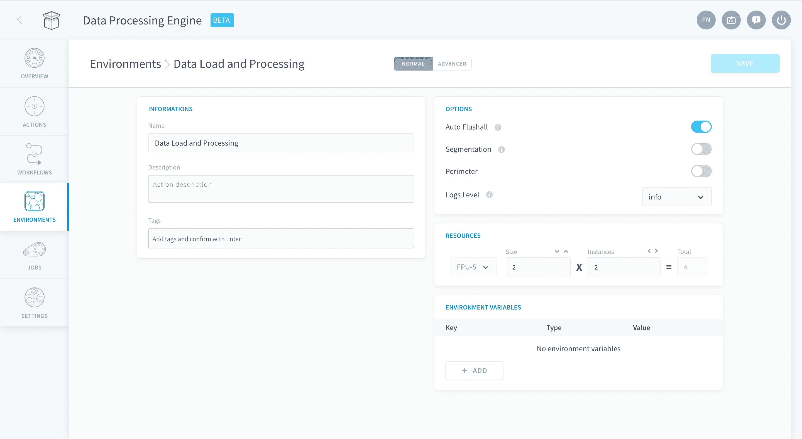

!> Each ressource allocation in ForePaaS is done using **proprietary units called [FPU](jp/product/infra-monitoring/index?id=forepaas-units-fpu)**, ForePaaS Units. **At the moment all FPU are identical and corresponds to 0.5 CPU and 2GB of RAM**. In other terms the environment created earlier will run jobs using 2 instances of 1 CPU and 4GB of RAM each.

Heading back to the workflows menu, we now need to assign each of our workflow to our custom environment. To do so edit each workflows and go to the preferences tab:

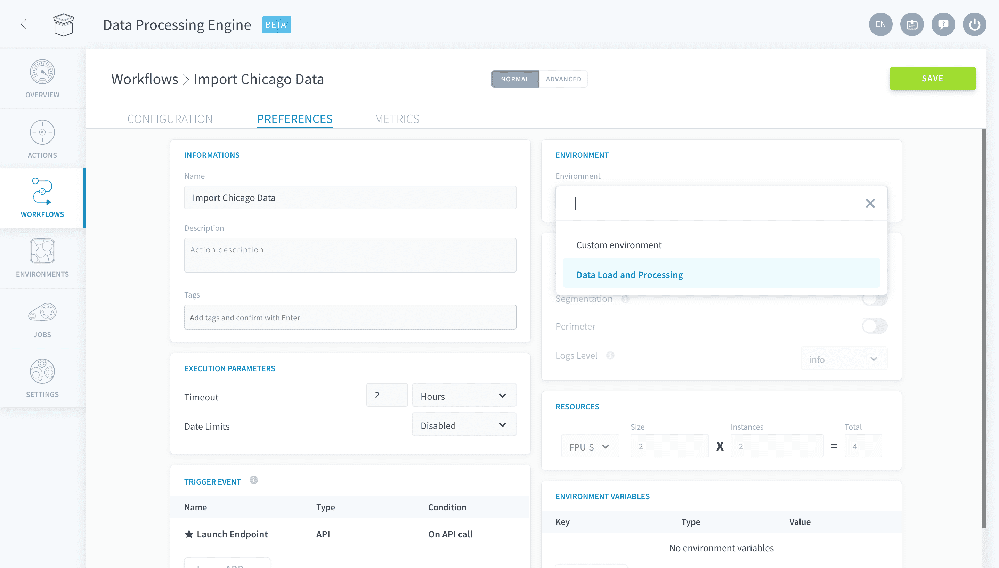

Click on the Save button. 
**You are now ready to launch your workflows** if you haven't done so already. To launch your workflows manually simply click on the Play icon on the top right of the screen for each workflows.

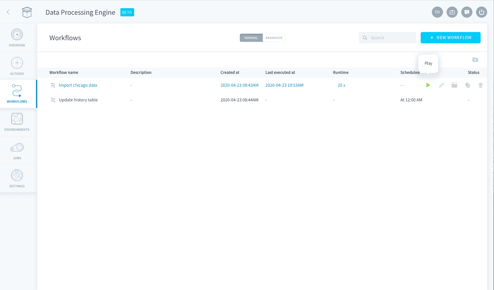

Alternatively you can click and launch your workflows in the overview page of the workflow tab. Once you clicked on the button, it will prompt a **logs dock panel** which will show you any execution logs. You can expand the log panel and keep a separate window if that's more convenient for you.


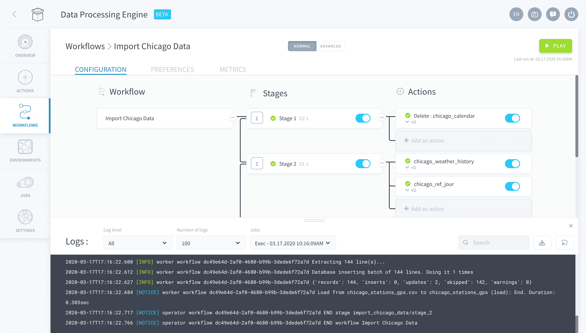

From this screen you can also follow the execution of your actions separately. Please make sure the two workflows *Import Chicago Data* and *Update Chicago tables* work properly before moving to the next steps. You can check their status once the execution is finished in the Workflows menu.

Finally, note that if you hadn't selected 2 instances for your workflows, setting segmentation actions (like you did for the Aggregate action) would have had only a limited effect on the execution runtime. **With two separate instances we allow the workflows to be truly run in parallel**, processing twice the amount of rows at any given time.

---
## Jobs

To wrap-up this section, here's a few words about the last tab of the Data Processing Engine component. **The Jobs tab summarized all executions triggered in the DataPlants and includes advanced metrics reports**. Jobs are listed under 3 main categories: running, queued and past executions. Having a look at the last jobs executed, you can verify the status of the two workflows recently  launched. 

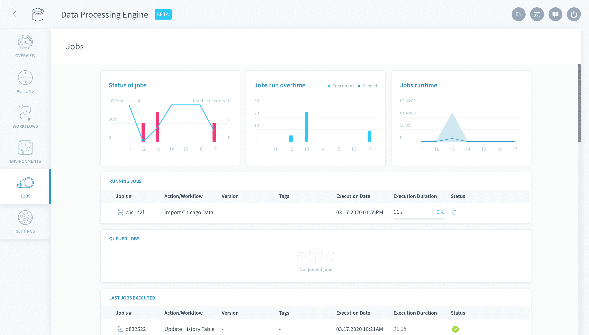

---

You now have completed the Data Processing Engine portion of the *Getting Started* tutorial 🌟, although only in a perfect world are you likely to only have as few actions, & workflows. Don't hesitate to connect if you're running into any issues or you'd like help to speed up your data pipelines, optimize their performance, adding custom exotic data sources or creating custom scripts.

Let's now march 🚶‍♀️🚶‍♂️forward on to the next component: the Query Builder! 

{Query Builder Quickstart}(#/jp/getting-started/app-init/query-builder)