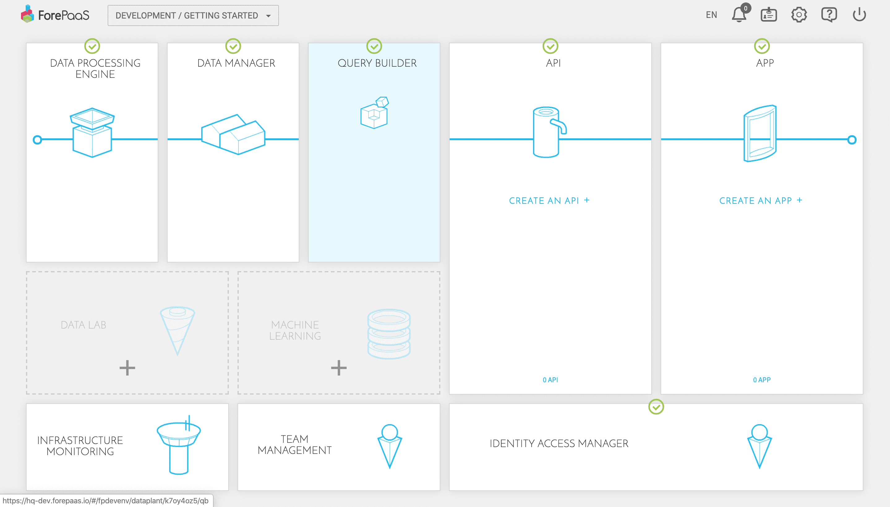
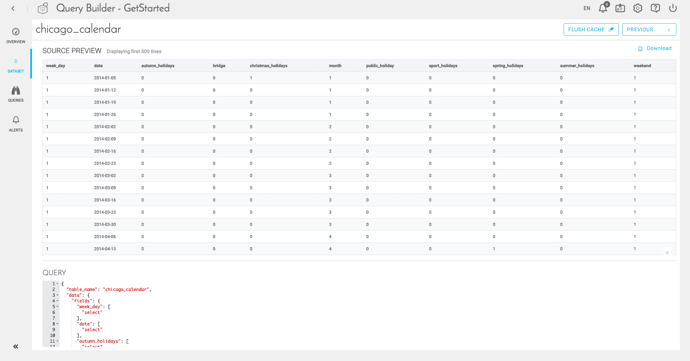
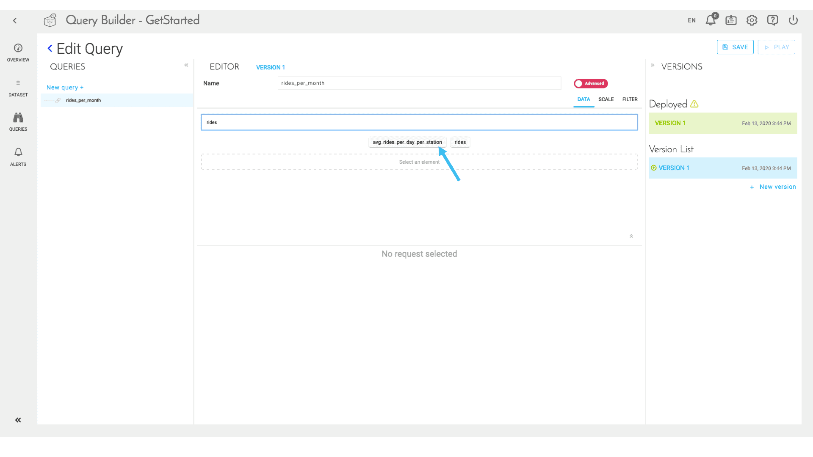
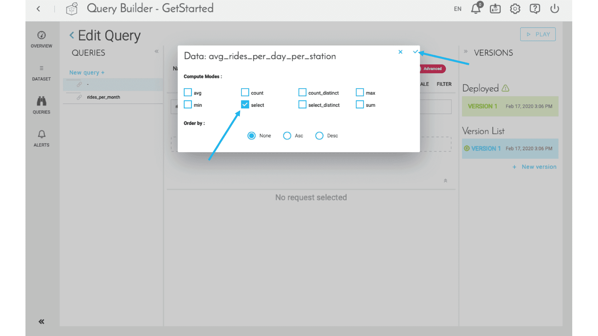
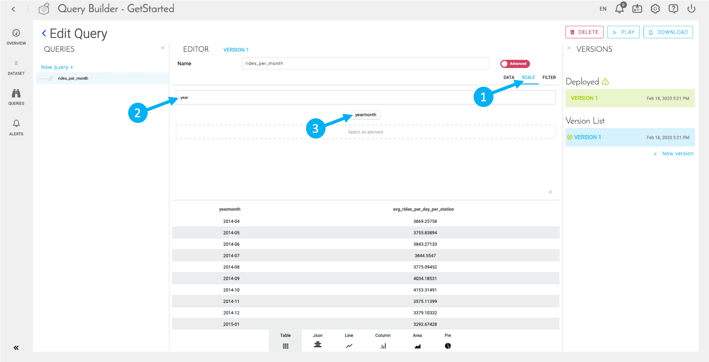
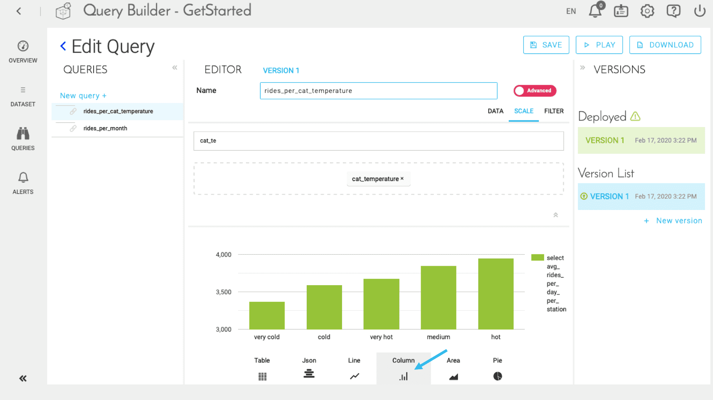

# Create queries on your data

## Objectives

In the Query Builder, you will create queries that will be used in the application that you'll build on the platform. The different queries are stored in the Data Manager and will be used to show attributes related to others and with various scales in order to highlight some indicators. In our project, we want to **highlight the variations of traffic in Chicago depending on the weather and the time of the year**. 

The Query Builder allows you, thanks to a **low-code approach**, to prepare and centralize the queries matching your business KPIs (Key Performance Indicator). The queries creation is strictly identical, regardless of the database. 

---

## Pre-requisites

Beforehand, you need to make sure all the previous steps of the project are up and running. Workers are running properly, actions are loading and refreshing data in the Data Manager. 

!> Also, make sure that **Prim** and **Mart** in the Data Manager are successfully built, else the Query Builder won't work.

What you'll do in this tutorial:
* [Discover your dataset](/jp/getting-started/app-init/query-builder?id=discover-your-dataset)
* [Build your first queries](/jp/getting-started/app-init/query-builder?id=build-your-first-queries)

---

## Discover your dataset

First, navigate to the “DATASET” window, using the left-hand menu. Here you will find a series of tabs.

If you want to know more about the Diamonds and Dictionary sub-sections, please refer to [this link](/jp/product/query-builder/dataset). Those 2 sections help you to understand more about your datasets and attributes, but won’t be necessary for this tutorial.
 
A good way to make sure your data properly loaded is to look at the **“Prim” tab**, amongst other functions, it displays the number of occupied rows in each of the tables in the “prim” section of your schema. If the data failed to correctly load, you will see a 0 in the column “number of rows”: it is therefore a good indicator to measure if your project is going the right way so far.

The **“Mart” tab** displays the same information as the “Prim tab” but exclusively for tables in the Mart. 

The last tab “Machine Learning” will be empty since we did not build a machine learning component yet.

---

## Build your first queries

Now, you will create your first queries in order to make data ready for visualization:
* *rides_per_month* to understand the average number of rides each month. We'll use it to build our first graph.
* *rides_per_cat_temperature* to understand the average number of rides depending on temperature.

### Create the first query

Click on the next tab, "Queries", then on "New Query". This is where you can give your query a name, and parametrize the data and the scale.  

> Note that the tutorial is restricted to the user interface to create simple queries. Queries can be customized much more using an "Advanced mode" and a variety of parameters documented in the product documentation.  
[Learn more about Queries](jp/product/query-builder/queries/advanced-mode)

Let's parametrize the first query to display the average number of rides per month. To begin with, name your query `rides_per_month`. Then start typing avg_rides in the search bar and click on the *avg_rides_per_day_per_station* attribute.

Select the compute mode **Select** and confirm as shown below.

Then, click on the **Scale** tab. Here, you want to display the average number of rides **each month** per date. Select *yearmonth* as a scale.

Then, click on 'Save and Play' in the top right-hand corner. You'll see a visualization of the result of your query. You can change the type of display (table, Json, line, column, area, pie...)

### Create a second query

Queries aren't meant to be used in a dashboard only, they also provide an easy way to examine your data.

Create a new query:
* Name it `rides_per_cat_temperature`
* Select *avg_rides_per_day_per_station* with compute mode **Select**
* Select *cat_temperature* as your scale

!> If you remember, *avg_rides_per_day_per_station* is the virtual attribute that you have set in the previous steps of the tutorial (Collect data). You cannot use any other compute mode than **Select** with virtual attributes as they often contain an SQL function. Adding **Sum** would end up running an SQL function twice, resulting in an error.

Just like the screenshot below, click on 'Column' to automatically display the data as a bar chart. You also have other options to visualize your data immediately: line chart, pie chart, etc.

Don’t forget to click on 💾 **Save** before moving forward.

**Congrats!** You've successfully created 2 queries using the Query Builder. Now let's move on to the API part. You will create and deploy an API in a few clicks in order to expose your data in your final application. 

{Follow the API Quickstart}(#/jp/getting-started/app-init/api-manager.md)